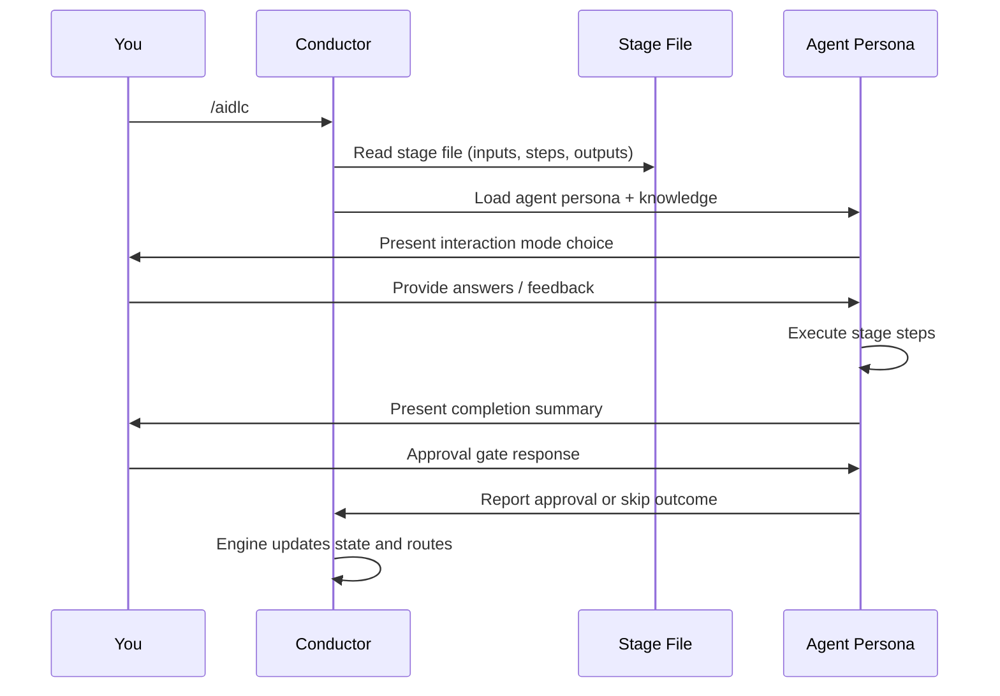
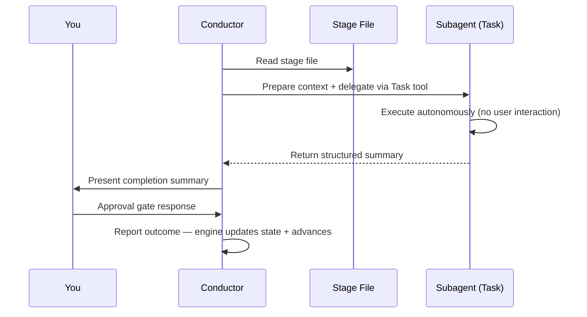

# 最初のワークフロー

本章では AI-DLC ワークフローの完全な 1 実行を追いながら、各ステップで何が表示され、どんな意思決定をするのかを説明する。例として、REST API を構築する `feature` scope のワークフローを使う。

> **注**: 本章のトランスクリプトは **Claude Code** のものである。Kiro CLI、
> Kiro IDE、Codex CLI、opencode でもワークフロー — stage・エージェント・
> ゲート・アーティファクト — は同一だが、Claude 専用のウェルカムバナーと
> カスタムの AI-DLC statusline は表示されない。Kiro と opencode では
> `/aidlc --status` を、Codex では `$aidlc --status` とその組み込みの
> `update_plan` 進捗表示を使う。ハーネスごとの相違点はすべて
> [他のハーネスでの実行](harnesses/README.md) の各章に載っている。

---

## ワークフローの開始

```
/aidlc Build a REST API for inventory management
```

セッション開始時、Claude Code は `settings.json` の `companyAnnouncements` エントリ経由で AI-DLC のウェルカムメッセージを表示する。AI-DLC の仕組みを説明し、stage マップと scope の選択肢を示すものである。（`companyAnnouncements` は Claude Code の設定項目であり、他のハーネスに相当するものは無い — その場合バナーは表示されず、ワークフローは下記の Initialization から直接始まる。）

```
# Welcome to AI-DLC

**AI-DLC** (AI-Driven Development Life Cycle) is an adaptive methodology that
structures AI-assisted software development into repeatable, traceable phases
while keeping you in control at every decision point.

## How It Works

- **You decide, AI executes.** Every material decision goes through an approval gate.
- **Adaptive scope.** Choose a scope or let AI auto-detect from your intent.
- **Traceable artifacts.** Every stage produces versioned documents in the intent's record dir.
- **11 domain experts.** Specialized agent personas guide each stage.
```

---

## Initialization phase（自動）

3 つの initialization stage は `aidlc-utility intent-birth` という単一のツール呼び出しの中で決定論的に実行され、1 秒未満で完了する。initialization で利用者が対話することはない。最初の intent をアクティブな space に自動で birth し、ワークフローのための record dir をブートストラップする。

### Stage 0.1: Workspace Scaffold

フレームワークは最初の intent を birth し、その record dir を `aidlc/spaces/<space>/intents/<YYMMDD>-<label>/` に作成する（名前付き space を使わない限り `<space>` は `default`）:

```
Intent born — record dir scaffolded:
  aidlc/spaces/default/intents/<YYMMDD>-<label>/initialization/   (3 stage artifact dirs)
  aidlc/spaces/default/intents/<YYMMDD>-<label>/ideation/         (7 stage artifact dirs)
  ...
Space-level dirs ensured:
  aidlc/spaces/default/knowledge/                             (team knowledge — empty; you add files)
```

### Stage 0.2: Workspace Detection

決定論的なルールベースのスキャナが、プロジェクト直下 1 階層と既知のソースディレクトリ（`src/`、`app/`、`lib/`、`pages/`、`components/`、`tests/`）を走査する。ソースファイル・フレームワーク設定・パッケージマニフェストに基づいて greenfield か brownfield かを分類する。トップレベルでシグナルが検出されないときは、任意の名前のサブディレクトリそれぞれの 1 階層下にも降りるため、ソースがコンテナフォルダ（例: `wordbook/`、`backend/`）の中にあるプロジェクトも brownfield として検出される。

### Stage 0.3: State Initialization

orchestrator は、scope・depth・テスト戦略とスキャナの分類に基づいた完全な stage 計画を持つ、intent の `aidlc-state.md` を（record dir 配下に）書き込む。あわせて入力を分析し、scope を確認する:

```
─── Scope Detection ───────────────────────────────────────────────────────────
Detected scope: feature (Standard depth, Standard test strategy, all 32 stages)
▸ Approve scope? [Yes / Change scope / Change depth / Change test strategy]
> Yes
```

検出された scope をそのまま受け入れることも、別の scope（例: `mvp`）へ変更することも、depth レベルやテスト戦略を調整することもできる。指針は [Scope・Depth・テスト戦略](05-scopes-and-depth.md) を参照。

---

## Ideation phase（対話的）

Initialization の後、ワークフローは Ideation に入る。ここから先の各 stage は、承認 gate を伴って対話的に実行される。

### Stage 1.1: Intent Capture（aidlc-product-agent）

Claude Code では、ターミナル下部のカスタム AI-DLC ステータスラインが更新される（Kiro と opencode は `/aidlc --status` を使う。Codex は `$aidlc --status` とその組み込みの `update_plan` 進捗表示を使う）:

```
[AIDLC] IDEATION > Intent Capture [▓▓▓▓▓░░░░░] 4/7 -- product
```

表示内容は、現在の phase、stage の表示名、phase 進捗バー、phase 進捗比、リードエージェントである。バーと比は同じ範囲を数える — どちらも現在の phase 内の `[x]` の stage を数えるため、比が進むたびにバーも進む。残りコンテキスト（`ctx:N%`）は常に右側に表示され、減るにつれて色分けされる。

aidlc-product-agent は対話モードの選択を求める:

```
▸ Choose interaction mode:
  (1) Guide Me — agent asks structured questions
  (2) Edit File — write directly to the artifact
  (3) Chat — freeform discussion
```

- **Guide Me** は質問を 1 つずつ順に進める
- **Edit File** は成果物を直接編集できるように開く
- **Chat** は自由に議論でき、エージェントが決定事項を抽出する

各モードの詳細は [対話モード](07-interaction-modes.md) を参照。stage の途中でモードを切り替えることもできる。

### 承認 gate

エージェントが作業を終えると、完了サマリと承認 gate が表示される:

```
# Intent Capture & Framing Complete

| Artifact | Contents |
|----------|----------|
| intent-capture.md | Problem statement, target users, success criteria |
| intent-capture-questions.md | 5 questions, all answered |

**Review:** `<record>/ideation/intent-capture/` (the intent's record dir)

▸ How would you like to proceed?
  (1) Approve — Continue to Market Research
  (2) Request Changes — Provide revision feedback
```

続行するには **Approve** を、フィードバックを与えるには **Request Changes** を選ぶ。修正プロセスの詳細は [対話モード](07-interaction-modes.md) を参照。

承認後、進捗行が表示される:

```
Progress: 4/32 overall | 1/7 IDEATION stages complete. Next: Market Research
```

### 残りの Ideation stage

ワークフローは Market Research、Feasibility & Constraints、Scope Definition、Team Formation、Rough Mockups、Approval & Handoff へと続く。いずれも同じパターンに従う: エージェントが作業し、利用者がレビューし、承認する。

一部の stage は**条件付き**であり、scope によってはスキップされることがある。stage がスキップされるとき、orchestrator は理由を表示して自動的に先へ進む。

---

## Inception phase

Inception は要件を精緻化し、ソリューションを設計する。Stage 2.1（Reverse Engineering）は **pipeline**（2 リンクの連鎖）として実行される点で特筆に値する — conductor がコードスキャンを aidlc-developer-agent に委譲し、続いて統合と成果物の書き出しを aidlc-architect-agent に委譲する。この stage は **brownfield** プロジェクト（既存コードベース）でのみ実行される。

```
─── Stage 2.1: Reverse Engineering (pipeline) ─────────────────────────────
Delegating to aidlc-developer-agent for code scan...
[Running in background — no interaction needed]
...
Developer scan complete. Delegating to aidlc-architect-agent for synthesis...
...
✓ 9 reverse engineering artifacts produced
```

残りの Inception stage（Requirements Analysis から Delivery Planning まで）は利用者とともに inline で実行される。

---

## Construction phase

Construction は **Bolt 単位** でソリューションを構築する。[Bolt](glossary.md) は、1 つの Unit（または依存で結ばれた小さな Unit 群）に対する stage 3.1–3.5 の 1 パスである。各 Bolt はレビュー可能なスライスを届ける。2.8 の計画が順序を決め、最初の Bolt を **walking skeleton** — アーキテクチャを証明する最小の end-to-end スライス — として印付ける。

```
─── Construction: Bolt 1 — notification-core (walking skeleton) ───────────
```

walking skeleton は**常に gate される** — 他のどの Bolt よりも先に、その設計成果物と生成コードをレビューする。承認の直後、**ladder prompt** がちょうど 1 回だけ発火する:

```
The walking skeleton shipped. How should the remaining Bolts run?
  ▸ Continue autonomously
  ▸ Gate every Bolt
```

回答は `aidlc-state.md` に `Construction Autonomy Mode` として記録され、このワークフローの残りすべての Bolt を統べる（セッション再開もこれを尊重する）。Stage 3.5（Code Generation）は Bolt 内の Unit ごとに subagent として実行され、その stage ファイルにある Unit 単位の gate は抑止される — 代わりに Bolt 単位（またはバッチ単位）の gate が 1 つ置かれる。

依存が満たされ、互いに依存しない Bolt 同士は**並列バッチ**で実行される — orchestrator は 1 ターンで複数の `Task` 呼び出しを発行する。失敗時は、autonomous モードを選んでいても必ず停止して retry / skip / abort を尋ねる。

すべての Bolt が完了した後、stage 3.6（Build and Test）と 3.7（CI Pipeline）がソリューション全体に対して 1 回だけ実行される。

---

## Operation phase

Operation はソリューションをデプロイし、監視する。7 つの stage はすべて条件付きであり、`poc` や `bugfix` のような小さい scope ではこの phase 全体がスキップされることがある。

最終 stage（4.7 Feedback & Optimization）の後、ワークフローは完了する。

---

## 実行モードの仕組み

ワークフロー全体を通じて、2 つの実行モードに出会う:

### inline 実行

ほとんどの stage は inline で実行される。conductor がエージェントペルソナを読み込み、stage の手順を会話の中で直接実行する。利用者はエージェントとリアルタイムに対話する。



<!-- Text fallback: You invoke /aidlc. The conductor reads the stage file and loads the agent persona with knowledge. The agent presents an interaction mode, you provide input, the agent executes steps and presents a completion summary. You respond at the approval gate, and the conductor reports the outcome so the engine advances state. -->

### subagent への委譲

4 つの stage は背景の subagent に dispatch される — 2.1 Reverse Engineering（pipeline: developer のスキャン、次いで architect の統合と書き出し）、2.2 Practices Discovery（subagent の hub-and-spoke: リードの草稿、相互に盲目な 3 つの支援レビュー、人間へのインタビュー、リードの統合）、2.4 User Stories（mob: collaborator が並列に貢献し、判断が割れた場合は stage の途中で利用者に提示されることがある）、3.5 Code Generation（subagent）である。Practices Discovery は、スポークと最終統合の間に意図的に利用者を輪の中へ招き入れる。User Stories の mob も判断の分かれ目を stage 途中で提示することがある。Workspace detection（0.2）は subagent ではなく `aidlc-utility intent-birth` の中で決定論的に実行される。



<!-- Text fallback: The conductor reads the stage file, prepares context, and delegates via the Task tool. The subagent executes autonomously without user interaction and returns a structured summary. The conductor presents the summary to you, you respond at the approval gate, and the conductor reports the outcome so the engine advances state. -->

---

## 生成される成果物

`feature` scope のワークフローが終わる頃には、intent の record dir（`aidlc/spaces/<space>/intents/<YYMMDD>-<label>/`）には次が含まれる:

```
aidlc/spaces/<space>/intents/<YYMMDD>-<label>/
├── aidlc-state.md          # Workflow state (all stages marked [x])
├── audit/                  # Full decision audit trail (per-clone shards, merged by timestamp)
├── ideation/               # Intent, market research, scope, mockups
├── inception/              # Requirements, stories, design, units
├── construction/           # Per-unit code + test artifacts
├── operation/              # Deployment, observability, incident plans
└── verification/           # Phase boundary verification reports
```

（チームナレッジは 1 階層上、space レベルの `aidlc/spaces/<space>/knowledge/` — `intents/` の兄弟 — にあり、すべての intent を横断して蓄積される。チームが確認した practices と learnings も、その隣にあるアクティブ space の memory 層 `aidlc/spaces/<active-space>/memory/` にあり、同様に intent を横断して永続する。）

---

## ステータスライン

Claude Code 上ではワークフロー全体を通じて、ターミナルのカスタム AI-DLC ステータスラインが現在位置を示す（Kiro と opencode は各 gate で `/aidlc --status` と進捗行を使う。Codex は `$aidlc --status` とその組み込みの `update_plan` 進捗表示を使う）:

```
[AIDLC] IDEATION > Intent Capture [▓▓▓▓▓░░░░░] 4/7 -- product
```

| セグメント | 意味 |
|---------|---------|
| `IDEATION` | 現在の phase |
| `> Intent Capture` | 現在の stage の表示名 |
| `[▓▓▓▓▓░░░░░]` | phase 進捗バー（10 文字。`n/m` 比と同じ範囲を数える） |
| `4/7` | phase 内の stage 進捗 |
| `-- product` | この stage のリードエージェント |
| `ctx:N%` | 残りコンテキスト（常に表示。減るにつれて色分け） |

---

## 次のステップ

- [Space と Intent](03-spaces-and-intents.md) — ワークスペースが複数の実行をどう保持するか、開始と切り替えの方法
- [Phase と Stage](04-phases-and-stages.md) — 全 5 phase・32 stage の詳細な内訳
- [対話モード](07-interaction-modes.md) — Guide Me・Edit File・Chat の解説
- [セッション管理](11-session-management.md) — 再開・やり直し・stage 間ジャンプ
- [用語集](glossary.md) — 用語リファレンス
