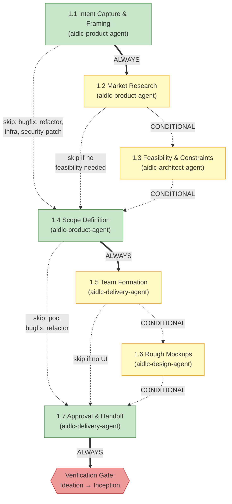
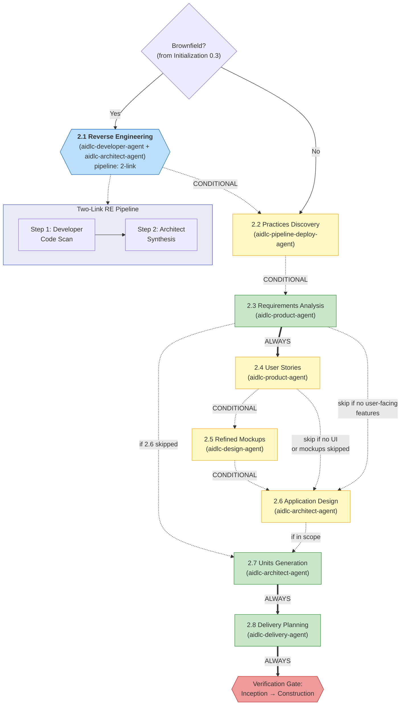
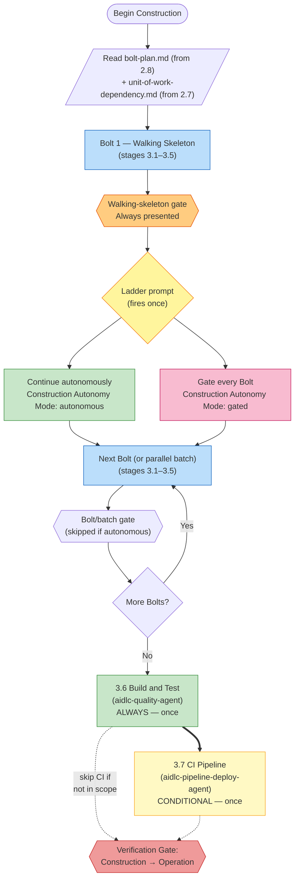
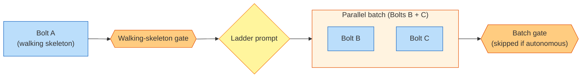
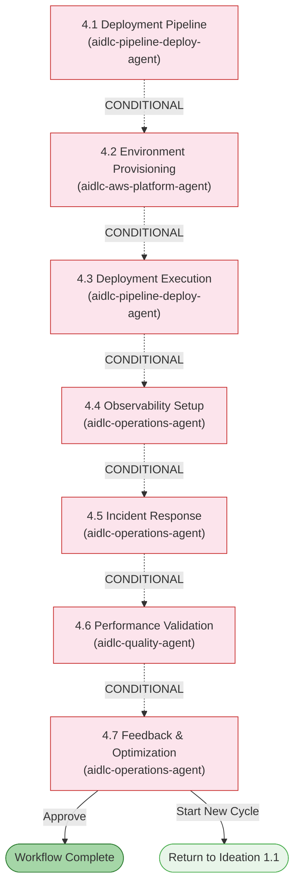

# Phase と Stage

AI-DLC のライフサイクルは、32 の stage を含む 5 つの phase に編成される。本章では各 phase を説明し、その stage を列挙し、どうつながるかを示す。

> **Harness に関する注記。** 方法論 — 本ガイドが説明する phase・stage・エージェント・gate —
> はどの harness でも同一である。仕組みが harness によって異なる箇所（gate の描画方法、
> subagent の dispatch 方法、設定の置き場所）は、その旨を明記して利用 harness の章の表に
> まとめている: [他の harness で動かす](harnesses/README.md)。ここでの例は断りがない限り
> Claude Code を使う。

---

## ライフサイクル概観

```mermaid
graph LR
    subgraph INITIALIZATION["INITIALIZATION (0.1-0.3)"]
        Z1["Workspace Scaffold"]
        Z4["State Init"]
        Z1 -.->|"3 stages"| Z4
    end

    subgraph IDEATION["IDEATION (1.1-1.7)"]
        I1["Intent Capture"]
        I7["Approval & Handoff"]
        I1 -.->|"7 stages"| I7
    end

    subgraph INCEPTION["INCEPTION (2.1-2.8)"]
        N1["Reverse Engineering"]
        N7["Delivery Planning"]
        N1 -.->|"8 stages"| N7
    end

    subgraph CONSTRUCTION["CONSTRUCTION (3.1-3.7)"]
        C1["Functional Design"]
        C7["CI Pipeline"]
        C1 -.->|"7 stages per unit"| C7
    end

    subgraph OPERATION["OPERATION (4.1-4.7)"]
        O1["Deployment Pipeline"]
        O7["Feedback & Optimization"]
        O1 -.->|"7 stages"| O7
    end

    Z4 -->|"auto-proceed"| I1
    I7 -->|"Verification Gate 1"| N1
    N7 -->|"Verification Gate 2"| C1
    C7 -->|"Verification Gate 3"| O1
    O7 -.->|"Feedback Loop"| I1

    style INITIALIZATION fill:#f3e5f5,stroke:#9c27b0
    style IDEATION fill:#e8f5e9,stroke:#4caf50
    style INCEPTION fill:#e3f2fd,stroke:#2196f3
    style CONSTRUCTION fill:#fff3e0,stroke:#ff9800
    style OPERATION fill:#fce4ec,stroke:#e91e63
```

<!-- Text fallback: Linear flow: INITIALIZATION (0.1-0.3) auto-proceeds to IDEATION (1.1-1.7), which passes through Verification Gate 1 to INCEPTION (2.1-2.8), through Verification Gate 2 to CONSTRUCTION (3.1-3.7), through Verification Gate 3 to OPERATION (4.1-4.7). A feedback loop returns from 4.7 back to 1.1. -->

phase は順に実行される。各 phase 境界（Initialization → Ideation を除く）では、**verification gate** が自動のトレーサビリティ検査を実行し、下流の stage が積み上げる前に、欠けたリンク・孤立した成果物・不整合を捕まえる。

---

## Phase 0: Initialization

**目的:** ワークスペースのブートストラップ — docs ディレクトリのスキャフォールド、ワークスペースの検出、状態の初期化。ウェルカムメッセージはセッション開始時に `settings.json` の `companyAnnouncements` エントリ経由で表示される（stage ではない）。

Initialization の stage は承認 gate なしで**自動的に**実行される。3 つすべてが単一の決定論的ツール呼び出し（`aidlc-utility intent-birth`）の中で実行され、1 秒未満で完了する。

| # | Stage | リード | 主要成果物 | 条件 |
|---|-------|------|---------------|-----------|
| 0.1 | Workspace Scaffold | orchestrator | 最初の intent の record dir（`aidlc/spaces/<space>/intents/<YYMMDD>-<label>/`） | ALWAYS |
| 0.2 | Workspace Detection | orchestrator | `aidlc-state.md`（ワークスペース状態） | ALWAYS |
| 0.3 | State Initialization | orchestrator | `aidlc-state.md`、`audit/` シャード | ALWAYS |

**実行に関する注記:**
- 3 stage すべてが `aidlc-utility intent-birth` の中で inline に実行される — LLM subagent への委譲も、stage ごとのプロンプトも無い。
- ワークスペース検出はルールベースのスキャナ（ファイル拡張子・既知の設定ファイル名・パッケージマニフェスト）である。
- この phase でユーザーの対話は不要。

---

## Phase 1: Ideation

**目的:** 構想の妥当性検証 — intent の捕捉、実現性の評価、scope の定義、チームの編成、先へ進む承認の獲得。

<!-- Text fallback: 1.1 Intent Capture (ALWAYS) flows to 1.2 Market Research (CONDITIONAL) or directly to 1.4. 1.2 flows to 1.3 Feasibility (CONDITIONAL) or to 1.4. 1.3 flows to 1.4 Scope Definition (ALWAYS). 1.4 flows to 1.5 Team Formation (CONDITIONAL) or to 1.7. 1.5 flows to 1.6 Rough Mockups (CONDITIONAL, skip if no UI) or to 1.7. 1.6 flows to 1.7 Approval & Handoff (ALWAYS), then Verification Gate 1. -->

| # | Stage | リード | 支援 | 主要成果物 | 条件 |
|---|-------|------|-----------|---------------|-----------|
| 1.1 | Intent Capture & Framing | aidlc-product-agent | aidlc-architect-agent | intent statement、ステークホルダーマップ | ALWAYS |
| 1.2 | Market Research | aidlc-product-agent | — | 競合分析、build-vs-buy | CONDITIONAL |
| 1.3 | Feasibility & Constraints | aidlc-architect-agent | aidlc-aws-platform-agent、aidlc-compliance-agent | 実現性評価、制約レジスタ、RAID ログ | CONDITIONAL |
| 1.4 | Scope Definition | aidlc-product-agent | aidlc-delivery-agent | scope 定義、intent バックログ | ALWAYS |
| 1.5 | Team Formation | aidlc-delivery-agent | — | チーム評価、mob 編成計画 | CONDITIONAL |
| 1.6 | Rough Mockups | aidlc-design-agent | aidlc-product-agent | ワイヤーフレーム、ユーザーフロー、コンセプトデッキ | CONDITIONAL |
| 1.7 | Approval & Handoff | aidlc-delivery-agent | aidlc-product-agent | initiative brief、決定ログ | ALWAYS |

**stage の色:** 緑 = ALWAYS（選択した scope に含まれていれば必ず実行）。黄 = CONDITIONAL（scope・プロジェクト種別・plan によってスキップされることがある）。scope ごとの正確な stage 所属は [scope 別 stage マトリクス](05-scopes-and-depth.md#stage-by-scope-matrix) を参照。

Intent Capture は、最初の記述・ワークフローが選んだ scope・使用した memory rule を
その questions ファイルに記録する。intent statement と stakeholder map の主張には
インラインの source タグが付き、両方の artifact が assumption と未解決の問いを
表面化する。残存する assumption は、Product Lead reviewer と承認 gate が動く前に
明示的な確認を必要とする。

---

## Phase 2: Inception

**目的:** 要求の精緻化 — コードベースの分析、要件の引き出し、アーキテクチャ設計、unit of work への分解、デリバリーの計画。

<!-- Text fallback: Brownfield check (from stage 0.3). If yes, 2.1 Reverse Engineering runs as a two-link pipeline (developer code scan then architect synthesis-and-write). Then 2.2 Practices Discovery runs as a hub-and-spoke on every included scope (lead draft, mutually blind quality/developer/devsecops spokes, human interview, lead integration) and promotes affirmed work to active-space memory. Next are 2.3 Requirements Analysis (ALWAYS), optional 2.4 User Stories mob, optional 2.5 Refined Mockups, optional 2.6 Application Design, 2.7 Units Generation (ALWAYS), and 2.8 Delivery Planning (ALWAYS), followed by Verification Gate 2. -->

| # | Stage | リード | 支援 | 主要成果物 | 条件 |
|---|-------|------|-----------|---------------|-----------|
| 2.1 | Reverse Engineering | aidlc-developer-agent | aidlc-architect-agent | 9 つの RE 成果物 | brownfield プロジェクト |
| 2.2 | Practices Discovery | aidlc-pipeline-deploy-agent | aidlc-quality-agent、aidlc-developer-agent、aidlc-devsecops-agent | `team-practices.md`、`discovered-rules.md`、`evidence.md`（確認時に `aidlc/spaces/<active-space>/memory/team.md` / `project.md` へ昇格） | CONDITIONAL |
| 2.3 | Requirements Analysis | aidlc-product-agent | — | `requirements.md` | ALWAYS |
| 2.4 | User Stories | aidlc-product-agent | aidlc-design-agent、aidlc-developer-agent、aidlc-quality-agent | `stories.md`、`personas.md` | ユーザー向け機能 |
| 2.5 | Refined Mockups | aidlc-design-agent | aidlc-product-agent | 高忠実度モックアップ、インタラクション仕様 | UI プロジェクト |
| 2.6 | Application Design | aidlc-architect-agent | aidlc-aws-platform-agent、aidlc-design-agent | アプリ設計成果物、ADR | 実行計画による |
| 2.7 | Units Generation | aidlc-architect-agent | aidlc-delivery-agent | `unit-of-work.md`、`unit-of-work-dependency.md`（DAG）、`unit-of-work-story-map.md` | ALWAYS |
| 2.8 | Delivery Planning | aidlc-delivery-agent | aidlc-architect-agent | `bolt-plan.md`、`team-allocation.md`、`risk-and-sequencing-rationale.md`、`external-dependency-map.md` | ALWAYS |

**主要な振る舞い:** Stage 2.1 は **pipeline**（2 リンクの連鎖）として実行される — まず aidlc-developer-agent のコードスキャン、次に成果物を書き出す aidlc-architect-agent の統合。brownfield プロジェクトでのみ実行される。Stage 2.2 は greenfield・brownfield の両方で **subagent の hub-and-spoke** として実行される: リードが草稿を書き、quality / developer / devsecops が独立に検分し、人間へのインタビューがギャップを解消し、リードが統合する。Stage 2.4 は **mob** として実行される — リードが草稿を書き、design・developer・quality の各エージェントが contribution ファイル経由で並列に貢献する。

---

## Phase 3: Construction

**目的:** ソリューションの構築 — 設計・実装・テスト — をレビュー可能なスライスで行う。

### Construction がこの形である理由

Construction はかつて [unit of work](glossary.md) ごとに stage 単位で実行され、各 stage の後に承認 gate があった。3 unit のプロジェクトで、テスト済みコードが 1 行も出る前に 15 個の gate を意味した。顧客はこれを babysitting と呼んだ。

最初の修正は、全 unit の質問・設計成果物・コード生成をそれぞれ一括にし、最後に 1 回のレビューにした。振り子は逆に振れた。15 unit の実行が build-and-test の gate に 15,000 行のコードを落とすことがあった。1 回のレビューで検証するには多すぎる。

現在の形はその中庸である: Construction は **Bolt 単位**で実行される。各 [Bolt](glossary.md) は、1 つの Unit（または依存で結ばれた小さな Unit 群）に対する stage 3.1–3.5 の 1 パスである。最初の Bolt は **walking skeleton** — gate 付きで対話的な、アーキテクチャを証明する最小の end-to-end スライスである。それが出荷されると、**ladder prompt** がちょうど 1 回発火する:「以後は自律的に続けるか、Bolt ごとに gate するか？」回答は状態に記録され、ワークフローの残りすべての Bolt を統べる。Stage 3.6（Build and Test）と 3.7（CI Pipeline）は最後に全体へ 1 回だけ実行される。

この形は、早期の確信チェックポイントと意図的な自律の選択を与え、2.8 が計画済みの Bolt に合わせた大きさのレビュー可能なスライスを保つ。

### Construction のフロー

<!-- Text fallback: Begin Construction → read bolt-plan.md and unit-of-work-dependency.md → execute Bolt 1 (walking skeleton, stages 3.1–3.5) → walking-skeleton gate (always) → ladder prompt (fires once, choose autonomous or gated) → loop executing remaining Bolts (each covers 3.1–3.5) with or without per-Bolt gate depending on mode → once all Bolts are done, run 3.6 Build and Test then optionally 3.7 CI Pipeline → Verification Gate 3. -->

### 並列 Bolt バッチ

2 つの Bolt が依存の前提を共有し（例: Bolt B と C がともに A だけに依存）、互いに依存しない場合、単一の**バッチ**として並行実行される。バッチ末尾の 1 つの gate が、その中のすべての Bolt をカバーする。

<!-- Text fallback: Bolt A (walking skeleton) runs first, followed by its gate and the ladder prompt. When B and C both depend only on A, they form a parallel batch that executes concurrently. A single batch-level gate covers both Bolts (or is skipped if the user chose "Continue autonomously"). -->

conductor（ライブの `/aidlc` セッション）は、1 ターンで複数の `Task` 呼び出しを発行して並列 Bolt を dispatch する — Claude Code 組み込みの並列性が、各 Bolt の Code Generation stage を並行実行する。質問の収集と設計成果物の生成は引き続き Bolt ごとに行う（安価であり、質問への回答はどのみちユーザーを通して直列化されるため）。

### 失敗時の halt-and-ask

失敗は、autonomous モードでも常に Construction を停止させる。autonomous モードが割り込む唯一の箇所である。

- 単独の Bolt が失敗すると、Construction は即座に停止し、**retry**（その Bolt だけ再実行）、**skip**（`[S]` を付けて続行 — 依存する Bolt もおそらく失敗する）、**abort**（Construction 全体を停止）を提示する。
- 並列バッチの中で 1 つの Bolt が失敗し他が成功した場合、conductor はバッチ全体の完了を待ち、成功した Bolt の成果物をディスクに保全した上で、失敗した Bolt だけに同じ retry / skip / abort の選択を提示する。

### Stage リファレンス

| # | Stage | リード | 支援 | 主要成果物 | 実行 |
|---|-------|------|-----------|---------------|------|
| 3.1 | Functional Design | aidlc-architect-agent | aidlc-developer-agent | `business-logic-model.md`、`business-rules.md` | Bolt ごと（実行計画により CONDITIONAL） |
| 3.2 | NFR Requirements | aidlc-architect-agent | aidlc-devsecops-agent、aidlc-compliance-agent、aidlc-quality-agent | セキュリティ・性能・信頼性の NFR | Bolt ごと（CONDITIONAL） |
| 3.3 | NFR Design | aidlc-architect-agent | aidlc-aws-platform-agent | NFR 設計仕様 | Bolt ごと（CONDITIONAL） |
| 3.4 | Infrastructure Design | aidlc-aws-platform-agent | aidlc-devsecops-agent、aidlc-compliance-agent | インフラ仕様、IaC 設計 | Bolt ごと（CONDITIONAL） |
| 3.5 | Code Generation | aidlc-developer-agent | — | アプリケーションコード + コード文書 | Bolt ごと（ALWAYS、Bolt 内の Unit ごと） |
| 3.6 | Build and Test | aidlc-quality-agent | aidlc-devsecops-agent | テスト結果、品質レポート | ALWAYS、最後に 1 回 |
| 3.7 | CI Pipeline | aidlc-pipeline-deploy-agent | — | CI 設定、品質 gate | CONDITIONAL、最後に 1 回 |

**主要な振る舞い:**

- 各 Bolt の中では、stage 3.1–3.4 の質問は成果物の生成前に、Bolt の Unit を横断する 1 回の対話パスでまとめて収集される。設計成果物が始まる前に、Bolt 単位の回答 gate が全回答を確定する。
- `stages/construction/code-generation.md` の中にある Unit 単位の承認 gate は、通常の Bolt 実行中は **conductor によって抑止**される。代わりに Bolt 単位（またはバッチ単位）の gate が 1 つ置かれる。
- ladder prompt はワークフローにつきちょうど 1 回 — walking-skeleton の gate の後 — に発火する。回答は `aidlc-state.md` に `Construction Autonomy Mode` として記録され、セッション再開でも尊重される。
- 並列バッチには複数の `Task` 対応 subagent スロットが必要 — 並行性の制約は [エージェント](06-agents.md) を参照。

---

## Phase 4: Operation

**目的:** デプロイと運用 — デプロイパイプラインの構築、環境のプロビジョニング、可観測性の設定、フィードバックループの確立。

<!-- Text fallback: All Operation stages are CONDITIONAL. 4.1 through 4.7 flow sequentially. Stage 4.7 can either complete the workflow or loop back to start a new Ideation cycle at 1.1. -->

| # | Stage | リード | 支援 | 主要成果物 | 条件 |
|---|-------|------|-----------|---------------|-----------|
| 4.1 | Deployment Pipeline | aidlc-pipeline-deploy-agent | — | CD 設定、デプロイ戦略、ロールバック runbook | CONDITIONAL |
| 4.2 | Environment Provisioning | aidlc-aws-platform-agent | aidlc-devsecops-agent、aidlc-compliance-agent | 環境インベントリ、検証レポート | CONDITIONAL |
| 4.3 | Deployment Execution | aidlc-pipeline-deploy-agent | aidlc-developer-agent | デプロイログ、スモークテスト、ヘルスチェック | CONDITIONAL |
| 4.4 | Observability Setup | aidlc-operations-agent | — | ダッシュボード、アラーム、SLO 設定 | CONDITIONAL |
| 4.5 | Incident Response | aidlc-operations-agent | — | SSM runbook、インシデント計画、エスカレーションマトリクス | CONDITIONAL |
| 4.6 | Performance Validation | aidlc-quality-agent | — | 負荷テスト結果、NFR 検証マトリクス | CONDITIONAL |
| 4.7 | Feedback & Optimization | aidlc-operations-agent | aidlc-aws-platform-agent | SLO レポート、コスト分析、フィードバックループ文書 | CONDITIONAL |

**主要な振る舞い:**
- 全 7 stage が**条件付き** — `mvp`・`poc`・`bugfix`・`refactor` の scope では phase 全体がスキップされることがある
- Stage 4.7 は**終端 stage** — 承認するとワークフローは完了する
- 4.7 から 1.1 へ戻る**フィードバックループ**が反復的な開発サイクルを可能にする

---

## Phase 遷移と verification gate

各 phase 境界（Ideation → Inception、Inception → Construction、Construction → Operation）で、フレームワークは **phase 境界検証**を実行する。この自動チェックは次を検証する:

- 完了する phase の必須成果物がすべて存在すること
- 成果物間のトレーサビリティリンクが無傷であること（例: すべての要件がストーリーに対応する）
- 孤立した成果物や欠けた参照が無いこと
- 関連する成果物間の一貫性

検証が失敗すると、conductor は問題を報告し、先へ進むか戻って直すかを尋ねる。

---

## Stage 実行モードのリファレンス

| モード | Stage | ユーザーとの対話 | 説明 |
|------|--------|-----------------|-------------|
| Inline（自動進行） | 0.1、0.2、0.3 | なし | `aidlc-utility intent-birth` の中で決定論的に実行。承認 gate なし |
| Inline | 28 stage | あり | エージェントが会話の中で作業し、末尾に承認 gate |
| Subagent | 2.2、3.5 | 2.2 は practices インタビュー + 最終 gate、3.5 は承認 gate | hub-and-spoke の Practices Discovery、集中実行の Code Generation |
| Pipeline（2 リンク） | 2.1 | 承認 gate のみ | developer のスキャン、次いで architect の統合と書き出し |
| Mob | 2.4 | stage 途中の判断質問 + 承認 gate | リードが草稿を書き、design / developer / quality が contribution ファイル経由で並列に協働 |

全 32 stage のトポロジー数は **28 inline / 2 subagent / 1 pipeline / 1 mob** である。

---

## 次のステップ

- [Scope・Depth・テスト戦略](05-scopes-and-depth.md) — scope がどの stage を実行するかを制御する仕組み、完全な [scope 別 stage マトリクス](05-scopes-and-depth.md#stage-by-scope-matrix) を含む
- [エージェント](06-agents.md) — 14 エージェントの一覧と、ドメイン・レビュー・構成の役割
- [最初のワークフロー](02-your-first-workflow.md) — 注釈付きウォークスルー
- [用語集](glossary.md) — 用語リファレンス
