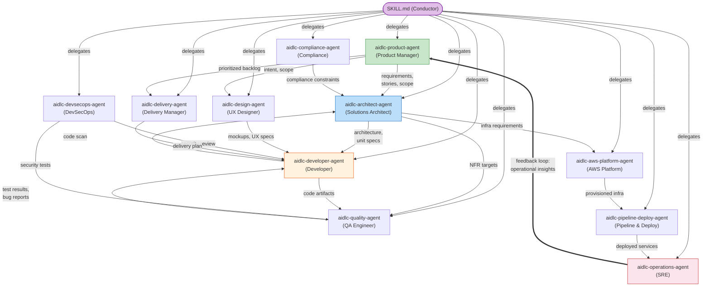

# エージェント

AI-DLC は 14 のエージェントペルソナを同梱する: stage の作業を実行する 11 のドメインエキスパート、レビュー専任の 2 エージェント、そして適応ワークフローの composer である。本章では、ドメインエージェントから始めて、レビュアーと composer まで全一覧を説明する。

---

## 哲学: Small Mob, Broad Agents

数十の狭い専門家（ウォーターフォールの引き継ぎ連鎖を再現してしまう）ではなく、AI-DLC は複数の stage と phase にまたがって関与する**広範な能力を持つ 11 エージェント**を使う。

### なぜ 30 ではなく 11 か？

人間のソフトウェアチームでは、3〜5 人の mob が要件からデプロイまで機能全体をカバーする。各人が複数の専門性にまたがる広いスキルセットを持ち寄る。AI-DLC はこのモデルを鏡写しにする:

- **各エージェントは多くのタスクにわたって 1 つのドメイン全体をカバーする。** aidlc-architect-agent は feasibility、application design、units generation、functional design、NFR requirements、NFR design — 3 phase にまたがる 6 stage — を扱う。狭い専門家モデルなら、ほぼ同一の知識ベースを持つ 6 つの別エージェントが必要になる。

- **エージェントが少ないほど引き継ぎが減る。** すべてのエージェント境界は情報損失の潜在点である。同じ aidlc-architect-agent が Application Design と Functional Design の両方をリードすれば、明示的な引き継ぎ成果物を要さず自然にコンテキストが保たれる。

- **支援ロールが、増殖なしの協働を可能にする。** 「security-reviewer-agent」「compliance-reviewer-agent」「cost-reviewer-agent」を作るのではなく、aidlc-devsecops-agent と aidlc-compliance-agent が、他のエージェントがリードする stage に支援エージェントとして参加する。どう参加するかは stage の `mode` — その通信トポロジー — が決める: `inline` の stage では conductor が各支援エージェントを自分のコンテキスト内のペルソナとして纏う。`subagent`（hub-and-spoke）と `mob`（メッシュ）の stage では、各支援エージェントは本物の独立した協働者として dispatch され、自分の contribution ファイルを書き、リードが統合する（全員が書き、最終成果物はリードが所有する。user-stories が mob のショーケースとして出荷されている）。`pipeline`（連鎖）の stage ではリンクが成果物を順に直接前進させる（reverse-engineering が出荷されている連鎖である）。どのトポロジーでも、すべての委譲は conductor が行う — エージェント同士が呼び合うことはない。

- **知識の読み込みはエージェント単位である。** 各エージェントは方法論の知識を `.claude/knowledge/<agent-name>/` から、チームの知識を space レベルの `aidlc/knowledge/<agent-name>/`（チームが作っていれば）から読み込む。エージェントが少ないほど管理する知識ディレクトリが減り、矛盾する指針が生まれる機会も減る。

---

## エージェント協働マップ

次の図は、ワークフロー中にエージェントがどのように情報を交換するかを示す。実線の矢印は主要な成果物のフロー、破線の矢印は助言・レビューの関係である。operations から product へのフィードバックループがライフサイクル全体を閉じる。

<!-- Text fallback: The SKILL.md conductor delegates to all 11 agents. Key flows: aidlc-product-agent sends requirements/stories to aidlc-architect-agent, who sends specs to aidlc-developer-agent. aidlc-developer-agent sends code to aidlc-quality-agent, who sends test results back. aidlc-aws-platform-agent provisions infrastructure for aidlc-pipeline-deploy-agent, who deploys for aidlc-operations-agent. The feedback loop: aidlc-operations-agent sends operational insights back to aidlc-product-agent, closing the cycle. -->

---

## 11 のドメインエージェント

> **同梱エージェントの知識をカスタマイズしたい？** `.claude/agents/*.md` にある 14 の同梱エージェントファイルを編集しないこと — フレームワークのファイルであり、アップグレードで上書きされる。会社の標準は代わりに space レベルの `aidlc/knowledge/<agent-name>/` に追加する。完全なワークフローは [ナレッジ](08-knowledge.md) を参照。*新しい*エージェントが欲しいチームは、必須の frontmatter を持つファイルを `.claude/agents/<slug>.md` に置ける — そのファイルはユーザー所有である。[コントリビューション: エージェントの追加](../reference/11-contributing.md#adding-an-agent) を参照。

以下の各エージェントには**深掘りページ**がある — 完全な責務、リード / 支援する stage、読み込む知識。[エージェント深掘り索引](agents/README.md) が 11 体すべてを一覧し、エージェント別リンクは各見出しの下にインラインで置いてある。

### [aidlc-product-agent](agents/product-agent.md)

**ドメイン:** 要件、ユーザーストーリー、scope、市場調査

aidlc-product-agent はプロダクトマネージャー兼ビジネスアナリストとして振る舞う。intent を捕捉し、市場調査を行い、scope を定義し、要件を引き出し、ユーザーストーリーを作る。Ideation と Inception の phase で最も活発なエージェントである。

- **リード:** intent-capture、market-research、scope-definition、requirements-analysis、user-stories
- **支援:** rough-mockups、approval-handoff、refined-mockups
- **特別なツール:** WebSearch（市場調査用）

### [aidlc-design-agent](agents/design-agent.md)

**ドメイン:** UX/UI デザイン、ワイヤーフレーム、インタラクションデザイン、アクセシビリティ

aidlc-design-agent はワイヤーフレーム・モックアップ・インタラクション仕様を作る。ユーザー向け機能では aidlc-product-agent と、デザインが実装可能であることの担保では aidlc-developer-agent と密に連携する。

- **リード:** rough-mockups、refined-mockups
- **支援:** user-stories、application-design
- **特別なツール:** WebSearch（デザインリサーチ用）

### [aidlc-delivery-agent](agents/delivery-agent.md)

**ドメイン:** チーム編成、キャパシティ計画、デリバリーの順序付け

aidlc-delivery-agent はエンジニアリングマネージャーとして振る舞う。チームのキャパシティを評価し、mob の編成を組み、デリバリーの順序を計画し、phase の引き継ぎを管理する。

- **リード:** team-formation、approval-handoff、delivery-planning
- **支援:** scope-definition、units-generation
- **特別なツール:** 共有セット以外なし

### [aidlc-architect-agent](agents/architect-agent.md)

**ドメイン:** アプリケーション設計、ドメインモデリング、NFR、コンポーネント分解

aidlc-architect-agent は設計の中心的権威である。stage への関与が最も広く（3 phase にわたる 9 stage）、`judgment` tier を持つ — 他の 7 つの高判断エージェント（product、design、developer、quality、devsecops、compliance、aws-platform）と同様である。judgment のエージェントはセッション自身のモデルと effort を継承するため、あなたが選んだものより下げられることはない。delivery・pipeline-deploy・operations の 3 体だけが `templated` tier（Claude Code・Codex・opencode では中型モデル + 低めの effort。Kiro では全 tier がセッションのモデルと effort を継承）を持つ。その出力が定型的な計画・CI/CD の YAML・runbook の雛形に支配されているためである。

- **リード:** feasibility、application-design、units-generation、functional-design、nfr-requirements、nfr-design
- **支援:** intent-capture、reverse-engineering（統合）、delivery-planning

### [aidlc-aws-platform-agent](agents/aws-platform-agent.md)

**ドメイン:** AWS インフラ、CDK/CloudFormation、コスト最適化

aidlc-aws-platform-agent はインフラを設計し、環境をプロビジョニングし、コストを最適化する。AWS CLI と CDK のコマンドを実行するための Bash アクセスを持つ。

- **リード:** infrastructure-design、environment-provisioning
- **支援:** feasibility、application-design、nfr-design、feedback-optimization
- **特別なツール:** Bash（`aws`・`cdk` コマンド用）

### [aidlc-compliance-agent](agents/compliance-agent.md)

**ドメイン:** 規制スキャン、データ分類、リスク評価

aidlc-compliance-agent は純粋に助言の立場で動く — リードする stage を持たない。他のエージェント、特に aidlc-architect-agent と aidlc-devsecops-agent がリードする stage に規制上の制約を供給する。

- **リード:** なし（支援のみ）
- **支援:** feasibility、nfr-requirements、infrastructure-design、environment-provisioning
- **特別なツール:** WebSearch（規制リサーチ用）

### [aidlc-devsecops-agent](agents/devsecops-agent.md)

**ドメイン:** 脅威モデリング、セキュリティスキャン、DevSecOps パイプライン

aidlc-devsecops-agent は設計をセキュリティ観点でレビューし、セキュリティ要件を定義し、CI/CD パイプラインにセキュリティを統合する。aidlc-compliance-agent と同様、支援ロールで動く。

- **リード:** なし（支援のみ）
- **支援:** practices-discovery、nfr-requirements、infrastructure-design、build-and-test、environment-provisioning
- **特別なツール:** Bash（セキュリティスキャン用）

### [aidlc-developer-agent](agents/developer-agent.md)

**ドメイン:** コード実装、コード分析、データモデリング

aidlc-developer-agent は 3 つの phase にまたがる — Inception のリバースエンジニアリングから Operation のデプロイ支援まで。既存コードベースのコードスキャンを実行し、実装コードを生成する。

- **リード:** reverse-engineering（コードスキャン）、code-generation
- **支援:** practices-discovery、user-stories、functional-design、deployment-execution

ワークスペース検出（workspace-detection）はかつて aidlc-developer-agent の subagent だったが、いまはルールベースのファイル・マニフェスト検出を使って `aidlc-utility intent-birth` の中で決定論的に実行される。
- **特別なツール:** Bash（ビルド・実行コマンド用）

### [aidlc-quality-agent](agents/quality-agent.md)

**ドメイン:** テスト戦略、テスト生成、性能検証

aidlc-quality-agent はテスト戦略を定義し、テストスイートを生成し、品質 gate を検証し、性能テストを実行する。

- **リード:** build-and-test、performance-validation
- **支援:** practices-discovery、user-stories、nfr-requirements
- **特別なツール:** Bash（テスト実行用）

### [aidlc-pipeline-deploy-agent](agents/pipeline-deploy-agent.md)

**ドメイン:** CI/CD パイプライン、デプロイ戦略、リリース実行

aidlc-pipeline-deploy-agent は CI/CD パイプラインを設定し、デプロイ戦略を計画し、ロールバック能力を備えたリリースを実行する。

- **リード:** practices-discovery、ci-pipeline、deployment-pipeline、deployment-execution
- **支援:** なし
- **特別なツール:** Bash（パイプライン・デプロイコマンド用）

### [aidlc-operations-agent](agents/operations-agent.md)

**ドメイン:** 可観測性、インシデント対応、SLO 追跡、フィードバックループ

aidlc-operations-agent は監視を構築し、インシデント対応手順を定義し、運用の洞察を次のイテレーションのために aidlc-product-agent へ還流してライフサイクルのループを閉じる。

- **リード:** observability-setup、incident-response、feedback-optimization
- **支援:** performance-validation
- **特別なツール:** Bash（可観測性・監視コマンド用）

---

## Phase への参加

この表は、どのエージェントがどの phase で活動し、リード（L）か支援（S）かを示す。

| エージェント | Phase 0 | Phase 1 | Phase 2 | Phase 3 | Phase 4 |
|-------|---------|---------|---------|---------|---------|
| aidlc-product-agent | — | L (intent-capture, market-research, scope-definition), S (rough-mockups, approval-handoff) | L (requirements-analysis, user-stories), S (refined-mockups) | — | — |
| aidlc-design-agent | — | L (rough-mockups) | L (refined-mockups), S (user-stories, application-design) | — | — |
| aidlc-delivery-agent | — | L (team-formation, approval-handoff), S (scope-definition) | L (delivery-planning), S (units-generation) | — | — |
| aidlc-architect-agent | — | L (feasibility), S (intent-capture) | L (application-design, units-generation), S (reverse-engineering, delivery-planning) | L (functional-design, nfr-requirements, nfr-design) | — |
| aidlc-aws-platform-agent | — | S (feasibility) | S (application-design) | L (infrastructure-design), S (nfr-design) | L (environment-provisioning), S (feedback-optimization) |
| aidlc-compliance-agent | — | S (feasibility) | — | S (nfr-requirements, infrastructure-design) | S (environment-provisioning) |
| aidlc-devsecops-agent | — | — | S (practices-discovery) | S (nfr-requirements, infrastructure-design, build-and-test) | S (environment-provisioning) |
| aidlc-developer-agent | — | — | L (reverse-engineering), S (practices-discovery, user-stories) | L (code-generation), S (functional-design) | S (deployment-execution) |
| aidlc-quality-agent | — | — | S (practices-discovery, user-stories) | L (build-and-test), S (nfr-requirements) | L (performance-validation) |
| aidlc-pipeline-deploy-agent | — | — | L (practices-discovery) | L (ci-pipeline) | L (deployment-pipeline, deployment-execution) |
| aidlc-operations-agent | — | — | — | — | L (observability-setup, incident-response, feedback-optimization) |

### 観察

- **aidlc-architect-agent** の関与が最も広い（3 phase にわたる 9 stage）。他の 7 つの高判断エージェントと同じく `judgment` tier（セッションのモデルと effort を継承）を持ち、`templated` tier を持つのは **aidlc-delivery-agent**・**aidlc-pipeline-deploy-agent**・**aidlc-operations-agent** だけである
- **aidlc-developer-agent** は 3 phase にまたがる: Inception・Construction・Operation
- **aidlc-compliance-agent** と **aidlc-devsecops-agent** は純粋な支援ロールで、他のエージェントがリードする stage に参加する
- **aidlc-operations-agent** は洞察を aidlc-product-agent へ還流してライフサイクルのループを閉じる

---

## エージェントのツールアクセス

すべてのエージェントは**セッションの完全なツールセット** — Claude Code の組み込みツール全部と、セッションにプロビジョニングされた MCP ツール — を継承する。同梱の唯一の制限は `disallowedTools: Task`（subagent を生成するのは conductor だけ）で、14 エージェントのどれも `tools:` 許可リストを宣言していない。したがって下の表はエージェント別の許可の集合ではなく、各ペルソナが作業で行使すると*期待*されるツールの記録である。

| ツール | 行使が期待されるエージェント |
|------|-------------|
| Read、Edit、Write、Glob、Grep、AskUserQuestion | 全 14 エージェント |
| Bash | aidlc-aws-platform-agent、aidlc-devsecops-agent、aidlc-developer-agent、aidlc-quality-agent、aidlc-pipeline-deploy-agent、aidlc-operations-agent |
| WebSearch | aidlc-product-agent、aidlc-design-agent、aidlc-compliance-agent |
| Task | なし（`disallowedTools: Task` により全エージェントでブロック） |

ペルソナを本当に絞るには、frontmatter に任意の `tools:` 許可リストを足す — ただし完全修飾の `mcp__<server>__<tool>` id も併記しない限り、継承していた MCP アクセスが落ちる。この実装は今日、そのような制限を同梱していない。

### MCP サーバーは共有であり、エージェント別ではない

上の表は各ペルソナが使うと期待される組み込みツールを示すが、実際にはすべてのエージェントが全部を継承する。MCP サーバーも同じ全継承モデルに従う: この実装はプロジェクトルート（`.claude/` の隣）の `.mcp.json` で一度だけ宣言し、Claude Code がセッションにプロビジョニングし、すべてのエージェントがその全部を継承する — エージェント別の許可は存在しない。14 エージェントのそれぞれが、追加設定なしに宣言済みの全サーバー（`context7` と 4 つの AWS サーバー）へ到達でき、認証情報の無いサーバーはブロッカーではなく単に利用不可になる。特定のエージェントからサーバーへの到達を止めるには、そのエージェントの `tools:` 許可リストを、保持すべき完全修飾の `mcp__<server>__<tool>` id（例えば `mcp__context7__<tool>`）に絞る。この実装は今日、そのような制限を同梱していない。

サーバーの一覧と認証情報は [はじめかた](01-getting-started.md)、MCP が Claude Code のネイティブなツールモデルにどう写像されるかは [Harness プリミティブの対応](../reference/14-claude-features.md#mcp-servers) を参照。

---

## レビュアーエージェント

11 のドメインエキスパートに加えて、AI-DLC は **2 つの品質 gate レビュアー
エージェント**を同梱する。成果物は作らない — ビルダーが作ったものをレビューして
挑み、gate で顧客（あるいはレビューボード）を代表する。

| レビュアー | レビュー対象 | Tier |
|----------|---------|------|
| `aidlc-product-lead-agent` | 要件・ユーザーストーリー・UX/モックアップ成果物 — 完全性、ビジネス整合、テスト可能性 | balanced |
| `aidlc-architecture-reviewer-agent` | 技術設計成果物 — 健全性、実装可能性、壊れた相互参照、達成不能な NFR 目標 | balanced |

## composer エージェント

両グループの外にもう 1 体いる: 適応ワークフローの composer である `aidlc-composer-agent`。conductor は compose の要望（`/aidlc compose`、コールドスタートでの compose 提案、`--report`、`--new-scope`）で dispatch する。タスクの実装エントロピー（5 成分: intent の曖昧さ・構造的不確実性・検証エントロピー・リスク・未解決の仮定 — 設定済みなら CodeKB MCP 分析に、そうでなければワークスペーススキャンに接地）を推定し、スコアの内訳と stage 別の根拠を添えて最小実行可能な EXECUTE/SKIP グリッドを提案し、gate であなたが承認した後にだけ、合成 scope を書く（フロント / レポート経由）か、決定論的な `recompose` 動詞が適用する保留 stage のフリップを提案する（実行中）。そのペルソナは存在と不在の両方をエントロピープロファイルに照らして正当化する: すべての EXECUTE は削減する成分を名指しし、すべての SKIP はそれを既にカバーするものを名指しし、背骨（core・検証・荷重を受けるディスカバリー stage）を切ることは危険な失敗として扱われる。[Scope と Depth - 適応コンポーザー](05-scopes-and-depth.md#the-adaptive-composer) を参照。

レビュアーは stage が `reviewer:` フィールドを宣言しているときにだけ発火する。今日、product
lead は `rough-mockups`・`refined-mockups`・`requirements-analysis`・
`user-stories` を、architecture reviewer は `application-design`・
`units-generation`・`functional-design`・`nfr-requirements`・`nfr-design`・
`infrastructure-design`・`code-generation` をレビューする。

**レビュアーのステップ。** stage 本体が成果物を作った後、learnings の儀式と承認 gate の前に、
conductor は名指しされたレビュアーを**独立した sub-agent** として起動する。レビュアーは
stage 定義・Q&A・成果物を読み（ビルダーの `memory.md` や計画は決して読まない —
独立の判断を形成する）、**READY** または **NOT-READY** の判定を付けた `## Review`
セクションを追記する。NOT-READY ならビルダーが指摘に対処するため再実行し、レビュアーが
再確認する。このループは `reviewer_max_iterations` 回（既定 2）まで。上限後も指摘が残る場合、
未解決の指摘を注記した上でワークフローは承認 gate へ進む — レビュアーは決してブロックせず、
最終決定権は常に人間にある。

（重要: エージェント名は示したとおりバッククォートの素の名前で使うこと — markdown リンクにしないこと。レビュアーのエージェント別ドキュメントページはまだ存在しない。）

---

## 次のステップ

- [Phase と Stage](04-phases-and-stages.md) — stage フロー全体の文脈でエージェントを見る
- [ナレッジ](08-knowledge.md) — エージェントが方法論とチームの知識を読み込む仕組み
- [Rule と学習ループ](09-rules-and-the-learning-loop.md) — エージェントの振る舞いを制約する行動ルール
- [用語集](glossary.md) — 用語リファレンス
