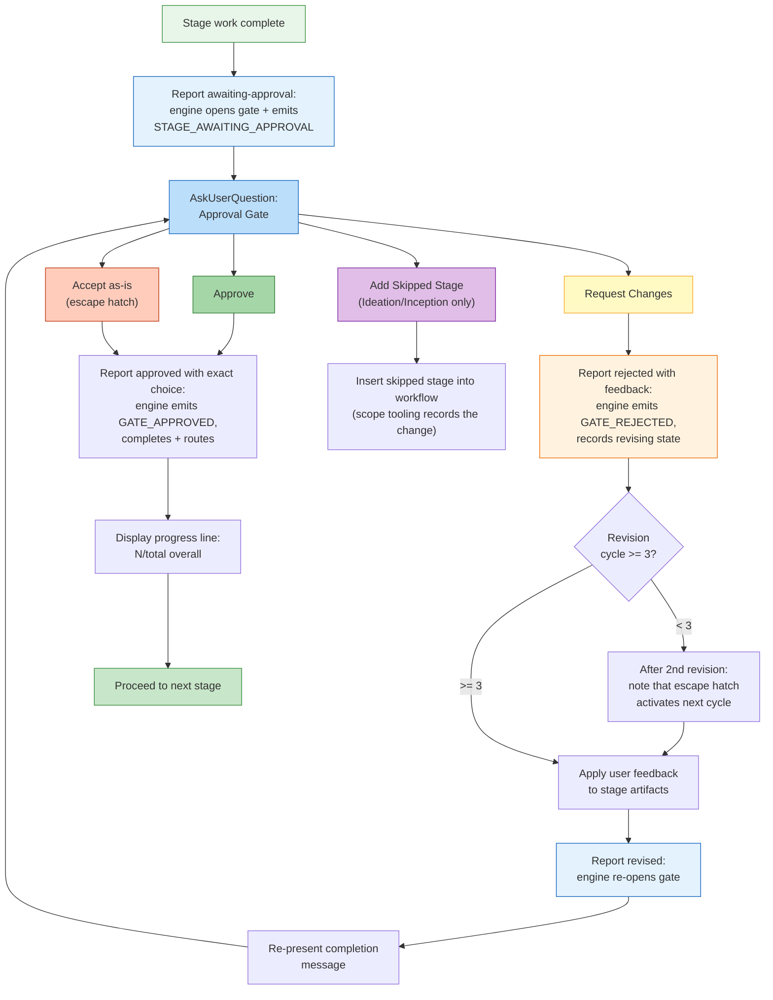

# 対話モード

AI-DLC は、stage の中でエージェントと対話する 3 つの方法と、あらゆる意思決定ポイントで制御を保つ承認 gate を提供する。

> **Harness に関する注記。** gate と質問の描画は harness ごとに異なる。Claude
> Code はネイティブの question picker を使い、Codex は有効化されていればその picker を使う。
> Kiro・opencode・GitHub Copilot は番号付きの散文の選択肢を描画する（Copilot の
> picker の結果は信頼済みの human-presence イベントを発火しない）。questions ファイルが
> 正であり続ける。gate がいつ発火し、何を尋ね、あなたが制御を保つという*意味論*は
> エンジン側にあるため同一である。
> [他の harness で動かす](harnesses/README.md) を参照。

---

## 3 モードの質問フロー

stage が入力を集めるとき、エージェントは 3 つの対話モードを提示する。いまの stage に最も合うモードを選ぶ。

```
▸ Choose interaction mode:
  (1) Guide Me — agent asks structured questions
  (2) Edit File — write directly to the artifact
  (3) Chat — freeform discussion
```

### Guide Me

エージェントが構造化されたプロンプトで質問を 1 つずつ対話的に進める。エージェントに会話をリードさせ、抜け漏れを防ぎたいときに最適。

- エージェントが質問を 1 つずつ（またはまとめて）提示する
- 各質問に直接答える
- 回答はトレーサビリティのために stage の questions ファイルに記録される

### Edit File

エージェントが questions ファイルを作成（または開き）、あなたが直接編集する。欲しいものが既に分かっていて、質問に答えるより書き下ろしたいときに最適。

- questions ファイルが空欄の回答フィールド付きで intent の record dir に現れる
- 自分のペースで回答を埋める
- エージェントが完成したファイルを読んで先へ進む

### Chat

エージェントとの自由な会話。アイデアを探索したいときや、要件がまだ固まっていないときに最適。

- エージェントと自由に議論する
- エージェントが会話から決定事項を抽出する
- 抽出された決定事項が、正としての questions ファイルへ書き戻される

### stage 途中のモード切り替え

stage の途中でいつでもモードを切り替えられる。3 つのモードはすべて、決定事項の正準記録としての questions ファイルに収斂する。切り替えで進捗は失われない — 捕捉済みの回答はファイルに残る。

---

## 承認 gate

すべての stage（Initialization の 3 stage を除く）は承認 gate で終わる。ワークフローが先に進む前にエージェントの仕事をレビューする、あなたのチェックポイントである。

### 標準の gate

既定の承認 gate は 2 つの選択肢を提示する:

```
▸ How would you like to proceed?
  (1) Approve — Continue to [next stage]
  (2) Request Changes — Provide revision feedback
```

`[next stage]` にはワークフローが実際に次に走らせる stage（例:「Continue to NFR Requirements」）、最終 stage では「Complete workflow」が入る。エンジンが計算するため、推測ではなく常に正しい。

- **Approve** は結果を報告する。エンジンが stage を完了にし、`aidlc-state.md` を更新し、
  進捗行を表示して、次の stage へ進む
- **Request Changes** は具体的なフィードバックを渡せる。エージェントが作業を修正して承認 gate を再提示する

gate は本物の人間の応答を要求する: プロンプトの入力やネイティブの question picker への回答は、audit の台帳に human turn（`HUMAN_TURN` イベント）を記録し、承認（および明確化質問への回答）は、直近の gate 解決以降に human turn が 1 つも記録されていなければ拒否される — つまり autopilot で走るモデルが、人間が何も行動していないのに承認を捏造することはできない。picker が human turn を記録しない harness では、一度だけ短いメッセージ（例えば「approve」）を打って記録を残す。（台帳にまだ human turn が無い harness では、gate は fail open となりこれを要求しない。）

### 承認 gate のフロー



<!-- Text fallback: Stage work completes, report awaiting-approval opens the gate (the engine records STAGE_AWAITING_APPROVAL), and AskUserQuestion presents the approval gate. Approve: report approved with the exact choice so the engine records GATE_APPROVED, completes, and routes; show progress; proceed. Request Changes: report rejected with the feedback (the engine records GATE_REJECTED), check revision count (if <3, note escape hatch coming, revise, report revised to re-open the gate, and re-present; if >=3, Accept-as-is becomes available). Accept as-is: report approved. Add Skipped Stage (Ideation/Inception only): recompose the plan. The report calls own the gate's audit trail; no separate log entries are added for the gate prompt or choice. -->

---

## 3 ストライクの修正エスケープハッチ

同じ stage で 3 回以上変更を要求すると、3 つ目の選択肢が現れる:

```
▸ This is revision cycle 4. How would you like to proceed?
  (1) Approve — Continue to [next stage]
  (2) Request Changes — Provide revision feedback
  (3) Accept as-is — Archive current version and move on
```

**Accept as-is** は stage 成果物の現行版をアーカイブしてワークフローを前進させる。完璧が善の敵になったときの、無限の修正ループを防ぐ。

### 有効化のされ方

| 修正サイクル | 起きること |
|----------------|-------------|
| 1 回目 | 標準の 2 択 gate |
| 2 回目 | 標準の 2 択 gate に注記を添える:「あと 1 回修正すると『Accept as-is』が選べるようになる」 |
| 3 回目以降 | Accept as-is 付きの 3 択 gate |

修正カウントは次の stage へ進むとリセットされる。

---

## スキップ済み stage の追加オプション

**Ideation** と **Inception** の phase では、承認 gate に、以前スキップされた stage をワークフローへ戻す条件付きの選択肢が含まれることがある:

```
▸ How would you like to proceed?
  (1) Approve — Continue to Scope Definition
  (2) Request Changes — Provide revision feedback
  (3) Add Market Research — Include Market Research which was skipped
```

この選択肢が現れるのは次のときだけである:
- 現在の stage が Ideation か Inception にある
- 先にある stage が scope ルーティングでスキップされた
- そのスキップ済み stage が現在の文脈に関連する

選択すると、スキップされていた stage がワークフロー計画に挿入される。追加された stage を通ってワークフローは通常どおり続く。

---

## stage のスキップと移動

承認 gate 以外にも、移動の選択肢がある:

| コマンド | 効果 |
|---------|--------|
| `/aidlc --stage <name>` | 特定の stage へジャンプ（間の stage は `[S]` が付く） |
| `/aidlc --phase <name>` | phase の先頭へジャンプ |

詳細は [セッション管理](11-session-management.md) と [CLI コマンド](12-cli-commands.md) を参照。

---

## 進捗の追跡

すべての承認の後、進捗行が表示される:

```
Progress: 13/32 overall | 3/7 IDEATION stages complete. Next: Approval & Handoff
```

表示内容:
- 全 stage を通した合計の進捗
- 現在の phase 内の進捗
- 次の stage の名前

---

## 次のステップ

- [最初のワークフロー](02-your-first-workflow.md) — 対話モードを文脈の中で見る
- [状態と audit](10-state-and-audit.md) — 決定がどう追跡されるか
- [セッション管理](11-session-management.md) — 再開・やり直し・ジャンプ
- [用語集](glossary.md) — 用語リファレンス
