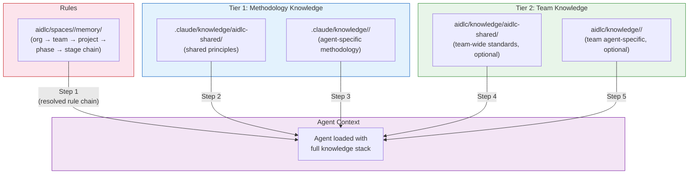
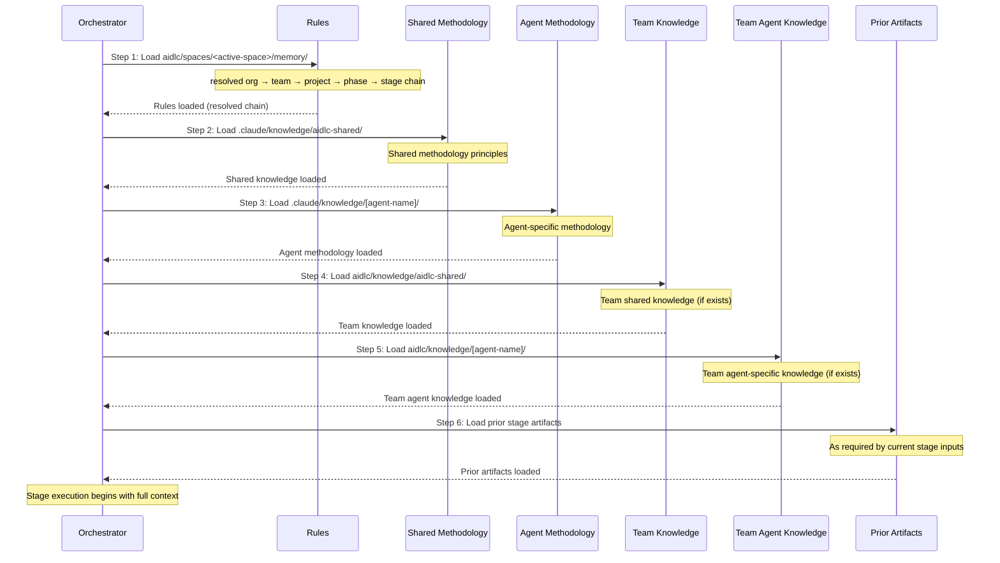

# ナレッジ

AI-DLC は 2 層のナレッジシステムを使い、エージェントが方法論の専門知識（フレームワーク同梱）と、チーム固有の標準（あなたが管理）の両方を引けるようにする。

---

## 2 層ナレッジアーキテクチャ



<!-- Text fallback: The resolved rule chain loads first, then Tier 1 methodology knowledge (shared, then agent-specific), then Tier 2 team knowledge (shared, then agent-specific). All feed into the agent context for stage execution. -->

### Tier 1: 方法論ナレッジ

**場所:** `.claude/knowledge/`

フレームワークに同梱される。AI-DLC の stage がどう実行されるかを定義する、共有原則とエージェント別の方法論リファレンスを含む。フレームワークのアップグレード時に更新される。

```
.claude/knowledge/
├── aidlc-shared/                       # Loaded by every agent
│   ├── ai-dlc-principles.md        # Core methodology principles
│   ├── audit-format.md             # 76-event audit taxonomy
│   ├── brownfield.md               # Brownfield safeguards and reverse-engineering guidance
│   ├── knowledge-readme-template.md # Optional README template a team can copy into Tier 2
│   ├── state-template.md           # State file contract
│   └── verification.md             # Phase boundary verification rules
├── aidlc-architect-agent/                 # Loaded when aidlc-architect-agent is active
├── aidlc-developer-agent/                 # Loaded when aidlc-developer-agent is active
├── aidlc-product-agent/                   # Loaded when aidlc-product-agent is active
└── ...                              # One directory per agent
```

> **チームの知識を注入するために Tier 1 のファイルを編集しないこと。** `.claude/knowledge/` と `.claude/agents/*.md` はフレームワークのファイルであり、アップグレードのたびに上書きされ、変更は消える。会社の標準・アーキテクチャの選好・ドメイン文脈を足したいなら **Tier 2**（下記）に足す。エージェントの振る舞いを制約したいなら **rule** を足す（[Rule と学習ループ](09-rules-and-the-learning-loop.md) を参照）。

### Tier 2: チームナレッジ

**場所:** アクティブな space — `aidlc/knowledge/`（`aidlc/spaces/<space>/knowledge/` の短縮表記）

ユーザーが管理する。会社固有の標準・ポリシー・慣習を含む。space の `memory/`・`codekb/`・`intents/` の兄弟であり、チームナレッジは特定の intent の記録の中ではなく、space 内のすべての intent を横断して蓄積される。**自由形式で、ブートストラップ時は空**である: エンジンは最初の `/aidlc` で空の `aidlc/knowledge/` ディレクトリを作るだけ。固定のファイルセットも強制される構造も無い。下の慣習 — `aidlc-shared/` ディレクトリとエージェント別ディレクトリ — はエージェントペルソナが探しに行く場所なので、必要になったサブディレクトリから作っていく:

```
aidlc/knowledge/                  # empty at bootstrap; create the subdirs you need
├── aidlc-shared/                 # if present, loaded by every agent
│   ├── company-coding-standards.md
│   └── company-architecture-principles.md
├── aidlc-architect-agent/           # if present, loaded when aidlc-architect-agent is active
│   └── company-architecture-patterns.md
├── aidlc-developer-agent/           # if present, loaded when aidlc-developer-agent is active
│   └── company-coding-conventions.md
├── aidlc-devsecops-agent/           # if present, loaded when aidlc-devsecops-agent is active
│   └── company-security-policy.md
├── aidlc-quality-agent/             # if present, loaded when aidlc-quality-agent is active
│   └── company-testing-standards.md
└── ...                        # add a directory per agent only if you have content for it
```

---

## 会社標準の追加

会社固有のファイルを適切な `aidlc/knowledge/` ディレクトリに置く。エージェントが有効化されたときに自動で読み込まれる — 設定変更は不要である。

### チーム全体の標準（全エージェントが読み込む）

`aidlc/knowledge/aidlc-shared/` に追加する:

```
aidlc/knowledge/aidlc-shared/company-coding-standards.md
aidlc/knowledge/aidlc-shared/company-architecture-principles.md
aidlc/knowledge/aidlc-shared/naming-conventions.md
```

### エージェント固有の標準（そのエージェントが有効なときだけ読み込む）

`aidlc/knowledge/<agent-name>/` に追加する:

| ディレクトリ | ファイル例 |
|-----------|--------------|
| `knowledge/aidlc-architect-agent/` | アーキテクチャパターン、ADR テンプレート、設計原則 |
| `knowledge/aidlc-developer-agent/` | コーディング規約、フレームワークガイド、API パターン |
| `knowledge/aidlc-devsecops-agent/` | セキュリティポリシー、脅威モデルテンプレート、スキャンルール |
| `knowledge/aidlc-quality-agent/` | テスト標準、カバレッジ閾値、性能基準 |
| `knowledge/aidlc-aws-platform-agent/` | AWS アカウント構造、CDK 規約、タグ付けポリシー |
| `knowledge/aidlc-compliance-agent/` | 規制要件、データ分類、監査標準 |
| `knowledge/aidlc-operations-agent/` | SLO 定義、インシデント手順、監視標準 |
| `knowledge/aidlc-product-agent/` | プロダクト戦略、ペルソナ定義、優先順位付けフレームワーク |
| `knowledge/aidlc-design-agent/` | デザインシステム、アクセシビリティ標準、UX ガイドライン |
| `knowledge/aidlc-delivery-agent/` | スプリントテンプレート、キャパシティモデル、見積もりガイドライン |
| `knowledge/aidlc-pipeline-deploy-agent/` | CI/CD パターン、デプロイチェックリスト、ロールバック手順 |

### ディレクトリはどこから来るか

チームが作る。最初の `/aidlc` でエンジンが空の space レベル `aidlc/knowledge/` ディレクトリを作る — 中身は何も無い。スキャフォールドコマンドも、シード済みのエージェント別サブディレクトリも、案内用 README も無い。`aidlc-shared/` とエージェント別サブディレクトリはエージェントペルソナが探しに行く慣習であり、コンテンツがあるものから作る。エージェントの slug と正確に一致させること（`architect/` ではなく `aidlc-architect-agent/`）— タイプミスしたディレクトリ名は黙って無視される。

---

## 実例: 最初のナレッジファイルを追加する

チームが Amazon API Gateway を特定のパターン — 全ルートの前段の authorizer Lambda、リクエスト検証の JSON スキーマ、標準のレスポンスエンベロープ — で使っているとしよう。aidlc-architect-agent が新しい API を設計するとき、常にそのパターンを既定にしてほしい。

**手順 1 — 必要なナレッジディレクトリを作る。** 最初の `/aidlc` でエンジンは空の `aidlc/knowledge/` を作る。エージェント別のスキャフォールドもシード済み README も無いので、エージェントのサブディレクトリ — ここでは `aidlc/knowledge/aidlc-architect-agent/` — を自分で作る。エージェントの slug と正確に一致させる。

**手順 2 — 正しいエージェントディレクトリに焦点の絞れたナレッジファイルを作る:**

```
aidlc/knowledge/aidlc-architect-agent/api-gateway-standards.md
```

ファイル名のルール:
- 小文字・ハイフン区切り・内容が分かる名前
- 1 ファイル 1 トピック — `architecture.md` ではなく `api-gateway-standards.md`
- ディレクトリ内のどの `.md` も読み込まれる — 命名規約の強制は無いが、内容が分かる名前は週次レビューで役に立つ

**手順 3 — 内容は簡潔なリファレンス資料として書く。** エージェントはファイルを字義どおり読み込むため、引き締めて書く:

```markdown
# API Gateway Standards

All new HTTP APIs use Amazon API Gateway REST APIs (not HTTP APIs) with:

## Authorization
- Lambda authorizer in front of every route
- Token source: `Authorization` header, Bearer scheme
- Authorizer result cached for 300 seconds

## Request validation
- Every request body validated against a JSON schema attached to the method
- Reject at the gateway layer — do not validate in handlers

## Response envelope
All successful responses follow:
  { "data": <payload>, "requestId": "<uuid>", "timestamp": "<iso-8601>" }

Error responses follow:
  { "error": { "code": "<short-code>", "message": "<human-readable>" }, "requestId": "<uuid>" }
```

**手順 4 — ワークフローを実行する。** 次の `/aidlc` 呼び出しで、aidlc-architect-agent が stage 開始時にこのファイルを自動で読み込む（下の読み込み順の手順 5）。設定も CLI フラグも登録も不要 — ファイルの存在が登録である。

**避けるべきよくある間違い:**

| 誤り | 正解 |
|-------|-------|
| `.claude/agents/aidlc-architect-agent.md` を編集する | `aidlc/knowledge/aidlc-architect-agent/` の下にファイルを足す |
| `.claude/knowledge/aidlc-architect-agent/architecture-guide.md` を編集する | `aidlc/knowledge/aidlc-architect-agent/` の下にファイルを足す |
| すべてを `knowledge/aidlc-shared/` に置く | 標準が本当に全 14 エージェントに当てはまる場合を除き、エージェント別ディレクトリを使う |
| API・認証・データ・ログを 1 つの大きな `company-standards.md` にまとめる | `api-gateway-standards.md`、`auth-standards.md` のように分割する |

---

## ナレッジが読み込まれていることの検証

チームに展開する前に、エージェントが実際にファイルを見ていることを確かめる。

**方法 1 — 承認 gate でエージェントに尋ねる。** ワークフロー中の任意の gate でこう返信する:

```
What team knowledge are you using for this stage?
```

エージェントが読み込んだ Tier 2 ファイルを列挙する。ファイルが無い場合、拡張子が `.md` であること、ディレクトリがエージェント名と正確に一致すること（`architect/` ではなく `aidlc-architect-agent/`）を確認する。

**方法 2 — audit トレイルでエージェントを確認する。** すべての stage 開始は、stage とそのリードエージェントを記録する `STAGE_STARTED` audit イベントを発行する。stage を実行した後、次を確認する:

```
<record>/audit/        # per-clone shards; glob and merge by timestamp
```

対象 stage の最新の `STAGE_STARTED` エントリを見つけ、**Agent** フィールドが、あなたのファイルを持つナレッジディレクトリのエージェントであることを確認する — 正しいペルソナが有効化され、その `aidlc/knowledge/<agent>-agent/` ディレクトリがスコープに入っていたことが分かる。audit トレイルはどのエージェントが走ったかを記録するのであって、読んだ個々のファイルは記録しない。特定のファイルが読み込まれたことの確認には方法 1 を使う。

**方法 3 — 高速なワークフローでスモークテストする。** 軽量な end-to-end 確認には、対象エージェントを動かす小さな scope を使う:

```
/aidlc poc Prototype a new inventory API
```

aidlc-architect-agent は Application Design で走る。読み込まれた Tier 2 ファイルは出力に目に見えて影響する（この例では、生成されたアーキテクチャが Lambda authorizer 付きの API Gateway を参照するはずだ）。

---

## ナレッジの経年管理

ナレッジファイルは置きっぱなしにできない。標準が進化するにつれ、チームナレッジの保管庫はコードと同じように剪定とリファクタリングを要する。

### 既存ファイルの更新

ファイルをその場で編集する。ナレッジは stage 開始のたびに再読み込みされるため、次の `/aidlc` 呼び出しが変更を拾う。再起動もキャッシュも登録も無い。

### 古くなったナレッジの削除

ファイルを削除する。更新すべきレジストリも掃除すべき設定も無い。エージェントが削除された標準に依存していた場合、以後の実行は単にそれを適用しなくなる。

### 大きくなりすぎたファイルの分割

1 ファイルが複数のトピックを覆うようになったら（よくあるドリフト）、分割する:

```
api-standards.md          →   api-gateway-standards.md
                              api-versioning-standards.md
                              api-error-handling-standards.md
```

小さく焦点の絞れたファイルは、更新しやすく、レビューしやすく、矛盾を含みにくい。

### エージェント固有から共有への昇格

あるエージェント向けに書いた標準がチーム全体に当てはまると分かったら、上へ移す:

```
aidlc/knowledge/aidlc-architect-agent/naming-conventions.md
  →  aidlc/knowledge/aidlc-shared/naming-conventions.md
```

`aidlc-shared/` ディレクトリはすべてのエージェントが読み込む（読み込み順の手順 4）。

### レビューの周期

四半期ごとの剪定を予定する — 活動中のプロジェクトはどれも古びたナレッジを溜め込む。古い・矛盾するファイルは、等しい重みで字義どおり読み込まれるため、エージェントを積極的に混乱させる。レトロの中の短い週次・スプリントレビューで足りることが多い: 各ファイルを開き、現実をまだ反映しているか確認し、そうでないものを削除・更新する。

---

## ナレッジと Rule: どちらを使うか

ナレッジファイルと rule はどちらもエージェントの振る舞いをカスタマイズするが、交換可能ではない。判断にはこの表を使う:

| ナレッジを使うのは… | rule を使うのは… |
|-----------------------|--------------------|
| エージェントが参照すべき**リファレンス資料**を提供するとき | エージェントが従うべき**行動ルール**を述べるとき |
| 「これが我々の使うパターンだ」 | 「X を決してするな」/「常に Y をせよ」 |
| 内容が情報的・文脈的 | 内容が規範的・交渉不能 |
| 特定のドメインやエージェントに適用される | stage とエージェントを横断して適用される |
| 長文の散文・図・表でよい | 短く、命令形で、1 行ずつが望ましい |
| 例: API Gateway 標準、コーディング規約、ドメイン用語集 | 例:「PII をログに出さない」「データアクセスは必ずリポジトリ層を通す」「DynamoDB の scan 操作を使う設計は拒否する」 |

有用な経験則: **ルール違反があったら人間のレビュアーが stage の出力を差し戻すようなものなら、space の memory 層（`aidlc/spaces/<active-space>/memory/`）に属する。** レビュー時の背景文脈として使うようなものなら、ナレッジである。

rule とナレッジは異なるプレーンにあり、だからこそ読み込みの振る舞いが違う。ナレッジファイルは stage 中にエージェントが重み付けするリファレンス資料である。rule は厳密加算の連鎖 — org、次に team、次に project、次に phase、次に stage — で解決され、フレームワークがワークフローに先立ってコンパイルする。適用されるすべての rule がエージェントに届き、何も黙って落とされない。層間の衝突は、team や project の rule が最初に書かれた受け入れ時に検出される — stage の途中で調停されるのではない。

rule モデルの全体 — ファイルの場所、5 層の連鎖、学習ループ、受け入れ時の衝突チェック — は [Rule と学習ループ](09-rules-and-the-learning-loop.md) を参照。

---

## ナレッジの読み込み順

stage が始まると、conductor は厳密な 6 手順の順序でナレッジを読み込む:



<!-- Text fallback: Six steps: 1. Rules (the resolved org → team → project → phase → stage chain), 2. Shared methodology knowledge, 3. Agent-specific methodology knowledge, 4. Team shared knowledge (if exists), 5. Team agent-specific knowledge (if exists), 6. Prior stage artifacts. -->

| 手順 | ソース | 読み込まれるもの | 優先度 |
|------|--------|-----------|----------|
| 1 | `aidlc/spaces/<active-space>/memory/` | 解決済みの org → team → project → phase → stage の rule 連鎖 | 行動ルール — 適用される全 rule が読み込まれる（厳密加算） |
| 2 | `.claude/knowledge/aidlc-shared/` | 共有の方法論原則 | フレームワークレベルの既定 |
| 3 | `.claude/knowledge/<agent>/` | エージェント別の方法論 | エージェントの専門性 |
| 4 | `aidlc/knowledge/aidlc-shared/` | チーム全体の標準 | 会社の既定 |
| 5 | `aidlc/knowledge/<agent>/` | チームのエージェント別標準 | 会社 + エージェントの専門性 |
| 6 | 前段 stage の成果物 | 先行 stage の出力 | ランタイムの文脈 |

**要点:**
- 手順 1〜5 はディスク上のファイルから読み込む
- 手順 6 は、現在 stage の宣言された入力に基づいて orchestrator が実行時に足す文脈である
- 手順 4〜5 はディレクトリが存在しファイルがあるときだけ読み込まれる
- [Rule](09-rules-and-the-learning-loop.md) はリファレンス資料ではなく行動の制約である — 解決済みの連鎖が最初に読み込まれ、適用される全 rule がエージェントに届く

---

## ベストプラクティス

### ナレッジファイルは焦点を絞る

各ファイルは 1 トピックを覆うこと。1 つの大きなファイルより多くの小さなファイルを選ぶ — 更新と、古びた標準の削除が容易になる。

### 横断的関心事には共有ディレクトリを使う

全エージェントに当てはまる標準（命名規約・コーディングスタイル・コミットメッセージ形式）は `knowledge/aidlc-shared/` へ。ドメイン固有の標準（アーキテクチャパターン・セキュリティポリシー）はエージェントのディレクトリへ。

### ワークフローの前にナレッジをレビューする

ナレッジファイルは stage 開始のたびに読み込まれる。古い・矛盾するナレッジはエージェントを混乱させる。定期的にナレッジディレクトリをレビューして剪定する。

### Tier 1 の内容を複製しない

方法論の原則をエージェントがどう適用するかを**制約**したいなら、Tier 1 ファイルを複製するのではなく rule を足す。[Rule と学習ループ](09-rules-and-the-learning-loop.md) を参照。

### チームの文脈を注入するためにエージェントファイルを編集しない

`.claude/agents/*.md` はエージェントのペルソナ・ツールアクセス・ナレッジ読み込み順を定義する。チームナレッジを足すためにこれを編集するのはよくある間違いだ — 変更はフレームワークのアップグレードで上書きされる。常に `aidlc/knowledge/<agent>/` を使う。

### ディレクトリ名はエージェントの slug に一致させる

space レベルの `aidlc/knowledge/` はブートストラップ時に空である — `aidlc-shared/` とエージェント別サブディレクトリは、標準が溜まるにつれて自分で作る。ディレクトリ名はエージェントの slug と正確に一致しなければならない（`architect/` ではなく `aidlc-architect-agent/`）。ローダーはエージェント自身のディレクトリを名前で歩いて何も見つけないため、タイプミスした名前は黙って無視される。

---

## 次のステップ

- [Rule と学習ループ](09-rules-and-the-learning-loop.md) — 厳密加算の rule 連鎖と、フレームワークがワークフローを跨いで新しい rule を学ぶ仕組み
- [はじめかた](01-getting-started.md) — ワークスペースシェルと、ナレッジディレクトリが現れる場所
- [カスタマイズ](13-customization.md) — カスタマイズの完全ガイド
- [用語集](glossary.md) — 用語リファレンス
