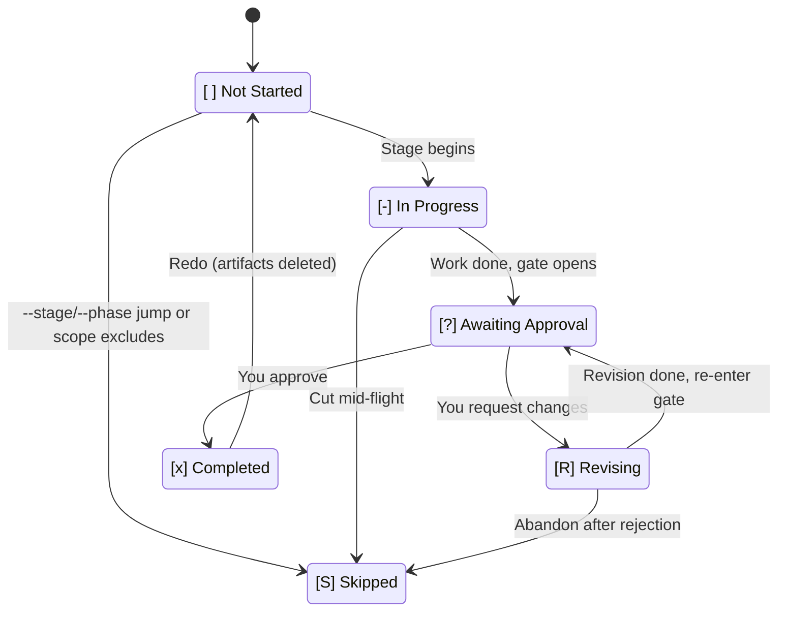
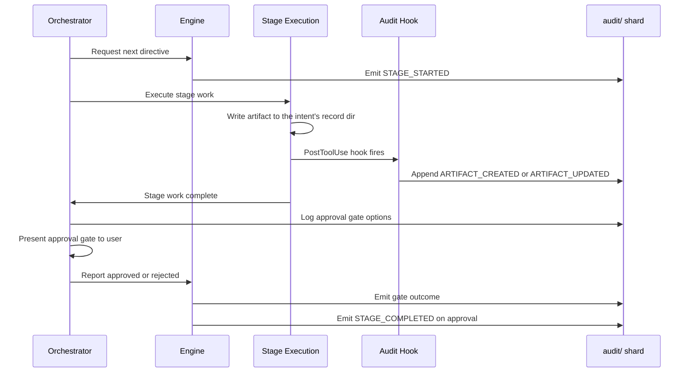

# 状態の追跡と audit トレイル

AI-DLC は、intent から本番までの完全なトレーサビリティを合わせて提供する 2 つの永続ファイルを維持する: **状態ファイル**はワークフローのどこにいるかを追跡し、**audit トレイル**は道中のすべての決定・行動・イベントを記録する。

---

## 状態ファイル（`aidlc-state.md`）

各 intent は `aidlc/spaces/<space>/intents/<YYMMDD>-<label>/aidlc-state.md`（intent の record dir 配下）に自分の状態ファイルを持つ — その intent のワークフロー進捗にとっての単一の正である。エンジンはセッション開始のたびにアクティブ intent の状態ファイルを読み、何が完了し、何が進行中で、次に何が来るかを判定する。

### 含まれるもの

| セクション | 目的 |
|---------|---------|
| **Project Information** | プロジェクト記述、種別（greenfield/brownfield）、scope、開始日、現在の phase、アクティブなエージェント |
| **Scope Configuration** | 実行する stage、スキップする stage（理由付き）、depth レベル |
| **Workspace State** | プロジェクトルート、検出された言語、フレームワーク、ビルドシステム |
| **Execution Plan Summary** | 総 stage 数、完了数、進行中の stage |
| **Runtime State** | 現在 stage の修正カウント |
| **Stage Progress** | stage ごとの完了状態を追跡するチェックボックス |
| **Current Status** | ライフサイクル phase、現在 / 次の stage、状態、最終更新タイムスタンプ |
| **Session Resume Point** | 最後に完了した stage、次のアクション、保留中の成果物 |

### 6 状態のチェックボックス

stage の進捗は 6 状態のチェックボックス記法を使う:

| チェックボックス | 意味 |
|----------|---------|
| `[ ]` | 未着手 |
| `[-]` | 進行中 |
| `[?]` | あなたの承認待ち（gate が開いている） |
| `[R]` | 修正中（gate で差し戻し、stage を修正している） |
| `[x]` | 完了 |
| `[S]` | スキップ（scope 対象外、`skip` で切除、または `--stage`/`--phase` ジャンプで迂回） |

ハッピーパスでは stage は `[ ]` → `[-]` → `[?]` → `[x]` と遷移する。gate で差し戻すと、修正の間 `[R]` へ移り、準備ができると `[?]` に戻り、承認で最終的に `[x]` になる。`/aidlc --status` はチェックボックスを読んで誰が詰まりの原因かを教える — `[?]` なら「Awaiting your approval on \<stage\>」、`[R]` なら「Revising \<stage\> (revision N of 3)」。

正準の状態機械リファレンス（遷移表・audit イベントの発行元）は [開発者リファレンス: 状態機械](../reference/12-state-machine.md) を参照。

### 状態遷移

<!-- Text fallback: [ ] Not Started transitions to [-] In Progress when a stage begins. [-] In Progress transitions to [?] Awaiting Approval when stage work is done and the gate opens. [?] Awaiting Approval transitions to [x] Completed when you approve, or to [R] Revising when you request changes. [R] Revising transitions back to [?] Awaiting Approval when revision is complete. [ ] Not Started, [-] In Progress, and [R] Revising can each transition to [S] Skipped via jumps, scope exclusion, or abandonment. [x] Completed transitions back to [ ] Not Started on redo (artifacts deleted). -->

### 通常・修正・スキップ・やり直し・ジャンプの各フロー

- **通常フロー**: `[ ]` -> `[-]` -> `[?]` -> `[x]`（stage 開始、作業完了、gate が開く、承認）
- **修正フロー**: `[?]` -> `[R]` -> `[?]` -> `[x]`（差し戻し、stage を修正、gate 再開、承認）
- **scope スキップフロー**: `[ ]` -> `[S]`（このワークフローの scope に無い stage。初期化時に付く）
- **やり直しフロー**: `[x]` または `[-]` -> `[ ]` -> `[-]`（やり直しを要望、成果物が削除され、stage が再実行）
- **ジャンプフロー**: stage A が `[-]` のとき stage B へのジャンプを要望すると、間の stage に `[S]` が付く

---

## audit トレイル（`audit/`）

audit トレイルは intent の record dir の `aidlc/spaces/<space>/intents/<YYMMDD>-<label>/audit/` に住む。**クローンごとのシャード**（`<host>-<clone>.md`）として書かれる追記専用のイベントログで、各クローンは自分のシャードにだけ追記するため、兄弟 worktree からの並行追記が git コンフリクトを起こすことは決してない。読む側は `audit/*.md` を glob し、ISO タイムスタンプでマージソートして、決定とイベントの完全な時系列を再構成する。

### 82 イベントの分類

イベントは 21 カテゴリに編成される:

| カテゴリ | 数 | イベント |
|----------|------:|--------|
| **Workflow Lifecycle** | 4 | `WORKFLOW_STARTED`、`WORKFLOW_COMPLETED`、`WORKFLOW_PARKED`、`WORKFLOW_UNPARKED` |
| **Phase Lifecycle** | 4 | `PHASE_STARTED`、`PHASE_COMPLETED`、`PHASE_VERIFIED`、`PHASE_SKIPPED` |
| **Stage Lifecycle** | 6 | `STAGE_STARTED`、`STAGE_AWAITING_APPROVAL`、`STAGE_REVISING`、`STAGE_COMPLETED`、`STAGE_SKIPPED`、`STAGE_JUMPED` |
| **Session** | 5 | `SESSION_STARTED`、`SESSION_RESUMED`、`SESSION_COMPACTED`、`SESSION_ENDED`、`HUMAN_TURN`（hook が発行） |
| **Initialization** | 3 | `WORKSPACE_SCAFFOLDED`、`WORKSPACE_SCANNED`、`WORKSPACE_INITIALISED` |
| **Navigation** | 7 | `SCOPE_CHANGED`、`SCOPE_DETECTED`、`DEPTH_CHANGED`、`TEST_STRATEGY_CHANGED`、`REVIEW_CLASS_CHANGED`、`RECOMPOSED`、`PLUGIN_SELECTION_CHANGED` |
| **Interaction** | 7 | `DECISION_RECORDED`、`GATE_APPROVED`、`GATE_REJECTED`、`QUESTION_ANSWERED`、`SUMMARY_CONFIRMATION_RECORDED`、`REVIEW_REQUESTED`、`REVIEW_COMPLETED` |
| **Unit Lifecycle** | 4 | `UNIT_STARTED`、`UNIT_PAUSED`、`UNIT_RESUMED`、`UNIT_COMPLETED` |
| **Artifact** | 3 | `ARTIFACT_CREATED`、`ARTIFACT_UPDATED`（write-audit-log hook）、`ARTIFACT_REUSED` |
| **Subagent** | 1 | `SUBAGENT_COMPLETED`（log-subagent hook） |
| **Reviewer Enforcement** | 2 | `REVIEWER_SCOPE_BLOCKED`（reviewer-scope hook）、`REVIEW_FREEZE_BLOCKED`（review-freeze hook） |
| **Plan Approval** | 1 | `PLAN_APPROVAL_BLOCKED`（plan-approval-guard hook） |
| **Utility** | 1 | `HEALTH_CHECKED` |
| **Error/Recovery** | 2 | `ERROR_LOGGED`、`RECOVERY_COMPLETED` |
| **Construction Bolt** | 4 | `BOLT_STARTED`、`BOLT_COMPLETED`、`BOLT_FAILED`、`AUTONOMY_MODE_SET` |
| **Worktree** | 7 | `WORKTREE_CREATED`、`WORKTREE_MERGED`、`WORKTREE_DISCARDED`、`STATE_FORKED`、`STATE_MERGED`、`AUDIT_FORKED`、`AUDIT_MERGED` |
| **Practices** | 4 | `PRACTICES_DISCOVERED`、`PRACTICES_AFFIRMED`、`PRACTICES_OVERRIDE`、`PRACTICES_SECTION_EMPTY` |
| **Merge Dispatch** | 3 | `MERGE_DISPATCH_INVOKED`、`MERGE_DISPATCH_RETURNED`、`MERGE_DISPATCH_FALLBACK` |
| **Sensors** | 5 | `SENSOR_FIRED`、`SENSOR_PASSED`、`SENSOR_FAILED`、`SENSOR_BUDGET_OVERRIDE`、`GUARDRAIL_LOADED` |
| **Learning Loop** | 3 | `MEMORY_EMPTY`、`RULE_LEARNED`、`SENSOR_PROPOSED` |
| **Swarm** | 6 | `SWARM_STARTED`、`SWARM_UNIT_CONVERGED`、`SWARM_UNIT_FAILED`、`SWARM_BATON_RETURNED`、`SWARM_COMPLETED`、`SWARM_DEGRADED` |

### 何がいつ記録されるか

- **すべての stage の開始と完了**が `STAGE_STARTED` と `STAGE_COMPLETED` イベントで記録される
- intent の record dir への**すべてのファイル書き込み**（`audit/` シャード自身を除く）が write-audit-log hook により自動記録される
- **すべての承認 gate の決定**（承認・変更要求・accept-as-is）が記録される
- あなたが与えた**すべての質問回答**が記録される
- **すべての subagent の完了**が log-subagent hook により記録される
- **すべてのエラーと復旧**が記録される

### audit ログの読み方

各エントリは次のフィールドを持つ構造化形式に従う:

- **Timestamp** — ISO 8601 タイムスタンプ
- **Event** - 82 イベント種別のいずれか
- **Details** — イベント固有のデータ（stage 名、決定、成果物パス 等）

エントリは時系列に追記される。特定の stage の履歴を確認するには、その `STAGE_STARTED` と `STAGE_COMPLETED` のエントリと、その間のすべてを探す。

### audit イベントのフロー

stage が実行され成果物を作るとき、audit トレイルは一連の流れを完全に捕捉する:

<!-- Text fallback: The orchestrator requests the next directive and the engine emits STAGE_STARTED. Stage execution writes artifacts; the PostToolUse hook appends ARTIFACT_CREATED or ARTIFACT_UPDATED. After the stage work and approval gate, the orchestrator reports the outcome. The engine emits the gate result and, on approval, STAGE_COMPLETED while updating state and routing. -->

---

## 状態と audit の協働

状態ファイルと audit トレイルは補完的な目的を担う:

| 関心事 | 状態ファイル | audit トレイル |
|---------|-----------|-------------|
| **目的** | 現在位置と進捗の追跡 | イベントの完全な履歴の記録 |
| **読む者** | orchestrator（ルーティングと再開のため） | ユーザーと監査者（トレーサビリティのため） |
| **更新パターン** | 状態変化のたびに上書き | 追記専用（決して変更しない） |
| **セッション再開** | どこから続けるかを決める第一のソース | 元のプロジェクト記述と決定の文脈を提供 |
| **Git ポリシー** | バージョン管理にコミット | コミット（`audit/` 配下のクローン別シャード。マージコンフリクトなし） |

orchestrator はすべてのルーティング判断に `aidlc-state.md` を使う。ルーティングのために `audit/` シャードを読むことはない。audit トレイルは、intent から本番まですべての決定を追跡できるようにするトレーサビリティの記録である。

状態ファイルが壊れた場合、`STAGE_STARTED` と `STAGE_COMPLETED` のイベントを確認して audit トレイルから再構成できる。修復手順は [トラブルシューティング](15-troubleshooting.md) を参照。

---

## 次のステップ

- [セッション管理](11-session-management.md) — セッション再開で状態がどう使われるか
- [成果物リファレンス](14-artifacts-reference.md) — intent の record dir に何が保存されるか
- [トラブルシューティング](15-troubleshooting.md) — 状態破損の修復
- [用語集](glossary.md) — 状態ファイル・audit トレイル・チェックポイント・コンパクションの定義
