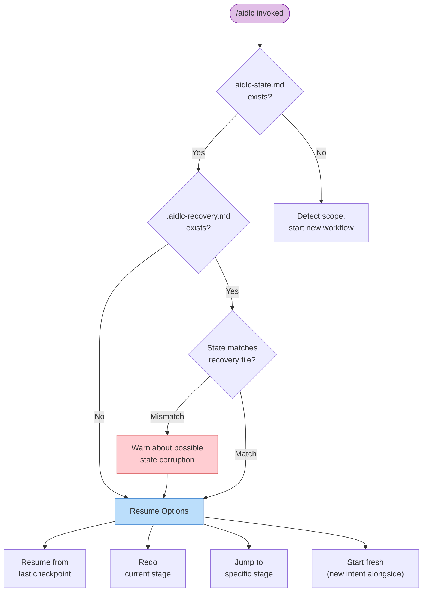

# セッション管理

1 つのワークフローは複数の harness セッションにまたがりうる。AI-DLC はすべての進捗をディスクに永続化するため、いつでも再開・やり直し・ジャンプ・新規開始ができる。

> **Harness に関する注記。** セッション再開はどの harness でも動く（状態は harness ではなく
> intent の record dir にある）。セッションの*ライフサイクルイベント*は異なる: Claude Code は
> `SESSION_STARTED/RESUMED/ENDED` と `SESSION_COMPACTED` を発行し、Kiro は
> `SESSION_STARTED` のみ、Codex は `SESSION_ENDED` を推定し、その後 compact-source の
> `SessionStart` を通じてミッションを再注入する。[他の harness で動かす](harnesses/README.md) を参照。

---

## 再開のフロー

`/aidlc` を実行し、アクティブ intent の `aidlc-state.md`（record dir 配下）が前のセッションから存在するとき、AI-DLC は状態サマリを提示し、4 つの再開オプションを提案する。



<!-- Text fallback: /aidlc invoked. If state file exists, check for recovery file. If recovery file exists and stage doesn't match state, warn about possible corruption. Then show four resume options. If no state file exists, start a new workflow with scope detection. -->

### 4 つの再開オプション

| オプション | 起きること | 保たれるもの | 失われるもの |
|--------|-------------|-------------------|-------------|
| **Resume from last checkpoint** | 進行中または次の保留 stage から続行。タスクサイドバーは状態ファイルから再構築される。 | すべての成果物・状態・audit トレイル | 前セッションのメモリ内会話コンテキスト |
| **Redo current stage** | 現在 stage のチェックボックスをリセットし（`aidlc-jump.ts execute --direction redo` 経由）、最初から再実行。 | 他のすべての成果物と状態 | 現在 stage の完了状態と途中の作業 |
| **Jump to stage** | 特定の stage へスキップ（`next --stage <slug>` 経由）。スキップされる stage と、下流成果物が無効になりうることを警告する。 | 既存のすべての成果物 | 現在と対象の間の stage に `[S]`（スキップ）が付く |
| **Start fresh** | 既存のものと並走する新しい intent を開始（scope と記述の確認後、`next --new-intent` 経由）。 | 既存ワークフローの成果物・状態・audit トレイル（その場に残る） | 何も失われない - 以前の intent は再開可能なまま |

dispatch されたアンサンブルの作業は、ディスク上の証拠から再開する。Practices
Discovery では、conductor はリードの草稿と既存のすべての contribution ファイルを保全し、
欠けている quality / developer / devsecops のスポークだけを dispatch し、
その後に人間へのインタビューとリードの統合へ続く。完了済みのスポークを繰り返すことはない。

---

## 復旧ブレッドクラム

Claude Code が会話コンテキストをコンパクションする前に、`validate-state.ts` hook がアクティブ intent の record dir に隠しの復旧ファイル `.aidlc-recovery.md` を書く。このファイルは次を含む:

- 最後の検証のタイムスタンプ
- 現在の stage 名（`aidlc-state.md` から抽出）
- 状態ファイルの妥当性の状態

次の `/aidlc` 呼び出しで、AI-DLC は `.aidlc-recovery.md` を `aidlc-state.md` と比較する。「Current stage」フィールドが食い違う場合、コンテキストコンパクションによる状態破損の可能性を警告する。

---

## コンテキストコンパクション

Claude Code はコンテキストウィンドウが埋まると、以前の会話コンテキストを自動的に要約する。これを**コンパクション**と呼ぶ。この実装は、コンパクションイベントを跨いでワークフローの状態を保つセーフガードを持つ。

### 何が保たれ、何が失われるか

| 保たれるもの | 失われるもの |
|-----------|------|
| record dir のすべての成果物（ディスク上のファイル） | メモリ内の会話コンテキスト（それまでの議論） |
| `aidlc-state.md`（stage 進捗・scope・プロジェクト情報） | まだファイルに書かれていない途中の作業 |
| `audit/` シャード（決定と行動の完全な履歴） | タスク ID（再開時に状態ファイルから再構築） |
| `.aidlc-recovery.md`（stage チェックポイント） | エージェントペルソナのコンテキスト（エージェントファイルから再読込） |

### コンパクション後の復旧方法

1. `/aidlc` を実行する — AI-DLC が状態ファイルを読み、再開オプションを提案する
2. 復旧ブレッドクラムが不一致を警告したら、**Redo current stage** を選んでコンパクション中に進行していた stage を再実行する
3. 警告が出なければ、**Resume from last checkpoint** を選んで通常どおり続行する

コンパクションは長いセッションの通常の一部である。状態ファイルとディスク上の成果物により、完了済みの作業は失われない。

---

## stage ジャンプ

ユーティリティコマンドでワークフローを前後にジャンプできる。

### 特定の stage へのジャンプ

```
/aidlc --stage code-generation
/aidlc --stage 3.5
```

前方へジャンプするとき、現在位置と対象の間の stage には `[S]`（スキップ）が付く。orchestrator は次を警告する:

- スキップされる stage
- 下流 stage が期待するのに見つからなくなる成果物
- トレーサビリティへの潜在的影響

後方へジャンプするとき、対象 stage は `[ ]`（未着手）にリセットされ再実行される。完了済みだった下流 stage は `[x]` のまま残るが、その成果物は古くなりうる。

### phase の先頭へのジャンプ

```
/aidlc --phase construction
/aidlc --phase 3
```

指定した phase の最初の stage へジャンプする。スキップされる stage と成果物の無効化に関する同じ警告が適用される。

### ジャンプと scope の組み合わせ

状態ファイルの無いプロジェクトでは、`--stage` や `--phase` を `--scope` と組み合わせられる:

```
/aidlc --stage code-generation --scope bugfix
```

指定した scope で新しいワークフローを作り、対象 stage へ直接ジャンプする。

---

## セッションスキル

3 つの読み取り専用スキルが、現在のワークフローを変更せずに報告する。いずれもコマンドのように打て、`/` のスキルピッカーに現れる:

| スキル | すること | 出力 |
|-------|--------------|--------|
| `/aidlc-session-cost` | 決定論的なコストビューを表示 — 所要時間、stage の結果、memory エントリ、sensor 発火、捕捉した学び | ターミナルのみ |
| `/aidlc-replay` | その場にいなかったステークホルダー向けに読みやすいセッションの物語を描画 — 何が、なぜ決まったか | ターミナルのみ |
| `/aidlc-outcomes-pack` | チームがワークフローを再実行せずにシステムを所有・継続できるよう、引き継ぎ文書を生成 | `OUTCOMES.md` を書く |

**読み取り専用である。** どれもワークフローの stage ポインタを進めず、audit イベントも発行しないため、stage の途中を含めいつ実行しても安全である。`/aidlc-session-cost` と `/aidlc-replay` はターミナルに表示するだけで何も書かず、ファイルを書くのは `/aidlc-outcomes-pack`（ワークスペースルートの `OUTCOMES.md`）だけである。

**報告される数値はすべてデータプレーンから直接来る。** 各スキルは数値を `bun .claude/tools/aidlc-runtime.ts summary --json` — `runtime-graph.json` 上の実体化されたビュー — から読む。スキルは決して推定も数え直しもしない。数値の周りの散文（物語・決定の根拠）だけが audit トレイルと成果物から合成される。トークンの見積もりは意図的に存在しない — 旧来のファイルサイズからトークンを推す発想は当て推量であり、取り除かれた。

```
/aidlc-session-cost      # quick "where are we" snapshot, any time
/aidlc-replay            # narrate the session for async review
/aidlc-outcomes-pack     # at workflow close — write the handover doc
```

各スキルは読み取るためにコンパイル済みの `runtime-graph.json` を必要とする。ワークフローが最初の stage を始める前に実行すると、短い「no session data yet」の注記を表示して止まる。

---

## 次のステップ

- [状態の追跡と audit トレイル](10-state-and-audit.md) — 状態ファイルの構造とチェックポイント記法
- [Skill とランナーコマンド](17-skills.md) — 読み取り専用のセッションビュー（`/aidlc-session-cost`・`/aidlc-replay`・`/aidlc-outcomes-pack`）とランナー群
- [CLI コマンド](12-cli-commands.md) — `--stage`・`--phase` ほかフラグの完全リファレンス
- [トラブルシューティング](15-troubleshooting.md) — コンパクションからの復旧と状態破損
- [用語集](glossary.md) — コンパクション・復旧ブレッドクラム・セッションの定義
