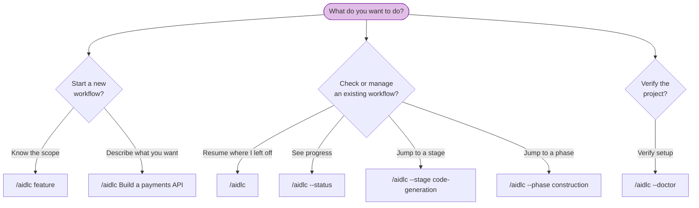

# CLI コマンド

AI-DLC のコマンドはすべて orchestrator の呼び出しから始まる。この章は、あらゆる呼び出しパターンとフラグの完全なリファレンスである。

> **呼び出しのプレフィックスは harness で異なる。** Claude Code・Kiro IDE・Kiro CLI・
> opencode では `/aidlc` と打つ。Codex CLI では `$aidlc`（または `/skills` →
> aidlc）である。以下のフラグと挙動はどちらでも同一 — 変わるのはプレフィックスだけである。
> 例は `/aidlc` を使う。Codex では `$aidlc` に置き換える。
> [Kiro CLI](harnesses/kiro-cli.md)・[Kiro IDE](harnesses/kiro-ide.md)・
> [Codex CLI](harnesses/codex-cli.md)・
> [opencode](harnesses/opencode.md) の harness ガイドを参照。

---

## クイックリファレンス

| コマンド | 説明 |
|---------|-------------|
| `/aidlc [scope]` | 明示した scope で新しいワークフローを開始する |
| `/aidlc [description]` | 新しいワークフローを開始する。scope は記述から自動検出される（豊かな／マッチしない散文には compose の申し出が出る） |
| `/aidlc compose "<task>"` | アダプティブ composer を強制する: タスクに合わせた EXECUTE/SKIP 計画を提案する |
| `/aidlc compose --report <path>` | スキャンレポートから compose する（トリアージ結果を、直して出すだけのコンパクトな実行に落とす） |
| `/aidlc --new-scope "<task>"` | 既製 scope がマッチする場合でも、composer にカスタム scope の合成を強制する |
| `/aidlc` | 既存ワークフローを再開する（intent があれば）か、最初の intent を birth して新規開始する |
| `/aidlc intent [name]` | アクティブな space の intent を一覧する、または既存の intent に切り替える |
| `/aidlc space [name]` | space を一覧する、または既存の space に切り替える |
| `/aidlc space-create <name>` | フレームワークのベースラインから新しい space を作成する |
| `/aidlc --status` | 読み取り専用のステータス要約を表示する |
| `/aidlc --doctor` | セットアップのヘルスチェックを実行する |
| `/aidlc --doctor --export` | 新規のヘルスチェックを実行し、続けて共有用に小さく秘匿化した診断レポートを書き出す |
| `/aidlc --stage <slug\|#>` | 特定の stage へジャンプする |
| `/aidlc --stage <slug> --single` | 1 つの stage を単独で実行する（ワークフローを進めない） |
| `/aidlc --phase <name\|#>` | phase の先頭へジャンプする |
| `/aidlc --scope <name>` | アクティブな scope を変更する |
| `/aidlc --depth <level>` | depth レベルを上書きする（minimal, standard, comprehensive） |
| `/aidlc --test-strategy <level>` | テスト戦略を上書きする（minimal, standard, comprehensive） |
| `/aidlc config get <key>` | アクティブなワークフロー設定を表示する（`depth`, `test-strategy`） |
| `/aidlc config set <key> <value>` | アクティブなワークフロー設定を変更する（`depth`, `test-strategy`） |
| `/aidlc config list` | アクティブなワークフロー設定を一覧する（構造化出力は `--json`） |
| `/aidlc plugin list` | インストール済みプラグインと有効状態を一覧する |
| `/aidlc plugin sync` | インストール済みのプラグインルートを現在のインストールに compose する |
| `/aidlc --version` | フレームワークのバージョンを表示する |
| `/aidlc --help` | 使い方を表示する |
| `bun .claude/tools/aidlc-utility.ts select-plugins [names]` | 直接呼び出し専用: このインストールの有効プラグイン一覧を表示または設定する |

---

## コマンド決定木



<!-- Text fallback: 新しいワークフローを開始する: /aidlc feature（scope が既知）か /aidlc Build a payments API（自動検出。最初の intent が自動 birth する）を使う。既存ワークフローの管理: /aidlc（再開）、/aidlc --status（進捗表示）、/aidlc --stage（stage へジャンプ）、/aidlc --phase（phase へジャンプ）。セットアップの検証: /aidlc --doctor（ヘルスチェック）。 -->

---

## 詳細リファレンス

### `/aidlc [scope]` — 明示スコープで開始

有効な scope のいずれかで新しいワークフローを開始する。core は名前付きの 9 scope を同梱する。プラグインが追加でき、`select-plugins` は無効化したプラグイン／core の scope をランタイムから隠せる。

**構文:**

```
/aidlc enterprise
/aidlc feature
/aidlc mvp
/aidlc poc
/aidlc bugfix
/aidlc refactor
/aidlc infra
/aidlc security-patch
```

**挙動:** フレームワークは scope キーワードを認識し、何を作りたいかを尋ね、Initialization phase を実行して最初のドメイン stage を開始する。状態ファイルが既に存在すれば、代わりに resume の選択肢を出す。

**例:**

```
/aidlc bugfix
> What would you like to fix?
> The login API returns 500 when email contains a plus sign
```

---

### `/aidlc [description]` — 自動検出で開始

作りたいものを記述すると、エンジンが適切な scope を自動検出する。

**構文:**

```
/aidlc Build a REST API for inventory management
/aidlc Fix the login timeout bug
```

**挙動:** エンジンは記述のキーワードを解析する（例: "fix" は bugfix を示唆する）。明確にマッチすれば、マッチした scope とその儀式（stage 数、承認 gate 数、unit ごとのファンアウト — すべてコンパイル済みグリッド由来）を挙げる 1 行確認を出す。豊かな、あるいはマッチしない散文には、沈黙の既定ではなく compose の申し出（後述の `/aidlc compose`）が出る。ワークフロー開始前に、確認するか上書きする。

**例:**

```
/aidlc Fix the null pointer in ProfileSerializer
> Starting a "bugfix" workflow for: "Fix the null pointer in ProfileSerializer" - 7 of 32 stages, 4 approval gates, 1 stage repeats per unit of work in Construction. Confirm to proceed, name a different scope, or say "compose" for a tailored plan.
```

---

### `/aidlc compose` — アダプティブ composer

既製 scope がマッチする場合でも composer を強制する。3 つの局面で働く:

```
/aidlc compose "harden the deployment pipeline and add observability"
/aidlc compose --report sonar.json
/aidlc compose            (mid-workflow: re-shape the pending stages)
```

**挙動:** conductor は composer エージェントを dispatch する。composer はタスク（またはスキャンレポート、または実行中ワークフローの状態）を読み、読み取り専用の `detect` スキャンを走らせ、実装エントロピーの 5 成分（intent の曖昧さ、構造的不確実性、検証エントロピー、リスク、未解決の前提 — 設定されていれば CodeKB MCP 解析に、なければワークスペーススキャンに根ざす）を見積もり、スコアの内訳と各 EXECUTE / SKIP の理由を添えた最小実行可能な EXECUTE/SKIP グリッドを提案する。gate であなたは承認・編集・却下する。承認時: 既製マッチはそのまま birth する。カスタムグリッドは本物の scope として著述され（インストール済みツリーに 2 ファイル）、同じターンでその上にワークフローが birth する。進行中の提案は、`recompose` 動詞で pending stage の suffix flip として着地する（audit ロック下、strict 検証、`RECOMPOSED` を audit）。`--new-scope` は合成を強制する。`--report <path>` はトリアージした findings を intent に seed する。`/aidlc-compose` スキルは同じ経路のタイプ可能なショートカットである。ワークフロー途中では、チャットで言うだけでもよい（"can we skip market research?"）— conductor は reshape 要求を認識し、同じ gate と動詞に経路づける。リテラルの `compose` は不要である（Claude 以外の harness では、リテラルの動詞が文書化された信頼できる経路のまま残る）。

完全なフローは [Scope と Depth — アダプティブ composer](05-scopes-and-depth.md#the-adaptive-composer) を参照。

---

### `/aidlc` — 既存ワークフローの再開

状態ファイルが存在するとき、引数なしで実行すると再開する。

**構文:**

```
/aidlc
```

**挙動:** `aidlc-state.md` を読み、`.aidlc-recovery.md` で破損を確認し、4 つの resume 選択肢を出す: チェックポイントから再開、現在の stage をやり直し、stage へジャンプ、最初からやり直し。詳細は [セッション管理](11-session-management.md) を参照。

状態ファイルが無ければ、フレームワークはこれを新しいワークフローとして扱い、scope／記述を尋ねる。

---

### Initialization — 自動、コマンド無し

スキャフォールドコマンドは無い。同梱される `dist/<harness>/` のワークスペースシェルは
構築済みで届き（`.claude/` エンジンと `aidlc/spaces/default/memory/`）、
エンジンは最初の `/aidlc`（または作りたいものを記述したとき）に最初の intent を
**自動 birth** する。birth は 3 つの Initialization stage（Workspace Scaffold、
Workspace Detection、State Init）を 1 つの決定論的ツール呼び出しとして走らせる:
intent の record dir を
`aidlc/spaces/<space>/intents/<YYMMDD>-<label>/`（`audit/` シャードdir、
phase 別の成果物 dir、`verification/`）に作り、空の space レベル
`aidlc/knowledge/` ディレクトリを作り、ルールベースのワークスペーススキャンを走らせ、
その intent の `aidlc-state.md` を scope 計画とともに書く。
init シーケンスのイベント（`WORKFLOW_STARTED`、`WORKSPACE_SCAFFOLDED`、
`WORKSPACE_SCANNED`、`WORKSPACE_INITIALISED`、加えて stage 別の
`STAGE_STARTED`/`STAGE_COMPLETED`）をログする。scope の指定（`/aidlc --scope feature`）は
初期 scope を seed する。無ければ `poc` を既定にする。最初の実行前にチーム knowledge や
ガードレールを足すには、同梱の `aidlc/spaces/default/memory/` ファイルを編集する。
space レベルの `aidlc/knowledge/` ディレクトリは最初の intent が存在すると（空で）作られ、
そこから自由形式のファイルを足していく。

ウェルカムメッセージは `settings.json` の `companyAnnouncements` エントリ経由で
セッション開始時に描画される。

**マルチリポのワークスペース。** ワークスペースルートが複数の兄弟コードリポ（それぞれ
`.git` を持つ直下の子ディレクトリ）を持つとき、birth ステップは intent が触れるリポの
集合を `intents.json` の行に記録する。既定ではすべての兄弟リポを**自動発見**する。
intent を特定の部分集合に絞るには、birth ツールが `--repos a,b`（リポのディレクトリ名の
カンマ区切りリスト）を受け付ける。これらはエンジンがあなたのために走らせる決定論的な
`aidlc-utility intent-birth` ステップのフラグであり、あなたが打つ `/aidlc` のフラグではない。
Construction の間、各 git 操作（worktree、swarm、Bolt）は 1 つのリポを対象にする。
conductor はそれを固定するために `--repo <name>` を渡す。intent が複数リポにまたがるときのみ
必須である。記録リポの無い intent は単一リポの既定（git はワークスペース／プロジェクト dir で
走る）である。[成果物リファレンス](14-artifacts-reference.md) を参照。

---

### `/aidlc intent [name]` — intent の一覧または切り替え

裸の `/aidlc intent` はアクティブな space の intent を一覧する。構造化出力には `--json` を
足す。`/aidlc intent <name>` は、曖昧さのない slug または完全な record-dir 名で、ユーザーごとの
アクティブ intent カーソルを既存の intent に切り替える。intent を作ることも、ワークフローを
進めることもしない。

### `/aidlc space [name]` — space の一覧または切り替え

裸の `/aidlc space` は space を一覧する。構造化出力には `--json` を足す。
`/aidlc space <name>` はユーザーごとのアクティブ space カーソルを切り替え、harness
ネイティブのメソッド include をその space に向け直す。space を作ることも、intent を
進めることもしない。

### `/aidlc space-create <name>` — space の作成

完全な `memory/`・`knowledge/`・`codekb/`・`intents/` の形を持つ新しいチーム space を、
別チームの学習済み practice ではなくフレームワークのベースラインから seed して作る。
自動で space を切り替えはしない。ワークスペースモデル、切り替えの例、何がコミットされるかは
[Space と Intent](03-spaces-and-intents.md) を参照。

---

### `/aidlc --status` — 読み取り専用ステータス

現在のワークフローの進捗を、何も変更せずに表示する。

**構文:**

```
/aidlc --status
```

**挙動:** アクティブな intent の `aidlc-state.md` を読み、現在の phase、現在の stage、完了／総 stage 数、scope、depth、stage 進捗リストを表示する。ワークフローがアクティブでなければ、進行中のワークフローが無いと報告する。

---

### `/aidlc --doctor` — ヘルスチェック

このインストールの前提条件・設定・stage グラフの整合性がすべて揃っていることを検証する。完全パスで 0、いずれかの失敗で 1 を exit する。完全なレポートはどちらの場合も stdout に書かれるため、orchestrator は必ず表に出す。`--doctor` は**読み取り専用**である — intent がまだ無い新規シェル（`audit/` シャードが無い）では何もファイルを作らないので、最初の intent が birth する前に走らせて安全である。intent が存在すれば `HEALTH_CHECKED` の audit 行を記録する。

ワークフローに問題があるとき、`--doctor` は**ワークフロー診断**の節も表示し、構造化された findings（例: `gate-unresolved`、`runtime-graph-stale`）を挙げる: 未解決の gate、古いまたは欠けたランタイムグラフ、冷えた hook、その他「進まなくなる」原因である。ライブレポートと `--export` は 1 つの解析を共有するため、findings はどちらでも同一である。

**構文:**

```
/aidlc --doctor
```

**何を確認するか:**

| チェック | 何を検証するか |
|-------|-------------------|
| 前提条件 | `bun` がインストールされ PATH にあること |
| Hook の存在 | `settings.json` が束ねるすべての hook（`hooks` ブロック + `statusLine` コマンド — フレームワークの 13 hook 全部）が `.claude/hooks/` に存在すること。束ねたのに欠けた hook は大きな音で失敗する。想定される名簿を `settings.json` から取ることで、そこに hook を足せば自動で確認される |
| プロジェクト構造 | `.claude/settings.json` が存在すること（ファイルの存在のみ、内容検証はしない） |
| ワークスペースシェル | `.claude/` + `aidlc/spaces/default/memory/` が存在すること（同梱のシェル） |
| サブモジュール | `.gitmodules` があれば、宣言されたサブモジュールパス数と未初期化数を報告し、未初期化があれば `git submodule update --init --recursive` を挙げる（助言 — 決して失敗しない） |
| Env scope | `AWS_AIDLC_DEFAULT_SCOPE`（設定されていれば）が有効な scope を指すこと |
| Hook ハートビート | `.aidlc-hooks-health/` に hook 実行の最近のタイムスタンプがあること |
| Hook ドロップ | `.aidlc-hooks-health/<hook>.drops` のテレメトリを表に出す — 各エントリはあなたのツール呼び出しを壊さないために hook が飲み込んだ失敗を記録する — hook ごとのドロップ数と最終タイムスタンプ、そして是正（調査し、ファイルを削除する）を添えて。助言 — 決して失敗しない |
| 状態ドリフト | アクティブな intent の `aidlc-state.md` が audit の最後の `WORKFLOW_COMPLETED` と一致すること |
| サイクル検出 | `stage-graph.json` にサイクルが無いこと |
| 孤立 stage ファイル | グラフのすべての slug がディスク上に対応する `<phase>/<slug>.md` を持つこと |
| 未コンパイル stage ファイル | slug がコンパイル済みグラフに無い stage `.md` をディスク上で表に出す。`aidlc-graph.ts compile` を走らせるまで実行されない（助言、決して失敗しない） |
| プラグイン選択 | 有効プラグイン一覧、プラグインごとの有効 stage 数、全グラフの `enabled:false` フラグの整合、破れた選択の回復ヒント |
| Scope 検証 | すべての有効 scope（プラグイン選択後の `.claude/scopes/*.md` 由来）がクリーンに歩けること（scope 切り詰めのギャップに対する助言は想定内） |
| スキーマ検証 | すべての stage の YAML frontmatter が `validateStageFrontmatter` を通ること |
| グラフ参照 | すべての `consumes[].artifact` と `requires_stage[]` の対象が解決すること |
| キーワード重複 | どのキーワードも 2 つ以上の scope に主張されていないこと |
| ルールドリフト | populated な org-policy の見出しと重なるチームまたはプロジェクトのルール見出しを表に出し、矛盾がないか見直せるようにする（助言 — 決して失敗しない） |
| ペア Sensor カバレッジ | ペアの Sensor を名指すすべてのルールが、どこかの stage が実際に発火する Sensor に解決することを確認する（助言 — 決して失敗しない） |

**出力例:**

```
✓ bun installed (required for CLI tools and hooks)
✓ aidlc-audit-logger.ts present
✓ aidlc-sync-statusline.ts present
✓ aidlc-validate-state.ts present
✓ aidlc-log-subagent.ts present
✓ aidlc-session-start.ts present
✓ aidlc-session-end.ts present
✓ aidlc-statusline.ts present
✓ settings.json present
✓ AWS_AIDLC_DEFAULT_SCOPE (unset — no project default)
✓ workspace shell ready (.claude/ + aidlc/spaces/default/memory/)
✓ Submodules: no .gitmodules at workspace root
✓ Hook heartbeats: not yet fired (first workflow stage will populate)
✓ Hook drops: none recorded
✓ State matches last audit event (no drift)
✓ Cycle detection: 0 cycles
✓ Orphan stage files: 32 graph entries all have files
✓ Uncompiled stage files: 0 stage files missing from the compiled graph
✓ Enabled plugins: all enabled (no selection); enabled stage counts: aidlc=32
✓ Scope validation: 9 scopes valid (29 advisories)
✓ Schema validation: 32/32 stages valid
✓ Graph references: 122 artifacts + edges resolved
✓ Keyword overlap: no conflicts
✓ Rule drift: no team/project rule overlaps org policy
✓ Paired sensor coverage: no sensor-bound rules (0 feedforward-only)
```

---

### `/aidlc --doctor --export` — 診断レポートの書き出し

`--doctor` に `--export` を足すと、小さく秘匿化した診断レポートを書き出し、プロジェクト
ディレクトリ全体を共有せずに、誤動作するワークフローをデバッグできる。まず**新規**の doctor
パスを走らせ（レポートは決してキャッシュされた診断を反映しない）、続けてレポートを書く。
レポートの書き出しは決して doctor の exit コードを変えない。

**構文:**

```
/aidlc --doctor --export
/aidlc --doctor --export --output <dir>
```

`--output <dir>` は出力先を上書きする。既定はプロジェクト下の
`aidlc/diagnostics/` である。

**何を生成するか:** システムの `tar` があればタイムスタンプ付きの `.tar.gz`、
無ければレポートディレクトリを保持し、共有前に自分で圧縮する指示を添える（新しいパッケージ
依存も、独自のアーカイブライターも無い）。レポートの中身:

| ファイル | 中身 |
|------|----------|
| `report.md` | 人が読めるワークフローのタイムラインと findings |
| `report.json` | 機械可読なタイムライン、findings、要約 |
| `manifest.json` | レポートスキーマのバージョン、AI-DLC バージョン、harness、ハッシュ化した intent id、ファイル別 SHA-256 チェックサム、適用した秘匿化、切り詰めの通知、除外リスト |
| `evidence/normalized.json` | 許可リストで正規化したフィールドのみ — 生ファイルは決して含まない |

**何を診断するか:** レポートは audit トレイルからワークフローの**タイムライン**（stage の所要時間、
gate、リビジョン、ギャップ、異常／不完全フラグ）を再構成し、続けて共通の「進まなくなる」原因に
対する**決定論的な**条件→是正ルール（LLM なし）を走らせる: 未解決の承認 gate、状態／audit の
ドリフト、古いまたは欠けたランタイムグラフ／冷えたまたは凍った hook ハートビート。findings は
ライブの `--doctor` が使うのと同じ共有 `DoctorFinding` モデルから来るため、コマンドとレポートが
食い違うことは決してない。回復のバイパス（例: `AIDLC_DISABLE_*` の env 変数や「ワークスペースを
アーカイブせよ」の指示）を名指す是正は、常に自動化して安全でないと印される。

**安全性。** レポートはワークスペースのソース、生の状態／audit／
ランタイムグラフファイル、成果物／コントリビューション／質問／memory の本文、環境変数、
コマンド出力を決して含まない。書き出す文字列はすべて秘匿化される: ホーム dir は `~`、
プロジェクトルートは `<project>`、intent id はハッシュ化、秘密らしい値はスクラブされる。
実際のパスがプロジェクトルートを脱出する入力は拒否される（シンボリックリンクされた葉や親は
ツリー外へ辿らない）。ファイル別と合計のサイズは上限が付き（切り詰めは manifest に記録される）、
プラットフォームが対応する場合はファイルは所有者のみで作られる。

**出力例:**

```
Diagnostic report created:
  aidlc/diagnostics/aidlc-diagnostic-report-20260714-153000-3f9a1c22.tar.gz

Findings:
  ERROR gate-unresolved
  WARNING runtime-graph-stale

No source files or artifact bodies were included.
```

---

### `/aidlc --stage <slug|#>` — stage へジャンプ

slug または番号で特定の stage へ直接ジャンプする。

**構文:**

```
/aidlc --stage code-generation
/aidlc --stage 3.5
/aidlc --stage requirements-analysis
/aidlc --stage 2.3
```

**挙動:** ワークフローがアクティブなら、対象 stage へジャンプする（途中の stage は警告付きで飛ばす）。ワークフローが無ければ、`--scope` と組み合わせられる:

```
/aidlc --stage code-generation --scope bugfix
```

---

### `/aidlc --stage <slug> --single` — 1 stage を単独実行

`--single` を足すと、メインワークフローに触れずに単一の stage をそれ単体で走らせる。stage は
走り、成果物を書き、止まる。ワークフローの `Current Stage` は決して進まない — 隔離は慣習ではなく
エンジンが強制する。フルライフサイクルにコミットせずに、方法論の 1 片（requirements 解析、
reverse-engineering スキャン）を適用するのに使う。隔離実行でも stage が設定したエージェントと
reviewer は使うが、ワークフローの learnings は走らせず、ワークフローの承認も求めない。その合成的な
完了は audit ログに記録され、そこでコマンドは止まる。

```
/aidlc --stage requirements-analysis --single
/aidlc --stage reverse-engineering --single
```

実行可能なすべての stage は、タイプ可能な 1 語のランナー `/aidlc-<slug>` も同梱する。これは
`/aidlc --stage <slug> --single` をパッケージしたものである。ランナーファミリー全体（scope
ランナー、stage ランナー、`/aidlc-init`、セッションビュー）は
[スキルとランナーコマンド](17-skills.md) に文書化されている。

---

### `/aidlc --phase <name|#>` — phase へジャンプ

特定の phase の最初の stage へジャンプする。

**構文:**

```
/aidlc --phase construction
/aidlc --phase 3
/aidlc --phase ideation
/aidlc --phase 1
```

**挙動:** `--stage` と同じだが、名指した phase の最初の stage を対象にする。`--scope` と組み合わせられる。

---

### `/aidlc --scope <name>` — scope の変更

実行中ワークフローのアクティブな scope を変更する。

**構文:**

```
/aidlc --scope bugfix
/aidlc --scope enterprise
```

**挙動:** `aidlc-state.md` の scope 設定を更新し、どの stage が実行され／飛ばされるべきかを再計算し、`SCOPE_CHANGED` の audit イベントをログする。新しい scope の既定 depth を上書きするために `--depth` と組み合わせられる。

自律 Construction 下（`Construction Autonomy Mode: autonomous`）では拒否される。`recompose` と同じルールである: 計画の再形成は gate に人間を要し、無人実行には人間がいない。先に gated Construction に切り替える（`aidlc-bolt set-autonomy --mode gated`）か、swarm を終わらせる。

ワークフローがまだ無い新規プロジェクトでは、`--scope <name>` は代わりにワークフローを開始する: `/aidlc <name>` と全く同じに振る舞う — ワークスペースが名指した scope で初期化され、その最初の stage でワークフローが始まる。

---

### `/aidlc --depth <level>` — depth の上書き

現在または新しいワークフローの depth レベルを上書きする。

**構文:**

```
/aidlc --depth minimal
/aidlc --depth standard
/aidlc --depth comprehensive
```

**挙動:** ワークフローがアクティブなら、`aidlc-state.md` の Depth フィールドを更新し、`DEPTH_CHANGED` の audit イベントをログする。`--scope` と組み合わせると、新しい scope の既定 depth を上書きする。`--stage` または `--phase` と組み合わせると、ジャンプ先の実行コンテキストの depth を設定する。アクティブなワークフローが無ければエラーになる。

**有効な値:** `minimal`、`standard`、`comprehensive`（大文字小文字を区別しない）。

**例:**

```
/aidlc --depth minimal                            Change depth of active workflow
/aidlc --scope bugfix --depth comprehensive        Bugfix with comprehensive analysis
/aidlc --stage code-generation --depth minimal     Jump with minimal depth
```

---

### `/aidlc --test-strategy <level>` — テスト戦略の上書き

depth とは独立に、テスト量の戦略を上書きする。

**構文:**

```
/aidlc --test-strategy minimal
/aidlc --test-strategy standard
/aidlc --test-strategy comprehensive
```

**挙動:** 指定しなければ現在の depth レベルを既定にする。ただし scope が独自の既定を宣言する場合（例: workshop は Minimal を既定にする）は除く。独立に設定すると、Standard depth（フル成果物）と Minimal テスト（Nyquist モデル）のような組み合わせを許す。`aidlc-state.md` の `Test Strategy` フィールドを更新し、`TEST_STRATEGY_CHANGED` の audit イベントをログする。

**有効な値:** `minimal`、`standard`、`comprehensive`（大文字小文字を区別しない）。

**テスト戦略のモデル:**
- **Minimal（Nyquist）:** 要件ごとに 1 テスト、happy-path の床、ユニットテストのみ（合計 ~5〜15）
- **Standard:** コンポーネントごとに 5〜8 テスト、ユニット + 統合
- **Comprehensive:** コンポーネントごとに 10〜15 テスト、全テスト種別

各レベルの詳細、既定化の挙動、よくある組み合わせは [Scope・Depth・テスト戦略](05-scopes-and-depth.md#the-3-test-strategy-levels) を参照。

**例:**

```
/aidlc --test-strategy minimal                         Minimal testing for active workflow
/aidlc --depth standard --test-strategy minimal        Full artifacts, minimal tests
/aidlc --scope bugfix --test-strategy comprehensive    Bugfix with thorough testing
```

---

### `/aidlc --version` — フレームワークのバージョン

フレームワークのバージョン（`aidlc <X.Y.Z>`）を表示して exit する。読み取り専用 — ワークフロー無しで動き、再開を促すこともない。

**構文:**

```
/aidlc --version
```

---

### `/aidlc --help` — 使い方

利用可能なコマンドとフラグの要約を表示する。

**構文:**

```
/aidlc --help
```

---

## 決定論的 CLI ツール

上記の `/aidlc` フラグの他に、このインストールは、ワークフローの実行中に hook と stage
プロトコルが呼び出す Bun/TypeScript のツールをいくつか同梱する。手で呼ぶことは稀だが、
それぞれ便利なデバッグハンドルでもある。

`bun <harness-dir>/tools/<tool>.ts <subcommand>` を使う。`<harness-dir>` は
Claude Code で `.claude`、Kiro CLI と Kiro IDE で `.kiro`、Codex CLI で `.codex` である。

### `aidlc-utility codekb-path` — コード knowledge ディレクトリを解決する

これは**直接のユーティリティ呼び出し**であり、`/aidlc codekb-path` コマンドではない:

```bash
bun .claude/tools/aidlc-utility.ts codekb-path --repo <repo>
bun .kiro/tools/aidlc-utility.ts codekb-path --repo <repo>
bun .codex/tools/aidlc-utility.ts codekb-path --repo <repo>
```

アクティブな space の決定論的な
`aidlc/spaces/<space>/codekb/<repo>/` パスを表示する。`--json` を足すと
`{space, repo, dir}`。このクエリは何も書かず、ディレクトリを作らず、audit イベントも
発しない。reverse-engineering stage の散文がこれを直接呼び出すため、パスは手で導かれない。

### `aidlc-utility detect` — 読み取り専用のワークスペーススキャン

`bun .claude/tools/aidlc-utility.ts detect --json` はワークスペーススキャン（プロジェクト種別、言語、フレームワーク、ビルドシステム、宣言された git サブモジュールとその初期化状態の `submodules` 配列）に加え、解決した scopes dir と scope グリッドのパスを表示する。純粋な読み取り。composer は現在の harness で scope データがどこにあるかを知るためにこれを走らせる。

### `aidlc-utility select-plugins` — インストールのプラグイン選択

`/aidlc plugin list` はインストール済みプラグイン名と各々の有効／無効を表示する。
`select-plugins` は**直接のユーティリティ呼び出し**であり、`/aidlc select-plugins` コマンドではない。
`bun .claude/tools/aidlc-utility.ts select-plugins` は現在の選択
（`plugins` キーが無ければ `all enabled (no selection)`）と既知の
プラグイン名を表示する。カンマ区切りのリストを渡して設定する:

```bash
bun .claude/tools/aidlc-utility.ts select-plugins test-pro
bun .claude/tools/aidlc-utility.ts select-plugins aidlc,test-pro
```

このコマンドは名前を検証し、`.claude/tools/data/harness.json` を書き、新たに無効化された プラグインのマージ済みコントリビューションを core stage ソースから剥がし（構造的追加は compose が書いた sidecar 経由、継ぎ合わせた散文はそのセンチネルマーカー経由。再有効化すると次のセッション開始時に復元される）、無効ノードを `enabled:false` と印して全グラフを再コンパイルし、stage と scope のランナーを刈り／再生成し、生成された SKILL.md の scope/stage テーブルを 1 トランザクションでリフレッシュする。`aidlc` は core である。省くと、常時オンの Initialization stage を除く core サーフェスを無効化する。アクティブなワークフローを座礁させる変更（その scope、または計画中の pending EXECUTE stage が、新しい選択で無効化されるプラグインに所有される）は、各依存を名指して拒否される — 先にワークフローを完了または park するか、そのプラグインを有効に保つ。

`/aidlc plugin sync` はインストール済みのプラグイン compose hook を走らせる。繰り返し走らせて安全である。プラグインルートが無ければ `no installed plugins; nothing to sync` で 0 exit する。

### `aidlc-utility recompose` — 進行中の計画 flip

`bun .claude/tools/aidlc-utility.ts recompose --skip <slugs> --add <slugs>`（カンマ区切り）は、ライブの状態ファイル上で、PENDING かつカーソルより先の stage の計画 suffix を flip する。audit ロック下で走り、残る stage の必須入力を飢えさせる flip を拒否する（および完了／進行中 stage の flip、カーソルより後ろの stage、Construction の最初の EXECUTE stage — walking-skeleton の錨 — をどちらの向きにも動かす flip、Status が Running でないワークフローに対する recompose、自律 Construction 下の recompose — 計画の再形成は gate に人間を要するので先に gated に切り替えるか swarm を終わらせる）、派生した状態フィールドを再構築し、`RECOMPOSED` を発する。通常はワークフロー途中に `/aidlc compose` 経由で到達し、直接は打たない。

### `aidlc-graph ars` — 決定論的な ARS スコアリング

`bun .claude/tools/aidlc-graph.ts ars --iae <s> --csu <s> --ve <s> --r <s> --ua <s> [--completed <csv>] [--project-type <t>]` は、adaptive composer の Autonomy Risk Score の算術を計算する: バンドラベル付きの重み付き合成値、LOW/MED/HIGH コンポーネントバンド、出荷済みコストの事前分布に対する stage ごとの期待値スクリーン、グリッド diff 数で最も近い既製 scope、そして markdown として事前レンダリングされた 2 つの gate テーブルである。定数 — 重み、バンドの境界、stage コストの事前分布、EV しきい値 — はすべて `tools/data/ars-priors.json` から読まれるので、同じ 5 つのスコアは常に同じ数値を描画する。composer はエビデンスからコンポーネントをスコアリングし、乗算を自分でやる代わりにこの出力をコピーする。`--completed`（カンマ区切りの slug）は、既に EXECUTE を走らせた stage を派生グリッドに残す。`--project-type brownfield|greenfield` は、コンパイル済みの `condition:` が他方の種類のプロジェクトに制限している stage をスクリーンアウトする（今日時点では Reverse Engineering が brownfield 限定）。JSON 結果は stdout に着地する。範囲外のスコア、未知の stage slug、priors スキーマ違反では exit 1 — 無言のフォールバックは決してしない。合成値は gate にいる人間のための ADVISORY な指標である: 決定論的に何かがそれでルーティングされることはない。

```bash
bun .claude/tools/aidlc-graph.ts ars --iae 0.55 --csu 0.75 --ve 0.65 --r 0.50 --ua 0.55
bun .claude/tools/aidlc-graph.ts ars --iae 0.30 --csu 0.80 --ve 0.40 --r 0.20 --ua 0.10 \
  --project-type greenfield --completed intent-capture,scope-definition
```

### `aidlc-graph validate-grid` — 任意グリッドの依存チェック

`bun .claude/tools/aidlc-graph.ts validate-grid --proposal <path> [--strict] [--project-type <t>] [--keywords <csv>]` は、任意の `{"<stage>": "EXECUTE"|"SKIP"}` JSON グリッドを検証する。lenient モードは `validate-scope` を映す（経路外の必須プロデューサは助言）。`--strict` はそれをハード却下する（recompose の姿勢）。`--keywords` は付与された各キーワードを、既存 scope が既に主張するキーワードと照合する: 衝突は現職の scope を名指すハードエラーである（composer は gate で付与されたキーワードを書く前にこれを走らせる）。無効なときのみ exit 1。JSON 結果は stdout に着地する。

### `aidlc-sensor` — Sensor の検査と発火

Sensor は、stage 出力への `Write` または `Edit` のたびに走る決定論的なチェックである（[ルールと学習ループ](09-rules-and-the-learning-loop.md) とリファレンスの [Sensor システム](../reference/07-sensor-system.md) を参照）。PostToolUse hook があなたのために発火する。このツールは一覧、記述、手動発火を可能にする。

| サブコマンド | 何をするか |
|------------|--------------|
| `list` | フレームワークの全 Sensor（`id`, `kind`, `description`）をアルファベット順に表示 |
| `describe <id>` | 1 つの Sensor の完全な manifest（コマンド、既定の severity、`matches` glob、タイムアウト）を表示 |
| `fire <id> --stage <slug> --output-path <path>` | ファイルに対して Sensor を走らせ、`SENSOR_FIRED` 行とペアの結果行を発する |

手動発火は `SENSOR_FIRED` の audit 行を発し、続けて厳密に 1 つの終端行を発する: `SENSOR_PASSED`、`SENSOR_FAILED`、または `SENSOR_BUDGET_OVERRIDE`。失敗は `<record>/.aidlc-sensors/<stage>/`（intent の record dir 内）に詳細ファイルを書く。Sensor は助言 — Sensor の失敗は決してツールの失敗ではないため、コマンドはなお 0 exit する。フレームワークが同梱する 5 つの Sensor は `claim-sources`、`required-sections`、`upstream-coverage`、`linter`、`type-check` である。

```
bun .claude/tools/aidlc-sensor.ts list
bun .claude/tools/aidlc-sensor.ts describe required-sections
bun .claude/tools/aidlc-sensor.ts fire required-sections \
  --stage requirements-analysis \
  --output-path aidlc/spaces/default/intents/<YYMMDD>-<label>/inception/requirements-analysis/requirements.md
```

### `aidlc-learnings` — 学習 gate ツール

これは §13 の学習 gate の決定論的な半分である。stage が承認された後、orchestrator はこれを使って、その stage の `memory.md` 日記をレビュー可能な学習候補に変え、続けてあなたが確認したものを永続化する。通常は直接呼ばない — orchestrator が `AskUserQuestion` gate の周りで両ステップを駆動する — が、発する audit 行の意味が通るようにここに載せる。

| サブコマンド | 何をするか |
|------------|--------------|
| `surface --slug <stage-slug>` | 承認直後の stage の `memory.md` を読み、構造化された候補（Interpretations、Deviations、Tradeoffs）と park された open question を表示。読み取り専用 |
| `persist --slug <stage-slug> --selections-json <path>` | 確認された learnings（確認された learning は practice である）を `aidlc/spaces/<active-space>/memory/project.md` / `team.md` に書く（Sensor 束縛の learning にはプロジェクト tier の Sensor をスキャフォールドし束縛する）。`RULE_LEARNED` / `SENSOR_PROPOSED` を発する |

確認された learnings は現在ではなく次のワークフローに適用される。

### `aidlc-runtime` — ランタイムグラフを読む

ランタイムグラフ（intent の record dir 内の `runtime-graph.json`）は、このワークフローで実際に何が起きたかのデータプレーンの記録である: どの stage が走ったか、各 `memory.md` 日記がどれだけ埋まったか、どの Sensor が発火したか、各々が何を返したか。構造的な `stage-graph.json` のランタイム版である。フレームワークは各 stage 遷移の後に再コンパイルする。このツールはコンパイルの起動、または 1 stage の行の読み取りを可能にする。

| サブコマンド | 何をするか |
|------------|--------------|
| `compile` | `audit/` シャードと stage 別の `memory.md` を歩き、`runtime-graph.json` を書き直す。遷移のたびに hook が自動発火 |
| `read <stage-slug>` | `runtime-graph.json` から 1 stage の行（タイムスタンプ、エージェント、memory 内訳、Sensor 発火、結果）を表示 |
| `summary [--json]` | グラフ全体にわたる決定論的な集計 — stage/phase の結果集計、memory エントリ数、Sensor の 4 状態集計、捕捉した learnings、ワークフロー所要時間 — を表示。読み取り専用のセッションスキルが読むデータソース |

```
bun .claude/tools/aidlc-runtime.ts read requirements-analysis
```

`runtime-graph.json` は gitignore される。成果物の形は [成果物リファレンス](14-artifacts-reference.md) を、完全なスキーマは [ランタイムグラフ](../reference/13-runtime-graph.md) のリファレンス章を参照。

### セッションスキル — ワークフローを報告する

3 つの読み取り専用スキルが、`aidlc-runtime summary` が報告する内容を、読みやすい出力に包んで表に出す。コマンドのようにタイプする:

| スキル | 何をするか |
|-------|--------------|
| `/aidlc-session-cost` | 決定論的なコストビュー（所要時間、stage の結果、memory、Sensor、learnings）。ターミナルのみ |
| `/aidlc-replay` | 非同期レビュー向けの読みやすいセッション物語。ターミナルのみ |
| `/aidlc-outcomes-pack` | チーム向けの引き継ぎ文書。`OUTCOMES.md` を書く |

3 つとも読み取り専用 — stage の前進も audit の発行も無い — で、すべての数値を `aidlc-runtime summary --json` から取る。完全なウォークスルーは [セッション管理 § セッションスキル](11-session-management.md#session-skills) を参照。

---

## 環境変数

### `AWS_AIDLC_DEFAULT_SCOPE`

プロジェクトの既定 scope を事前設定する。ワークフロー初期化時に `.claude/settings.json` の `env` ブロックから読まれる。

**構文（`.claude/settings.json` 内）:**

```json
{
  "env": {
    "AWS_AIDLC_DEFAULT_SCOPE": "workshop"
  }
}
```

**有効な値:** `enterprise`、`feature`、`mvp`、`poc`、`bugfix`、`refactor`、`infra`、`security-patch`、`workshop`。

**優先順位:** 明示の CLI フラグ > キーワード検出 > `AWS_AIDLC_DEFAULT_SCOPE` > ハードコードのフォールバック。

**効果の範囲:** ワークフロー初期化時のみ適用される。intent の `aidlc-state.md` が存在すると、状態ファイルが正である。完全なウォークスルーは [カスタマイズ § プロジェクト別の既定 scope](13-customization.md#per-project-default-scope) を参照。

---

## 次のステップ

- [スキルとランナーコマンド](17-skills.md) — タイプ可能な `/aidlc-<scope>` と `/aidlc-<stage>` のランナー、`--single` の役割
- [セッション管理](11-session-management.md) — resume の選択肢と stage ジャンプの詳細
- [Scope・Depth・テスト戦略](05-scopes-and-depth.md) — scope の定義、stage マッピング、テスト戦略のレベル
- [トラブルシューティング](15-troubleshooting.md) — コマンドが期待どおりに動かないとき
- [用語集](glossary.md) — command、utility command、scope の定義
