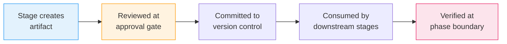

# 成果物リファレンス

すべての AI-DLC ワークフローは、その **intent record dir** —
`aidlc/spaces/<space>/intents/<YYMMDD>-<label>/`（`<space>` は非既定の space を使わない限り
`default`、`<YYMMDD>-<label>` は intent のディレクトリ。以下 `<record>/` と表記）—
の下に成果物を生み出す。本章はディレクトリ構造・成果物ごとの説明・ライフサイクル・
git ポリシーの完全なリファレンスである。

---

## ディレクトリツリー

```
aidlc/spaces/<space>/intents/<YYMMDD>-<label>/   # one record dir per intent
  aidlc-state.md                    # Workflow state (commit)
  audit/                            # Audit trail — per-clone shards (commit)
    <host>-<clone>.md               # this clone's shard; readers glob + merge by timestamp
  .aidlc-recovery.md                # Recovery breadcrumb (gitignore)
  runtime-graph.json                # Execution telemetry view (gitignore)

  verification/                     # Phase boundary checks (commit)
    phase-check-initialization.md
    phase-check-ideation.md
    phase-check-inception.md
    phase-check-construction.md
    phase-check-operation.md

  initialization/                   # Phase 0 artifacts
    workspace-scaffold/scaffold-report.md
    workspace-detection/workspace-findings.md
    state-init/state-init-summary.md

  ideation/                         # Phase 1 artifacts
    intent-capture/
    market-research/                (conditional)
    feasibility/                    (conditional)
    scope-definition/
    team-formation/                 (conditional)
    rough-mockups/                  (conditional)
    approval-handoff/

  inception/                        # Phase 2 artifacts
    reverse-engineering/            (conditional: brownfield)
    practices-discovery/            (conditional)
    requirements-analysis/
    user-stories/                   (conditional)
    refined-mockups/                (conditional)
    application-design/             (conditional)
    units-generation/
    delivery-planning/

  construction/                     # Phase 3 artifacts
    {unit-name}/                    (per unit of work, repeated)
      functional-design/            (conditional)
      nfr-requirements/             (conditional)
      nfr-design/                   (conditional)
      infrastructure-design/        (conditional)
      code-generation/
    build-and-test/
    ci-pipeline/                    (conditional)

  operation/                        # Phase 4 artifacts
    deployment-pipeline/            (conditional)
    environment-provisioning/       (conditional)
    deployment-execution/           (conditional)
    observability-setup/            (conditional)
    incident-response/              (conditional)
    performance-validation/         (conditional)
    feedback-optimization/          (conditional)

  archive/                          (created on-demand)
    {ISO-date}-{stage-name}/
```

**チームナレッジは record dir に無い。** 1 階層上、space レベル —
`aidlc/spaces/<space>/knowledge/`（`intents/` の兄弟）— に住み、1 つの intent の記録に
閉じ込められるのではなく、space 内のすべての intent を横断して蓄積される。
エンジンは空で作成し、チームが任意の `aidlc-shared/` とエージェント別サブディレクトリの
下に自由形式のファイルを足す。[ナレッジ](08-knowledge.md) を参照。

**stage ごとの memory 日誌。** 実行された各 stage は、成果物の隣にコミット対象の
`memory.md` も保持する（例:
`<record>/inception/requirements-analysis/memory.md`）。stage の観察日誌であり —
stage 開始時にテンプレートから自動作成され、stage 中は orchestrator が維持し、
承認 gate では §13 の Learnings Ritual が読む。手で編集することは決してない。
日誌が学習ループへどう流れるかは
[Rule と学習ループ](09-rules-and-the-learning-loop.md) を参照。

**コードは record dir ではなく兄弟リポジトリに住む。** `aidlc/` ツリーが持つのは
メソッド・状態・audit・成果物だけであり、アプリケーションコードは決して持たない。生成された
コードはワークスペースの**コードリポジトリ**に落ちる: よくある単一リポジトリの場合は
プロジェクトディレクトリ自体、複数リポジトリのワークスペースではワークスペースルート直下の
兄弟リポジトリディレクトリ（それぞれ自分の `.git` を持つ）である。intent は触れるリポジトリを
誕生時に記録する — 自動発見か、`--repos a,b` での指定 — `intents.json` の行
（`repos: [...]`）に。Construction は各 git 操作をその中の 1 つにアンカーする。`repos` の
記録が無い intent は単一リポジトリの既定である。[CLI コマンド](12-cli-commands.md) を参照。

---

## 成果物のライフサイクル

成果物は、作成から下流 stage による消費まで、予測可能なライフサイクルを流れる:



<!-- Text fallback: Stage creates artifact, reviewed at approval gate, committed to version control, consumed by downstream stages, verified at phase boundary. -->

1. **作成** — リードエージェントが stage 実行中に成果物を作り、intent の record dir の適切なサブディレクトリへ書く
2. **レビュー** — 承認 gate で成果物をレビューし、承認するか変更を要求する
3. **コミット** — 承認後、成果物はバージョン管理の準備が整う（下の git ポリシーを参照）
4. **消費** — 下流の stage が成果物を入力として読む（下の入力の表を参照）
5. **検証** — phase 境界の検証チェックが、その phase の全成果物にわたるトレーサビリティを確認する

---

## Phase 別の成果物

### Initialization（stage 0.1-0.3）

| Stage | 成果物 | 注記 |
|-------|-----------|-------|
| 0.1 Workspace Scaffold | `scaffold-report.md` | 決定論的（`aidlc-utility intent-birth` の中で実行） |
| 0.2 Workspace Detection | `workspace-findings.md`、`aidlc-state.md` を更新 | 決定論的なルールベーススキャナ |
| 0.3 State Init | `state-init-summary.md` | 決定論的 |

ウェルカムメッセージはセッション開始時に `settings.json` の `companyAnnouncements` 経由で描画される — stage ではなく、成果物も作らない。

### Ideation（stage 1.1-1.7）

| Stage | 主要成果物 | 条件 |
|-------|--------------|-----------|
| 1.1 Intent Capture | `intent-statement.md`、`stakeholder-map.md` | 常に |
| 1.2 Market Research | `competitive-analysis.md`、`build-vs-buy.md` | 条件付き |
| 1.3 Feasibility | `feasibility-assessment.md`、`constraint-register.md`、`raid-log.md` | 条件付き |
| 1.4 Scope Definition | `scope-document.md`、`intent-backlog.md` | 常に |
| 1.5 Team Formation | `team-assessment.md`、`mob-composition.md` | 条件付き |
| 1.6 Rough Mockups | `wireframes.md`、`user-flow.md` | 条件付き |
| 1.7 Approval & Handoff | `initiative-brief.md`、`decision-log.md` | 常に |

### Inception（stage 2.1-2.8）

| Stage | 主要成果物 | 条件 |
|-------|--------------|-----------|
| 2.1 Reverse Engineering | `architecture.md`・`code-structure.md`・`technology-stack.md` を含む 9 ファイル | brownfield のみ |
| 2.2 Practices Discovery | `team-practices.md`、`discovered-rules.md`、`evidence.md`、`practices-discovery-timestamp.md`、加えて quality / developer / devsecops の contribution ファイル（承認後に `aidlc/spaces/<active-space>/memory/team.md` と `project.md` へ昇格） | 条件付き |
| 2.3 Requirements Analysis | `requirements.md` | 常に |
| 2.4 User Stories | `stories.md`、`personas.md` | ユーザー向け機能 |
| 2.5 Refined Mockups | `mockups.md`、`interaction-spec.md`、`accessibility-checklist.md` | UI プロジェクト |
| 2.6 Application Design | `components.md`、`services.md`、`decisions.md` | 新しいコンポーネントが必要なとき |
| 2.7 Units Generation | `unit-of-work.md`、`unit-of-work-dependency.md`、`unit-of-work-story-map.md` | 常に |
| 2.8 Delivery Planning | `bolt-plan.md`、`team-allocation.md`、`risk-and-sequencing-rationale.md`、`external-dependency-map.md` | 常に |

### Construction（stage 3.1-3.7）

stage 3.1-3.5 は unit of work ごとに繰り返す。成果物は `construction/{unit-name}/{stage-name}/` に入る。stage 3.6-3.7 は全 unit の後に 1 回だけ走る。

4 つの設計 stage（3.1-3.4）は、成果物を各 unit の **kind**（2.7 のエッジブロックで付くタグ: `service`・`spec`・`ui`・`packaging`・`library`）に合わせて剪定する。`spec` の unit はスケーラビリティ文書を負わず、`packaging` の unit はビジネスロジックモデルを負わない。タグの無い unit は下の完全なマトリクスを受け取る。どの成果物がどの kind に当てはまるかは stage frontmatter のデータである（`produces_kinds`。[Stage 定義](../reference/15-stage-definition.md) を参照）。ある stage のどの成果物も当てはまらない unit は、その stage をファイル 0 個で完了とする。

| Stage | 主要成果物 | 条件 |
|-------|--------------|-----------|
| 3.1 Functional Design | `business-logic-model.md`、`business-rules.md` | 計画により、unit ごと（kind による） |
| 3.2 NFR Requirements | `security-requirements.md`、`performance-requirements.md` | 計画により、unit ごと（kind による） |
| 3.3 NFR Design | `security-design.md`、`performance-design.md` | 計画により、unit ごと（kind による） |
| 3.4 Infrastructure Design | `deployment-architecture.md`、`infrastructure-services.md` | 計画により、unit ごと（kind による） |
| 3.5 Code Generation | `code-generation-plan.md`、`code-generation-questions.md`、`code-summary.md`（コードはワークスペースルートへ） | 常に、unit ごと |
| 3.6 Build and Test | `build-instructions.md`、`test-results.md` | 常に、全 unit の後 |
| 3.7 CI Pipeline | `ci-config.md`、`quality-gates.md` | 条件付き、全 unit の後 |

### Operation（stage 4.1-4.7）

| Stage | 主要成果物 | 条件 |
|-------|--------------|-----------|
| 4.1 Deployment Pipeline | `cd-config.md`、`deployment-strategy.md`、`rollback-runbook.md` | 条件付き |
| 4.2 Environment Provisioning | `environment-inventory.md`、`validation-report.md` | 条件付き |
| 4.3 Deployment Execution | `deployment-log.md`、`smoke-test-results.md` | 条件付き |
| 4.4 Observability Setup | `dashboards.md`、`alarms.md`、`slo-config.md` | 条件付き |
| 4.5 Incident Response | `runbooks.md`、`incident-plan.md`、`escalation-matrix.md` | 条件付き |
| 4.6 Performance Validation | `load-test-plan.md`、`nfr-validation-matrix.md` | 条件付き |
| 4.7 Feedback & Optimization | `slo-report.md`、`cost-analysis.md`、`feedback-loop.md` | 条件付き |

---

## 質問ファイル

ユーザー入力を集めるすべての stage は、`{stage-name}-questions.md` という名前の併置された質問ファイルを作る。質問はレター付きの選択肢（A-E）と必須の `X. Other (please specify)` を使い、回答の記録には `[Answer]:` タグを使う。

各 stage でどう答えるかを選べる:

| モード | 動き方 |
|------|-------------|
| **Guide Me** | 対話的なウォークスルー。最大 4 問ずつのバッチ |
| **I'll Edit the File** | 質問ファイルを直接編集し、終わったら「done」を伝える |
| **Chat** | 自由な会話。決定事項が抽出されてファイルへ書かれる |

stage 途中でモードを切り替えられる。質問ファイルが常に正である。

---

## コミットするもの・gitignore するもの

同梱の `.gitignore` がこの分割をエンコードしている（vision §5.1）: 共有する仕事 —
メソッド・レジストリ・状態・audit・成果物 — はコミットし、ユーザーごとのセッション
カーソルとマシンローカルの導出状態は無視する。

| コミット | gitignore |
|--------|-----------|
| `aidlc-state.md` | `aidlc/active-space`、`intents/active-intent`（ユーザーごとのカーソル） |
| `audit/*.md`（クローン別シャード） | `.aidlc-recovery.md` ほか `intents/*/.aidlc-*`（一時的なブレッドクラム） |
| すべての stage 成果物 | `runtime-graph.json`（audit シャードから再導出可能） |
| `verification/` の phase チェック結果 | `aidlc/.aidlc-clone-id`（このクローンのシャード名。マシンローカルに保つ） |
| space レベル `aidlc/knowledge/` のチームナレッジファイル | `aidlc/.aidlc-sessions/`（会話ごとのセッション→intent 対応） |
| stage ごとの `memory.md` 日誌、space の `memory/` 層 | `.aidlc-hooks-health/`、`.aidlc-sensors/`（ハートビート、advisory の指摘） |

---

## 入力と依存関係

各 stage は先行 stage の成果物を入力として読む。主要な依存の連鎖:

- **Intent Capture** の成果物は Market Research・Feasibility・Scope Definition・Rough Mockups へ流れる
- **Requirements Analysis** の成果物は User Stories・Application Design・すべての Construction stage へ流れる
- **Application Design** と **Units Generation** の成果物は unit ごとのすべての Construction stage へ流れる
- **すべての Construction 成果物**は Build and Test と CI Pipeline へ流れる
- **Infrastructure Design** の成果物は Operation の stage へ流れる

完全な stage 別入力表は [オーケストレーションリファレンス](../reference/00-overview.md) を参照。

---

## Phase 境界の検証

各 phase の遷移で、トレーサビリティを確認する検証チェックが走る:

| チェックファイル | 遷移 | 検証内容 |
|-----------|-----------|-------------------|
| `phase-check-initialization.md` | Initialization から Ideation | ワークスペースのスキャフォールド、scope 計画、エージェントの利用可能性 |
| `phase-check-ideation.md` | Ideation から Inception | intent → scope → intent バックログの一貫性 |
| `phase-check-inception.md` | Inception から Construction | 要件 → ストーリー → アーキテクチャの整合 |
| `phase-check-construction.md` | Construction から Operation | 全 unit のビルドとテスト完了、CI の構成 |
| `phase-check-operation.md` | Operation からワークフロー完了 | デプロイ・可観測性・フィードバックループの検証 |

---

## 次のステップ

- [状態の追跡と audit トレイル](10-state-and-audit.md) — 状態ファイルと audit トレイルの詳細
- [stage はどう走るか](04-phases-and-stages.md) — stage の実行と成果物の生成
- [用語集](glossary.md) — 成果物・phase 境界検証・質問ファイルの定義
