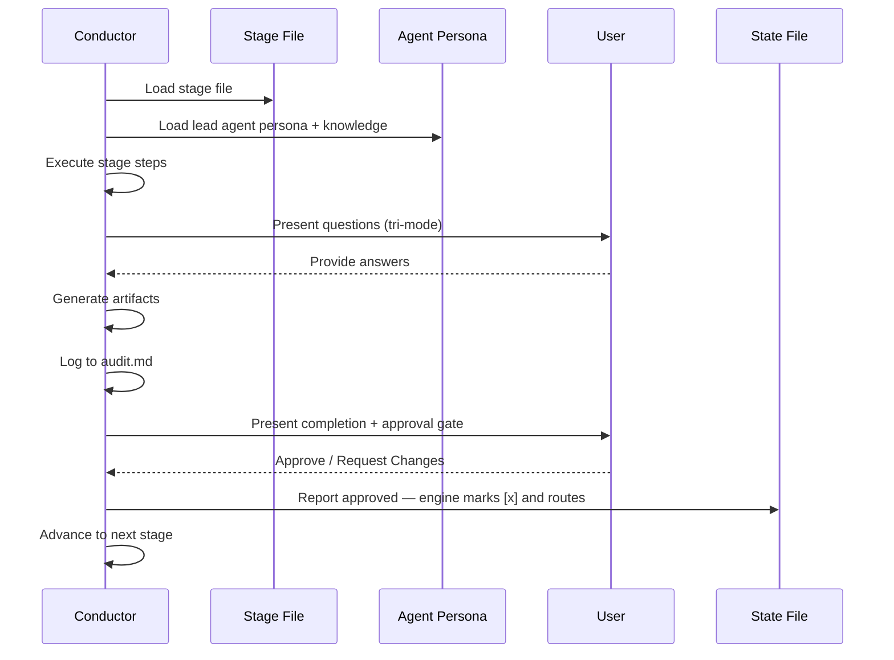
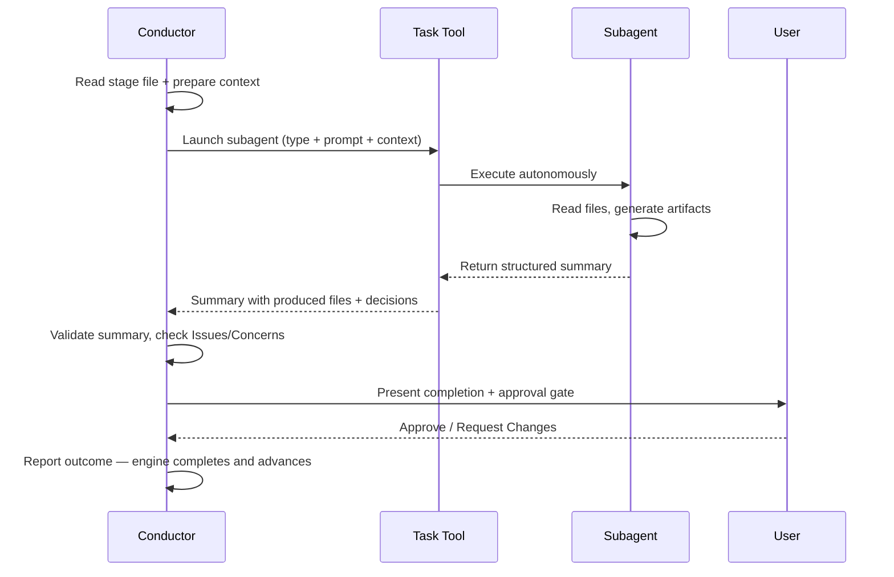

# Architecture

> **Source**: engine と conductor（`.claude/tools/aidlc-orchestrate.ts` と `.claude/skills/aidlc/SKILL.md`）および周辺ファイルから導出。

## Overview

AI-DLC はハイブリッドな実行モデルを用いる: 一部の stage は inline で走り（conductor が agent persona をロードし、会話の中で直接実行する）、他の stage は Claude Code の Task tool 経由で subagent へ委譲する。inline の stage はユーザー対話（質問、明確化、承認）をサポートする。subagent の stage は自律的に走り、構造化されたサマリを返す。

```mermaid
graph LR
    subgraph INITIALIZATION["INITIALIZATION (0.1-0.3)"]
        Z1["Workspace Scaffold"]
        Z4["State Init"]
        Z1 -.->|"3 stages"| Z4
    end

    subgraph IDEATION["IDEATION (1.1-1.7)"]
        I1["Intent Capture"]
        I7["Approval & Handoff"]
        I1 -.->|"7 stages"| I7
    end

    subgraph INCEPTION["INCEPTION (2.1-2.8)"]
        N1["Reverse Engineering"]
        N7["Delivery Planning"]
        N1 -.->|"8 stages"| N7
    end

    subgraph CONSTRUCTION["CONSTRUCTION (3.1-3.7)"]
        C1["Functional Design"]
        C7["CI Pipeline"]
        C1 -.->|"7 stages per unit"| C7
    end

    subgraph OPERATION["OPERATION (4.1-4.7)"]
        O1["Deployment Pipeline"]
        O7["Feedback & Optimization"]
        O1 -.->|"7 stages"| O7
    end

    Z4 -->|"auto-proceed"| I1
    I7 -->|"Verification Gate 1"| N1
    N7 -->|"Verification Gate 2"| C1
    C7 -->|"Verification Gate 3"| O1
    O7 -.->|"Feedback Loop"| I1

    style INITIALIZATION fill:#f3e5f5,stroke:#9c27b0
    style IDEATION fill:#e8f5e9,stroke:#4caf50
    style INCEPTION fill:#e3f2fd,stroke:#2196f3
    style CONSTRUCTION fill:#fff3e0,stroke:#ff9800
    style OPERATION fill:#fce4ec,stroke:#e91e63
```



## Five Layers

**Rules**（`rules/`）-- 組織とプロジェクトのガードレール。自己学習する: 人間による訂正が永続的な振る舞いの rule になる。合計でわずか ~35 行 -- 非 AI-DLC の会話でのコンテキスト肥大を避けるため最小限に保たれる。

**Agents**（`agents/*.md`）-- 14 個のフラットな agent ファイル: 11 のドメインエキスパート persona、2 つのレビュー専用 agent、そして adaptive-workflows composer。各々が自身の役割、責務、コラボレーションパターン、tools、knowledge のロード順を定義する。すべてが `disallowedTools: Task` を持つ -- conductor だけが委譲する。

**Knowledge**（`knowledge/`）-- 2 tier の方法論リファレンス:
- `aidlc-shared/` -- 原則、verification、brownfield セーフガード、**audit イベント分類**（正規のイベントレジストリ）、state テンプレート
- `aidlc-<agent>-agent/` -- agent ごとの方法論ファイル（アーキテクチャパターン、テスト戦略など）

**Skills**（`skills/aidlc/`）-- orchestrator のエントリポイント（`SKILL.md`）、stage protocol ファイル（`stage-protocol.md`、`stage-protocol-recovery.md`、`stage-protocol-governance.md`）、そして 5 つの phase ディレクトリ（`stages/initialization/`、`stages/ideation/`、`stages/inception/`、`stages/construction/`、`stages/operation/`）にまたがる 32 の stage ファイル。

**Hooks**（`hooks/`）-- audit 発行（Write/Edit での PostToolUse）、セッションライフサイクル（SessionStart、SessionEnd）、state 同期（TaskUpdate での PostToolUse）、state 検証（PreCompact）、subagent トラッキング（SubagentStop）、statusline レンダリングのための framework hook。すべての framework ファイルは `aidlc-*.ts` プレフィックスを持つ。

## Configuration Layers

> **Audience**: 新しい関心事（rule、方法論の一片、sensor の束縛、ドメイン knowledge の事実）がどこに属すかを決める貢献者。
> **Source-of-truth status**: これはルーティングの原則である。コードとこの節が食い違うとき、この節が勝つ; コードのほうが誤分類されている。

このリポジトリの configuration は、1 つではなく **2 つの直交する軸** に沿って分割される。

### Axis 1 — who authors it?

- **Framework-authored** — AI-DLC ディストリビューションに同梱される。すべてのプロジェクトで同じ内容。framework がリリースするときに更新される。ユーザーが自身の workspace で編集することは決してない。
- **Team-authored** — 人間によって（あるいはこの workspace で走る stage によって書かれ、その後に人間が是認して）書かれる。このプロジェクトに固有。この workspace のワークフローをまたいで永続する。編集可能。

### Axis 2 — when is it consumed?

- **継続的にロードされる（harness configuration）** — セッション開始時に読まれる; この workspace のすべてのワークフロー実行のすべての stage で利用可能。`.claude/` の下に住む。
- **Per-workflow artefact** — 特定の stage が出力として生産し、後段の stage が入力として読む。intent の record dir（`aidlc/spaces/<space>/intents/<YYMMDD>-<label>/`、以下では `<record>/` と記す）の下に住む。各ワークフロー実行で再生産される。

### The four quadrants

2 つの軸を交差させると 4 つの象限ができる。3 つは埋まっており; 1 つは意図的に空である。

|  | Framework-authored | Team-authored |
|---|---|---|
| **継続的にロードされる** (harness config) | `.claude/skills/`, `.claude/agents/`, `.claude/knowledge/`, `aidlc/spaces/<active-space>/memory/org.md`, `aidlc/spaces/<active-space>/memory/phases/*.md`, `.claude/scopes/`, `.claude/tools/data/scope-grid.json`, `.claude/tools/data/stage-graph.json` | `aidlc/spaces/<active-space>/memory/team.md`, `aidlc/spaces/<active-space>/memory/project.md` |
| **Per-workflow artefact** | *(設計上、空)* | `<record>/aidlc-state.md`, `<record>/audit/*.md` (per-clone シャード), `<record>/<phase>/<stage>/*.md`, `.aidlc/worktrees/bolt-*/` |

framework が per-workflow artefact を生産しないのは、そうした出力がディストリビューションに同梱されねばならず — それは per-workflow output ではなく framework-authored な harness config になってしまうからである。空のセルはルーティングルールの署名であり、欠落ではない。

> **Framework-authored = upstream から同梱される; プロジェクトでは不変として扱う。** git やファイルシステムはこれを強制しない — `.claude/` は編集可能な領域であり、望むなら `org.md` や `phases/*.md` ファイルを編集できる。しかし規約はこうである: framework のデフォルトを変異させる代わりに、`team.md` / `project.md`（右手のセル）で上書きする。それによって上書きがレビュー時に可視のままになり、framework がクリーンにアップグレードでき、同じ framework バージョンを共有するプロジェクト間の drift を防ぐ。

### Boundary tests for placing a new concern

新しい関心事が到来したとき、2 つの問いが行き先を解決する:

1. **すべてのプロジェクトで同じ内容か、プロジェクト固有か？** Framework-authored 対 team-authored。
2. **毎セッション agent のコンテキストにロードされるか、特定の stage だけが読むか？** Harness config 対 per-workflow artefact。

具体例:

- *"We always squash-merge to main"* — プロジェクト固有（他のチームは rebase を使う）かつ継続的にロードされる（conductor が Bolt のマージのたびに読む）。`aidlc/spaces/<active-space>/memory/team.md` へ行く。
- *"ALWAYS use Result<T,E> in service layer; NEVER throw"* — プロジェクト固有かつ継続的にロードされる（agent が code-gen のたびに読む）。`aidlc/spaces/<active-space>/memory/project.md` へ行く。
- *"Trunk-based development is the recommended branching strategy"* — すべてのプロジェクトで同じ（framework の見解）かつ継続的にロードされる（delivery-planning で読まれる）。`aidlc/spaces/<active-space>/memory/org.md` へ行く。
- *"The 5 common branching strategies and their trade-offs"* — すべてのプロジェクトで同じ（framework リファレンス）かつ継続的にロードされる（aidlc-pipeline-deploy-agent が branching strategy を discovery するときに読む）。`.claude/knowledge/aidlc-pipeline-deploy-agent/branching-strategies.md` へ行く。
- *"This run's requirements analysis"* — プロジェクト固有かつ per-workflow（各実行が新鮮な分析を生産する）。`<record>/inception/requirements-analysis/` へ行く。
- *"Bolt-1's worktree state mid-Construction"* — プロジェクト固有かつ per-workflow（Bolt ごとに再生成される）。record dir の Bolt worktree のコピー、`.aidlc/worktrees/bolt-1/<record>/aidlc-state.md` へ行く。

### Sub-categories of harness config (top row)

上段は **内容の形式** によってさらに分割される:

- **Framework harness mechanics** → frontmatter / JSON。ワークフローの順序、stage 定義、artifact の生産、gate のセマンティクス。tool が決定論的に読む。`.claude/skills/`、`.claude/tools/data/` に住む。
- **Framework domain reference** → `.claude/knowledge/aidlc-<agent>-agent/` の下の agent KB 散文。あるドメインのための選択肢のメニュー（5 つの branching strategy、デプロイパターン、テスト方法論）。所有する agent がメニューを必要とするときに読む。
- **Framework methodology defaults** → `aidlc/spaces/<active-space>/memory/org.md` の散文。チームが別途是認するまで framework が推奨するもの。チームの声で書かれる（なぜなら、チームが上書きしなければ、org のデフォルトが *まさに* チームの声だからである）。
- **Team practices** → `aidlc/spaces/<active-space>/memory/team.md` の散文。チームの選択 — 「我々はこう働く」、practices-discovery の是認 gate によって populate される。agent が意思決定のポイントで読む（delivery-planning は branching strategy を読む; conductor は `SKILL.md` で walking-skeleton の立場を読む）。
- **Project overrides** → `aidlc/spaces/<active-space>/memory/project.md` の散文。team と org のデフォルトを上書きするプロジェクト固有の訂正; これも practices-discovery の是認 gate によって populate される。
- **Guardrails**（`## Forbidden`、`## Mandated`、`## Corrections` セクション）— `org.md`、`team.md`、`project.md` に存在する。agent のための訂正 rule — `ALWAYS X`、`NEVER Y`。継続的に agent のコンテキストにロードされる。

### What not to put in `.claude/` directly

configuration に見えるがそうではない 2 つのケース:

- **永続的なリポジトリ分析の出力。** Reverse-engineering の 9 個の brownfield artifact（`code-structure.md`、`architecture.md` など）は、1 つのリポジトリの最新のスキャンを記述する。それらは `.claude/` や intent record ではなく `aidlc/spaces/<active-space>/codekb/<repo>/` に住む。Reverse Engineering は該当する各ワークフローで再実行され、その共有されたリポジトリごとの knowledge をリフレッシュする。
- **Run-state。** `aidlc-state.md` ファイルは per-workflow の「今」の真実である。それは `.claude/` ではなく intent の record dir に属する。`audit/` シャードも同様。

### Cross-row promotion — the practices-discovery exception

ほとんどの stage は 1 つの段に書く。いくつかの stage は両方に書き、段をまたぐ書き込みはチームの是認によって gate される。**Practices-discovery（Inception 2.2）はこれを行う唯一の stage である。** その出力は:

- `<record>/inception/practices-discovery/team-practices.md` — per-workflow の audit trail（下段）。
- 是認されると、内容は space memory レイヤーへコピーされる — `aidlc/spaces/<active-space>/memory/team.md` および `memory/project.md` — team-authored な harness config（右上のセル）。

audit-trail のコピーは、この実行で何が是認されたかを証明する; `.claude/` のコピーは、すべての将来のワークフローがロードするチームの恒常的な configuration になる。

このパターン（scan → draft → affirm → publish）は reverse-engineering の構造に一致する。違いは *帰結* にある: reverse-engineering の是認は単に「このスキャンは正確だ」を意味する; practices-discovery の是認は「framework はこれらの言葉を我々の恒常的な config に書き込み、すべての将来のワークフローでロードしてよい」を意味する。

是認 gate が無ければ、framework はチームの口に言葉を入れることになる — そしてより悪いことに、それらの言葉はワークフローをまたいで永続する。gate があれば、常にチームがそれを書いたことになる。

このパターンは稀であり、意図的であるべきだ。次の 3 つすべてが真のときにだけ使う:
1. stage の出力が、チーム、プロジェクト、または workspace についての構成的な真実である。
2. その真実が、この実行の下流の stage だけでなく、すべての将来のワークフロー実行に影響すべきである。
3. チームがその真実を著述する意志がある — framework に書かせるだけでなく、gate でレビューし承認する。

3 つのいずれかが偽なら、per-workflow のみをデフォルトとする。

### Cross-references

- [Agent System](05-agent-system.md) — agent ファイルの構造（左上のセルのメカニクス）。
- [Knowledge System](10-knowledge-system.md) — `knowledge/` の 2 tier の形。
- [Stage Definition](15-stage-definition.md) — stage frontmatter の仕様（harness mechanics のフォーマット）。
- [Stage Protocol](04-stage-protocol.md) — stage ごとの実行 rule。

## Execution Models

**Inline stage** -- conductor は persona のフレーミングのために、lead agent のフラットファイル（例: `agents/aidlc-architect-agent.md`）と `knowledge/[agent]/` からの knowledge を読み、その後 stage を会話の中で直接実行する。これによりリアルタイムのユーザー対話が可能になる: 質問すること、曖昧さを解決すること、承認の前に artifact をイテレートすること。

28 の stage が inline 実行を使う。これには 3 つすべての Initialization stage（Workspace Scaffold、Workspace Detection、State Init — すべて `aidlc-utility intent-birth` の内側で決定論的に走る）、すべての Ideation stage、5 つの Inception stage（Requirements Analysis、Refined Mockups、Application Design、Units Generation、Delivery Planning）、6 つの Construction stage（Functional Design、NFR Requirements、NFR Design、Infrastructure Design、Build and Test、CI Pipeline）、そしてすべての Operation stage が含まれる。注意: Build and Test（3.6）は per-unit ではなく、すべての unit が完了した後に一度だけ走る。

**Subagent stage** -- conductor はコンテキスト（先行の artifact、プロジェクト記述、workspace の発見事項）を準備し、Claude Code の Task tool subagent へ委譲する。subagent は自律的に実行し、構造化されたサマリを返す。これは、実行中のユーザー対話なしに、集中した独立の作業から利益を得る stage で使われる。subagent の呼び出しが失敗した場合、conductor はコンテキストを減らしたプロンプトで一度リトライし、その後 inline 実行または skip-and-revisit をフォールバックの選択肢としてユーザーに提示する。

4 つの stage が dispatched 実行を使う: Reverse Engineering（2.1、`mode: pipeline` — developer のスキャン、続けて architect の synthesis-and-write）、Practices Discovery（2.2、`mode: subagent` — pipeline-deploy の lead ドラフト、相互にブラインドな quality/developer/devsecops のスポーク、人間へのインタビュー、lead の統合）、User Stories（2.4、`mode: mob` — product lead のドラフトに加え design/developer/quality の貢献ラウンド）、そして Code Generation（3.5、集中した developer subagent）。完全なトポロジは 28 inline / 2 subagent / 1 pipeline / 1 mob である。Workspace Detection（0.2）は subagent としてではなく、`aidlc-utility intent-birth` の内側で決定論的に走る。

```mermaid
flowchart LR
    subgraph INLINE["Mode 1: Inline"]
        direction TB
        IN1["Conductor reads\nstage file"]
        IN2["Load agent persona\n+ knowledge"]
        IN3["Execute stage steps\ndirectly in conversation"]
        IN4["User interaction\navailable"]
        IN5["Approval gate\n(AskUserQuestion)"]
        IN1 --> IN2 --> IN3 --> IN4 --> IN5
    end

    subgraph SUBAGENT["Mode 2: Subagent (simple)"]
        direction TB
        SA1["Conductor reads\nstage file"]
        SA2["Prepare context:\nartifacts + persona"]
        SA3["Task tool call\n(subagent_type specified)"]
        SA4["Subagent executes\n(no user interaction)"]
        SA5["Return structured\nsummary to conductor"]
        SA6["Conductor presents\ncompletion + approval"]
        SA1 --> SA2 --> SA3 --> SA4 --> SA5 --> SA6
    end

    subgraph TWOSTEP["Mode 3: Pipeline (2-link RE chain)"]
        direction TB
        TS1["Conductor reads\nRE stage file"]
        TS2["Task: aidlc-developer-agent\ncode scan"]
        TS3["Developer returns\nscan results"]
        TS4["Task: aidlc-architect-agent\nsynthesis"]
        TS5["Architect produces\n9 artifacts"]
        TS6["Conductor presents\ncompletion + approval"]
        TS1 --> TS2 --> TS3 --> TS4 --> TS5 --> TS6
    end

    style INLINE fill:#e8f5e9,stroke:#4caf50
    style SUBAGENT fill:#e3f2fd,stroke:#2196f3
    style TWOSTEP fill:#fff3e0,stroke:#ff9800
```



### Conductor Inline Stage Execution



### Conductor Subagent Delegation



## Source vs distribution (one core, many harnesses)

framework は **一度著述され、harness ごとに生成される** — 今日では Claude
Code、Kiro CLI、Kiro IDE、Codex CLI、opencode、そして移植した任意の能力を持つ
CLI。手著述のソースは、harness 中立な `core/` に加え、CLI ごとの薄い
`harness/<name>/` サーフェスである; `bun scripts/package.ts` が、コミットされ
drift ガードされた `dist/<harness>/` ツリーを再生成する:

```
core/                  # hand-authored, harness-neutral (tools, aidlc-common,
                       #   agents, rules, scopes, sensors, knowledge, hooks,
                       #   3 session skills); prose uses the {{HARNESS_DIR}} token
harness/<name>/        # per-CLI surface: manifest.ts + orchestrator skill +
                       #   harness files (+ emit.ts for codex)
scripts/package.ts     # the build: copy core (token→.claude/.kiro/.codex) +
                       #   harness, compile the graph, generate runners, emit;
                       #   `--check` is the byte-parity drift guard
scripts/build-binaries.ts # release-only binary compiler + smoke gate, writing
                       #   per-target executable + runtime/<harness>/ bundles
                       #   under ignored build/binaries/
dist/<harness>/        # GENERATED + committed: claude/.claude, kiro/.kiro,
                       #   kiro-ide/.kiro, codex/{.codex,.agents} — never hand-edited
```

`core/` の `.ts` は変換なしにバイトコピーされる; ランタイムの `harnessDir()` シーム
（`core/tools/aidlc-lib.ts`）は、実行時に同梱されたレイアウトから harness dir を
導出する — ハードコードされたリストではなく tool 自身のパスからの open-set なので、
新しい harness はここでの編集を要さない — そしてその rules-dir のリネームは、
`rulesSubdir()` シームが読む生成された `tools/data/harness.json` にツリーごとに
同梱される。1 セットの tool ソースがすべての harness で走る。
[Porting to a New Harness](../harness-engineering/09-porting-to-a-new-harness.md) を参照。

## Directory Structure

同梱される Claude ディストリビューション（`dist/claude/.claude/`、`core/` +
`harness/claude/` からバイト単位で再生成される）:

```
dist/claude/.claude/
+-- CLAUDE.md
+-- settings.json
+-- hooks/
|   +-- aidlc-audit-logger.ts
|   +-- aidlc-sync-statusline.ts
|   +-- aidlc-validate-state.ts
|   +-- aidlc-log-subagent.ts
|   +-- aidlc-session-start.ts
|   +-- aidlc-session-end.ts
|   +-- aidlc-statusline.ts
+-- rules/
|   +-- aidlc.md                  # @-import stub -> ../../aidlc/spaces/<active-space>/memory/ (NOT a copy; re-pointed in place on `space` switch)
+-- agents/
|   +-- aidlc-product-agent.md
|   +-- aidlc-design-agent.md
|   +-- aidlc-delivery-agent.md
|   +-- aidlc-architect-agent.md
|   +-- aidlc-aws-platform-agent.md
|   +-- aidlc-compliance-agent.md
|   +-- aidlc-devsecops-agent.md
|   +-- aidlc-developer-agent.md
|   +-- aidlc-quality-agent.md
|   +-- aidlc-pipeline-deploy-agent.md
|   +-- aidlc-operations-agent.md
+-- knowledge/
|   +-- aidlc-shared/
|   |   +-- ai-dlc-principles.md
|   |   +-- verification.md
|   |   +-- brownfield.md
|   |   +-- audit-format.md
|   |   +-- state-template.md
|   |   +-- knowledge-readme-template.md
|   +-- aidlc-product-agent/
|   |   +-- requirements-guide.md
|   |   +-- product-guide.md
|   |   +-- functional-design-guide.md
|   |   +-- requirements-elicitation.md
|   |   +-- prioritization-frameworks.md
|   |   +-- user-story-patterns.md
|   |   +-- market-research-methods.md
|   +-- aidlc-architect-agent/
|   |   +-- architecture-guide.md
|   |   +-- nfr-design-guide.md
|   |   +-- ddd-patterns.md
|   |   +-- architecture-patterns.md
|   |   +-- nfr-design-patterns.md
|   |   +-- adr-template.md
|   +-- aidlc-developer-agent/
|   |   +-- code-analysis-guide.md
|   |   +-- code-generation-guide.md
|   |   +-- code-generation-patterns.md
|   |   +-- api-design-guide.md
|   |   +-- data-modelling-patterns.md
|   |   +-- re-artifacts.md
|   +-- [... 8 more agent knowledge dirs]
+-- skills/
    +-- aidlc/
        +-- SKILL.md
        +-- stage-protocol.md
        +-- stage-protocol-recovery.md
        +-- stage-protocol-governance.md
        +-- stages/
            +-- initialization/
            |   +-- workspace-scaffold.md
            |   +-- workspace-detection.md
            |   +-- state-init.md
            +-- ideation/
            |   +-- intent-capture.md
            |   +-- market-research.md
            |   +-- feasibility.md
            |   +-- scope-definition.md
            |   +-- team-formation.md
            |   +-- rough-mockups.md
            |   +-- approval-handoff.md
            +-- inception/
            |   +-- reverse-engineering.md
            |   +-- practices-discovery.md
            |   +-- requirements-analysis.md
            |   +-- user-stories.md
            |   +-- refined-mockups.md
            |   +-- application-design.md
            |   +-- units-generation.md
            |   +-- delivery-planning.md
            +-- construction/
            |   +-- functional-design.md
            |   +-- nfr-requirements.md
            |   +-- nfr-design.md
            |   +-- infrastructure-design.md
            |   +-- code-generation.md
            |   +-- build-and-test.md
            |   +-- ci-pipeline.md
            +-- operation/
                +-- deployment-pipeline.md
                +-- environment-provisioning.md
                +-- deployment-execution.md
                +-- observability-setup.md
                +-- incident-response.md
                +-- performance-validation.md
                +-- feedback-optimization.md
```

### The workspace: spaces and intents

上のツリーは **engine** である — harness 固有で、ユーザーが閲覧することは決してない。
engine が *ランタイムに読み書きする* すべては、プロジェクトルートの分離された中立な
`aidlc/` ディレクトリに住み、2 レベルのコンテナとして組織される: **space → intent**。
（エンドユーザー向けのオリエンテーションは、ユーザーガイドの
[Spaces and Intents](../guide/03-spaces-and-intents.md) を参照; この節は engine が
解決の拠り所とするデータモデルである。）

```
aidlc/                                    # neutral, harness-independent, committed to git
+-- active-space                          # cursor: active space name (gitignored, per-user)
+-- spaces/
    +-- default/                          # one space per team; "default" is auto-resolved
        +-- memory/                        # the method — org.md/team.md/project.md, phases/, templates/
        +-- knowledge/                     # space-level domain knowledge (free-form)
        +-- codekb/<repo>/                 # per-repo code knowledge base
        +-- intents/
            +-- active-intent              # cursor: active intent record dir (gitignored, per-user)
            +-- intents.json               # the registry: [{ uuid, slug, dirName, scope, repos, status }]
            +-- <YYMMDD>-<label>/          # one record dir per intent (date-prefixed, short kebab label; UUIDv7 carries identity in intents.json)
                +-- aidlc-state.md          # per-intent workflow state
                +-- audit/<host>-<clone>.md # per-clone audit shards (glob-and-merge by timestamp)
                +-- <phase>/<stage>/*.md    # artifacts + the per-stage memory.md diary
```

**Resolution。** 2 つのユーザーごとの cursor がコンテキストを選択する; どちらも決してエラーにならない（欠けた cursor はデフォルトにフォールバックする）:

- **Space** — `aidlc/active-space`、優先順位は `explicit arg > cursor > "default"`
  （`DEFAULT_SPACE`、`core/tools/aidlc-lib.ts:285`; resolver は `activeSpace()`、
  `aidlc-lib.ts:354-366`）。`listSpaces()` は、ディスク上に何も無くても常に `default` を報告する（`aidlc-lib.ts:713-728`）。
- **Intent** — `aidlc/spaces/<space>/intents/active-intent`、優先順位は
  `explicit arg > cursor (if it names a real record holding aidlc-state.md) >
  lone-intent > null`（`activeIntent`、`aidlc-lib.ts:411-435`）。`null` の intent
  は「まだ record が無い」を意味する — orchestrator が最初の intent を auto-birth
  するために使うシグナルである。

パスヘルパー — `intentsDir`、`knowledgeDir`、`codekbDir`（`aidlc-lib.ts`）、
そして `memoryDirFor`（`aidlc-graph.ts:234`）— はすべて、space 引数を
`activeSpace(projectDir)` にデフォルトする。だから AI-DLC 自身の resolver は cursor に従う; `/aidlc space <name>` で space を切り替えると、各 harness ネイティブの rule include（上で述べた Claude の `@`-import スタブ、Kiro の resources glob、Codex の rules dir）も、切り替えられた space の `memory/` に指し直される。`default` では指し直しはバイト単位で同一の no-op なので、単一チームのコミットされたツリーが churn することは決してない。

**Committed 対 gitignored。** `aidlc/` は、チームが作業を共有するためにチェックインされる。分割（`harness/claude/dot-gitignore:34-54`）: 2 つの cursor（`active-space`、`active-intent`）、clone ごとのランタイム（`.aidlc-clone-id`、`.aidlc-sessions/`）、そして導出された state（`runtime-graph.json`、record の下の `.aidlc-*`）は **gitignored**; メソッド（`memory/**`）、knowledge（`knowledge/**`、`codekb/**`）、`intents.json` レジストリ、各 record の `aidlc-state.md`、`audit/` シャード、そして artifact は **committed** である。audit が clone ごとのシャード（`audit/<host>-<clone>.md`）としてコミットされるのは、まさに git が並行する追記をマージせずに済むようにするためである — 意図的に `merge=union` 属性は無い。

## Key Design Decisions

1. **ハイブリッド実行モデル（inline + dispatched トポロジ）** -- ユーザー対話（質問、明確化、承認のイテレーション）を要する stage は、conductor が直接の会話アクセスを持つ inline で走る。集中した自律的な作業（コードスキャン、コード生成）または真の multi-agent コラボレーション（mob）を行う stage は、stage の `mode` トポロジに従って subagent へ dispatch する。純粋な subagent モデルは stage 途中のユーザー対話を妨げる; 純粋な inline モデルは集中した agent の専門化や独立した視点から利益を得られない。

2. **inline stage のための agent persona** -- inline stage では、conductor は subagent へ委譲するのではなく、視点をフレーミングするためのコンテキストとして agent のフラットファイルをロードする。これにより、subagent のコンテキスト転送とユーザー対話の喪失というコストなしに、ドメインエキスパートのフレーミング（Application Design の間、conductor は architect のように考える）の利益が得られる。

3. **2 リンクの Reverse Engineering pipeline** -- Reverse Engineering（`mode: pipeline`）は、コードスキャンに developer subagent を、続けて synthesis と artifact の書き込みに architect subagent を使う。conductor はバスとして振る舞い（Claude Code では subagent は subagent を spawn できない）、developer のコードスキャン結果を architect へ渡す - チェーントポロジが設計どおりに働く。

4. **aidlc-state.md による state 追跡** -- 単一の markdown の state ファイルが、stage の完了、現在のステータス、workspace のコンテキスト、scope の設定、実行計画、そしてランタイム state（リビジョン数）を追跡する。stage は結果を orchestration engine へ報告する; その内部の state 遷移がファイルを更新し、ライフサイクルの audit 行を発行し、アトミックにルーティングする。stage の散文がライフサイクルのチェックボックスを直接編集することは決してない。PostToolUse hook が各書き込みの後に state ファイルの構造を検証する。stage レベルのタスク ID は、state ファイルに保存されるのではなく、ランタイムに `TaskList` 経由で解決される（「Inception - Requirements Analysis」のような subject でマッチする）-- これは実際のタスクシステムの state を反映するため、コンテキストの compaction 後もより堅牢である。

5. **共有契約としての stage protocol** -- 32 すべての stage が、承認 gate、質問フォーマット（tri-mode: Guide Me / Edit File / Chat）、完了メッセージ、state 追跡、エラーリカバリ、変更処理、§13 Learnings Ritual、そして phase 境界の verification について `stage-protocol.md` に従う。これにより、各 stage ファイルで指示を繰り返すことなく、すべての stage で一貫した振る舞いが保証される。

6. **2 tier の knowledge アーキテクチャ** -- 方法論の knowledge は framework とともに `knowledge/` に同梱される（共有原則 + agent ごとの方法論）。ユーザー管理のチーム knowledge は、space レベルの `aidlc/knowledge/`（space の `intents/` の兄弟）に住み、engine によって空で作成され、チームによって populate される。これは framework のアップグレードをチームのカスタマイズから分離する。

7. **フラットな agent ファイル** -- 各 agent は `agents/` 内の単一の `.md` ファイルである（`agent.md` + `knowledge/` を持つサブディレクトリではない）。これは構造を単純化し、agent を発見可能にする。方法論の knowledge は `knowledge/[agent]/` に別途住む。

8. **scope 駆動の適応的 depth** -- 9 つの名前付き scope（enterprise、feature、mvp、poc、bugfix、refactor、infra、security-patch、workshop）に auto-detect を加えたものが、どの stage がどの depth で実行されるかを決める。各 scope は `.claude/scopes/aidlc-<name>.md` ファイル（アイデンティティ）である; メンバーシップは stage ごとの `scopes:` frontmatter タグであり、compile 時に EXECUTE/SKIP グリッド（`.claude/tools/data/scope-grid.json`、権威）へ転置され、SKILL.md のサマリテーブル（情報提供用）へコンパイルされる。NL キーワード→scope の推論は、各 scope の `.md` frontmatter からその `keywords` を読む。ユーザーは任意の承認 gate で上書きできる。

9. **最小限の rule** -- ガードレール（合計 ~35 行）だけが active space memory レイヤー（`aidlc/spaces/<active-space>/memory/`、`.claude/rules/aidlc.md` @-import スタブ経由で取り込まれる）に住む。それ以外のすべて（verification、brownfield セーフガード、audit フォーマット、適応的パターン）は `knowledge/aidlc-shared/` に住むか、SKILL.md/stage-protocol.md に埋め込まれる。rule は常にロードされるため、これは非 AI-DLC の会話でのコンテキスト肥大を防ぐ。

10. **自己学習ループ** -- 人間が agent の振る舞いを訂正すると、その訂正は永続的な Rule になりうる。§13 Learnings Ritual（tool-as-actor: `aidlc-learnings.ts` が表面化し永続化する; ユーザーが確認する）は、確認された各 learning を practice として active space memory レイヤー — `aidlc/spaces/<active-space>/memory/project.md`（デフォルト）、ワンクリックで `memory/team.md` へ昇格 — に書き込むか、あるいは Sensor をスキャフォールドし、次のワークフローの compile で適用する。[Rule System](08-rule-system.md) を参照。

11. **phase 境界の verification** -- トレーサビリティチェックが phase 遷移（Initialization->Ideation の auto-proceed、Ideation->Inception、Inception->Construction、Construction->Operation）で自動的に走る。これは、下流の stage が不完全な基礎の上に構築する前に、欠けた requirements-to-design のリンク、孤立した artifact、そして不整合を捕まえる。

12. **hook ベースの audit ロギング** -- Write/Edit 操作の PostToolUse hook が、artifact の作成と変更を intent の `audit/` シャードへ自動的にログする。PreCompact hook が、コンテキストの compaction の前に state ファイルの構造を検証する。SubagentStop hook が subagent の完了をログする。74 イベントの分類（`knowledge/aidlc-shared/audit-format.md` で定義される; emitter レジストリについては [State Machine](12-state-machine.md) を参照）が事後分析を可能にする -- 主要なイベントには `STAGE_STARTED`、`STAGE_COMPLETED`、`DECISION_RECORDED`、`SCOPE_CHANGED`、`RULE_LEARNED` が含まれる。

13. **ネストした委譲は無い** -- conductor（SKILL.md）がすべての agent Task 呼び出しを行う。agent が互いを呼び出したり subagent を spawn したりすることは決してない。これは委譲グラフをフラットでデバッグ可能に保つ。

14. **4 択のセッション再開** -- チェックポイントからの再開、現在の stage のやり直し、特定の stage へのジャンプ、または新規開始（アーカイブ確認付き）。手動の state ファイル編集なしに、ワークフローのナビゲーションに対するきめ細かな制御をユーザーに与える。

15. **Stage/Phase ジャンプコマンド** -- `--stage <slug|#>` と `--phase <name|#>` は特定の stage または phase へ直接ジャンプする。`--scope <scope>` はワークフローの scope を設定または上書きする。前方ジャンプは中間の stage を `[S]`（skipped）とマークする; 後方ジャンプは下流の stage を `[ ]` にリセットし、ターゲットから前方へリプレイする。互いにコンポーザブル。

## Directory Structure: Tests

```
tests/
+-- run-tests.ts              # Native Bun test runner (all levels, flag-selectable)
+-- run-tests.sh              # POSIX compatibility wrapper for run-tests.ts
+-- gen-coverage-registry.ts  # Generates .coverage-registry.json from covers: headers
+-- .coverage-registry.json   # Machine-checked coverage index (units x test files)
+-- .coverage-ratchet.json    # Coverage floor the registry --check enforces
+-- README.md                 # Discoverable suite index + quick reference
+-- lib/
|   +-- bun-junit-to-meta.ts  # Bun JUnit -> runner metadata glue
+-- harness/                  # Shared TS helpers: fixtures, sdk-drive, tui-drive, windows/
+-- fixtures/                 # State files, stub projects, RE artifacts
+-- hooks/
|   +-- pre-commit            # Git hook: runs the default levels (smoke + unit + integration)
+-- smoke/                    # Level: structural validation (no LLM, seconds)
+-- unit/                     # Level: single-component isolation (no LLM)
+-- integration/              # Level: cross-component contracts + live stage/CLI utilities
+-- e2e/                      # Level: full lifecycle, worktree, rendered terminal journeys
```

すべてのテストは `bun` の下で走る `t*.test.ts` ファイルである — シェルのテストファイルは無い。4 つのディレクトリがスイートの 4 つのレベルである。

## Testing

プロジェクトのテストスイートは **完全に TypeScript** であり（`.sh` テストファイルはゼロ）、4 つのレベル — `smoke`、`unit`、`integration`、`e2e` — に組織され、それらは古典的な 3 層のピラミッド（smoke + unit = L1 Protocol、integration = L2 Stage、e2e = L3 Acceptance）に対応する。すべて TS であることは、スイートを構成上クロスプラットフォームにする: 同じファイルが macOS、Linux、ネイティブ Windows で同一に走る。テストはファイルの存在からレンダリングされたターミナルの journey まですべてを検証し、hook、agent、stage、または settings への変更がリグレッションを持ち込まないことを保証する。

### Test Levels

| Level | Directory | What It Covers |
|-------|-----------|----------------|
| **Smoke** (L1) | `tests/smoke/` | ファイルの存在、agent/stage/protocol の構造、SKILL.md グラフの整合性、settings.json スキーマ。欠けた、または名前を誤ったファイルを捕まえる高速な構造チェック。LLM なし。 |
| **Unit** (L1) | `tests/unit/` | 13 個の hook、CLI tool、stage/agent の frontmatter、knowledge のインベントリ、orchestration-engine のハンドラ、その他の単一コンポーネントの契約。各テストは 1 つのコンポーネントを隔離する。LLM なし。 |
| **Integration** (L2) | `tests/integration/` | コンポーネント横断の契約（scope-to-stage のマッピング、stage-agent のクロスチェック、protocol の準拠、audit/runtime-graph の end-to-end）と、`claude` CLI または SDK を通じて駆動される live な stage/CLI ユーティリティ。live ファイルは `claude` が無いときクリーンにスキップする。 |
| **E2E** (L3) | `tests/e2e/` | 完全なライフサイクルと worktree のプリミティブ、加えて、実際の AskUserQuestion gate に答えることがディスク state を前進させることを証明するレンダリングされたターミナル（`tui-drive.ts`）の journey。live な journey は `claude` + Bedrock creds を要し、`AIDLC_TUI_LIVE=1` の背後で gate される。 |

完全なテスト戦略、カバレッジレジストリ、そしてテストの足し方については、[Testing](09-testing.md) を参照。

## Cross-References

- [Orchestrator](03-orchestrator.md) -- SKILL.md の deep-dive
- [Stage Protocol](04-stage-protocol.md) -- 振る舞いの契約
- [Agent System](05-agent-system.md) -- agent の構造と設定
- [Hooks and Tools](06-hooks-and-tools.md) -- hook の実装
- [Knowledge System](10-knowledge-system.md) -- 2 tier アーキテクチャ
- [Diagrams](diagrams.md) -- すべての Mermaid 図を 1 箇所に
