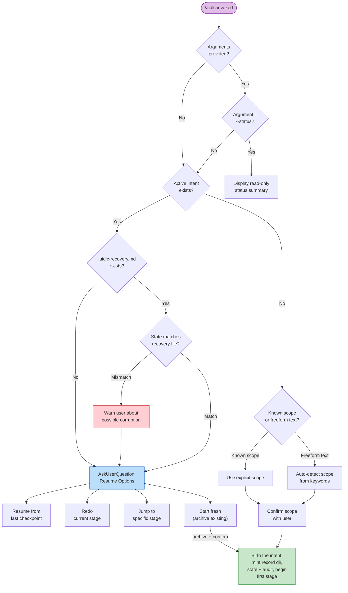
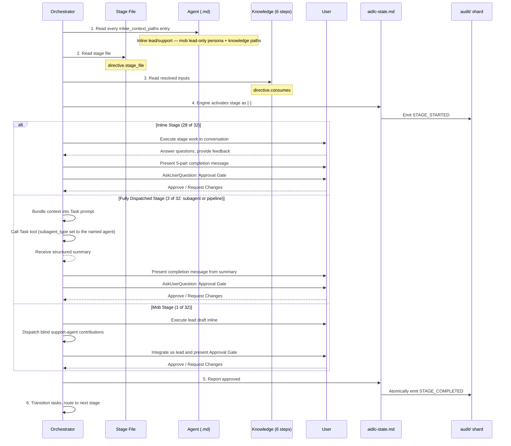
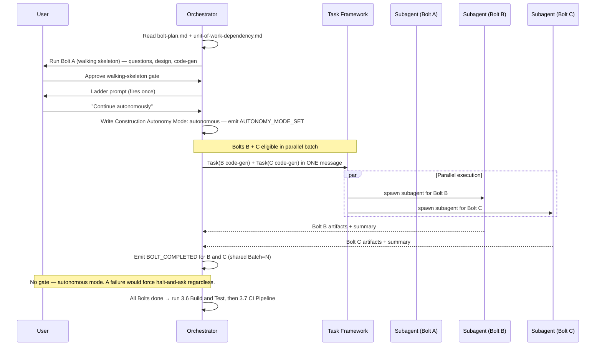
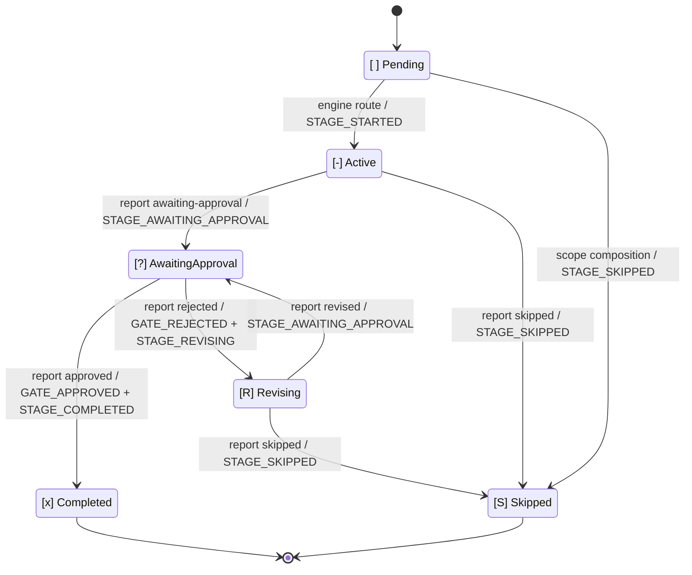

# Orchestrator

オーケストレーションは 2 つの部品に分かれている。決定論的な **engine**（`aidlc-orchestrate.ts`。サブコマンドは `next`・`report`・`park` のちょうど 3 つ）が stage 間のあらゆる判断——scope 判定、stage ルーティング、ジャンプ解決、resume と init のガード、gate の状態、workflow の完了——を担い、`next` のたびに型付きの **directive** を発行する。**conductor**（`.claude/skills/aidlc/SKILL.md`。`/aidlc` から起動）は各 directive に従って動く薄い forwarding loop であり——指名された stage を実行し、人間に質問し、swarm を fan-out する——その結果を `report` で報告する。SKILL.md は control plane ではない。ルーティングの判断は engine とそれが読むコンパイル済みデータ（`tools/data/stage-graph.json`、`tools/data/scope-grid.json`）にあり、SKILL.md は engine が指名した手の内側で実行品質を担う。

本章は conductor 側から見た workflow の挙動——エントリーポイント、セッション管理、scope から stage への対応、stage の実行・進行プロトコル、意図的な逸脱——を記述する。engine 内部（`next`/`report` の契約、型付き directive の union、conductor のペルソナ、複数形の skills、scope の形、swarm レフェリー）については [Engine and Skill System](17-skill-system.md) を参照。ユーザー向けのコマンド利用法は [User Guide -- CLI Commands](../guide/12-cli-commands.md) を参照。

> **所有権に関する注記。** 本章で述べる挙動——引数解決、scope 検出、ジャンプ検証、resume の分岐——は、`next` のたびに **engine** が計算し、directive として conductor に渡す。古い記述で「orchestrator が X する」とあれば、「engine が X を決めて directive を発行し、conductor がそれを実行する」と読み替えること。判断ロジックは決定論的なツールコードであって、SKILL.md のプロースではない。

> **パス規約。** 各 intent の状態、audit トレイル、intent スコープの
> 成果物は、その **record dir** の下——
> `aidlc/spaces/<space>/intents/<YYMMDD>-<label>/`、以下 `<record>/` と表記——に置かれる。
> Reverse Engineering は例外で、その永続的なリポジトリ単位の出力は
> `aidlc/spaces/<active-space>/codekb/<repo>/` に置かれる。audit トレイルは
> `<record>/audit/` 下の clone 単位シャードのディレクトリであり、単一ファイルではない。

---

## 目次

- [エントリーポイント](#entry-points)
- [セッション管理](#session-management)
- [Scope から Stage への対応](#scope-to-stage-mapping)
- [Stage 実行エンジン](#stage-execution-engine)
- [Stage 進行プロトコル](#stage-advancement-protocol)
- [タスク追跡](#task-tracking)
- [意図的な逸脱](#deliberate-deviations)
- [エラー処理](#error-handling)
- [付録 A: Stage Graph リファレンス](#appendix-a-stage-graph-reference)
- [付録 B: Hook リファレンス](#appendix-b-hook-reference)
- [付録 C: 承認ゲートのパターン](#appendix-c-approval-gate-patterns)

---

## Entry Points

conductor は `$ARGUMENTS` を engine の最初の `next` にそのまま渡す——事前パースは一切しない。engine がフラグと自由記述テキストをパースし、以下のどの起動パターンに該当するかを解決して、対応する directive を発行する。パターンは engine が解決する入力であって、conductor 側の分岐ではない。

### `/aidlc [scope]` -- 明示的な scope

引数が既知の 9 scope（`enterprise`、`feature`、`mvp`、`poc`、`bugfix`、`refactor`、`infra`、`security-patch`、`workshop`）のいずれかに一致した場合:

新規ワークスペース（まだ intent が無い——`aidlc/spaces/*/intents/*/` の下に `aidlc-state.md` が存在しない）で明示的に scope を指名すると、**最初の intent が誕生する**。engine の `next` は `aidlc-utility.ts intent-birth --scope <scope>` を指名する run-then-continue の `print` directive を発行し（`--depth` / `--test-strategy` フラグは指名コマンドに引き継ぐ）、conductor がそれを実行して `next` を再実行し、最初の stage に着地する。裸の位置引数（`/aidlc bugfix`）と明示フラグ（`/aidlc --scope bugfix`）の両方の記法が、同一の birth print を発行する。作るものを記述する（`/aidlc "build the auth service"`）場合も誕生する。明示的に指名された scope も記述も無い裸の `/aidlc` は誕生しない（env またはデフォルトで解決された scope は birth シグナルではない）。この場合は no-state エラーを発行し、作るものを記述するか scope を指名するようユーザーに促す。

1. `aidlc/spaces/<active-space>/memory/` からガードレールを読む。
2. ユーザーに「What would you like to build?」と尋ねる。
3. Scope から Stage への対応に従って実行する stage を決める。
4. Initialization phase（workspace-scaffold、workspace-detection、state-init）を単一の決定論的な `aidlc-utility intent-birth` 呼び出しとして実行する。ウェルカムメッセージはセッション開始時に `settings.json` の `companyAnnouncements` から描画される。
5. scope 内の全 stage に対して stage レベルのタスクを作成する。最初の stage は `in_progress` に、残りは `pending` に設定する。scope 外の stage にはタスクを一切作らない。
6. Initialization 後の最初の stage を開始する。

### `/aidlc [freeform]` -- AI による scope 検出

引数が自由記述テキスト（既知の scope キーワードでない）の場合:

1. `aidlc/spaces/<active-space>/memory/` からガードレールを読む。
2. intent をキーワードパターンに照らして解析する:
   - "fix" / "bug" / "broken" は `bugfix` に対応
   - "refactor" / "clean up" / "simplify" は `refactor` に対応
   - "infrastructure" / "deploy" / "infra" は `infra` に対応
   - "security" / "CVE" / "vulnerability" / "patch" は `security-patch` に対応
   - "proof of concept" / "prototype" / "poc" / "spike" は `poc` に対応
   - "mvp" / "minimum viable" は `mvp` に対応
   - それ以外はすべて `feature` にフォールバックする
3. 曖昧性解消ルール: テキストが scope キーワードと、より長いプロジェクト記述（5 語超）の両方を含む場合、その一致は偶発的なものとして扱い、無言のデフォルトではなく COMPOSE OFFER を発火させる。
4. 明確なキーワード一致では、コンパイル済みグリッドからセレモニーを名付けてユーザーに確認する: `Starting a "[scope]" workflow for: "[text]" - [N] of [T] stages, [G] approval gates. Confirm to proceed, name a different scope, or say "compose" for a tailored plan.`（scope の Construction stage が Unit of Work ごとに fan-out する場合は、per-unit 節が末尾に付く。）
5. 一致なし / 豊かなプロースの場合は、適応型コンポーザを提示する。composer agent がタスクの実装エントロピーを見積もり、最小限の EXECUTE/SKIP グリッドを提案する（human-gated。下記の compose サーフェスを参照）。提示される例の scope リストにもカウントが付く（`bugfix = 7 of 32 stages, poc = 8, feature = all 32`）ので、選ぶ前に規模差が見える。
6. 確認されると、明示 scope の場合と同様に進む。元の自由記述テキストは `aidlc-state.md` に `Initial Intent` として保存される。
7. ユーザーが検出された scope を上書きした場合は、ユーザーが選んだ scope を使う。

### `/aidlc compose` -- 適応型コンポーザ

compose サーフェス（先頭の `compose` 動詞、`--new-scope`、`--report <path>`）は、engine に scope 確認ではなく composer-dispatch の `print` を発行させる。この動詞は意図的にワークスペース動詞ではない（ワークスペース動詞は Kiro シームがオフバンドで走らせる終端ユーティリティコマンド。compose は conductor がディスパッチする workflow の仕事である）。状態ファイルの有無で 2 モードに分かれる:

1. **フロント / レポート（まだ workflow が無い）:** conductor は `aidlc-composer-agent` をディスパッチする。このエージェントは読み取り専用の `detect --json` スキャンを走らせ、5 つの実装エントロピー成分を見積もり（設定済みなら CodeKB MCP の証拠、そうでなければワークスペーススキャン）、構造化された提案（`mode matched|custom`、成分スコアと証拠手法を持つ `ars` ブロック、`arsRationale`、グリッド、SKIP 単位の根拠、validator から逐語コピーした `summary`、加えて事前描画された 2 つの markdown 表——バンド付き ARS スコアと、根拠付きの stage 単位の判断）を返す。これは `aidlc-graph.ts validate-grid` で検証される（その JSON には今やグリッドの stage/gate/per-unit カウントを持つ `summary` フィールドが載る）。conductor は approve/edit/reject の gate を 3 ブロックで描画する: validator の summary 行（`N stages EXECUTE / M SKIP, G approval gates`）、次に composer の ARS スコア表を逐語、最後にその stage 判断表を逐語。approve すると、既製の match は直接誕生し、custom グリッドは scope データ（`scopes/aidlc-<name>.md` + `scope-grid.json` エントリ、既定で `keywords: []`）として著述され、同一ターン内で birth が続く。
2. **実行中（workflow 稼働中）:** composer は完了済み stage が実際に解決した内容からエントロピー成分を再見積もりし、カーソルより先の PENDING stage に対して SKIP/un-SKIP のフリップを提案する。各フリップの根拠は、スコアを動かした完了済み stage の証拠を名指しする。自身の検証パスは `--strict` で走るので、痩せたフリップは gate の前に捕捉される。conductor は gate の前に pending-proposal マーカー（`aidlc/.aidlc-compose-pending`）を書き（Stop hook はこれをターン停止シグナルとして尊重する）、解決時に削除する。approve すると `aidlc-utility.ts recompose --skip <slugs> --add <slugs>` を走らせ、これは audit ロックの下でプランのサフィックスをフリップし、新たな starvation に対して strict 検証し、派生フィールドを再構築し、`RECOMPOSED` を発行する。マーカーには時間境界がある: Stop hook はそれが新鮮な（mtime で 24h 未満）間だけ尊重し、より古い孤児（書き込みと解決の間でクラッシュしたセッション）は無視してベストエフォートで削除するので、取り残されたマーカーが forwarding-loop の強制を黙って無効化することはない。`--doctor` も、存在するマーカーをその年齢とともに報告する（新鮮 = advisory pass、stale = fail）。`recompose` は autonomous Construction の下では拒否する（gate に人間が必要）——先に gated へ切り替えるか、swarm を終わらせること。検出は chat-first である: conductor の pre-forward 判定ステップ（new-work を見つけるのと同じもの）が、平文チャットの reshape 要求（"can we skip market research?"）を分類し、逐語 forward せずに `next compose "<their words>"` としてルーティングする（逐語 forward だと Branch 10 に落ちて現在の stage を走らせてしまう）。要求が特定の stage を命令形で名指しする場合、conductor は composer dispatch を省いて自分で gate を提示し、approve 時に直接 `recompose` を走らせてよい——この動詞は誰が呼んでも starved/frozen/behind-cursor/skeleton-gate のフリップ（および autonomous-Construction からの呼び出し）を拒否するので健全である。人間の gate とマーカー規律は両経路で同一である。

### `/aidlc --status` -- 進捗確認

workflow を進めずに現状を検査する読み取り専用コマンド:

1. アクティブな intent の `aidlc-state.md`（`aidlc/spaces/<space>/intents/<YYMMDD>-<label>/` の下）を読む。
2. 表示する: 現在の phase、現在の stage、完了率、保留中の判断、アクティブなエージェント。
3. 検証が必要なら、stage-protocol-governance.md の section 13 に従って phase 境界チェックを走らせる。
4. workflow を進めない——厳密に読み取り専用。

### `/aidlc --stage <id>` / `/aidlc --phase <name>` -- Stage/Phase へジャンプ

特定の stage または phase へ直接ジャンプする。前方・後方いずれのジャンプもサポートする。engine がターゲットを解決し、scope メンバーシップを検証し、ジャンプ方向を計算する。engine は `aidlc-jump.ts execute` ツールを指名する run-then-continue の `print` directive を発行する。conductor はそのツールを走らせて `next` を再実行する——ジャンプの解決や検証は自分では行わない。以下の番号付きステップは、ジャンプ計算（engine + ツール）が実施する内容を記述する。

**前方ジャンプ**（ターゲットが現在位置より先）:
1. ターゲット解決: `--stage` は slug（`code-generation`）または表示番号（`3.5`）を受け付ける。`--phase` は名前（`construction`）または番号（`3`）を受け付け、その phase の scope 内で最初の stage に解決する。
2. 既存の状態ファイルを確認する。無ければ自動初期化する（3 つの Initialization stage を走らせる）。
3. ターゲットが現在の/指定の scope に含まれることを検証する。
4. 中間の scope 内 stage を `[S]`（ジャンプによる skip）としてマークする。既に完了した `[x]` stage は変更しない。
5. 欠けている上流成果物について警告し、確認を求める。
6. stage レベルのタスクを作成し、ターゲット stage から実行を開始する。

**後方ジャンプ**（ターゲットが現在位置より後ろ）:
1. 前方ジャンプと同じ解決・検証。
2. ターゲットより下流の全 stage を `[ ]`（未開始）にリセットする。ディスク上の成果物は保持し、削除しない。
3. ターゲット stage と後続 stage が再実行されるとき、既存の成果物を検出して選択肢を提示する: Keep / Modify / Redo from scratch。
4. stage レベルのタスクを作成し、ターゲット stage から実行を開始する。

`--scope`（scope の設定・上書き）、`--depth`（depth レベルの上書き）、`--test-strategy`（テスト量の上書き）と組み合わせ可能。

### `/aidlc --scope <scope>` -- Scope の設定・上書き

workflow の scope を設定する。単独（`/aidlc --scope bugfix`）で使うと `/aidlc bugfix` と同じ挙動になる。`--stage` や `--phase` と組み合わせると、ジャンプ操作の scope を与える。`--depth` や `--test-strategy` と組み合わせてデフォルトを上書きできる。

### `/aidlc --depth <level>` -- Depth の上書き

depth レベル（minimal、standard、comprehensive）を上書きする。単独で使うと、アクティブな workflow の depth を更新する。`--scope` と組み合わせると、新しい scope のデフォルトを上書きする。単独変更については `DEPTH_CHANGED` audit イベントを記録する。

### `/aidlc --test-strategy <level>` -- Test Strategy の上書き

depth とは独立に、テスト量の戦略（minimal、standard、comprehensive）を上書きする。指定されない場合は現在の depth をデフォルトとする。`--depth standard --test-strategy minimal`（完全な成果物・最小限のテスト）のような組み合わせを許す。単独変更については `TEST_STRATEGY_CHANGED` audit イベントを記録する。

### Intent の誕生 -- Initialization phase

別建てのスキャフォールドコマンドは無い（以前の `init` フラグは廃止された。ワークスペースのシェルは `dist/<harness>/` に構築済みで出荷される）。3 つの Initialization stage（workspace-scaffold、workspace-detection、state-init）は `aidlc-utility intent-birth` の内側で決定論的に走る——最初の `/aidlc`（または `/aidlc <description>`）で自動起動されるか、`/aidlc-init` パッケージングで明示的に起動される。誕生は intent の record dir を `aidlc/spaces/<space>/intents/<YYMMDD>-<label>/` に鋳造し、状態を初期化し、scope ルーティングを適用し、workflow を Initialization 後の最初の stage に位置づける:

1. record dir ツリーを作成する（冪等——既存のディレクトリ/ファイルはスキップ）: `audit/` シャードディレクトリ、stage 成果物ディレクトリ（空）、検証ディレクトリ。
2. 空の space レベル `aidlc/knowledge/` ディレクトリ（space の `intents/` の兄弟）を作成する。固定のファイルセットを持たない自由形式で、誕生は per-agent サブディレクトリも README も種として置かない。チームが自分でファイルを足す。
3. ワークスペースをスキャンし、intent の `aidlc-state.md` を、実際の phase（例: `--scope feature` なら `IDEATION`）、解決された scope、コンパイル済み scope グリッド（`scope-grid.json`。各 stage の `scopes:` frontmatter の転置）から導いた stage プランとともに書く。
4. 完全なイベント列を発行する: `WORKFLOW_STARTED`、`WORKSPACE_SCAFFOLDED`、`WORKSPACE_SCANNED`、`WORKSPACE_INITIALISED`、最初に実行される phase の `PHASE_STARTED`、各 Initialization stage の `STAGE_STARTED` + `STAGE_COMPLETED`、加えて scope がスキップする phase の `PHASE_SKIPPED` イベント。
5. 自動誕生は intent がゼロのワークスペースでのみ起きる。intent が既に存在しアクティブなカーソルが無い場合、engine は重複を誕生させずにユーザーへどれかを選ぶよう促す（`/aidlc intent <slug>`）。re-init フラグは無い。
6. 誕生が自動誕生 print 経由で到達した場合、conductor は `next` を再実行し Initialization 後の最初の stage へ進む。明示的な `/aidlc-init` パッケージングは Initialization 後に止まるので、ユーザーは再度 `/aidlc` を起動して対話的に開始する。

### Resume（状態ファイルが存在する）

アクティブな intent の `aidlc-state.md` が存在する状態でユーザーが `/aidlc` を起動すると、engine の `next` が既存状態を検出し、resume/recovery ガードを走らせ、resume-options の質問を運ぶ `ask` directive を発行する。conductor はそれを `AskUserQuestion` で描画し、選択を `report --user-input` で返す。conductor は状態ファイルの有無で自分では分岐しない。以下のガードロジックは engine 内で走る:

1. engine が状態ファイルを読み、ステータスサマリを準備する。
2. `.aidlc-recovery.md`（intent の record dir 内）を確認する。存在すれば、その "Current stage" フィールドを `aidlc-state.md` と比較し、compaction 起因の状態破損の可能性を検出する。
3. resume options を持つ `ask` directive を発行する。conductor がそれを `AskUserQuestion` で描画する。
4. 回答を受けて、conductor は現在の workflow 状態に一致する stage レベルのタスクを再作成する。

---

## Session Management

### Session Resume Flow

以下の分岐は **engine** の `next` の判断ロジックである——引数、init、状態ファイルのチェックはすべて `aidlc-orchestrate next` の内側で走り、1 つの directive（ステータス `print`、スキャフォールド `print`、resume メニューの `ask`、作業を開始する `run-stage`）を発行する。conductor 自身のフローは forwarding loop だけである: `next` を呼び、directive に従って動き、`report`、を繰り返す。



### State File Schema

`aidlc/spaces/<space>/intents/<YYMMDD>-<label>/aidlc-state.md`（intent の record dir）にある状態ファイルは、`.claude/knowledge/aidlc-shared/state-template.md` の契約に従って engine が生成する。stage の行はテンプレートからではなく、コンパイル済みの `tools/data/stage-graph.json` と `scope-grid.json` から来る。State Version 7 を使い、以下を含む:

| セクション | 内容 |
|---------|----------|
| Project Information | プロジェクト記述、種別（greenfield/brownfield）、scope、開始日、ライフサイクル phase、アクティブなエージェント、worktree パス、Bolt refs、practices affirmed タイムスタンプ |
| Scope Configuration | 実行する stage、スキップする stage（理由付き）、depth レベル、test strategy |
| Workspace State | プロジェクトルート、検出言語、フレームワーク、ビルドシステム |
| Execution Plan Summary | 合計 stage 数、完了数、in-progress の stage |
| Runtime State | 現在の stage の revision カウント |
| Phase Progress | phase ごとのステータス |
| Stage Progress | コンパイル済みグラフから生成された stage ごとのチェックボックス。phase 別に整理（下記参照） |
| Current Status | ライフサイクル phase、現在/次の stage、ステータス、最終更新タイムスタンプ |
| Session Resume Point | 最後に完了した stage、次のアクション、保留中の成果物 |

**Stage Progress** は 6 状態のチェックボックスを使う:
- `[ ]` 未開始
- `[-]` 進行中
- `[?]` 承認待ち（gate open）
- `[R]` 修正中（gate を却下したので stage を修正している）
- `[x]` 完了（ユーザーが承認）
- `[S]` skip（init で scope 除外、`skip` でカット、または `--stage`/`--phase` ジャンプでバイパス）

Construction phase のセクションは特別で、Bolt ごとに走る（下記 [Construction の実行](#construction-execution) を参照）ので、チェックボックスは `bolt-plan.md` で定義された各 Bolt 内の Unit ごとに一度ずつ現れる。加えて `Construction Autonomy Mode: [unset|autonomous|gated]` が **Current Status** の下に記録される——ladder prompt が発火した後に書かれ、セッション resume で尊重される。

### Recovery Breadcrumb

recovery breadcrumb（intent の record dir 内の `.aidlc-recovery.md`）は `validate-state.ts` の PreCompact hook が書く。context compaction が起きる前の、workflow の最後の既知良好状態のスナップショットを記録する。

セッション resume 時、orchestrator は breadcrumb の "Current stage" を状態ファイルの "Current Stage" と比較する。異なる場合、compaction が状態破損を引き起こした可能性をユーザーに警告する。これは PreCompact hook が情報提供専用で compaction をブロックできないため重要である。

### Resume Options

状態ファイルが検出されると、orchestrator は 4 つの選択肢を提示する。conductor は人間の回答を `report --result resumed --user-input "<answer>"` で報告する。engine が選択に一致させ、正確な手を名指しする選択ごとの directive を返す（認識できない回答は、受理可能な選択肢を添えてエラーになる）:

**1. Resume from last checkpoint** -- in-progress の stage から続ける: `next` を再実行し、`aidlc-state.md` を読んで完了/進行中/未開始の stage を判定する。

**2. Redo current stage** -- directive は `aidlc-jump.ts execute --target <current> --direction redo --scope <scope>` を名指しし、現在の stage のチェックボックスをリセットする。次の `next` がそれを最初から再実行する。

**3. Jump to stage** -- directive は conductor にターゲットを尋ね、`next --stage <slug>` 経由でルーティングするよう指示する（engine が方向を解決しターゲットを検証する）。

**4. Start fresh** -- directive は second-intent フロー経由でルーティングする: scope と記述を確認し、`next --new-intent --scope <scope> "<description>"`。既存の workflow は新しい intent と並んでそのまま残る。

### Session Resume Context Loading

| Phase / Stage 種別 | ロードされるコンテキスト |
|---|---|
| INITIALIZATION (0.1-0.3) | ガードレールのみ（ワークスペース未検出） |
| IDEATION (1.1-1.7) | ここまで完了した `<record>/ideation/` 成果物 + ガードレール |
| INCEPTION -- RE stages | `aidlc/spaces/<active-space>/codekb/<repo>/` + ideation 成果物 |
| INCEPTION -- Requirements stages | リポジトリ単位の `codekb/` 成果物（実施済みなら）+ requirements 成果物 |
| INCEPTION -- Design stages | requirements + user stories + application design 成果物 |
| INCEPTION -- Delivery Planning | 全 inception 成果物 |
| CONSTRUCTION -- Code Generation | 現在の unit の design 成果物 + story design + acceptance criteria + 先行コード |
| CONSTRUCTION -- Build/Test | 現在の unit のコード出力 + test plan + build configuration |
| CONSTRUCTION -- CI/Infra | infrastructure design + code generation 出力 |
| OPERATION (4.1-4.7) | Construction 出力 + operation 成果物。後段の stage（4.4+）は 4.1-4.3 のデプロイ出力もロードする |

---

## Scope-to-Stage Mapping

scope は 32 stage のうちどれをどの depth で実行するかを決める。scope 外の stage は完全にスキップされる——タスクは作られず、承認 gate も提示されない。すべての scope は Initialization phase（0.1-0.3）で始まる。

### Complete Mapping

正典データは `.claude/scopes/aidlc-<name>.md` ファイル群と各 stage の `scopes:` frontmatter にあり、`.claude/tools/data/scope-grid.json` にコンパイルされる。ライブのコンパイル済みカウントは `bun .claude/tools/aidlc-utility.ts scope-table` で取得する。

| Scope | 含まれる Stage | EXECUTE / Total | Depth | Test Strategy |
|---|---|---|---|---|
| `enterprise` | All: 0.1-0.3, 1.1-1.7, 2.1-2.8, 3.1-3.7, 4.1-4.7 | 32 / 32 | Comprehensive | Comprehensive |
| `feature` | All: 0.1-0.3, 1.1-1.7, 2.1-2.8, 3.1-3.7, 4.1-4.7 | 32 / 32 | Standard | Standard |
| `mvp` | 0.1-0.3, 1.1, 1.3 (light), 1.4, 2.1 (if brownfield), 2.2, 2.3, 2.4, 2.5 (if UI), 2.6, 2.7, 2.8, 3.1-3.7 | 22 / 32 | Standard | Standard |
| `poc` | 0.1-0.3, 1.1 (minimal), 2.1 (if brownfield), 2.3 (minimal), 3.5, 3.6 | 8 / 32 | Minimal | Minimal |
| `bugfix` | 0.1-0.3, 2.1 (always), 2.3 (minimal), 3.5, 3.6 | 7 / 32 | Minimal | Minimal |
| `refactor` | 0.1-0.3, 2.1 (always), 2.3 (minimal), 3.1 (refactoring plan), 3.5, 3.6 | 8 / 32 | Minimal | Minimal |
| `infra` | 0.1-0.3, 2.2, 2.3 (infra requirements), 3.2, 3.3, 3.4, 3.7, 4.1, 4.2, 4.3, 4.4 | 13 / 32 | Standard | Standard |
| `security-patch` | 0.1-0.3, 2.1 (find vulnerability context), 2.3 (minimal), 3.2, 3.5, 3.6, 4.1, 4.3 | 10 / 32 | Minimal | Minimal |
| `workshop` | 0.1-0.3, 2.1-2.8, 3.1-3.7, 4.1-4.7 (skips all ideation 1.1-1.7) | 25 / 32 | Standard | **Minimal** |

### Detailed Scope Breakdown

- **enterprise** -- 全 32 stage を comprehensive depth で。各 stage は完全な成果物詳細、深い分析、全オプション stage 込みで実行する。完全なトレーサビリティを要する規制対象のエンタープライズ機能に適する。
- **feature** -- 全 32 stage を standard depth で。stage セットは enterprise と同じだが、成果物詳細は中庸。新規機能の既定 scope。
- **mvp** -- Ideation の大半をスキップ（Intent Capture、軽い Feasibility、Scope Definition のみ残す）。Inception と Construction は全て走らせる。Operation stage は任意。
- **poc** -- 最小限の Ideation（Intent Capture のみ）。中核の Inception。Construction からは Code Generation と Build and Test のみ。Operation は無し。
- **bugfix** -- Ideation 無し。Reverse Engineering は常に含む（バグを見つけるため）+ 最小限の Requirements Analysis。Code Generation と Build and Test のみ。
- **refactor** -- Ideation 無し。Inception の入りは bugfix と同じ。Functional Design（リファクタリング計画として）を追加する。
- **infra** -- Ideation 無し。Infra 中心の Requirements Analysis。Construction から NFR stage + Infrastructure Design + CI Pipeline。Operation から Deployment と Observability。
- **security-patch** -- Ideation 無し。脆弱性コンテキストを見つける Reverse Engineering + 最小限の Requirements Analysis（脆弱性とその修復基準の監査可能な記述）。NFR Requirements、Code Generation、Build and Test。Operation から Deployment Pipeline と Deployment Execution。
- **workshop** -- Ideation 無し（プロジェクトはファシリテータが事前に決めている）。Inception・Construction・Operation の全 stage を実行する。既定 depth: Standard（学習のための完全な成果物詳細）。既定 test strategy: Minimal（workshop のペースを速く保つ Nyquist testing）。参加者が mob として全ライフサイクルを通す複数日の AI-DLC workshop 向けに設計されている。

### Depth Levels

| Depth | Scopes | 特性 |
|---|---|---|
| Minimal | poc, bugfix, refactor, security-patch | 最小限の成果物、簡潔な分析、オプション stage はスキップ |
| Standard | feature, mvp, infra, workshop | 中庸な詳細度の完全な成果物 |
| Comprehensive | enterprise | 深い分析つきの comprehensive な成果物、全 stage 実行 |

**注:** Workshop は独立した depth と test strategy のデフォルトを持つ点で唯一の存在である。Standard depth（学習のための完全な成果物）を使うが、Minimal test strategy（ペースのための Nyquist testing）を使う。他の全 scope は test strategy を depth レベルに合わせるのが既定。`--test-strategy` で上書きする。

---

## Stage Execution Engine

すべての stage は 4 つのアクティブな実行パターン——inline、subagent、pipeline、mob——のいずれかに従う（出荷グラフでは 28 / 2 / 1 / 1）。コンパイル済み stage グラフ（`tools/data/stage-graph.json`）が各 stage のモードを持ち、engine がそれを読んで `run-stage` directive に `directive.mode` として届ける。SKILL.md の Stage Graph 表は人間可読のミラーであって、ディスパッチのソースではない。

### Full Stage Lifecycle



### Inline Execution

Inline stage は orchestrator の会話の中で直接走る。ユーザーはその stage とリアルタイムに対話できる。32 stage のうち 28 が inline で、残り 4 はディスパッチされる（practices-discovery と code-generation の subagent、reverse-engineering の pipeline、user-stories の mob）。

6 ステップのプロセス:

1. **すべての inline context path を読む。** stage の作業前に、conductor は `directive.inline_context_paths` の全ファイルを読む。engine が正確な lead・support のペルソナと knowledge ファイルの一覧を供給する。エージェント名だけではコンテキストとしてロードされず、support-agent エントリを省いてはならない。
2. **stage ファイルを読む。** conductor は正確な `directive.stage_file` を読む。
3. **解決済み入力を読む。** conductor は `directive.consumes` の既存成果物を読み、期待どおり入力が欠けている場合は stage が文書化したフォールバックを適用する。
4. **会話の中でステップを直接実行する。** orchestrator は stage の作業を inline で行う: 質問し、回答を分析し、成果物を生成し、ユーザーと対話する。
5. **承認 gate は stage-protocol.md に従う。** すべての inline stage（3 つの Initialization stage を除く）は、5 部構成の完了メッセージと `AskUserQuestion` の承認 gate で終わる。
6. **engine に制御を返す。** 承認後、conductor は結果を報告する。engine が状態をアトミックに更新し、完了を記録し、次の stage へルーティングする。

### Dispatched and Hybrid Execution

3 つの stage は lead の作業を別のエージェントタスクに委譲する。mob は lead を
inline に保ち、support agent だけをディスパッチする:

| Stage | Mode | Claude Code Subagent Type | Agent | 理由 |
|-------|------|---------------------------|-------|--------|
| 2.1 Reverse Engineering | pipeline | `aidlc-developer-agent` then `aidlc-architect-agent` (2-link chain) | aidlc-developer-agent + aidlc-architect-agent | 深いコード分析は大きな中間出力を生む。最終リンクが成果物を書く |
| 2.2 Practices Discovery | subagent | `aidlc-pipeline-deploy-agent`, then three parallel spokes, then the lead again | pipeline-deploy + quality + developer + devsecops | Hub-and-spoke の発見は、人間インタビューと lead 統合の前に証拠の視点を独立に保つ |
| 2.4 User Stories | mob | lead inline; `aidlc-design-agent` + `aidlc-developer-agent` + `aidlc-quality-agent` in parallel | 4 participants | lead が下書きし、互いに blind な協力者が contribution ファイルを書き、lead が gate 前に統合する |
| 3.5 Code Generation | subagent | `aidlc-developer-agent` | aidlc-developer-agent | コード記述は unit 仕様に絞ったクリーンなコンテキストから利益を得る |

Workspace detection（0.2）は以前は subagent だった。今は `aidlc-utility intent-birth` の内側の決定論的なルールベーススキャナである。ルールは `aidlc-common/stages/initialization/workspace-detection.md` に文書化されている。

6 ステップのプロセス:

1. **ルール・stage・入力を読む。** 正確な directive パスを使う。
2. **conductor 所有のコンテキストをロードする。** mob directive は lead の完全な
   一覧を `inline_context_paths` に運ぶ。完全にディスパッチされる subagent/pipeline
   の directive は空の一覧を運ぶ。
3. **paths-only のブリーフを準備する。** 正確なルールと関連する成果物の
   パス + タスク指示を渡す。名指しされた harness エージェント設定がペルソナと
   knowledge をロードする。どちらもプロンプトにコピーしない。
4. **トポロジーを適用する。** subagent の support には blind spoke、pipeline には
   順序付きリンク、mob には blind な support contribution + 境界付きの objection
   ラウンドを使う。
5. **永続出力を集める。** lead が `produces[]` を所有する。ディスパッチされた
   subagent/mob の support はそれぞれ identity マーク付きの contribution ファイルを書く。
6. **engine を通じて完了する。** 成果物/証拠を検証し、承認 gate を提示する。

### Multi-Agent Coordination

一部の stage には複数のエージェント——lead エージェントと 1 つ以上の support エージェント——が関わる。協調パターンは `directive.mode`（stage の通信トポロジー）に従い、常に orchestrator を介する:

1. lead エージェントの作業をまず実行し、主要成果物を生成する。
2. トポロジーに従って各 support エージェントを投入する。`inline` stage では orchestrator が `directive.inline_context_paths` の全 lead/support エントリを読み、ディスパッチせずにそれらの視点を採用する。`mob` では lead-only の一覧を読んで lead 作業を inline で行い、各 support は実際のディスパッチとする。`subagent`（hub-and-spoke）と `pipeline`（chain）では lead と support をディスパッチする: subagent では互いに blind な spoke、pipeline では順序付きの enrichment ホップ、mob では並列の blind contribution + 境界付き objection ラウンド（stage-protocol.md §5）。
3. 全エージェント出力を最終 stage 成果物に統合する——ディスパッチされた support エージェントは contribution ファイル（Contribution + Positions、stage-protocol §11）を書き、lead がそれを統合する。`produces[]` 成果物は lead だけが編集する（pipeline リンクはそれを直接前進させる）。未解決の mob 判断は stage の途中で人間に浮上し、維持された dissent は gate で逐語引用される。
4. エージェント同士は互いを呼び出さない——orchestrator だけが委譲する。全エージェントファイルの `disallowedTools: Task` で強制される。

Practices Discovery は gate 順序の例外である。その hub-and-spoke の作業は
**Approve** / **Request Changes** gate で終わる。Approve 後、conductor が
`practices-promote` を走らせる。このコマンドだけが affirmed タイムスタンプと
`PRACTICES_AFFIRMED` の audit 受領を commit でき、engine が `approved` を受理する前に、
その受領は現在の stage 試行に対して新鮮でなければならない。promotion の欠落・陳腐化・
失敗は gate を開いたまま、stage を未完了のままにする。

### Two-Link Reverse Engineering Pipeline

Stage 2.1 は出荷される `mode: pipeline` の例——各リンクが作業物を直接
前進させる 2 リンクのチェーン——である:

1. **Developer（link 1、lead）:** コードベースをスキャンし、コード構造を分析し、コンポーネントを識別し、依存を対応づけ、生の分析を返す。
2. **Architect（link 2、最終リンク）:** developer の生分析を受け取り、`aidlc/spaces/<active-space>/codekb/<repo>/` の下の 9 つの codekb 成果物に統合する——最終リンクは pipeline 契約どおり `produces[]` 成果物を完成させて残す。

Reverse Engineering には **always-rerun ポリシー** がある: brownfield プロジェクトでは、先行成果物が存在しても常に再実行され、分析が現在のコードベース状態を反映することを保証する。

### Construction Execution <a id="construction-execution"></a>

Construction（stage 3.1–3.7）は、標準的な stage ごとの inline 実行モデルから逸脱する。代わりに orchestrator はそれを **Bolt ごと**に走らせる。駆動するのは `<record>/inception/delivery-planning/bolt-plan.md`（Bolt 列 + walking-skeleton マーカー）と `<record>/inception/units-generation/unit-of-work-dependency.md`（DAG）である。

Bolt 単位の構造:

1. Bolt の Unit 群を横断して、stage 3.1–3.4 の質問を QUESTION-ONLY モードで集める。単一の回答で gate する。
2. stage 3.1–3.4 の design 成果物を ARTIFACT-ONLY モードで生成する。
3. stage 3.5 Code Generation を Unit ごとに Task ツール（`subagent_type="aidlc-developer-agent"`）でディスパッチする。`code-generation.md` 内の Unit 単位の承認 gate は orchestrator によって **抑制される**。
4. 単一の Bolt レベル（またはバッチレベル）の承認 gate を提示する。

`bolt-plan.md` の最初の Bolt は **walking skeleton** であり——その gate は autonomy モードに関わらず常に提示される。walking-skeleton gate が承認された直後、orchestrator は **ladder prompt** を workflow ごとにちょうど一度発火し、`aidlc-state.md` に `Construction Autonomy Mode: autonomous|gated` を記録し、`AUTONOMY_MODE_SET` を発行する。残りの Bolt はそのモードを尊重する。

並列実行の資格を持つ Bolt（依存の前提が満たされ、相互依存が無い）は **batch** を成す。orchestrator は batch 内で質問/design を Bolt ごとに逐次実行し、その後 stage 3.5 Code Generation を **単一の assistant メッセージ内の N 個の `Task` 呼び出し**で並列にディスパッチする。フレームワークが N 個の subagent セッションを並行して spawn し、結果は orchestrator の次のターンで到着する。単一の batch レベル gate が batch 内の全 Bolt をカバーする。audit ログは `BOLT_STARTED`/`BOLT_COMPLETED` の `Batch` フィールドで並列 Bolt を結びつける。

失敗処理は **halt-and-ask** であり、autonomy モードに関わらず走る:

- Solo Bolt の失敗: halt し、`BOLT_FAILED` を発行し、retry / skip / abort を提示する。
- 並列 batch の部分失敗: 全並列 Task の返りを待ち、成功した Bolt の成果物をディスク上に保存し、`Succeeded=[names]` 付きで `BOLT_FAILED` を発行し、失敗した Bolt にスコープした同じ選択肢を提示する。Retry は失敗した Bolt だけを再実行する。batch の兄弟は `[x]` のまま残る。



<!-- Text fallback: The orchestrator reads bolt-plan.md and the dependency DAG. It runs Bolt A as the walking skeleton, the user approves the gate, and the ladder prompt fires once. User picks "Continue autonomously", orchestrator writes Construction Autonomy Mode and emits AUTONOMY_MODE_SET. For Bolts B and C (eligible in parallel), the orchestrator issues both Task calls in a single message; the framework runs them concurrently; the orchestrator receives both results in the next turn and emits BOLT_COMPLETED for each with a shared Batch field. No gate because autonomy mode is autonomous — a failure would still halt. Once all Bolts are done, 3.6 and 3.7 run once at the end. -->

並列ディスパッチ下での状態と audit の安全性: `aidlc-audit.ts` は mkdir ベースのロックを使うので、並行 append は安全である。ライフサイクルの書き込みは、必要な全 Task 結果が返り conductor が 1 つの結果を報告した後にのみ起きる。engine は内部の状態遷移を直列化する。状態レースのリスクは無い。

---

## Stage Advancement Protocol

状態遷移は engine が所有する。conductor は `aidlc-orchestrate.ts` を通じて outcome を報告し、engine が内部の状態遷移を呼び出して state ファイルを更新し、ライフサイクルの audit 行を発行し、アトミックに routing する。標準の workflow / phase / stage 状態遷移図と audit イベント分類の全体は [State Machine](12-state-machine.md) を参照。

### Stage Lifecycle



上記のすべての遷移は orchestration engine が所有する。conductor は outcome を報告するのみで、checkbox の状態を書き込んだり、state のライフサイクル動詞を直接呼んだり、stage/gate/phase の audit イベントを散文で発行したりすることは決してない。

### stage が完了したとき（gate で user が承認）

1. **completion verification を実行する** - artifact がディスク上に存在し、guardrail が守られているか確認する。これは正しさの検査であって、状態遷移ではない。これは決定論的にも強制される: `approve` は、宣言された `produces` artifact が欠けている gated stage を拒否する（`AIDLC_SKIP_ARTIFACT_GUARD=1` の場合を除く）。したがって stage は出力なしに完了としてマークできない（#366）。unit ごとの Construction stage は代わりに swarm referee が検証する。

2. **gate に入る**: `bun .claude/tools/aidlc-orchestrate.ts report --stage <slug> --result awaiting-approval`。engine は `[-]` → `[?]` にマークし、`STAGE_AWAITING_APPROVAL` を発行し、`/aidlc --status` に "Awaiting your approval on \<stage\>" を表示させる。

3. **approval gate を提示する**（AskUserQuestion）。

4. **user の応答を記録する**:
   - **Approve** -> `bun .claude/tools/aidlc-orchestrate.ts report --stage <slug> --result approved --user-input "<exact choice>"`。欠けている gate 行があれば発行し、続いて `GATE_APPROVED` + `STAGE_COMPLETED` を発行し、advance する。stage の `produces` 出力が存在しない場合は missing-produced-artifact エラーで拒否する。
   - **Request Changes** → `bun .claude/tools/aidlc-orchestrate.ts report --stage <slug> --result rejected --user-input "<text>"`。engine は `GATE_REJECTED` + `STAGE_REVISING` を発行し、`[?]` → `[R]` にマークし、Revision Count をインクリメントする。
   - `[R]` stage の作業を再実行した後、`bun .claude/tools/aidlc-orchestrate.ts report --stage <slug> --result revised` を呼んで gate に再入する（新たな `STAGE_AWAITING_APPROVAL` を発行し、`[R]` → `[?]` にマークする）。

5. **次の stage へ advance する**: 手順 4 の承認 report が advance も行う。engine は、（`init` が設定した）state ファイルの EXECUTE/SKIP サフィックスとコンパイル済みの scope grid（`scope-grid.json`）から、次の in-scope stage を導出する。完了したものを `[x]`、次のものを `[-]` にマークし、Current Stage / Lifecycle Phase / Active Agent / Next Stage / Last Completed Stage / Last Updated / Completed 数を更新し、次の stage の `STAGE_STARTED` を発行する。phase 境界ではさらに `PHASE_COMPLETED` + `PHASE_VERIFIED` + `PHASE_STARTED` をアトミックに発行する。

   このツールは冪等である — `advance <slug>` を 2 度目に再生しても、イベントを再発行せずに `{replay: true}` を返す。

6. **これが最後の in-scope stage だった場合**: 同じ `report --stage <slug> --result approved --user-input "<exact choice>"` 呼び出しが `[x]` にマークし、Status=Completed を設定し、`PHASE_COMPLETED` + `PHASE_VERIFIED` + `WORKFLOW_COMPLETED` を発行する。completion summary を提示する。

7. **task を遷移させる**: 古い task を `completed` にマークし、新しい task を `activeForm: "Running <Next Stage> [slug]"` 付きで `in_progress` に設定する。`[slug]` サフィックスが、statusline フィールドを同期する PostToolUse hook をトリガーする。

### Phase Boundary Verification

phase 遷移時（init→ideation / inception / …、ideation→inception、inception→construction、construction→operation）、`advance` は PHASE_COMPLETED + PHASE_VERIFIED + PHASE_STARTED を発行する。orchestrator は、`advance` を呼ぶ前に `.claude/knowledge/aidlc-shared/verification.md` の traceability チェックを実行する責任を負う — 検証に失敗した場合は、問題を user に提示し、advance してはならない。

---

## Task Tracking

orchestrator は Claude Code の TaskCreate/TaskUpdate/TaskList ツールを使い、workflow を通じて可視の進捗サイドバーを保つ。

### Stage-Level Tasks

task は stage レベルで作成される -- scope 内の stage 1 つにつき task 1 つ。task は Claude Code の task サイドバーにのみ存在する（state ファイルには保存されない）。context compaction 後に task ID が失われた場合は、subject ベースの検索で `TaskList` から復元される。

### Task Creation Timing

task は phase バッチで作成される:

- **INITIALIZATION**: すべての Initialization stage task（workspace-scaffold, workspace-detection, state-init）を `aidlc-utility intent-birth` の実行前に作成する。このツールは 1 回の呼び出しで 3 stage すべてを完了する。task はツールが返った後に completed へ切り替わる。
- **IDEATION**: すべての Ideation stage task を stage 1.1 の開始前に作成する。
- **INCEPTION**: すべての Inception stage task を stage 2.1 の開始前に作成する。
- **CONSTRUCTION**: Delivery Planning からの execution plan に基づいて task を作成する。unit ごとの stage task を各 unit に作成し、加えて cross-cutting task を作成する。
- **OPERATION**: すべての Operation stage task を stage 4.1 の開始前に作成する。

### Per-Unit Task Naming Conventions

| Phase | パターン | 例 |
|---|---|---|
| Initialization | `"Initialization - [Stage Name]"` | `"Initialization - Workspace Scaffold"` |
| Ideation | `"Ideation - [Stage Name]"` | `"Ideation - Intent Capture"` |
| Inception | `"Inception - [Stage Name]"` | `"Inception - Requirements Analysis"` |
| Construction (per Bolt) | `"Construction — Bolt: [bolt-name]"`（最初の Bolt には `" (walking skeleton)"` を付す） | `"Construction — Bolt: notification-core (walking skeleton)"` |
| Construction (per-Unit code gen) | `"Construction — Code Generation (Unit: [unit-name])"` | `"Construction — Code Generation (Unit: notification-email)"` |
| Construction (cross-Bolt) | `"Construction — [Stage Name]"` | `"Construction — Build and Test"` |
| Operation | `"Operation - [Stage Name]"` | `"Operation - Observability Setup"` |

### Skipped Stage Handling

execution plan で SKIP とマークされた stage について、orchestrator は task を作成するが、skip の説明を付けて直ちに completed にマークする。これにより、サイドバーは明確な skip 注記付きで stage セット全体を表示する。

### MANDATORY Status Line Updates

いかなる stage を実行する前にも、orchestrator は必ず以下を行わなければならない:

1. 直前の stage task（あれば）を `completed` にマークする。
2. 現在の stage task を、`activeForm` を `"Running [Stage Name]"` に設定して `in_progress` にアクティブ化する。

`activeForm` のスピナーが表示されるには、task が `in_progress` でなければならない。この更新は stage ファイルを読む前に行わなければならない。

---

## Deliberate Deviations

upstream の `aidlc-workflows/` reference および v2 framework spec との以下の意図的な差異は、将来の「修正」の試みを防ぐために SKILL.md と stage-protocol.md に文書化されている。

| # | Deviation | Reference | Implementation | 根拠 |
|---|-----------|-----------|----------------|-----------|
| 1 | NFR artifact の粒度 | 各 2 ファイル | 5 NFR Requirements + 5 NFR Design ファイル | 粒度を細かくすると traceability が向上する |
| 2 | Plan/question ファイルの配置 | フラットな集中パターン | stage artifact と同じ場所に配置 | 発見しやすさが向上する |
| 3 | Infrastructure Design の拡張 | 2-3 ファイル | 5 ファイル（+monitoring-design.md, +cicd-pipeline.md） | 運用上の可視性 |
| 4 | インラインの質問 | すべての質問をファイルで | 単純な 1-3 の選択肢には `AskUserQuestion` | Claude Code の構造化 UI |
| 5 | Architecture Decision Records | 存在しない | Application Design に `decisions.md` | アーキテクチャの traceability |
| 6 | Welcome メッセージ | より長い Unicode ベース | より短く ASCII-safe。`settings.json` の `companyAnnouncements` で描画（stage ではない） | reference 自身の ascii-diagram-standards 違反を修正 |
| 7 | RE の always-rerun ポリシー | キャッシュした artifact を使う | brownfield では常に再実行 | 現在の codebase 分析を保証 |
| 8 | Session resume | ファイルベースの `[Answer]:` タグ | `AskUserQuestion` を使う | Claude Code でより自然 |
| 9 | Clarification の質問 | 別ファイル | インラインで処理 | 通常は 1-2 の的を絞った問い合わせ |
| 10 | Audit ログ形式 | 単一形式 | 追加で 3 つ: Error, Recovery, Change Request | 事後分析 |
| 11 | Tri-mode の質問フロー | ファイルベースのみ | "Guide me" / "I'll edit the file" / "Chat" | 異なる好みに対応 |
| 12 | Delivery Planning | Workflow Planning（stage selector） | 改名。work breakdown 分析を追加 | より実行可能な Construction 計画 |
| 13 | State ファイル名 | `state.md` | `aidlc-state.md` | hook がパスをハードコードしており、変更するとスクリプトが壊れる |
| 14 | 最小限の rule | 複数の rule ファイル | guardrail のみ（~35 行） | 非 AI-DLC 会話での context 肥大化を回避 |
| 15 | Scope-to-stage マッピングの場所 | rule 内 | ファイルで記述: `.claude/scopes/aidlc-<name>.md`（identity）+ stage ごとの `scopes:` frontmatter（membership）。コンパイル時に `scope-grid.json`（engine が読む runtime ソース）へ転置 | scope はファイルで記述する primitive。`scope-mapping.json` も SKILL.md 常駐の routing もない |
| 16 | Agent のツールアクセス | scoped な制限 | バイナリ: 完全な Bash か皆無か | Claude Code は scoped なツール制限をサポートしない |
| 17 | ネストした委譲なし | Agent は委譲できる | すべての Agent が `disallowedTools: Task` を持つ | 連鎖する subagent chain を防ぐ |
| 18 | フラットな Agent の配置 | `.claude/agents/aidlc/*.md` | `.claude/agents/*.md` | Claude Code 標準の discovery に合わせる |
| 19 | Agent memory | `memory: project` を定義 | 省略 | サポートされない Claude Code frontmatter フィールド |
| 20 | Design-agent の support 追加 | 1.6, 2.5 のみ | 2.4, 2.6 の support として追加 | UX を踏まえた開発 |

---

## Error Handling

### Subagent Failure Retry

Claude Code の Task ツール呼び出しが失敗したとき:

1. **1 度リトライする** — context を減らした prompt で（inception artifact を要約し、現在の unit の design artifact のみを渡す）。
2. **リトライも失敗した場合**、2 つの選択肢を提示する: "Run inline"（orchestrator の会話内で実行）または "Skip and revisit"（未完了とマークして続行）。
3. **失敗を記録する** — `audit/` shard に Error 形式で。

### State Corruption Recovery

`aidlc-state.md` が存在するがパースできない場合:

1. バックアップを作成する（`aidlc-state.md.bak`）。
2. intent の record ディレクトリを走査して artifact の痕跡を探し、実際にどの stage が完了したかを判定する。
3. artifact の痕跡から state ファイルを再構築する。
4. user に通知する: "State file was corrupted. Rebuilt from artifacts. Please verify."

resume 時に `.aidlc-recovery.md` が `aidlc-state.md` と食い違う場合、compaction 起因の破損の可能性を user に警告する。

### Missing Artifact Recovery

stage が存在しない先行 artifact を参照している場合:

1. どの期待される artifact が欠けているか確認する。
2. state と突き合わせる（生成元の stage が完了とマークされているか）。
3. 完了とマークされているのに artifact が欠けている場合、stage の再実行か artifact の手動提供を提示する。
4. 完了とマークされていない場合、stage を通常どおり実行する。

### Contradictory Inputs Recovery

異なる stage からの user 入力が互いに矛盾する場合:

1. 両方のソースからの引用を添えて、具体的な矛盾を指摘する。
2. 一方の解釈を選んで解決してはならない。
3. どちらの入力を優先するか user に尋ねる。
4. 上書きされる artifact を更新し、解決内容を記録する。

### Error Severity Levels

| Severity | アクション | 例 |
|---|---|---|
| **Critical** | 直ちに停止して user に尋ねる | 破損した state、欠けている重要な artifact、回復不能なパースエラー |
| **High** | 直ちに停止して user に尋ねる | 矛盾する入力、不完全な回答、欠けている依存関係 |
| **Medium** | 解決を試みる。未解決なら user に尋ねる | 曖昧な応答、部分的な context、曖昧な要件 |
| **Low** | 黙って処理して記録する | 書式の不整合、軽微な命名の不一致 |

---

## Appendix A: Stage Graph Reference

実行メタデータ付きの全 32 stage の完全なリファレンス。welcome メッセージは session 開始時に `settings.json` の `companyAnnouncements` で描画される — stage ではない。

| # | Stage | Phase | Execution | Lead Agent | Support Agents | Mode |
|---|---|---|---|---|---|---|
| 0.1 | Workspace Scaffold | Initialization | ALWAYS | (orchestrator) | -- | inline |
| 0.2 | Workspace Detection | Initialization | ALWAYS | (orchestrator) | -- | inline |
| 0.3 | State Initialization | Initialization | ALWAYS | (orchestrator) | -- | inline |
| 1.1 | Intent Capture & Framing | Ideation | ALWAYS | aidlc-product-agent | aidlc-architect-agent | inline |
| 1.2 | Market Research | Ideation | CONDITIONAL | aidlc-product-agent | -- | inline |
| 1.3 | Feasibility & Constraints | Ideation | CONDITIONAL | aidlc-architect-agent | aidlc-aws-platform-agent, aidlc-compliance-agent | inline |
| 1.4 | Scope Definition | Ideation | ALWAYS | aidlc-product-agent | aidlc-delivery-agent | inline |
| 1.5 | Team Formation | Ideation | CONDITIONAL | aidlc-delivery-agent | -- | inline |
| 1.6 | Rough Mockups | Ideation | CONDITIONAL | aidlc-design-agent | aidlc-product-agent | inline |
| 1.7 | Approval & Handoff | Ideation | ALWAYS | aidlc-delivery-agent | aidlc-product-agent | inline |
| 2.1 | Reverse Engineering | Inception | CONDITIONAL | aidlc-developer-agent | aidlc-architect-agent | pipeline (aidlc-developer-agent → aidlc-architect-agent) |
| 2.2 | Practices Discovery | Inception | CONDITIONAL | aidlc-pipeline-deploy-agent | aidlc-quality-agent, aidlc-developer-agent, aidlc-devsecops-agent | subagent |
| 2.3 | Requirements Analysis | Inception | ALWAYS | aidlc-product-agent | -- | inline |
| 2.4 | User Stories | Inception | CONDITIONAL | aidlc-product-agent | aidlc-design-agent, aidlc-developer-agent, aidlc-quality-agent | mob |
| 2.5 | Refined Mockups | Inception | CONDITIONAL | aidlc-design-agent | aidlc-product-agent | inline |
| 2.6 | Application Design | Inception | CONDITIONAL | aidlc-architect-agent | aidlc-aws-platform-agent, aidlc-design-agent | inline |
| 2.7 | Units Generation | Inception | ALWAYS | aidlc-architect-agent | aidlc-delivery-agent | inline |
| 2.8 | Delivery Planning | Inception | ALWAYS | aidlc-delivery-agent | aidlc-architect-agent | inline |
| 3.1 | Functional Design | Construction | CONDITIONAL | aidlc-architect-agent | aidlc-developer-agent | inline |
| 3.2 | NFR Requirements | Construction | CONDITIONAL | aidlc-architect-agent | aidlc-devsecops-agent, aidlc-compliance-agent, aidlc-quality-agent | inline |
| 3.3 | NFR Design | Construction | CONDITIONAL | aidlc-architect-agent | aidlc-aws-platform-agent | inline |
| 3.4 | Infrastructure Design | Construction | CONDITIONAL | aidlc-aws-platform-agent | aidlc-devsecops-agent, aidlc-compliance-agent | inline |
| 3.5 | Code Generation | Construction | ALWAYS | aidlc-developer-agent | -- | subagent (aidlc-developer-agent) |
| 3.6 | Build and Test | Construction | ALWAYS | aidlc-quality-agent | aidlc-devsecops-agent | inline |
| 3.7 | CI Pipeline | Construction | CONDITIONAL | aidlc-pipeline-deploy-agent | -- | inline |
| 4.1 | Deployment Pipeline | Operation | CONDITIONAL | aidlc-pipeline-deploy-agent | -- | inline |
| 4.2 | Environment Provisioning | Operation | CONDITIONAL | aidlc-aws-platform-agent | aidlc-devsecops-agent, aidlc-compliance-agent | inline |
| 4.3 | Deployment Execution | Operation | CONDITIONAL | aidlc-pipeline-deploy-agent | aidlc-developer-agent | inline |
| 4.4 | Observability Setup | Operation | CONDITIONAL | aidlc-operations-agent | -- | inline |
| 4.5 | Incident Response | Operation | CONDITIONAL | aidlc-operations-agent | -- | inline |
| 4.6 | Performance Validation | Operation | CONDITIONAL | aidlc-quality-agent | -- | inline |
| 4.7 | Feedback & Optimization | Operation | CONDITIONAL | aidlc-operations-agent | aidlc-aws-platform-agent | inline |

**Execution key:**
- ALWAYS: この stage を含むすべての scope で実行する。
- CONDITIONAL: scope、プロジェクト種別、execution plan に応じて skip されうる。

**Mode key:**
- `inline`: orchestrator の会話内で実行する。user が対話できる。
- `subagent (<agent-name>)`: Claude Code の Task ツールで、`subagent_type` を名前付き agent（例: `aidlc-developer-agent`）に設定して委譲する。subagent は、agent の frontmatter にある任意の `tools:` allowlist で絞られない限り、session のツールセット全体を継承する。`disallowedTools: Task` が唯一出荷されている制限である。

---

## Appendix B: Hook Reference

framework の hook は `settings.json` にプロジェクト全体で登録されている（v0.6.0 の hooks-move。workflow がアクティブでないときは自己ゲートする）。以下ではそのうち 3 つを詳述する。`aidlc-sensor-fire.ts`, `aidlc-sync-statusline.ts`, `aidlc-runtime-compile.ts` を含む残りは [Hooks and Tools](06-hooks-and-tools.md) が扱っており、そこに権威ある hook 一覧とすべての hook のソースレベルの完全なドキュメントがある。

### PostToolUse: audit-logger.ts

- **Matcher**: `Write|Edit`
- **Trigger**: skill session 中のすべての Write または Edit の Claude Code ツール呼び出し。
- **Behavior**: intent の record-dir パスのみにフィルタする。`audit/` shard 自体はスキップする（再帰を避ける）。`appendAuditEntry` 経由で、正規の `ARTIFACT_CREATED`（新規パスへの Write）または `ARTIFACT_UPDATED`（Edit、または既存を上書きする Write）イベントを発行する。`lib.ts` 経由で `mkdir` ベースの locking を使う。
- **Exits silently** — アクティブな intent の `audit/` shard が存在しない場合。

### PreCompact: validate-state.ts

- **Matcher**: （空 -- すべての compaction イベントに一致）
- **Trigger**: Claude Code が context compaction を行う前。
- **Behavior**: state ファイルが存在しなければ黙って終了する。`aidlc-state.md` が "Stage Progress" と "Current Status" セクションを含むか検証する。`.aidlc-recovery.md` の breadcrumb を書き込む。

### SubagentStop: log-subagent.ts

- **Matcher**: （空 -- すべての subagent 完了に一致）
- **Trigger**: 任意の subagent が実行を終えたとき。
- **Behavior**: `appendAuditEntry` 経由で正規の `SUBAGENT_COMPLETED` audit イベントを発行する（以前の自由形式の `## Subagent Completed` markdown 書き込みを置き換える）。フィールド: agent type、agent ID、切り詰めたメッセージ（先頭 200 文字）。`lib.ts` 経由で `mkdir` ベースの locking を使う。

これらの hook は TypeScript であり、`bun` 経由で実行される。`jq` を必要としない。

---

## Appendix C: Approval Gate Patterns

### Standard 2-Option Gate (Construction and Operation)

```
AskUserQuestion({
  questions: [{
    question: "[Stage Name] complete. How would you like to proceed?",
    header: "Approval",
    multiSelect: false,
    options: [
      { label: "Approve", description: "Continue to [next stage]" },
      { label: "Request Changes", description: "Provide revision feedback" }
    ]
  }]
})
```

`[next stage]` は run-stage directive の `next_stage` フィールドから逐語的に描画される（次の in-scope stage の表示名で、engine が発行時に計算する）。`next_stage` が null のときは `Complete workflow` になる。conductor が次の stage を推測することは決してない。

### Conditional 3-Option Gate (Ideation and Inception only)

```
AskUserQuestion({
  questions: [{
    question: "[Stage Name] complete. How to proceed?",
    header: "Approval",
    multiSelect: false,
    options: [
      { label: "Approve", description: "Continue to [next stage]" },
      { label: "Request Changes", description: "Provide revision feedback" },
      { label: "Add [Skipped Stage]", description: "Include [stage] which was skipped" }
    ]
  }]
})
```

### Revision Loop Escape Hatch

同じ stage で "Request Changes" が 3 サイクル続いた後、3 つ目の選択肢が現れる:

```
AskUserQuestion({
  questions: [{
    question: "[Stage Name] -- this is revision cycle [N]. How would you like to proceed?",
    options: [
      { label: "Approve" },
      { label: "Request Changes" },
      { label: "Accept as-is", description: "Archive current version and move on" }
    ]
  }]
})
```

"Accept as-is" の選択肢は、決定を記録し、その stage を完了とマークし、その特定の stage について NO EMERGENT BEHAVIOR RULE を上書きする。

2 回目の revision サイクルの後（escape hatch が有効化される前）、approval の質問には次の注記が含まれる: "After one more revision, an 'Accept as-is' option will become available."

### Final Stage Gate (4.7 Feedback & Optimization)

```
Options:
  - Approve (workflow complete)
  - Request Changes
  - Start New Ideation Cycle
```

### NO EMERGENT BEHAVIOR RULE

Construction および Operation stage は、標準化された 2 択の完了メッセージを使わなければならない。orchestrator は、これらの phase について 3 択メニューやその他の emergent なナビゲーションパターンを作ってはならない。Ideation と Inception stage のみが、条件付きで 3 つ目の選択肢（以前 skip した stage を追加する）を含められる。唯一の例外は revision loop escape hatch（3 サイクル以上の revision）である。

---

## Cross-References

- [Architecture](01-architecture.md) -- 5 層モデル、実行モデル
- [Stage Protocol](04-stage-protocol.md) -- すべての stage の behavioral contract
- [Agent System](05-agent-system.md) -- agent frontmatter、ツール制限
- [Hooks and Tools](06-hooks-and-tools.md) -- hook システム、audit イベント分類
- [Knowledge System](10-knowledge-system.md) -- 6 ステップの knowledge ロード順
- [Diagrams](diagrams.md) -- すべての Mermaid 図を集約
