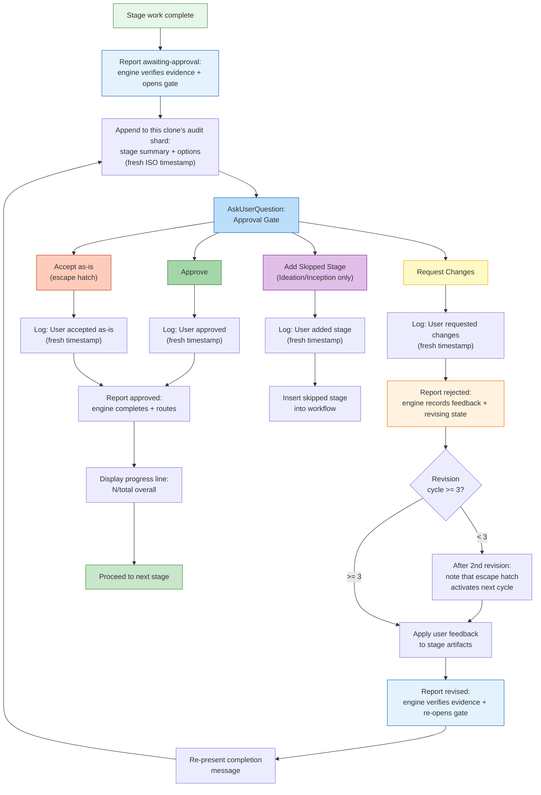

# Stage Protocol リファレンス

機械向けの `dist/claude/.claude/aidlc-common/protocols/stage-protocol.md` を、人間が
読める形に再構成したものである。すべての rule・条件・振る舞いを保ちつつ、開発者が消費
できるよう再編している。節への参照（例: 「Protocol Section 1」）は元のファイルに対応する。

> stage ファイルの *フォーマット*（YAML frontmatter、本文の規約）については
> [Stage Definition](15-stage-definition.md) を参照。この章はランタイムの実行時の
> 振る舞いを扱う。

> **パス規約。** intent スコープの成果物・状態・audit トレイルは、アクティブな
> intent の **record dir** の下に住む —
> `aidlc/spaces/<space>/intents/<YYMMDD>-<label>/`、以下では `<record>/` と書く。
> Reverse Engineering の出力は代わりに、space レベルのリポジトリごとのストア
> `aidlc/spaces/<active-space>/codekb/<repo>/` に住む。audit トレイルは単一ファイル
> ではなく、`<record>/audit/<host>-<clone>.md` にある clone ごとのシャードの
> ディレクトリである（読み手は glob してタイムスタンプでマージする）。

---

## プロトコルファイルの構造

stage protocol は 3 つのファイルに分割され、ワークフローのコンテキストに基づいて
conductor が条件付きでロードする:

| ファイル | 内容 | ロードされるとき |
|------|----------|-------------|
| `stage-protocol.md` | コアプロトコル: approval gate、完了メッセージ、質問フロー、状態追跡、agent persona のロード、depth ガイダンス、用語、コンテンツ検証、subagent の返却フォーマット、そして §13 Learnings Ritual | すべての stage（必須） |
| `stage-protocol-recovery.md` | エラーリカバリ + 変更のハンドリング | セッション再開時、または stage の途中で change イベントが検出されたとき |
| `stage-protocol-governance.md` | Phase 境界の検証（§13） | phase 境界（1.7->2.1, 2.8->3.1, 3.7->4.1）で |

### 条件付きロードのロジック（SKILL.md の Routing より）

conductor の Routing セクションがロードのルールを定義する:

- **`stage-protocol.md`**: すべての stage でロードする — コアの gate、質問フォーマット、
  状態追跡、完了メッセージ。
- **`stage-protocol-recovery.md`**: セッション再開時、または stage の途中で change
  イベントが検出されたときにロードする。これにより、通常の前進する stage では
  エラーリカバリと変更のハンドリングをコンテキストの外に保つ。
- **`stage-protocol-governance.md`**: phase 境界（1.7->2.1, 2.8->3.1, 3.7->4.1）で
  ロードし、Phase 境界の検証のトレーサビリティチェックを走らせる。これにより、
  governance のオーバーヘッドを必要な地点に限定する。

この分割は、通常の stage 実行中のコンテキストサイズを減らしつつ、recovery と governance
のルールが関連するときに利用可能であることを保証する。stage 中の訂正を永続的な Rule
として捕らえることは、別個の governance フローではなく、`stage-protocol.md`（すべての
stage でロードされる）の §13 Learnings Ritual が扱う。

---

## 概要

stage protocol は、AI-DLC ワークフローのすべての stage がどう実行されるかを統べる必須の
振る舞い契約である。5 つの phase（Initialization, Ideation, Inception, Construction,
Operation）にまたがる 32 個すべての stage が、例外なくこのプロトコルに従う。conductor
（`SKILL.md`）は stage の実行を agent persona に手渡す; プロトコルは phase と agent から
独立を保ち、任意の stage のドメイン固有の作業を包む構造的なルールを定義する。

プロトコルがカバーするもの: 承認 gate、完了メッセージ、質問フロー、状態追跡、agent
persona のロード、エラーリカバリ、変更のハンドリング、depth ガイダンス、コンテンツ検証、
subagent の返却フォーマット、§13 Learnings Ritual、そして phase 境界の検証。

### 重要なコンプライアンスチェックリスト

すべての stage の前と最中に、よく見落とされる次のステップを検証する:

状態遷移と audit の発行は、手書きの audit ブロックではなくツールが所有する。conductor は
前進を `aidlc-orchestrate.ts report --stage <slug>` を通じて報告する; engine は state tool
に委譲し、それが状態をアトミックに更新し、対になる audit イベントを新鮮なタイムスタンプで
発行する。

| # | チェック |
|---|-------|
| 1 | 承認 gate で `bun .claude/tools/aidlc-orchestrate.ts report --stage <slug> --result awaiting-approval` を呼ぶ。engine は状態を `[-]` から `[?]` AwaitingApproval に反転させ、`STAGE_AWAITING_APPROVAL` をアトミックに発行するので、プロンプトが開いている間 status は保留中の gate を表示する。（`STAGE_STARTED` / `[-]` 遷移は stage がアクティブになったときに発行済み。） |
| 2 | `AskUserQuestion` を呼ぶ前に、`bun .claude/tools/aidlc-log.ts decision` を通じて選択肢をログする（`audit/` シャードへの手書きではなく） |
| 3 | ユーザーが応答した後、`bun .claude/tools/aidlc-log.ts answer` を通じて正確な選択をログし、承認には `aidlc-orchestrate.ts report --stage <slug> --result approved --user-input "<exact choice>"` を、request-changes には `aidlc-orchestrate.ts report --stage <slug> --result rejected --user-input "<feedback>"` を使う。修正作業の後、gate を再提示する前に `--result revised` を報告する。 |
| 4 | ユーザー入力を決して要約しない — 正確な選択肢ラベルを log tool に渡す; 自動化された stage には `N/A -- [reason]` を使う |
| 5 | 1 インタラクションにつき 1 つの audit エントリ — log/state tool が単一イベントの発行を強制する; 複数のイベントを 1 回の呼び出しにマージしない |
| 6 | stage の終わりに、`aidlc-orchestrate.ts report --stage <slug> --result approved --user-input "<exact choice>"`（gate 付きの stage）または `report --stage <slug> --result completed`（Initialization）を呼ぶ。engine は `[?]`/`[-]` を `[x]` に反転させ、gate 付きなら `GATE_APPROVED` を発行し、state tool を通じて `STAGE_COMPLETED` をアトミックに発行する |
| 7 | 作業が始まる前に、前の stage タスクを `completed`、現在の stage タスクを `activeForm` 付きで `in_progress` にマークする（`sync-statusline` hook が状態の同期を扱う） |
| 8 | `knowledge/aidlc-shared/audit-format.md` のイベントタイプのみを使う — state と log tool がこれを強制する; `audit/` シャードに直接書き込まない |
| 9 | ライフサイクルイベントを手書きしたり、`aidlc-state.ts` でライフサイクルの動詞を呼び出したりしない。結果は `aidlc-orchestrate.ts` を通じて報告する; engine の内部の state 呼び出しがアトミックな audit 行を発行する |

---

## 承認 Gate

3 つの Initialization stage を除くすべての stage は、進む前に明示的なユーザー承認を要する。
承認は構造化された UI 選択肢を持つ `AskUserQuestion` を使う。

この gate は `aidlc-state.md` の `[?]` AwaitingApproval チェックボックス状態に対応する;
拒否は stage を `[R]` Revising に遷移させる。完全な stage 状態図と、正規の `GATE_APPROVED`
/ `GATE_REJECTED` / `STAGE_AWAITING_APPROVAL` の emitter については
[State Machine](12-state-machine.md) を参照。

*(Protocol Section 1)*

### 標準の 2 択 gate

既定の gate はちょうど 2 つの選択肢を提示する — **Approve**（完了とマークして進む）
または **Request Changes**（ユーザーがフィードバックを与え、stage が再実行され、gate が
再提示される）:

```
AskUserQuestion({
  questions: [{
    question: "[Stage Name] complete. How would you like to proceed?",
    header: "Approval",
    multiSelect: false,
    options: [
      { label: "Approve", description: "Continue to [next stage]" },
      { label: "Request Changes", description: "Provide revision feedback" }
    ]
  }]
})
```

`[next stage]` は run-stage directive の `next_stage` フィールド（次の in-scope stage の
表示名で、engine が発行時に計算する）から逐語的にレンダリングされるか、`next_stage` が
null のとき `Complete workflow` になる。conductor は次の stage を決して推測しない。

**No Emergent Behavior Rule:** Construction と Operation の stage（phase 3-4）は、常に
この 2 択フォーマットを使わねばならない。追加のナビゲーション選択肢を決して導入しては
ならない。

### 条件付きの第 3 選択肢

Ideation と Inception の stage（phase 1-2）は、以前 skip された stage を追加し戻せるとき、
条件付きで第 3 の選択肢を含めてよい:

```
{ label: "Add [Skipped Stage]", description: "Include [stage] which was skipped" }
```

これが phase 1-2 で第 3 選択肢が現れる唯一の状況である。ラベルは特定の skip された stage
を参照せねばならない。

### 修正の escape hatch

同じ stage で 3 回の「Request Changes」サイクルの後、4 回目以降の承認 gate は第 3 の
選択肢を追加する:

```
{ label: "Accept as-is", description: "Archive current version and move on" }
```

質問テキストはサイクル数を含むように変わる:
`"[Stage Name] -- this is revision cycle [N]. How would you like to proceed?"`

**「Accept as-is」が選択されたとき:** `audit/` シャードにログし（"User accepted stage
output as-is after [N] revision cycles"）、完了とマークして進む。これは、閾値に達した
ときに限り、Construction stage の No Emergent Behavior Rule を上書きする。

**Pre-activation notice:** 2 回目のサイクルの後、次を含める: "After one more
revision, an 'Accept as-is' option will become available."

### 承認 gate のフロー



---

## 完了メッセージ

すべての stage は、この 5 部構成の構造で順に終わる。すべての部が必須である。

*(Protocol Section 2)*

### Part 0: Audit ロギング

完了メッセージを表示する前に:
1. `<record>/audit/`（clone ごとのシャード）に追記する: stage 名、作業サマリ、成果物
2. 承認の応答を受け取った後、ユーザーの選択を新鮮なタイムスタンプで追記する

### Part 1: アナウンス

```markdown
# [emoji] [Stage Name] Complete
```

emoji は各 stage ファイルが定義する。常に level-1 の見出しである。

### Part 2: サマリ

生成されたものの構造化された箇条書きサマリ:
- 事実に基づき、コンテンツに焦点を当てる — ワークフローの指示（"please review"）は無し
- 主要な成果物のインラインサマリテーブル（5-10 行）を含める:
  ```
  | Artifact | Contents |
  |----------|----------|
  | requirements.md | 6 FR groups (18 sub-requirements), 4 NFRs |
  | requirements-analysis-questions.md | 5 questions, all answered |
  ```
- **セッションで最初の完了**は次を含めねばならない:
  `**Project depth**: [Minimal/Standard/Comprehensive] -- depth adapts artifact detail. You can request different depth at any approval gate.`

### Part 3: レビュー + 承認

```markdown
**Review:** `<record>/[path to artifacts]`
```

続けて `AskUserQuestion` の承認 gate（承認 Gate のセクションを参照）。

### Part 4: 進捗アップデート

ユーザーが承認した後、進む前に表示する:

```
Progress: [N]/[total] overall | [phase-N]/[phase-total] [Phase] stages complete. Next: [Next Stage Name]
```

現在の phase の stage だけを数える。分子には completed と skipped を含める。
例: `Progress: 13/32 overall | 3/7 IDEATION stages complete. Next: Approval & Handoff`

---

## 質問フロー

stage が質問を通じてユーザー入力を集めるとき、プロトコルは、バッチングのルール、必須の
回答分析、曖昧さの検出を伴う tri-mode のインタラクションフローを定義する。

*(Protocol Section 3)*

### Tri-Mode システム

**Step 1: 質問ファイルを作成する** — 選択肢 A-E を持つ `[Answer]:` タグ形式で、適切な
`<record>/` ディレクトリに。すべての質問は `X. Other (please specify)` で終わらねばならない
— 例外なし。すべての `[Answer]:` タグは空白で始まる。複数選択の質問は質問テキストに
"(select all that apply)" を加える; 回答形式: `[Answer]: A, B, E`。

**Step 2: モード選択を提示する:**

```
AskUserQuestion({
  questions: [{
    question: "I've created [N] questions at `[file path]`. How would you like to answer them?",
    header: "Questions",
    multiSelect: false,
    options: [
      { label: "Guide me", description: "Walk through each question interactively here" },
      { label: "I'll edit the file", description: "I'll fill in the answers in the file directly" },
      { label: "Chat", description: "Discuss freely -- I'll extract decisions from our conversation" }
    ]
  }]
})
```

モード選択を `audit/` シャードにログする。ユーザーは stage の途中でモードを切り替えられる。

#### Guide Me（インタラクティブモード）

- `AskUserQuestion` を通じてバッチで提示する（呼び出しごとに最大 4 問、質問ごとに最大
  4 選択肢）
- 5 つ以上の選択肢を持つ質問: 複数の呼び出しに分割する（各 4 選択肢）。ユーザーはすべての
  選択肢を見なければならない。ファイルは完全な選択肢セットを保持する。
- 組み込みの "Other" が議論をトリガーする。最初のバッチの前にユーザーに伝える:
  "Select 'Other' on any question to discuss it before answering."
- 各バッチの後、即座に回答を質問ファイルに書く
- 各バッチを新鮮な ISO タイムスタンプでログする
- 統合された回答サマリを提示し、続けて **Looks correct** と **Request changes** の選択肢
  を持つ構造化された確認を行う。確認を裸の散文として求めてはならない。提示する前に、両方の
  選択肢と空白の `[Answer]:` を持つ専用の **Consolidated Summary Confirmation** エントリ
  を stage の質問ファイルに追記またはリセットする; それは human の応答からのみ埋める。
  変更の要求は、再プロンプトの前にその確認を空白にリセットする。

#### Edit File（セルフガイドモード）

- ユーザーに伝える: "Edit the file at `[file path]`. When done, send **done** or
  **ready** and I'll continue."
- 完了シグナルを待つ。シグナルされるまでファイルを読んだり進んだりしない。

#### Chat（フリーフォームモード）

- オープンエンドの会話; 決定が現れるにつれて抽出する
- 終了シグナル: "When ready to proceed, say **done** and I'll summarize."
- 抽出した回答を、値・タイムスタンプ・`**Mode:** chat` とともにファイルに書く
- 決定サマリを提示し、続けて進む前に同じ **Looks correct / Request changes** の構造化
  された確認を永続化して使う
- 適する用途: 探索的な stage、ブレインストーミング、議論を要する質問

**Step 4: 完全性を検証する。** ファイルを読み、すべての `[Answer]:` タグが埋まっている
ことを確認する。空白があれば、未回答を `AskUserQuestion` を通じて提示する。部分的な回答
で進んではならない。ファイルが権威ある記録である。

### バッチのルール

| 制約 | 上限 |
|-----------|-------|
| `AskUserQuestion` 呼び出しごとの質問数 | 最大 4 |
| 呼び出しごとの質問あたりの選択肢数 | 最大 4 |
| 5 つ以上の選択肢を持つ質問 | 複数の呼び出しに分割 |

### 回答の分析

回答を集めた後、すべての応答を分析する（必須）:
- **曖昧な回答**: "mix of"、"not sure"、"depends"、"probably"
- 回答間の **矛盾**
- 次のステップに必要な **欠けた詳細**

少しでも曖昧さが見つかれば、フォローアップの質問を作り、進む前に解決する。
**疑わしいときは訊く。**

### 曖昧さの検出

**無効/欠けた回答のハンドリング:**

| 条件 | アクション |
|-----------|--------|
| 空白またはアンダースコアのみの `[Answer]:` | 未回答をリストし、ユーザーに完成を求める |
| 選択肢（A-E, X）に合致せず、明確な自由記述でもない回答 | ユーザーに明確化を求める |
| 曖昧（"maybe B", "either A or C"） | ユーザーに単一の選択への確定を求める |

**矛盾の検出** — 完全な回答セットを次についてクロスチェックする:

| タイプ | 例 |
|------|---------|
| Scope の不一致 | "Keep it simple" + エンタープライズグレードの機能要求 |
| Risk の不一致 | "Security not a concern" + 機微なデータの取り扱い |
| 技術の衝突 | Offline-first + リアルタイムコラボレーション |
| タイムライン対 scope | MVP のタイムライン + フルフィーチャの scope |

検出したとき: 矛盾する回答を並べて提示し、衝突を説明し、的を絞ったフォローアップを訊く。
解決するまで進んではならない。

**過信の防止:**
- 仮定せず、訊くことを既定にする。曖昧さを抱えたまま決して進まない。
- フォローアップを要する危険信号: オープンエンドの質問への単語だけの回答;
  "whatever you think" / "up to you"; 矛盾するシグナル; 質問のはぐらかし
- ユーザーが AI に委ねるとき: "I want to make sure the design reflects YOUR
  priorities. Could you tell me [specific aspect]?"

### plan と質問ファイルの位置

ファイルは集中管理されず、stage の成果物と同じ場所に置かれる。例:
`<record>/inception/user-stories/user-stories-questions.md`。stage のすべての入力・質問・
出力は同じディレクトリに住む。

---

## 状態追跡

状態は複数のレベルで保守される: 状態ファイルの stage チェックボックス、サイドバーの
タスクステータス、audit エントリの ISO タイムスタンプ、そして構造化された audit ログ
エントリ。

*(Protocol Section 4)*

### チェックボックスの状態

| チェックボックス | 意味 |
|----------|---------|
| `[ ]` | 未開始 |
| `[-]` | 進行中（実行中、まだ未承認） |
| `[?]` | human の承認待ち |
| `[R]` | 拒否後に修正中 |
| `[x]` | 完了（ユーザーが承認済み） |
| `[S]` | 正当化された現在 stage の report またはナビゲーションによって skip された |

**Enforcement:** engine がこれらの状態をマークする; stage の散文や conductor はしない。
gate と終端の結果は `aidlc-orchestrate.ts` を通じて報告する。

**`[S]` の振る舞い:**
- `report --stage <current> --result skipped --reason "<reason>"`、scope の合成、または Stage/Phase Jump によって設定される
- statusline の進捗カウントから除外される（total にも done にも数えられない）
- engine が先へルートする間も保たれる; `STAGE_COMPLETED` と対にされることは決してない
- 再開時、タスク追跡上は completed として扱われる（タスクが作成され、即座に completed とマークされる）
- report された skip は明示的な現在 stage と空白でない reason を要する; 単一 stage の実行はそれを拒否する

### タスクステータスの遷移

任意の stage を始める前に、サイドバーのタスクを遷移させる:

1. 前の stage タスク `in_progress` -> `completed` にマークする
2. 現在の stage タスク -> `activeForm: "Running [Stage Name]"` 付きで `in_progress` にマークする

ルール: スピナーが表示されるにはタスクが `in_progress` でなければならない。stage ファイル
を読む前に更新する。32 個すべての stage に適用される。タスク ID を失った場合（compaction）、
`TaskList` を使って subject で見つける。skip された stage には:
`TaskUpdate({ taskId: [ID], status: "completed", description: "[original] -- Skipped: [reason]" })`

### plan レベルのチェックボックスの強制

2 レベルの追跡は同期を保たねばならない:
- **Plan レベル**: 個々の作業項目（各 user story、各 component）
- **State レベル**: `aidlc-state.md` における stage の完了

ステップが完了していれば、そのチェックボックスはチェックされる。チェックされていれば、
ステップは完了していなければならない。各ステップを完了した直後に更新する。

### タイムスタンプ

形式: `date -u +"%Y-%m-%dT%H:%M:%SZ"` による ISO 8601 UTC。Bash 経由で実行する。日付の
みは決して使わない。audit エントリごとに 1 回の Bash 呼び出し — タイムスタンプを決して
再利用しない。

### Audit ログのフォーマット

`<record>/audit/`（clone ごとのシャード）のルール: 常に追記する（決して上書きしない）;
"User Input" フィールドは完全かつ無修正でなければならない; プロンプトは表示する前にログ
する; 応答は受け取った後にログする; 欠けていれば `# AI-DLC Audit Log` ヘッダで作成する;
破損していればバックアップする; Edit が失敗したら 1 回リトライする（hook が Read と Edit の
間で修正することがある）。

#### 標準の会話イベント

```markdown
## [Stage Name]
**Timestamp**: [YYYY-MM-DDTHH:MM:SSZ]
**User Input**: "[Complete raw input -- never summarize]"
**AI Response**: "[Action taken]"
**Context**: [Stage, decision made]
---
```

#### Error ログ

```markdown
## Error: [Brief Description]
**Timestamp**: [ISO timestamp]
**Severity**: [Critical/High/Medium/Low]
**Type**: [Parse error/Missing artifact/State corruption/Validation failure]
**Description**: [What went wrong]
**Cause**: [Root cause or best assessment]
**Resolution**: [Action taken]
**Impact**: [Artifacts affected, stages delayed, data lost]
---
```

#### Recovery ログ

```markdown
## Recovery: [Brief Description]
**Timestamp**: [ISO timestamp]
**Issue**: [What triggered recovery]
**Recovery Steps**: [Numbered list of actions]
**Outcome**: [Successful/Partial/Failed -- current state after recovery]
**Artifacts Affected**: [Files created, restored, or rebuilt]
---
```

#### Change Request ログ

```markdown
## Change Request: [Brief Description]
**Timestamp**: [ISO timestamp]
**Request**: [User's exact change request -- complete raw input]
**Current State**: [Which stage, what exists, what would change]
**Impact Assessment**: [Stages affected, artifacts to regenerate, scope change]
**User Confirmation**: [User's approval response]
**Action Taken**: [What was done]
**Artifacts Affected**: [Files changed]
---
```

#### 質問インタラクションのログ

```markdown
## Questions: [Stage Name] -- [Mode choice / Batch N of M]
**Timestamp**: [ISO timestamp]
**User Input**: "[Exact user selection -- option labels as displayed]"
**AI Response**: "[Wrote answer to file / Presented next batch / Proceeded to analysis]"
**Context**: [Stage name, file path, question numbers covered]
---
```

### 会話イベントのロギングチェックリスト

`PostToolUse` hook はファイル書き込みを自動ログする。会話イベントは手動でログせねば
ならない（最もよく見落とされるステップ）。

**各承認 gate で:** (1) `AskUserQuestion` の前 — 選択肢を新鮮なタイムスタンプで追記
する。(2) 応答の後 — ユーザーの選択を新鮮なタイムスタンプで追記する。

**各質問インタラクションで:** 回答を受け取った後 — Q&A サマリを追記する。

---

## Agent Persona のロード

各 stage は lead と任意の support agent を指定する。persona は、広いコンテキストから stage
固有の成果物へと積み上がる 6 ステップの knowledge 順を通じてロードされる。

*(Protocol Section 5)*

### 6 ステップの Knowledge ロード順

完全なロード順は [Knowledge System](10-knowledge-system.md) を参照。

Step 1-3 は framework に同梱される。Step 4-5 は user が管理する。Step 6 はワークフロー
位置ごとに動的である。

### Inline Stage と Inline Mob Lead

1. stage 作業を行う前に、`directive.inline_context_paths` の **すべての** ファイルを読む。
   engine は正確な persona と既存の knowledge ファイルのパスを展開する: `inline` には
   lead + supports、`mob` には lead のみ（mob の supports は dispatch されるため）。
   agent 名だけではロードされたコンテキストにならない。
2. directive のパス順を保つ。これは 6 ステップの knowledge 順に従う。`inline` の
   support-agent エントリや `mob` の lead エントリを省略しない。
3. 実行中、ロードされたすべての観点を適用する。

### Subagent Stage

1. 名指された harness agent を dispatch する; その config が persona と knowledge をロード
   する。
2. コピーした persona や knowledge の散文ではなく、正確な rule パス、関連する先行成果物の
   パス、タスク指示を渡す。
3. stage のメタデータが名指す agent を選ぶ。

### Multi-Agent Stage（アンサンブルトポロジ）

conductor が support agent を *どう* 連れてくるかは `directive.mode` — stage の
コミュニケーショントポロジ — に従う: `inline` stage では support agent は conductor が
自身のコンテキストにロードする persona である（dispatch ではなく voice）; `subagent`
（hub-and-spoke）、`pipeline`（chain）、`mob`（bounded round としての mesh）では、各
support agent は実際に独立して dispatch される協力者である。全員が自分の作業を書く:
subagent/mob では各協力者が contribution ファイル（Contribution + Positions, §11）を
書き、それを lead が統合する — lead だけが `produces[]` 成果物を編集し、contribution
ファイルが engine がチェックする完了の証拠になる; pipeline では chain のリンクが成果物を
直接前進させ、最後のリンクがそれらを完成状態で残す。誰が何を見るかはトポロジごとに
異なる — spoke は相互にブラインドで、chain のリンクはすべての上流の作業を見て、mob の
異議者は 1 回の confirm-or-maintain ラウンドを得る一方、judgment-call の異議は stage の
途中で human に浮上する — が、どのトポロジでも conductor がすべての委譲を行う; agent が
subagent を spawn することは決してない。完全な契約は stage-protocol.md §5
"Multi-agent stages" を参照。

例: Feasibility は `aidlc-architect-agent`（lead）+ `aidlc-aws-platform-agent` +
`aidlc-compliance-agent` を使い、すべて inline である。mob のショーケースは
`user-stories` である: `aidlc-product-agent` が persona とストーリーをドラフトする;
design、developer、quality の協力者が相互にブラインドのままそのドラフトに対して貢献する;
その後 lead が gate の前に彼らの作業を統合し、`aidlc-product-lead-agent` がレビューする。
hub-and-spoke のショーケースは `practices-discovery` である: pipeline-deploy lead の
ドラフト、相互にブラインドな quality・developer・devsecops の貢献、human インタビュー、
その後 lead の統合。その gate は **Approve** / **Request Changes** を提供する; Approve の
後、conductor が stage を approved と報告する前に、`practices-promote` は affirmed
タイムスタンプと、現在の stage 試行からの `PRACTICES_AFFIRMED` audit レシートの両方を
コミットせねばならない。

### 11 個の Domain Agent

完全な 14 agent の陣容は、11 個の domain agent、2 個の review 専用 agent、そして
adaptive-workflows の composer から成る。stage の作業を lead し support する domain agent は:

aidlc-product-agent, aidlc-design-agent, aidlc-delivery-agent, aidlc-architect-agent,
aidlc-aws-platform-agent, aidlc-compliance-agent, aidlc-devsecops-agent, aidlc-developer-agent,
aidlc-quality-agent, aidlc-pipeline-deploy-agent, aidlc-operations-agent.

2 個の review 専用 agent は、stage の frontmatter が reviewer を名指すときに独立した
チェックを走らせる; [Reviewer の呼び出し](#reviewer-invocation) を参照。composer は、
domain の stage 作業を lead する代わりに、適応的な stage plan を提案し再形成する。完全な
[Agent Reference](agents/README.md) を参照。

---

## エラーリカバリ

*(Protocol Section 6)*

### Resume コンテキスト

セッション開始時に `aidlc-state.md` が存在するとき、conductor はそれを読んで、完了した
stage（`[x]`）、現在/次の stage、成果物の存在を判定し、その後、最後の未完了 stage からの
再開を申し出る。

### Phase 別の Resume コンテキストロード

| Phase/Stage グループ | ロードするコンテキスト |
|-------------------|----------------|
| **Initialization (0.1-0.3)** | Workspace のファイルシステム; `aidlc-state.md` |
| **Ideation (1.1-1.7)** | `<record>/ideation/` の成果物; guardrail |
| **Inception -- RE** | `aidlc/spaces/<active-space>/codekb/<repo>/` のリポジトリごとの RE 成果物; ideation の scope/feasibility |
| **Inception -- Practices Discovery** | lead のドラフトと既存の contribution ファイルを保つ; 欠けている quality/developer/devsecops の spoke だけを dispatch し、その後 human インタビューと lead の統合を続ける |
| **Inception -- Requirements** | リポジトリごとの `codekb/` 成果物（実行された場合）; requirements-analysis のドキュメント |
| **Inception -- Design** | 要件; user story; application-design のドキュメント |
| **Inception -- Delivery Planning** | すべての inception 成果物; 部分的なら delivery-planning |
| **Construction -- Code Gen** | 現在の unit の design 成果物、story design、受け入れ基準、先行コード |
| **Construction -- Build/Test** | 現在の unit のコード、テスト計画、受け入れ基準、build 設定 |
| **Construction -- CI/Infra** | インフラ設計; code generation の出力 |
| **Operation (4.1-4.7)** | Construction の出力; これまでの operation 成果物; 4.4+ には 4.1-4.3 からの deployment 出力 |

### 再実行の振る舞い

stage の再実行が必要な場合（承認後に変更が要求された）:
1. stage ファイルを再読する
2. 先行成果物をコンテキストとしてロードする
3. 前の成果物を上書きして再実行する
4. 新しい完了メッセージを提示する

### Compaction リカバリ

`PreCompact` hook は compaction の前に `aidlc-state.md` の構造を検証する（情報提供のみ、
ブロック不可）。最後に検証された状態（stage、タイムスタンプ）を持つ `.aidlc-recovery.md`
のパンくずを書く。再開時、conductor はパンくずと状態ファイルを比較して compaction 関連の
破損を検出する。

### 破損した状態ファイルのリカバリ

`aidlc-state.md` は存在するがパースできない場合:
1. `aidlc-state.md.bak` にバックアップする
2. 実際の完了を判定するため `<record>/` を成果物についてスキャンする:
   - RE 分析ファイル -> RE stage 完了
   - 要件ドキュメント -> requirements 完了
   - Design ドキュメント -> design 完了
   - story design に合致するコード -> code gen 完了
3. 成果物の証拠から状態を再構築する
4. 「Current Status」を証拠を欠く最初の stage に設定する
5. ユーザーに知らせる: "State file was corrupted. Rebuilt from artifacts. Please verify."

### 欠けた成果物のリカバリ

stage がディスク上に存在しない成果物を参照する場合:
1. 欠けた成果物をリストする
2. 生成する stage が完了とマークされているか確認する
3. 完了しているが欠けている場合: ユーザーに知らせ、再実行または手動での提供を申し出る
4. 完了していない場合: stage を通常どおり走らせる

### 矛盾する入力のリカバリ

異なる stage からの user 入力が矛盾する場合:
1. 両方のソースからの引用とともに、具体的な矛盾をフラグする
2. 1 つの解釈を選ぶことで解決しない
3. どちらが優先されるかを訊く
4. 上書きされる成果物を更新する
5. 解決を `audit/` シャードにログする

### Severity レベル

| Severity | 説明 | 例 | アクション |
|----------|-------------|----------|--------|
| **Critical** | 継続不可 | 破損した状態、欠けた重要成果物、回復不能なパースエラー | 停止し、即座にユーザーに訊く |
| **High** | 出力が誤っている可能性 | 矛盾する入力、不完全な回答、欠けた依存 | 停止し、即座にユーザーに訊く |
| **Medium** | 品質低下 | 曖昧な応答、部分的なコンテキスト、曖昧な要件 | 解決を試みる; 未解決なら、ユーザーに訊く |
| **Low** | 見た目のみ | フォーマット、命名、スタイルの問題 | 静かに処理し、`audit/` シャードにログする |

---

## 変更のハンドリング

ワークフロー途中の変更の 5 つのカテゴリ。それぞれ異なるハンドリングを持つ。

*(Protocol Section 7)*

### マイナーな変更

現在の stage だけに影響する。変更を成果物に適用し、完了メッセージを再提示する。
ロールバックは不要。

### メジャーな変更

先行する stage に影響する:
1. 影響を受ける先行 stage を特定する
2. `AskUserQuestion` を通じて影響分析を提示する
3. 承認されたら、影響を受ける stage を順に再実行する
4. orchestrator の directive と report を通じてそれらに再突入して完了させる; ライフ
   サイクルのチェックボックスを直接編集しない

### Scope の変更

新しい要件、または scope レベルの変更:
1. `audit/` シャードに記録する
2. Requirements Analysis (2.3) または Delivery Planning (2.8) に戻る
3. その地点から再計画する
4. 変更が stage の選択に影響する場合（例: `poc` -> `feature`）、engine が plan をアトミック
   に更新するよう scope/recompose コマンドを使う

### Unit の変更

| 変更 | 手順 |
|--------|-----------|
| **Add** | plan に追加し、story design を作成し、build 順に差し込む。完了した unit を再実行しない。 |
| **Remove** | skip とマークし、成果物をアーカイブする。依存を確認する — 依存先への影響をフラグする。 |
| **Split** | 元をアーカイブし、2 つのエントリを作り、ストーリーを分配し、それぞれに story design を走らせる。 |

### アーキテクチャの変更

アプリケーションアーキテクチャに影響する（DB の切り替え、デプロイメントモデル、大きな
統合）:
1. scope を特定する: 影響を受ける design 成果物、story design、生成されたコード
2. 完全な影響分析を提示する
3. 承認されたら、App Design stage に戻り、そこから再実行する
4. 影響を受ける unit のすべての下流成果物を再生成する
5. 影響を受けない unit を保つ

### 変更前のアーカイブ

成果物を上書きする大きな変更の前に:
1. 必要なら `<record>/archive/` を作成する
2. 影響を受ける成果物を `<record>/archive/[ISO-date]-[stage-name]/` にコピーする
3. 進む。先行する作業が永続的に失われることはない。

---

## Depth ガイダンス

必要な詳細をちょうど作る — 多すぎず、少なすぎず。depth は scope と問題の複雑さに適応する。

*(Protocol Section 8)*

### Scope から Depth へのマッピングとテスト戦略の既定値

| Scope | 既定の Depth | テスト戦略 | 典型的な stage 数 | 備考 |
|-------|--------------|---------------|---------------:|-------|
| enterprise | Comprehensive | Comprehensive | 32 | 全 stage |
| feature | Standard | Standard | 32 | 全 stage |
| mvp | Standard | Standard | 22 | Operation を全 skip |
| poc | Minimal | Minimal | ~8 | Initialization + Ideation + コアの Inception |
| bugfix | Minimal | Minimal | ~8 | 対象を絞る |
| refactor | Minimal | Minimal | 8 | 対象を絞る |
| infra | Standard | Standard | ~13 | インフラ中心 |
| security-patch | Minimal | Minimal | ~10 | セキュリティ中心 |
| workshop | Standard | **Minimal** | 25 | 学習のための Standard depth; ペースのための Nyquist テスト |

user はどの承認 gate でも depth やテスト戦略を上書きできる。

### 3 つの Depth レベル

**Minimal**（poc, bugfix, refactor, security-patch）— 最小限の成果物、簡潔な分析、任意の
stage を skip:
- Requirements: 5-10 項目、簡潔な説明、最小限の NFR
- App Design: 単一の component 図、基本的なデータモデル、ADR なし
- Functional Design: 簡潔なビジネスルール、単純な entity、`frontend-components.md` を
  skip

**Standard**（feature, mvp, infra）— 中程度の詳細での完全な成果物:
- Requirements: 受け入れ基準付きで 15-30、中程度の NFR
- App Design: インタラクションを伴う component 図、関係、2-3 個の ADR
- Functional Design: 詳細なビジネスロジック、包括的なルール、entity のライフサイクル

**Comprehensive**（enterprise）— 深い分析、全 stage を実行:
- Requirements: 30 以上、詳細な基準、全カテゴリにわたる包括的な NFR
- App Design: 多層の図、詳細なデータフロー、統合シーケンス、代替案を伴う 5 個以上の ADR
- Functional Design: 決定木、状態機械、並行性、error recovery、unit 横断のパターン

---

## 用語集

*(Protocol Section 9)*

| 用語 | 定義 |
|------|-----------|
| **AI-DLC** | AI-Driven Development Life Cycle — このシステムが実装する方法論 |
| **Phase** | トップレベルのグルーピング: Initialization, Ideation, Inception, Construction, Operation |
| **Stage** | phase 内の個別のステップ（例: Intent Capture, Code Generation） |
| **Scope** | どの stage がどの depth で実行されるかを制御する（enterprise, feature, mvp, poc, bugfix, refactor, infra, security-patch, workshop） |
| **Depth** | 成果物の詳細度のスケール: Minimal, Standard, または Comprehensive |
| **Unit of Work** | 独立して実装可能な機能のパッケージ; Construction のイテレーション単位。stage 3.1-3.7 の 1 巡。 |
| **Service** | デプロイ可能なプロセスまたはコンテナ（API サーバー、worker、frontend アプリ） |
| **Module** | service 内のコードレベルの組織的境界（package、namespace） |
| **Component** | module 内の論理的な構成ブロック（class、関数グループ、UI component） |
| **Planning** | markdown 成果物を生成する stage（分析、質問、design） |
| **Generation** | 実行可能なコードを生成する stage（Code Generation, Build and Test） |
| **Artifact** | 決定・design・分析を記録する `<record>/` 内のバージョン管理された markdown ファイル |
| **Guardrail** | アクティブな space の memory 層（`aidlc/spaces/<active-space>/memory/`）に保存された、学習された振る舞いの rule |
| **Approval Gate** | user が承認または変更要求を行う構造化されたプロンプト |
| **Inline Stage** | orchestrator の会話で直接実行される stage |
| **Subagent Stage** | 実行を Claude Code の Task tool 呼び出しに委譲する stage |
| **Lead Agent** | stage の作業に責任を持つ主要な agent persona |

---

## コンテンツ検証

*(Protocol Section 10)*

### Mermaid のルール

Mermaid 図を書く前に:
1. 構文を検証する（バランスした波括弧、有効なノード/エッジ、エスケープされていない
   特殊文字が無いこと）
2. 参照されるすべてのノードが宣言されていることを保証する
3. テキストのフォールバックを含める: `<!-- Text fallback: [description] -->`

### 作成前チェックリスト

成果物を作成する前に:
- 参照されるすべての entity が先行成果物に存在する
- 既存の成果物との命名衝突が無い
- ファイルパスが stage の規約に合致する

### ASCII 図の規格

基本的な ASCII のみを使う: `+` `-` `|` `^` `v` `<` `>` `/` `\` に加えて英数字とスペース。
禁止: Unicode の罫線素片（U+2500-U+257F）。文字幅のルール: box 内のすべての行は等しい
文字数を持たねばならない。

リファレンスパターン:
```
+------------------+       +---------------------------+
| Component Name   |       | Outer                     |
+------------------+       |  +-----+  +-----+        |
                           |  | A   |  | B   |        |
[Source] -----> [Target]   |  +-----+  +-----+        |
[Source] <----> [Target]   +---------------------------+
```

### 文字のエスケープ

| 文字 | ルール |
|-----------|------|
| Pipe (`\|`) | テーブルセル内でエスケープする |
| 山括弧 | HTML タグでないときエスケープする |
| Code fence | 言語識別子付きのトリプルバッククォート |
| Mermaid ラベル | 特殊文字をクォートで囲む |

---

## Subagent の返却サマリ

subagent が完了するとき、コンテキストが失われないことを保証するため、構造化されたサマリ
を conductor に返さねばならない。

*(Protocol Section 11)*

### 必須フォーマット

```markdown
## Subagent Summary: [Stage Name]
### Produced
- [file path]: [brief description]
### Key Decisions
- [Decision]: [rationale]
### Issues / Concerns
- [Problems, edge cases, risks] or "None"
### Next Steps
- [What orchestrator should do next]
```

**Conductor のルール:** 進む前にサマリを読まねばならない。空でない Issues/Concerns は
ユーザーに提示せねばならない。期待より少ないファイル数は、完了とマークする前に調査を
要する。

### Context バジェット

| ルール | 詳細 |
|------|--------|
| 現在の unit のみ | 現在の unit の design 成果物だけを渡す |
| inception を要約する | inception 成果物ごとにパス付きで 1-2 行のサマリ; 必要なら subagent が Read する |
| 常に含める | 具体的なタスク指示と関連する state/成果物のパス; harness agent の config が persona と knowledge をロードする |
| 大きな knowledge セット | 特に関連するファイルパスを名指す; persona や knowledge の散文をプロンプトに貼り付けない |

### 失敗リカバリ

1. 縮小したコンテキストで **1 回リトライする**（inception を要約、現在の unit のみ）
2. リトライが失敗したら、ユーザーに申し出る: "Run inline"（orchestrator で実行）または
   "Skip and revisit"（未完了とマークして継続）
3. Error ログ形式を使って失敗を `audit/` シャードにログする

---

## Reviewer の呼び出し

`run-stage` directive が非 null の `reviewer` フィールドを運ぶとき、conductor は stage 本体
が成果物を生成した後、§13 Learnings Ritual と承認 gate の前に、その reviewer を **別個の
sub-agent** として呼び出す。stage の儀式のシーケンスの全体: questions → artifact →
reviewer（宣言されていれば）→ learnings → gate。

*(Protocol Section 12a)*

1. **Invoke.** `directive.reviewer` で名指された agent に委譲し、stage 定義のパス、Q&A
   ファイル、生成された成果物のパス、および frontmatter の任意の検証ツールを渡す —
   builder の `memory.md` や plan は決して渡さず、reviewer が独立した判断を形成するように
   する。
2. **Review.** レビューは adversarial review 契約の下で走る: reviewer は成果物を確認する
   のではなく反証しようと試み、存在する場合は機械チェック可能な証拠に findings を根拠づける
   （READY は既定ではなく、到達し損ねる評決である）。reviewer は定義・Q&A・成果物を読み、
   リストされた任意の検証ツールを走らせ、**READY** または **NOT-READY** の評決とともに
   `## Review` セクションを主要な成果物に追記する。
3. **Verdict.** READY → learnings の儀式、続けて gate へ進む。イテレーションが
   `reviewer_max_iterations`（既定 2）を下回って残っている NOT-READY → lead agent が
   findings に対処するため再実行し、reviewer が再チェックする。イテレーションを使い果たした
   NOT-READY → 未解決の findings を書き留めたうえで gate へ進む。

reviewer は決してブロックしない — human は常に gate で最終決定権を持つ — し、`reviewer`
フィールドの無い stage では発火しない。[Stage Definition](15-stage-definition.md) の
`reviewer` / `reviewer_max_iterations` frontmatter フィールドを参照。

---

## Learnings Ritual

human が agent の振る舞いを訂正するとき、その訂正は次のワークフローのための永続的な rule
（guardrail）になり得る。v0.5.0 はこれを、別個の guardrail 発行フローではなく、
tool-as-actor の Learnings Ritual を通じて扱う。

*(Protocol Section 13)*

この儀式は、完了メッセージと承認 gate の間で、gate 付きのすべての stage で走る:

1. **Diary**: agent は作業しながら stage ごとの `memory.md`（Interpretations / Deviations
   / Tradeoffs / Open questions）を保守する。
2. **Surface**: `aidlc-learnings.ts surface --slug <slug>` が diary を読み、構造化された
   候補を発行する — LLM は再パースや分類をしない。
3. **Confirm**: conductor が候補をレンダリングする; user はどれを保持するかを選び、自由
   記述の追加については、宛先を導く見出しを選ぶ。常に存在する "Anything to add?" チャネル
   は少なくとも `Nothing to add` と `Add a note` をレンダリングする; 1 選択肢の構造化質問
   は Claude Code と Codex では無効である。
4. **Admission check**: 保持された各 learning は `org.md` の合致するセクションに対して
   チェックされる; 矛盾は revise / skip / escalate へと浮上する。
5. **Persist**: `aidlc-learnings.ts persist` が確認された各 learning を practice として
   `aidlc/spaces/<active-space>/memory/{project,team}.md` に書き込む（そして sensor 束縛の
   learning については、manifest + stage の `sensors:` インポートを 1 つのロックされた
   トランザクションでインストールする）とともに、`RULE_LEARNED` / `SENSOR_PROPOSED` を
   発行する。

learnings は進行中の実行ではなく、**次の** ワークフローの compile で適用される。完全な
tool-as-actor プロトコルは `stage-protocol.md` §13 を、書かれた rule が供給される
strict-additive の解決については [Rule System](08-rule-system.md) を参照。

---

## Phase 境界の検証

各 phase の遷移で、トレーサビリティ検証が、完了した phase の出力が次の phase にとって
十分で一貫していることを保証する。

*(`stage-protocol-governance.md` の Section 13 — Learnings Ritual（`stage-protocol.md` の
Section 13）とは別)*

### トリガー

- 各 phase の最後の stage が承認された後
- 次の phase の最初の stage が始まる前
- `/aidlc --status` を通じてオンデマンドで

### プロセス

1. `.claude/knowledge/aidlc-shared/verification.md` から方法論を読む
2. phase 固有のトレーサビリティチェックを走らせる
3. 結果を `<record>/verification/[phase-boundary]-verification.md` に書く
4. 失敗した場合: 進む前に問題（欠けたリンク、孤立した成果物、不整合）を提示する
5. `PHASE_VERIFIED` を `audit/` シャードにログする

### Phase ごとのチェック

| 境界 | 検証内容 |
|----------|---------|
| **Ideation -> Inception** | intent がキャプチャされ、scope が定義され、feasibility が確認され、initiative が承認されている |
| **Inception -> Construction** | すべての要件が design に辿れ、unit が定義され、delivery plan が承認されている |
| **Construction -> Operation** | すべての unit がビルド/テストされ、CI pipeline が設定され、インフラが設計されている |

### トレーサビリティマトリクス

検証は辿れるチェーンを保証する:
```
Intent -> Scope -> Requirements -> Designs -> Units -> Code -> Tests -> Deployment
```

各境界で、左側のすべての成果物は右側に対応する成果物を持たねばならない。欠けたリンク、
孤立、不整合は user のレビューのためにフラグされる。

---

## Cross-References

- [Architecture](01-architecture.md) -- 5 層モデル、設計上の決定
- [Orchestrator](03-orchestrator.md) -- SKILL.md の deep-dive
- [Stages](04-stages/) -- phase ごとの stage ドキュメント
- [Agent System](05-agent-system.md) -- agent の構造、frontmatter
- [Hooks and Tools](06-hooks-and-tools.md) -- hook システム、audit イベント
- [Knowledge System](10-knowledge-system.md) -- ロード順、テンプレート
- [Diagrams](diagrams.md) -- すべての図を 1 箇所に
