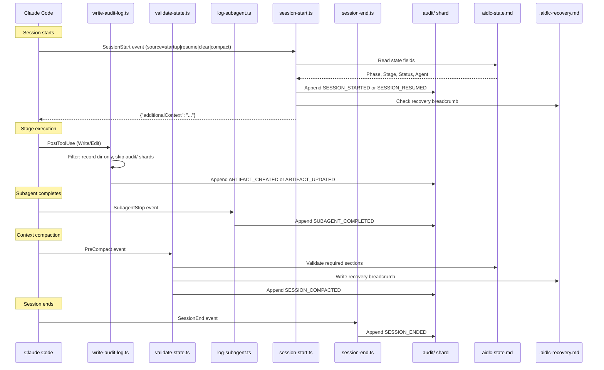

# Hooks and Tools

この章は、hook システムのアーキテクチャ、17 個すべての hook スクリプト、audit イベントの分類体系、CLI ツールの構成、そして決定論的なユーティリティツールを文書化する。

> **パス規約。** 状態・audit・成果物は、アクティブな intent の **record dir** の下に住む — `aidlc/spaces/<space>/intents/<YYMMDD>-<label>/`、以下では `<record>/` と書く（record dir が時系列でソートされるよう、コンパクトな UTC 日付プレフィックスと短い kebab-case ラベルを付す; 正規の id は `intents.json` レジストリ行の UUIDv7 である）。audit トレイルは単一ファイルではなく、`<record>/audit/` の下の clone ごとのシャードのディレクトリである。

---

## Hook システムのアーキテクチャ

この実装は `.claude/hooks/` にある 17 個の hook スクリプトを使う。17 個すべてが TypeScript である（`bun` で走る）。17 個すべてが **project-wide** である — `settings.json` に登録され（statusline はトップレベルの `statusLine` キーで、残る 16 個は `hooks` ブロックで）、どの skill がアクティブかに関わらず発火する。以前は分割されていた（6 個は skill スコープとして `aidlc/SKILL.md` frontmatter に宣言され、残りは project-wide だった）; v0.6.0 で skill スコープの 6 個を `settings.json` に移し、すべてのエントリポイント — orchestrator、各同梱の scope/stage runner、および手書きの顧客 runner — が runner ごとの `hooks:` ブロック無しで決定論的なスパインを継承するようにした。

17 個のうち 11 個は **非ブロッキング** である。6 個は **フロー変更** である: `Stop` hook はフォワーディングループを走らせ続け、deliver-stage-rules hook は harness が入力の書き換えをサポートする場合に厳密な active-stage の rule を subagent のブリーフに添付し、plan-approval guard は時期尚早な code-generation ディスパッチを拒否し、reviewer-scope hook は兄弟 unit の reviewer アクセスを拒否し、review-freeze hook は gate の前に fresh な READY レビュー receipt を無効化する produces[] 書き込みを拒否し、state-transition guard は `aidlc-orchestrate.ts report` を迂回する直接のライフサイクル呼び出しを拒否する。

```
.claude/hooks/
+-- record-human-turn.ts     # UserPromptSubmit + PostToolUse AskUserQuestion (project-wide, settings.json, TypeScript)
+-- deliver-stage-rules.ts    # PreToolUse Task|Agent (project-wide, settings.json, TypeScript, flow-altering)
+-- plan-approval-guard.ts # PreToolUse Task (project-wide, settings.json, TypeScript, flow-altering)
+-- state-transition-guard.ts # PreToolUse Bash (project-wide, settings.json, TypeScript, flow-altering)
+-- reviewer-scope.ts    # PreToolUse file/search/shell tools (project-wide, settings.json, TypeScript, flow-altering)
+-- review-freeze.ts     # PreToolUse file-write tools (project-wide, settings.json, TypeScript, flow-altering)
+-- write-audit-log.ts      # PostToolUse Write|Edit (project-wide, settings.json, TypeScript)
+-- run-sensors.ts       # PostToolUse Write|Edit (project-wide, settings.json, TypeScript)
+-- sync-workflow-state.ts   # PostToolUse TaskUpdate (project-wide, settings.json, TypeScript)
+-- rebuild-stage-graph.ts   # PostToolUse Bash (project-wide, settings.json, TypeScript)
+-- fold-usage.ts        # PreToolUse + PostToolUse (project-wide, settings.json, TypeScript, Claude-only producer)
+-- validate-state.ts    # PreCompact (project-wide, settings.json, TypeScript)
+-- log-subagent.ts      # SubagentStop (project-wide, settings.json, TypeScript)
+-- aidlc-continue-workflow.ts        # Stop (project-wide, settings.json, TypeScript, flow-altering)
+-- session-start.ts     # SessionStart (project-wide, settings.json, TypeScript)
+-- session-end.ts       # SessionEnd (project-wide, settings.json, TypeScript)
+-- aidlc-statusline.ts  # statusLine (project-wide, settings.json, TypeScript)
```

### Hook 一覧

| Hook | イベント | スコープ | Matcher | 目的 |
|------|-------|---------|---------|------|
| `record-human-turn.ts` | UserPromptSubmit + PostToolUse | Project-wide (settings.json) | (空) / `AskUserQuestion` | すべての本物の人間プロンプトと、応答されたすべての `AskUserQuestion` ウィジェットで `HUMAN_TURN` イベントを記録する（gate 承認やインタビュー回答はタイプされたプロンプトではなくウィジェットのクリックである）; 承認/インタビュー gate は台帳をチェックし、最後の gate 解決以降に 1 つを要求するので、autopilot 下のモデルは人間が行動していないのに承認を捏造できない |
| `deliver-stage-rules.ts` | PreToolUse | Project-wide (settings.json) | `Task\|Agent` | **フロー変更。** ディスパッチされた stage の実質的なアクティブ space の rule を解決し、その正確なバイトをすべての AI-DLC subagent ブリーフに追記する。Claude、Codex、opencode、Copilot の入力を書き換える; Kiro CLI はツール引数を書き換えられないため、不完全なブリーフは advisory の警告付きで進む（Kiro CLI agent は `resources` を通じてアクティブな memory ツリーをプリロードする; ロードできない必須 rule はそれでも repair guidance 付きでブロックする）。Kiro IDE はライブの memory-file 参照を持つ常時包含のワークスペース steering を使う。完全な bundle が既に存在する場合は idempotent である |
| `plan-approval-guard.ts` | PreToolUse | Project-wide (settings.json) | `Task` | **フロー変更。** code-generation の plan-before-generation の順序（stage ステップ 2-4）を決定論的に強制する: アクティブな directive（または Current Stage フォールバック）が code-generation である間、`aidlc-developer-agent` を対象とする Task ディスパッチは拒否される（exit 2 + リダイレクトする stderr の理由）、ただしその 1 つの明示的な `AIDLC-UNIT: <unit>` マーカーが、ディスク上に空でない `code-generation-plan.md` を持ち、かつ明示的な「Approve Plan」応答を記録する Plan Approval 質問を持つ既知の unit を識別する場合を除く。各拒否は `PLAN_APPROVAL_BLOCKED` を発する; 欠落・矛盾・未知のマーカーは、プロンプトの散文から推測するのではなくブロックする。`AIDLC_DISABLE_PLAN_APPROVAL_GUARD=1` は強制を無効化する |
| `state-transition-guard.ts` | PreToolUse | Project-wide (settings.json) | `Bash` | **フロー変更。** 直接の `aidlc-state.ts` ライフサイクル動詞を拒否し、conductor を `aidlc-orchestrate.ts report` へリダイレクトする; harness が delegated-agent の identity を供給する場合、reviewer とサポート agent からのライフサイクル/ルーティングコマンドも拒否する; 読み取り専用の状態と通常の build/validation コマンドは利用可能なまま残る |
| `reviewer-scope.ts` | PreToolUse | Project-wide (settings.json) | `Read\|Edit\|Write\|Glob\|Grep\|Bash` | **フロー変更。** unit ごとの reviewer 読み取りスコープ境界（stage-protocol §12a）を決定論的に強制する: conductor の reviewer ディスパッチ記録（`<record>/.aidlc-reviewer-dispatch.json`）が新鮮な間、ディスパッチされた reviewer のツール呼び出しのうち兄弟 unit の `construction/` パスに手を伸ばすもの — ファイル読み書きと兄弟にまたがる grep/glob/shell パターン — は拒否される（exit 2 + リダイレクトする stderr の理由）、ただし対象が記録の免除リストにある場合を除く。各拒否は `REVIEWER_SCOPE_BLOCKED` を発する。あらゆる曖昧さで fail-open する; `AIDLC_DISABLE_REVIEWER_SCOPE_HOOK=1` は強制を無効化する |
| `review-freeze.ts` | PreToolUse | Project-wide (settings.json) | `Read\|Edit\|Write\|Glob\|Grep\|Bash`（自身をミューテーション可能な呼び出しへ絞り込む） | **フロー変更。** §12a の終端 receipt 順序を決定論的に強制する: reviewer を持つ、まだ完了していない stage の宣言済み `produces[]` 成果物を対象とする Write/Edit またはシェルのミューテーションは、fresh な READY レビュー receipt がそれをカバーしている間、拒否される（exit 2 + リダイレクトする stderr の理由）。シェルの書き込みは Write/Edit の audit フィードを通らず、変更されたバイトの上に古い receipt を残してしまうため、実行前に検査される。engine の正確な receipt スキャン（`aidlc-lib.ts` の `freshReviewReceipts`）を共有するので、記録された gate の reject、jump、ワークフローの再起動は自動的に freeze を解除し、NOT-READY の評決は決して freeze しない。各拒否は `REVIEW_FREEZE_BLOCKED` を発する。あらゆる曖昧さで fail-open する; `AIDLC_DISABLE_REVIEW_FREEZE_HOOK=1` は強制を無効化する |
| `write-audit-log.ts` | PostToolUse | Project-wide (settings.json) | `Write\|Edit` | 成果物の書き込みを `audit/` シャードに自動ログする |
| `run-sensors.ts` | PostToolUse | Project-wide (settings.json) | `Write\|Edit` | 合致する書き込みで、アクティブな directive stage の解決済み Sensor を発火する（advisory; 決してブロックしない）; state に束縛された intent ごとのマーカーが、unit-major の実行が `Current Stage` より先行するときも帰属を保つ |
| `sync-workflow-state.ts` | PostToolUse | Project-wide (settings.json) | `TaskUpdate` | stage タスクのアクティベーション時に状態ファイルを自動同期する |
| `rebuild-stage-graph.ts` | PostToolUse | Project-wide (settings.json) | `Bash` | 成功した `intent-create` をそのツールイベントの正確なホストセッション ID に束縛する; セッションが既に別の intent を所有している場合、一度きりの fresh-session ハンドオフ receipt を書く; その後 transition クラスの audit 発行時に `runtime-graph.json` を再コンパイルする |
| `fold-usage.ts` | PreToolUse + PostToolUse | Project-wide (settings.json) | (空) | **Claude 専用。** トランスクリプトの新しい token 使用量を、llm 呼び出しごとに永続的な使用量台帳へ折り込む: PreToolUse は完了しつつあるメインの呼び出しを封じ、engine の境界の前には完了したすべての subagent 呼び出しも封じるので、ライフサイクルの roll-up が最新のまま保たれる; PostToolUse は通常のホールドバックのフォールバックを供給する。観察のみで決してブロックしない。Claude-Code のトランスクリプトリーダーは Claude harness にのみ結線されるので、Kiro/Codex/opencode では producer が走らず台帳は空のままになる（すべての使用量コンシューマは no-data に劣化する）。`AIDLC_DISABLE_USAGE_TRACKING=1` はそれを無効化する。下の「Token 使用量とコスト追跡」を参照 |
| `validate-state.ts` | PreCompact | Project-wide (settings.json) | (空) | 状態ファイルを検証し、recovery ブレッドクラムを書く |
| `log-subagent.ts` | SubagentStop | Project-wide (settings.json) | (空) | subagent 完了イベントをログする |
| `aidlc-continue-workflow.ts` | Stop | Project-wide (settings.json) | (空) | **フロー変更。** ターン終了時にフォワーディングループを強制する: `aidlc-orchestrate next` を走らせ; `done` または `parked` では stop を許し、保留中の directive では stop をブロックして `reason` 経由で次の一手を注入し戻す。セッションの元の UUID と新たにアクティブな UUID が PostToolUse の receipt に合致するとき、`intent-create` 後の正確な一度きりの fresh-session ハンドオフも許す。次のときは stop を許す（human-wait 免除）: 現在の stage が承認待ち（`[?]`）、修正中（`[R]`）、またはアクティブな directive の正規もしくは unit ごとの `<slug>-questions.md` に未回答の質問がある、もしくは未解決のログされた `DECISION_RECORDED` がある `[-]` 進行中、あるいは会話的なターンも許される。ログされた決定と会話的な免除は自律 Construction 下では抑制される; 保留ファイルの免除は unit-major code-generation の必須 Plan Approval を除いて抑制される。再帰境界あり（no-progress カウンタ + `CLAUDE_CODE_STOP_HOOK_BLOCK_CAP` 下の `stop_hook_active`; 既定はインタラクティブ実行で 2、自律 Construction 下で 8）。AIDLC ワークフローの外では no-op |
| `session-start.ts` | SessionStart | Project-wide (settings.json) | (空) | セッション再開時にワークフローのコンテキストを注入する |
| `session-end.ts` | SessionEnd | Project-wide (settings.json) | (空) | 正常終了時に、その正確なセッションに記録された intent へ `SESSION_ENDED` を発する; UUID に束縛されたワークフローがセッション束縛を持たないとき、共有のアクティブカーソルを使う代わりに fail closed する |
| `aidlc-statusline.ts` | statusLine | Project-wide (settings.json) | -- | ターミナルにリアルタイムの進捗を表示する |

### 共通の性質

17 個の TypeScript hook すべて:

- TypeScript で書かれ、`bun` で走る
- 実行権限を必要としない — macOS、Linux、ネイティブ Windows PowerShell で同一に動く
- Claude Code から stdin で JSON を受け取る
- ネイティブの JSON パースを使う（`jq` 依存なし）
- 成功時またはスキップ時に code 0 で exit する（`Stop` hook はブロックするときも 0 で exit する — ブロックは stdout の `{"decision":"block"}` JSON オブジェクトで通知される; 4 つの PreToolUse 制御 hook は回復不能または再試行可能な拒否を exit 2 + stderr の理由で通知する）
- 複数のフォールバック手法で `$CLAUDE_PROJECT_DIR` を解決する
- ロックとユーティリティ関数を `lib.ts` から共有する

### Audit イベントフロー



---

## ワークフロースパインの hook

これら 6 個の hook（audit/sensor/statusline/rebuild-stage-graph/state-validation/subagent のスパイン）は `settings.json` に project-wide で登録される。常にオンだが、各々が **self-gate** する: アクティブなワークフローが無い（`aidlc-state.md` / アクティブな intent の `audit/` シャードが不在）とき早期 exit するので、audit ログと状態同期が非 AI-DLC セッションを散らかすことは決してない。v0.6.0 より前は `aidlc/SKILL.md` frontmatter に宣言されていた（skill スコープ）; `settings.json` への移行により、すべてのエントリポイント — orchestrator とすべての同梱または手書きの runner — が `hooks:` ブロックをコピーせずにスパインを継承する。

### PostToolUse: write-audit-log.ts

**ソース:** `.claude/hooks/aidlc-write-audit-log.ts`
**トリガー:** すべての `Write` または `Edit` Claude Code ツール呼び出しの後（matcher: `"Write|Edit"`）
**目的:** 成果物の書き込みを intent の `audit/` シャードに自動ログする

**処理ステップ:**

1. **プロジェクトディレクトリの解決:** `$CLAUDE_PROJECT_DIR` を、スクリプトパス導出と CWD 検出へのフォールバック付きで解決する。
2. **ヘルスハートビート:** UTC タイムスタンプを `.aidlc-hooks-health/write-audit-log.last` に書く。
3. **JSON パース:** stdin を読み、`tool_name` と `tool_input.file_path` を抽出する。
4. **パスフィルタリング:** intent の record dir 配下でないファイルをスキップする。`audit/` シャード自体をスキップする（再帰を避ける）。
5. **Audit ファイルガード:** アクティブな intent の `audit/` シャードが存在しなければ静かに exit する（フレームワークが作成する）。
6. **コンテキスト抽出:** record dir までのパスプレフィックスを剥ぎ、`/` を ` > ` に置換してブレッドクラムにする（例: `inception > requirements-analysis > requirements.md`）。
7. **アトミックロック:** システムの temp ディレクトリ（`os.tmpdir()`）で `mkdir` ベースのロックを 3 回リトライループ（100ms 遅延）で使う。ハッシュがプロジェクトごとにロックを隔離する。
8. **ログエントリ:** 正規の `ARTIFACT_CREATED`（純新規パスへの Write）または `ARTIFACT_UPDATED`（Edit、または既存を上書きする Write）イベントを `appendAuditEntry` 経由で追記する。フィールド: Timestamp、Event、Tool、File、Context。

### PostToolUse: sync-workflow-state.ts

**ソース:** `.claude/hooks/aidlc-sync-workflow-state.ts`
**トリガー:** すべての `TaskUpdate` 呼び出しの後（matcher: `"TaskUpdate"`）
**目的:** stage タスクが `in_progress` になったとき `aidlc-state.md` を自動同期する

**処理ステップ:**

1. **プロジェクトディレクトリの解決:** write-audit-log.ts と同じマルチフォールバックパターン。
2. **Status フィルタ:** `status` が `in_progress` のときだけ発火する。`completed`、`pending` などでは静かに exit する。
3. **activeForm フィルタ:** `activeForm` フィールドが無い、または `[slug]` サフィックスパターンが無ければ静かに exit する。
4. **状態ファイルガード:** `aidlc-state.md` が存在しなければ静かに exit する（init 前）。
5. **ヘルスハートビート:** `.aidlc-hooks-health/sync-workflow-state.last` に書く。
6. **状態同期:** `bun aidlc-utility.ts set-status --stage <slug>` を呼ぶ（通常は Phase、Stage、Agent、チェックボックスを更新する）。有効な interleaved unit-major directive では、永続的な first-stage カーソル、`In Progress`、チェックボックスを保ちながら、一時的な status フィールドとマーカーの digest を更新する。

**設計ノート:**
- Stage Jump タスク（`[slug]` 無し）と依存関係配線の TaskUpdate（activeForm 無し）は自然にフィルタで除かれる。
- hook は既存の `set-status` サブコマンドを呼ぶ — 新しいコードパスは不要。
- アクティベートされた slug が state に束縛されたアクティブ directive マーカーに合致するとき、`set-status` はその unit を保ったままそのマーカーの state digest を更新する。interleaved な unit-major directive では、`Current Stage`、`In Progress`、そして永続的なカーソルのチェックボックスも変更しないままにするので、completed-grid の gate cascade はなおブロックの最初の stage で始まる。

### PostToolUse: run-sensors.ts

**ソース:** `.claude/hooks/aidlc-run-sensors.ts`
**トリガー:** すべての `Write` または `Edit` Claude Code ツール呼び出しの後(matcher: `"Write|Edit"`)
**目的:** 合致する書き込みで、アクティブな stage のコンパイル解決済み Sensor を発火する（advisory; 決してブロックしない）

**処理ステップ:**

1. **プロジェクトディレクトリの解決:** write-audit-log.ts と同じマルチフォールバックパターン。
2. **Audit + state ガード:** `audit/` シャードまたは `aidlc-state.md` が存在しなければ静かに exit する（init 前）。
3. **アクティブ stage の読み取り:** engine は、各最終的に検証された `run-stage` を、アクティブな intent の gitignore された `.aidlc-active-directive.json` にアトミックに記録し、正確な `aidlc-state.md` の SHA-256 に束縛する。Task のアクティベーションは、その slug がマーカーに合致するときだけ digest を更新し、unit ごとの directive の unit を保ちながら無関係な状態変更を拒否する。hook は digest が合致する間その stage を使い、それから `stage-graph.json` から `sensors_applicable` 配列を読む。これは、永続的なカーソルがより早い設計 stage に残っている間も、unit-major code-generation の診断を `code-generation` の下に保つ。孤立した `--single` directive はあらゆるメインワークフローのマーカーを置き換え、成功した `report --single` がそれをクリアする。欠落・不正・古い、または graph-unknown のマーカーは `Current Stage` にフォールバックする。
4. **ディスパッチ:** 適用可能な各 Sensor について、`aidlc-sensor.ts fire <id> --stage <slug> --output-path <path>` を spawn する。dispatcher は各 Sensor の `matches` glob を hook 側で適用する; 合致しない書き込みはスキップされる。結果は advisory である — hook は書き込みを決してブロックしない。
5. **ヘルスハートビート:** 発火時に `.aidlc-hooks-health/run-sensors.last` を書くので、doctor は健全なアイドル hook を静かな失敗と区別できる。

manifest スキーマと fire ライフサイクルは [Sensor System](07-sensor-system.md) を参照。

### PostToolUse: rebuild-stage-graph.ts

**ソース:** `.claude/hooks/aidlc-rebuild-stage-graph.ts`
**トリガー:** すべての `Bash` Claude Code ツール呼び出しの後（matcher: `"Bash"`）
**目的:** pre-workflow セッションを、そのシェル呼び出しによって born した intent に束縛し、transition クラスの audit イベントが今しがた着地したとき `runtime-graph.json` を再コンパイルする

**処理ステップ:**

1. **セッション束縛:** グラフフィルタの前に、PostToolUse イベントの正確な `session_id` を、成功した `intent-create` の結果の record と space とペアにする。その record を `intents.json` 経由で解決する; 束縛されていないセッションにスタンプするか、既存の所有権を保ちつつ、元の intent UUID と新たにアクティブな intent UUID を名指す短命なハンドオフ receipt を書く。
2. **コマンドフィルタ:** `bun .claude/tools/aidlc-(state|jump|bolt|utility).ts` の起動だけがグラフの早期 exit を通過する。`aidlc-runtime.ts` は明示的に拒否される（再帰ガード）。
3. **Audit 存在ガード:** init 前に清く exit する（まだ `audit/` シャードが無い）。
4. **ヘルスハートビート:** `.aidlc-hooks-health/rebuild-stage-graph.last` を書く。
5. **末尾読み取り:** マージされた `audit/` シャードを `\n---\n` で分割し、最後の 3 ブロックを取る（単一の `approve` 呼び出しが追記する上限）。
6. **イベントクラスフィルタ:** 最後の 3 ブロックのいずれかが `GATE_APPROVED`、`STAGE_STARTED`、`STAGE_AWAITING_APPROVAL`、`AUDIT_MERGED`、`WORKFLOW_COMPLETED` を運ぶときだけ再コンパイルする。合致無しでは exit する。
7. **ディスパッチ:** `bun aidlc-runtime.ts compile` を spawn する。非ゼロ exit では `--doctor` 用に hook ドロップを記録する; 親の Bash 呼び出しを決してブロックしない。

コンパイルライフサイクルとロックされたスキーマは [Runtime Graph](13-runtime-graph.md) を参照。

### PreCompact: validate-state.ts

**ソース:** `.claude/hooks/aidlc-validate-state.ts`
**トリガー:** Claude Code が会話コンテキストを compact する前（matcher: 空 = 常時）
**目的:** セクション存在チェック（情報提供のみ、compaction をブロックしない）と recovery ブレッドクラムの書き込み

**処理ステップ:**

1. **状態ファイルガード:** `aidlc-state.md` が存在しなければ清く exit する。
2. **セクション検証:** 2 つの必須セクションを `grep -q` でチェックする:
   - `## Stage Progress` -- 完了状況付きの全 stage のチェックリスト
   - `## Current Status` -- 現在の phase、stage、scope
   いずれかのセクションが欠けていれば WARNING を出力する（情報提供のみ -- compaction をブロックできない）。
3. **Recovery ブレッドクラム:** 現在の stage と検証タイムスタンプを含む `.aidlc-recovery.md` を書く。セッション再開時、フレームワークはこれを `aidlc-state.md` と比較して compaction 関連の状態破損を検出する。

**これがなぜ重要か:** コンテキスト compaction は会話履歴を捨てる。stage の途中で compaction が起きると、モデルは自分が何をしていたかの認識を失う。recovery ブレッドクラムは compaction を生き延びる外部のチェックポイントを提供する。

### SubagentStop: log-subagent.ts

**ソース:** `.claude/hooks/aidlc-log-subagent.ts`
**トリガー:** いずれかの subagent（Claude Code Task ツールの起動）が完了したとき（matcher: 空 = 常時）
**目的:** subagent 完了イベントを audit トレイルにログする

**処理ステップ:**

1. **プロジェクトディレクトリの解決:** write-audit-log.ts と同じマルチフォールバックパターン。
2. **ヘルスハートビート:** `.aidlc-hooks-health/log-subagent.last` に書く。
3. **JSON パース:** `agent_type`（既定 `"unknown"`）、`agent_id`、`last_assistant_message`（200 文字に切り詰め）を抽出する。
4. **Audit ファイルガード:** `audit/` シャードが存在しなければ静かに exit する。
5. **エントリ組み立て:** 正規の `SUBAGENT_COMPLETED` イベントを `appendAuditEntry` 経由で発する。フィールド: Timestamp、Event、Agent Type、任意で Agent ID と切り詰めた Message。
6. **アトミックロック:** write-audit-log.ts と同じ `mkdir` ベースのパターン（`lib.ts` で統一）だが、競合を避けるため別のロック名を使う。

**ディスパッチされたすべての agent で発火する:**
- Stage 2.1（Reverse Engineering、`mode: pipeline`）-- repo ごとに 2 回発火する: `aidlc-developer-agent` のコードスキャン、続けて `aidlc-architect-agent` の統合
- Stage 3.5（Code Generation、`mode: subagent`）-- `aidlc-developer-agent`（unit of work ごとに 1 回発火する）
- アンサンブル stage（`mode: mob`、またはサポート agent 付きの `subagent`）-- ディスパッチされた協働者ごとと lead ディスパッチごとに 1 回発火する（例: user-stories は 3 人の協働者それぞれに発火する）

Workspace 検出（0.2）はかつて subagent だった; 今は `aidlc-utility intent-create` の中で決定論的に走るので、この hook は初期化中にもはや発火しない。

---

### Stop: aidlc-continue-workflow.ts

**ソース:** `.claude/hooks/aidlc-continue-workflow.ts`
**トリガー:** conductor がターンを終えようとするとき（matcher: 空 = 常時、`/aidlc` がアクティブな間）
**目的:** インタラクティブなフォワーディングループを強制する — engine がワークフローを `done` と報告するまで走らせ続ける

これはフレームワークの 5 つのフロー変更 hook の 1 つであり、dispatch-rules・state-transition・reviewer-scope・review-freeze の 4 つの PreToolUse 制御と並ぶ。ターンの終了を止めるために `{"decision":"block"}` を返しうる; 他の 11 個の hook は観察して exit 0 する。gate 付きの会話的な経路では conductor（LLM）がループを保持する、なぜなら人間に質問できるのはそれだけだからである — だから engine を参照し忘れると、ワークフローは漂流する。この hook はその LLM の勤勉さへの依存を取り除く: ループは harness によって強制される。

**処理ステップ:**

1. **stdin のイディオム:** `log-subagent.ts` を鏡写す — TTY は Claude Code JSON が来ないことを意味する（test/debug）ので、stop を許す。さもなければ Stop-hook JSON を読み、そこから必要なのは `stop_hook_active` だけである。
2. **AIDLC の外では no-op:** プロジェクトディレクトリの下にアクティブな intent の `aidlc-state.md` が無ければ、強制すべきものは無い — stop を許す。frontmatter の `Stop` matcher は既に hook を `/aidlc` にスコープしている; これは非 AIDLC セッションが決してブロックされないための多層防御である。
3. **engine を compose する:** `bun .claude/tools/aidlc-orchestrate.ts next --project-dir <dir>` を走らせ、directive の `kind` をパースする。状態を再導出はしない — engine を compose する。
4. **`done` → 許す:** directive が `done` なら、ワークフローは完了である; hook は何も発せず exit 0 する（先例の非ブロッキングパターン）、そして再帰カウンタをクリアする。
5. **`parked` -> 許す:** directive が `parked` なら、ワークフローは後のセッションのために意図的にフロー途中で park された（`aidlc-orchestrate park`）; hook は stop を許してカウンタをクリアする、`done` とちょうど同じに。これはサポートされたマルチセッションの exit である: これが無いと、唯一の清い stop は `done` であり、長いワークフローの agent は残りの stage をラバースタンプしてしか到達できない（#367）。**Autonomy guard（#365）:** `parked` の許しは自律 Construction 下（`Construction Autonomy Mode: autonomous`）では抑制されるので、そこでの `parked` directive は cap 境界のブロックに落ち、ループは動き続ける。
6. **Human-wait -> 許す:** directive が保留中だが conductor が正しく人間で park している（または単に雑談している）なら、hook は stop を許し、nudge をスパムするのではなくドロップを記録する。5 つのケースが該当する: 現在の stage のチェックボックスが積極的に `[?]` 承認待ち、`[R]` 修正中、`[-]` 進行中 **かつ** その `<slug>-questions.md` に未回答の `[Answer]:` タグがある、`[-]` 進行中で、後に `QUESTION_ANSWERED` の無い current-stage の `DECISION_RECORDED` がある、または終了しつつあるターンが会話的だった。ログされた決定と会話的なターンは自律 Construction 下では抑制される; ファイルに基づく質問は unit-major code-generation の正確な必須 Plan Approval 質問を除いて抑制される。積極的確認のみ: 他のあらゆる状態、チェックボックス行無し、開いたファイル/ログされた質問無し、トランスクリプト無し / 人間プロンプト無し / 応答ターンでのエンジン呼び出しあり、またはパースエラーは、下のブロックに落ちる。下の「Human-wait 免除」を参照。
7. **Pending -> ブロックして注入:** 他のあらゆる（保留中の）directive - `run-stage`、`dispatch-subagent`、`invoke-swarm`、`present-gate`、`ask`、`print`、`error` - では `{"decision":"block","reason":<オンタスクの継続>}` を出力するので、同じセッションが次の一手を注入された状態で再開する。注入された `reason` は清い一時停止の代替として `aidlc-orchestrate park` も名指すので、長いワークフローを止めたい conductor は前進するのではなく park する。
8. **Fail open:** 予期しない失敗（読めない状態、非ゼロで exit するかパース可能な directive を返さない engine、不正な stdin）は stop を許し、ドロップを記録する。fail open は、さもなければターンを罠にかけうる hook にとって唯一安全な失敗モードである。

**セキュリティ性質 — `reason` はオンタスクの継続であり、決して override ではない。** 注入された `reason` は conductor がまだ負っている仕事（「フォワーディングループを走らせ、directive に基づき行動し、それから report する」）を名指し、何か新しいことや帯域外のことをする指示は決してしない。override の形をした directive は conductor 自身の安全訓練によって拒否される; その拒否がセキュリティ性質である。したがってバグのあるまたは侵害された engine は、認可された仕事を *継続* させることしかできない — セッションを乗っ取ってユーザーに反して行動させることはできない。

**再帰ガード — スタックしたブロックは決してセッションを罠にかけられない。** 永遠に再発火するブロックは、hook がターンを罠にかけうる唯一の道なので、再帰は 2 通りに、両方ネイティブに、境界づけられる:

- **`stop_hook_active`** — Claude Code は、現在の stop それ自体が先行する Stop-hook ブロックの産物であるとき、これを true に設定する。hook はこれを、既にブロックされたシーケンスの中にいるというシグナルとして読む。
- **no-progress カウンタ** - hook は `<record>/.aidlc-stop-hook/block-count.json`（intent の record dir の中）の下に小さな記録を、ワークフローの *進捗シグネチャ*（Current Stage slug + audit 末尾長）をキーに永続化する。ワークフローを前進させる `report` はそのシグネチャを変えるので、カウンタはリセットする - 健全なループは決してスロットルされない。連続するブロックでシグネチャが不変のとき（report が走らなかった）、カウンタは増える。no-progress の連続が上限 - `CLAUDE_CODE_STOP_HOOK_BLOCK_CAP`、その既定は **run-mode を認識する: インタラクティブ実行で 2、自律 Construction 下で 8**（インタラクティブは 2 なので、雑談中または一時停止中の人間は 1 回の nudge で解放される; 自律は 8 なので、解放する人間のいない無人ループは手放す前に完了まで走る） - に達すると、hook はターンを **解放** する（stop を許す）ので、スタックしたループは常に手放す。明示的な `CLAUDE_CODE_STOP_HOOK_BLOCK_CAP` は両方の既定を上書きする。

**Human-wait 免除 - インタラクティブな gate は罰されない。** conductor が人間を待っている（または単に会話的である）*から* ターンを終える 5 つのケースは、hook が決して nudge をスパムしないよう扱われる:

- **Esc は無料。** Stop hook はユーザーの割り込み（Esc）では発火しないので、手動の割り込みが罠にかかることは決してない — そのケースにコードは不要である。
- **承認 gate は無料ではない。** conductor が `AskUserQuestion` の回答を待つためにターンを終えるとき、Stop hook は *発火する*。承認 gate（現在の stage が `[?]` 承認待ち）または Request-Changes ループ（`[R]` 修正中）では、engine は依然として進行中の stage に対し保留中の `run-stage` を再発行するので、免除が無ければ hook はブロックし、cap が尽きるまでフォワーディングループの nudge を再注入する — インタラクティブな gate では混乱を招く。だから現在の stage のチェックボックスが積極的に `[?]`/`[R]` のとき、hook は stop を許す。これは **積極的確認のみで fail-open** である: より進んで解放するだけで、決してより多くブロックしない; チェックボックス行の欠落とあらゆるパースエラーは cap 境界のブロックに落ちるので、本物の stage 途中の中断はなお nudge される。
- **stage 途中の明確化質問も無料ではない。** そのような質問は stage を `[-]` 進行中で park する — 怠惰な中断と同じチェックボックス状態なので、`[-]` だけでは免除できない。しかし conductor は質問する前に空の `[Answer]:` タグを持つ `<slug>-questions.md` を作らねばならない（stage protocol §3）ので、未回答のタグは質問が保留中である積極的シグナルである。hook は正規の `<record>/<phase>/<slug>/` ディレクトリ、または unit ごとの Construction directive では `next` が名指す正確な `<record>/construction/<unit>/<slug>/` をチェックする; 別の unit からの古い質問は受理しない。現在の `[-]` stage の質問ファイルに未回答のタグがあるとき、hook は stop を許す。これは自律 Construction 下（`Construction Autonomy Mode: autonomous`）では **厳格にゲートされる**: unit-major code-generation の正確で可視な Plan Approval セクションで、空欄/アンダースコアのみの回答タグを持つものだけが stop を許される; 一般的な明確化質問は無人ループを走らせ続ける。他のあらゆる miss - ファイル無し、すべて回答済み、別の unit、または読み取り/パースエラー - は cap 境界のブロックに落ちるので、本物の stage 途中の中断はなお nudge される。（残余のケースへの即時緩和策: `CLAUDE_CODE_STOP_HOOK_BLOCK_CAP=1`。）
- **ログされた構造化された質問もまた human wait である。** 一部の gate ではないプロンプト、特に §13 の learnings 質問は、stage の質問ファイルに空欄タグを追加しない。それらの必須な audit のハンドシェイクが同等の積極的シグナルを供給する: `DECISION_RECORDED` が current-stage の質問を開き、`QUESTION_ANSWERED` がそれを閉じる。その決定が未解決のままで現在の stage が `[-]` である間、hook は stop を許すので、散文をレンダーする harness は次の人間のメッセージを待てる。解決済みまたは別 stage の決定は該当せず、自律 Construction はこの免除を抑制する。
- **会話的なターンも無料ではない。** アクティブなワークフロー中、ただ雑談したい（質問する、決定を議論する）人間はループに nudge し戻されるべきではない。hook は、直近の本物の人間プロンプトが **無し** のワークフローエンジン関与で応答された - conductor がそのプロンプト以降 `aidlc-orchestrate` も `aidlc-state` も走らせなかった - とき stop を許す。読み取り専用のクエリ（`--status`、`--doctor`、`--help`、`--version`）は関与に **数えない** ので、`--status` で応答された「今どの stage にいる？」はなお雑談として該当する。これは **厳格にゲートされ fail-closed** である: 自律 Construction 下では決して発火せず、欠落したまたは読めない証拠、人間プロンプトが見つからない、または応答ターンでのエンジン呼び出しは cap 境界のブロックに落ちるので、ワークフローに関与してからループ途中で中断した conductor はなお nudge される。それは常に許すだけ - 決してより多くはブロックできない。

  **1 つの述語、2 つの証拠源。** 質問はどの harness でも同一である; 異なるのは証拠だけである。

  | 証拠 | Harness | 「最後の人間プロンプト以降エンジン呼び出しゼロか?」にどう答えるか |
  |---|---|---|
  | Stop ペイロードの `transcript_path` | Claude Code、Codex | ターン履歴をパースし、各ツール呼び出しを `isEngineToolCall` で分類する。最も忠実度が高く、届く限りそれが優先される。 |
  | マーカーの mtime | Kiro IDE、Kiro CLI、opencode | `<record>/.aidlc-human-turn` を `<record>/.aidlc-engine-touch` と比較する。最後の engine の前進より **新しい** 人間のターンは、同じ質問のマーカーによる言い換えである — ただしそれはより **粗く** 答える; 下のカバレッジギャップを参照。 |

  これらの harness はターン履歴を hook に一切露出しない。opencode の `session.idle` はトランスクリプトを運ばず、Kiro の `Stop` ペイロードは `{session_id, hook_event_name, cwd}` だけを運ぶ — IDE 1.x でライブに捕捉: トランスクリプト無し、ターン id 無し。（より豊富な `{tool_name, tool_input, tool_response}` の形は *ツール* トリガーに属し、`Stop` には属さない。そして「v1」/「v2」は hook の **登録スキーマ** を名指し、ペイロードではない — [kiro-ide-hook-payload.md](kiro-ide-hook-payload.md) を参照。）だからフレームワークは、既に存在するシームでその 2 つの事実を自ら書く: `UserPromptSubmit` の mint は自身の `HUMAN_TURN` 台帳イベントと並んで `.aidlc-human-turn` にタッチし、`aidlc-orchestrate` はあらゆる前進する `next` / `report` / `park` で `.aidlc-engine-touch` にタッチする。マーカーが audit 台帳の読み取りより選ばれたのは、**`next` が読み取り専用で audit イベントを発しない** からである - 台帳のみの述語は、engine に相談してからループ途中で降りた conductor に対して盲目であり、それこそがフォワーディングループが捕まえるために存在する正確な失敗である。

  **カバレッジギャップ — マーカーの経路はトランスクリプトの経路より寛容である。** 2 つの述語は読み取り専用の免除では一致するが、すべてでは一致しない。`isEngineToolCall` は、非読み取り専用の `aidlc-jump` / `aidlc-bolt` / `aidlc-swarm` 呼び出しとミューテーションを行う `aidlc-state` 動詞（`approve`、`advance`、`skip`、`set`、…）のいずれも関与として数える。**これらのツールはどれも engine マーカーに触れない** — その唯一の書き手は `aidlc-orchestrate` の 3 つのサブコマンドである。だからトランスクリプトの無い harness では、`aidlc-jump` を走らせ（stage ポインタをミューテーションし、audit を発する）その後 engine に相談せずにターンを終える conductor は *会話的* として読まれ解放される、一方 Claude Code と Codex では同じターンがブロックされる。マーカーの経路が存在する前は、そのようなターンは nudge されていたので、これは Kiro と opencode における本物の — 狭いとはいえ — 緩和であり、単なる未実装の便宜ではない。これを閉じるには、4 つのツールすべてが横切るシーム（audit 発行の経路、または `writeStateFile`）からマーカーにタッチする必要があり、これはこの免除をはるかに超えて爆発半径を広げるので、閉じるのではなく文書化される。

  **セッションのスコープ。** 両方のマーカーは *intent* ごとであり、セッションキーを運ばない、一方トランスクリプトの述語は本質的にセッションごとだった。1 つの intent 上の 2 つの並行セッション（たとえば IDE ウィンドウと CLI 実行）は cross-talk しうる: セッション B のプロンプト mint がセッション A の関与した stop を会話的として読ませることがある。この窓は狭く、失敗モードは誤った transition ではなく解放された stop なので、今のところ受け入れられている; もし閉じる価値が出てきたら Kiro のペイロードは `session_id` を運ぶ。

  **鍵となる微妙な点:** Stop hook は engine 自体に相談する（`aidlc-orchestrate next` を走らせて仕事が保留中かを学ぶ）。そのプローブが engine マーカーに触れてしまうと、engine の mtime は常に人間の mtime より新しくなり、述語は永遠に false になる - 免除は実装されているように見えて何もしない。だから hook は自身の spawn に `AIDLC_STOP_HOOK_PROBE=1` を設定し、engine はそれを見るとタッチをスキップする。

  両方のマーカーは intent の record root の下、`.aidlc-stop-hook/block-count.json` の隣に住み、出荷される `aidlc/spaces/*/intents/*/.aidlc-*` の gitignore 規則でカバーされるので、どちらも決してコミットされない。両方の読み取りは **fail closed** である: マーカーが不在（アップグレード前のワークスペース、またはマーカーが出荷されて以降一度も前進していないワークフロー）は「証拠無し」として読まれ、「engine が一度も触れられていない」としては読まれないので、免除は推測するのではなく不活性のままである。書き込みが FAIL したマーカーは古いまま残すのではなく削除される — 古い *engine* マーカーは永続的な silent fail-open になる、人間のマーカーはそれを追い越し続けるからである。

  **免除が何を変えるかは、host がそのブロックに応じるかどうかで決まる。** `{decision: block}` の契約は Claude Code のものである; 他の各 host はそれを、自分の作法で消費するか、しない。

  | Host | ブロックに応じるか? | 免除の効果 |
  |---|---|---|
  | Claude Code、Codex | Yes — ネイティブな契約 | nudge が抑制される; ターンは清く終わる |
  | opencode | Yes — プラグイン自身がブロックをパースし、reason でセッションを再プロンプトする | nudge が抑制される |
  | Kiro IDE | **No。** IDE 1.x でプローブ hook を使ってライブに測定: コマンドは走ったが、stdout も stderr も agent に届かなかった。Kiro は `Stop` をブロック可能な集合の外に文書化し、stdout を `SessionStart` / `UserPromptSubmit` にのみ転送する | ユーザーに見えるものは無い。`continue-workflow.drops` と no-progress カウンタだけが補正される — nudge はそもそもここでは届けられていなかった |
  | Kiro CLI 2.16.0 legacy/V2 | **Yes — この harness のアダプタを通じてライブに測定。** host は `{"decision":"block","reason":"..."}` を消費し、`reason` を再注入し、誘発された継続の後にもう一度 `Stop` を発火する（合計 2 回の Stop 起動） | nudge が抑制される |
  | Kiro CLI 2.16.0 `--v3`/KAS | **Yes — その独立した `.kiro/hooks` 登録を通じてライブに測定。** host は同じブロックの形を消費し `reason` を再注入する; `Stop` は 1 回発火し、誘発された継続の後には再発火しなかった | nudge が抑制される |

  だから Kiro IDE では、この節で述べられる強制は hook ではなく conductor 自身の Stop プロトコルの上に立つ — これは `aidlc-continue-workflow.json` が常に宣言してきたことである。そこでの hook はループへの gate ではなく、フォワーディングループの audit として扱うこと。
> **run-sensors hook の advisory 契約との対比。** `aidlc-run-sensors.ts` は明示的な *never-block* 契約を運ぶ（決して `{decision: block}` を返さない、`t95` Case 7 で保証される）。それは *その hook の* advisory 契約であり、フレームワーク全体のブロック禁止ではない。`Stop` hook のループ強制のための `block` の使用は、別の、認可された契約である。

---

### PreToolUse: aidlc-deliver-stage-rules.ts

**ソース:** `.claude/hooks/aidlc-deliver-stage-rules.ts`
**トリガー:** AI-DLC subagent 呼び出しの前（Claude では `Task` または `Agent`; 他の harness ではアダプタの等価物）
**目的:** conductor からワーカーへの境界を越えて厳密な active-stage の rule を保持する

orchestration engine は既に、境界付きの `load-steering` チャンクを通じて conductor へ実質的な rule を届けている。この hook は次の境界を閉じる: 有効な明示的な stage-file パスをまず、次に状態ファイルの `Current Stage` を、最後に生きた stage が無いときの一意な slug 言及を、ディスパッチ stage の解決に使う。未知のパス形の参照は生きた stage のフォールバックを抑制しない。engine と同じアクティブ space の rule ロースターを読み、正確なファイル内容を digest マーク付きの bundle に追記する。その完全な生成ブロックだけが既に配送済みとみなされるので、marker の無いコピーや rule を言い換えた散文は注入を回避せず、再試行は idempotent のままである。composer を除くインストール済みの agent ロースターのすべてのエントリが、plugin 所有の agent を含めて参加する; ロースター外のターゲットは無変更で通過する。

Claude と Codex は `hookSpecificOutput.updatedInput` を消費する; opencode アダプタはその書き換えを `output.args` に適用する。hook は完全な応答をシリアライズしてから書き込み、過大な応答は repair guidance 付きで拒否するので、トランスポートの上限が切り詰められた JSON を生むことはない。Kiro CLI は subagent の引数を露出するが書き換えチャンネルを持たないので、そのアダプタは提案された書き換えを観察し、advisory の警告を出しつつディスパッチを許す; その agent-v1 の `resources` が memory ツリーをプリロードする。書き換え上限を超える有効な bundle もそのネイティブなプリロードを通じて進む一方、欠落・読み取り不能・無効な UTF-8 の必須 rule はそれでもブロックして repair guidance を出す。Kiro IDE は hook にツール引数を露出せず、この hook を登録しない; `.kiro/steering/aidlc-active-memory.md` は常時包含され、ライブファイル参照を使って conductor と委譲先エージェントの両方に向けてアクティブな memory ツリーをプリロードする。

---

### PreToolUse: aidlc-state-transition-guard.ts

**ソース:** `.claude/hooks/aidlc-state-transition-guard.ts`
**トリガー:** `Bash` ツール呼び出しの前
**目的:** ワークフローのライフサイクル変異を orchestration engine の背後に保つ

guard は直接の `aidlc-state.ts` ライフサイクル動詞を exit 2 と
リダイレクトする stderr の理由で拒否する。conductor は gate と完了の結果には
`aidlc-orchestrate.ts report`、park には `aidlc-orchestrate.ts park`、そして
ルーティングには `next`/jump フローを使う。読み取り専用の状態クエリと特殊な
recovery/構成の動詞は利用可能なまま残る。state CLI は独立に同じ所有権マーカーを
チェックし、シェルコマンドを pre-tool ペイロードで露出できない harness を
カバーする。

harness が突合された delegated-agent の identity を供給する場合、同じ guard は
reviewer、lead、サポート agent からの conductor 専用エントリポイントも拒否する:
orchestrator の `next`/`report`/`park`、`unpark` を含むミューテーションを行う
state 動詞、jump の実行、そしてワークフローのルーティング/構成のミューテーション。
delegated agent は成果物の作業、build、validation、そして読み取り専用の状態検査
のための通常のシェルアクセスは保つ; それらは結果をメインの conductor へ返し、
conductor だけがワークフローのライフサイクルと gate を所有する。

コマンド位置のパーサは、その境界を適用する前に、認識される実行ラッパー
（`command`、`exec`、`time`、`env`、`nice`、`nohup`）を、ネストしたラッパーも含め
再帰的に正規化する。リテラルな `eval` ペイロードは再帰的に検査され、単純で無害な
コマンドは利用可能なまま残る; シェル展開やエスケープ構文を含む `eval` ペイロードは、
hook が実行前に結果のコマンドを判定できないため拒否される。サポートされない
プラットフォーム固有のラッパーオプションと `env -S` の展開構文は同じ理由で
fail closed する。

---

### PreToolUse: aidlc-reviewer-scope.ts

**ソース:** `.claude/hooks/aidlc-reviewer-scope.ts`
**トリガー:** file/search/shell ツール呼び出しの前（`Read`、`NotebookRead`、`Edit`、`MultiEdit`、`Write`、`NotebookEdit`、`LS`、`Glob`、`Grep`、または `Bash`; matcher: `"Read|NotebookRead|Edit|MultiEdit|Write|NotebookEdit|LS|Glob|Grep|Bash"`）
**目的:** unit ごとの reviewer 読み取りスコープ境界（stage-protocol §12a）を決定論的に強制する

これはフレームワークの 5 つのフロー変更 hook の 1 つであり、4 つの `PreToolUse` 制御の 1 つである。§12a の散文の境界は、1 つの unit にディスパッチされた reviewer は兄弟 unit の `construction/<other-unit>/` の内容をどのツールでも読んではならないと言う — フィールドのトランスクリプトは、勤勉な reviewer が cross-unit glob（`construction/*/*/*.md`）を運ぶ再帰的な grep で散文を迂回し、unit ごとのレビューコストを unit 数に対して超線形に育てるのを示した。フレームワークのレイヤリング（決定論はツールと hook に属する）に従い、この hook は境界を自己強制させる。

**ディスパッチをどう学ぶか。** conductor は §12a ステップ 1（unit ごとの stage のみ）で `<record>/.aidlc-reviewer-dispatch.json` を書く — `{reviewer, stage, unit, exempt[]}`、ここで `exempt` は解決済みの `consumes` 契約パス、stage ファイル、Q&A ファイル、そして（現在の unit の設計が統合ポイントを明示的に名指すとき）その 1 つの所有する兄弟ファイルを運ぶ — そしてステップ 3 で判定が読まれるときそれを削除する。この記録が強制のウィンドウである; 6 時間より古い記録はクラッシュしたレビューからの孤児であり、無視され janitor される（compose-marker の陳腐化規律）。

**Identity。** Claude Code と Codex はアクティブな subagent の名前を hook ペイロードの `agent_type` として届ける（メインセッションの呼び出しでは不在）ので、hook は `agent_type` が記録の `reviewer` に等しいときだけ強制する。Kiro CLI は hook を 2 つの reviewer agent 自身の JSON 設定の中に登録するので、登録それ自体が identity である（adapter が `scoped_registration` を保証する）。Kiro IDE は登録を出荷しない: ツール入力はサポートされる世代をまたいで一様には利用できない（捕捉される PostToolUse の write / shell の入力は空。より新しい 1.x ビルドは一部の PreToolUse と委譲の入力を populate する - `kiro-ide-hook-payload.md` を参照）ので、フレームワークはそこで安定した pre-tool の identity/target 契約に依存できず、§12a の散文の境界がその harness で統べる。

**Decision。** matcher（`evaluateReviewerScope`、`t220` で固定されたエクスポートされた純関数）はパスフィールドとコマンド/パターンテキストを `construction/<seg>` トークンについて走査する: ディスパッチされた unit は通過し、ワイルドカードや裸の sweep ルートはブロックし、具体的な兄弟は、完全なトークンが免除エントリの `construction/` サフィックスに正確に合致しない限りブロックする。現在の unit の grep、共有の inception 契約、および validation ツールの実行は決して触られない。ブロックは `REVIEWER_SCOPE_BLOCKED` audit 行（Tool、Target、Stage、Unit）を発し、**exit 2 + リダイレクトする stderr の理由** で通知する — harness の PreToolUse reject 契約 — それはスコープを名指し、reviewer を通過した契約へ指し戻す。

**あらゆる箇所で fail-open。** 記録無し、古いまたは不正な記録、非 reviewer agent、未知のツール、不正な stdin、またはあらゆる内部エラーは呼び出しを許す; ディスパッチ記録の無い reviewer-agent の目撃は `--doctor` 用の advisory ドロップを記録する（conductor がステップ 1 の書き込みを忘れた）。決定論的なオフスイッチ `AIDLC_DISABLE_REVIEWER_SCOPE_HOOK=1` は強制を完全に無効化する。

---

### Plan-Approval Guard Hook

**ソース:** `.claude/hooks/aidlc-plan-approval-guard.ts`
**トリガー:** subagent ディスパッチの前（matcher: `"Task"`）
**目的:** Code Generation の plan-before-generation の順序（stage ステップ 2-4）を決定論的に強制する

これはフレームワークの 5 つのフロー変更 hook の 1 つであり、4 つの `PreToolUse` 制御の 1 つである。stage の散文は、人間が「Approve Plan」と答える前に generation が決して始まらないと言う - フィールドレポートは、conductor がコードを先に生成し、`code-summary.md` の隣に `code-generation-plan.md` を後から埋めて、plan を事後的な summary に変えてしまったのを示した。stage 完了の成果物 guard はその逆転を捉えられない（それは完了時に発火し、その時にはバックフィルされた plan が既に存在する）ので、この hook はディスパッチ自体を拒否する。

**Decision。** guard は、アクティブな state に束縛された directive が code-generation である（有効なマーカーが無ければ `Current Stage` にフォールバックする）、かつツール呼び出しが `subagent_type` が `aidlc-developer-agent` である `Task` ディスパッチであるときだけ動作する。これにより、永続的なカーソルが最初の設計 stage に残っている間も、unit-major の interleave の間 guard はアクティブなままである。ステップ 4 は、委譲プロンプトが `AIDLC-UNIT: <directive.unit>`（または現在の単一 iteration の unit）で始まることを要求する。guard はその正確なマーカーをワークフローの既知の unit（コンパイル済みの bolt DAG とディスク上の `construction/<unit>/` ディレクトリ）に対して解決し、その unit が、ディスク上の空でない `code-generation-plan.md` と、`code-generation-questions.md` の Plan Approval 質問への明示的な「Approve Plan」回答の両方を持つことを要求する。兄弟 unit への文脈的な言及は効果を持たない; 欠落・矛盾・未知のマーカーはブロックする。Plan Approval の識別子は、その質問番号と見出しを共有してよい(`Q1: Plan Approval` または `Question 1 - Plan Approval`)、または番号付き見出しの下の最初の質問テキスト行として現れてよい(`## Q1` の後に `Plan Approval`); 空欄タグ、「Request Changes」、無関係な回答済みの質問、そして HTML コメントやフェンスされたコード内の例は generation を認可しない。同じ証拠は自律 Construction 下でも必須であり、stage のあらゆる実行モードでのハードストップに合致する。この決定(`evaluatePlanApprovalDispatch`、`t265` で固定されたエクスポートされた純関数)は、欠落した証拠と、それを生成する stage のステップを名指す **exit 2 + リダイレクトする stderr の理由** でブロックし、`PLAN_APPROVAL_BLOCKED` audit 行(Tool、Target、Stage、Unit)を発する。

**ガードされたディスパッチの外では fail-open。** 状態ファイル無し、別の stage、別の agent やツール、不正な stdin、またはあらゆる内部エラーは呼び出しを許す。code-generation の developer ディスパッチが識別されると、欠落または曖昧な対象の証拠はブロックする。決定論的なオフスイッチ `AIDLC_DISABLE_PLAN_APPROVAL_GUARD=1` は強制を完全に無効化する。Kiro CLI では conductor agent がその `subagent` matcher に guard を登録する(adapter が crew スキーマを翻訳する); Codex では `spawn_agent` の PreToolUse シームに乗る; opencode ではプラグインが `task` ディスパッチの前にそれに相談する; Kiro IDE はこの境界を、他の guard と同様に散文のみとして文書化する。

---

### PreToolUse: aidlc-review-freeze.ts

**ソース:** `.claude/hooks/aidlc-review-freeze.ts`
**トリガー:** file-write とシェルのツール呼び出しの前（`Write`、`Edit`、`MultiEdit`、`NotebookEdit`、`Bash`; 共有の PreToolUse matcher グループに登録され、自身をミューテーション可能な呼び出しへ絞り込む）
**目的:** §12a の終端 receipt 順序を決定論的に強制する - READY レビュー receipt と gate の間の write-freeze

これはフレームワークの 5 つのフロー変更 hook の 1 つであり、4 つの `PreToolUse` 制御の 1 つである。各 `REVIEW_COMPLETED` 行は、宣言された成果物パスとバイトの SHA-256 フィンガープリントを記録する。完了の前提条件は、そのフィンガープリントがなお合致する間だけ receipt を受け入れる — どの harness やツールがファイルを変更したかに関わらず; 既存の audit-event の下限はなお早期の無効化シグナルとして残る。自律的な swarm の finalization もまた、あらゆる適用可能な必須成果物が Bolt worktree にファイルとして存在することを要求する（不在の任意出力は有効なフィンガープリントエントリのままである）。フィールドのトランスクリプトは散文が順序の競争に負けるのを示した: conductor が終端の receipt を記録した *後で* reviewer の提案を適用し、自分自身の receipt を無効化し、再レビューし、再編集し、gate で行き詰まるまで揺れ動いたライブセッションがあった。この hook は認識可能な書き込みをそれが起きる前に拒否する一方、コンテンツのフィンガープリントは harness に依存しない正しさの下限である。

**Decision。** 各書き込み対象について、hook は状態ファイルの中でまだ完了またはスキップされていない、reviewer を持つすべての stage に対してチェックする: パスは宣言された `produces[]`/`optional_produces[]` 成果物（engine 自身のサフィックスマッチャ `producesArtifactUnit`）に合致するか、そして fresh な READY receipt がそれを現在カバーしているか（`freshReviewReceipts` - engine の完了の前提条件が読む **同じ** スキャン、`aidlc-lib.ts` で共有され、freeze ウィンドウと拒否ウィンドウが分岐できないようにする）？ Freshness は audit の時系列と正確な現在の成果物フィンガープリントの両方を要求する。unit ごとの stage は、レビューされた unit の成果物だけを freeze する; 曖昧な unit ごとのパスは、いずれかの unit が READY receipt を持てば freeze する。NOT-READY の評決は決して freeze しない（修復ループは編集せねばならない）、そして記録された gate の reject、jump、ワークフローの再起動、audit された書き込み、またはコンテンツの不一致は receipt を無効化する。ブロックは `REVIEW_FREEZE_BLOCKED` audit 行（Tool、Target、Stage、任意で Unit）を発し、認可された経路を名指す **exit 2 + リダイレクトする stderr の理由** で通知する: gate を提示して提案をそこで引用するか、成果物を再オープンするために gate で reject する。

**シェルの書き込み。** engine の無効化スキャンを養う write-audit-log hook は Write/Edit の PostToolUse hook なので、シェルコマンドとして届いたファイルのミューテーションはさもなければ不可視であり、変更されたバイトをカバーする古い READY receipt を残してしまう。だから freeze は、Bash が実行される前に、一般的なミューテーションコマンドの出力リダイレクト対象とオペランドを抽出する。読み取り専用のシェル呼び出しは対象を生まず通過する。

**Identity: 無し。** reviewer-scope と異なり agent の関門は無い - conductor が提案を適用する、再ディスパッチされた lead、または迷い込んだ subagent など、誰が行うかに関わらず、あらゆる produces[] の書き込みは fresh な READY receipt を無効化する。

**あらゆる箇所で fail-open。** audit 台帳無し（あらゆる状態読み取りの前に決定される、非 AIDLC の一般的なケース）、読めない状態または stage グラフ、未知のツール、不正な stdin、またはあらゆる内部エラーは呼び出しを許す。決定論的なオフスイッチ `AIDLC_DISABLE_REVIEW_FREEZE_HOOK=1` は強制を完全に無効化する。

**harness ごと。** Claude Code: `settings.json`、共有の PreToolUse matcher グループの 3 番目のエントリ。Codex: adapter target `review-freeze`、Bash を転送し、`apply_patch` を触れたファイルごとに分配する（Delete File / Move to は含まれる）。Kiro CLI: conductor とすべての書き込み可能な delegate に対し `fs_write` と `execute_bash` に登録される; 委譲された `fs_write` はその後 `audit-and-sensors` も走らせるので、通常の無効化は完全なままである。opencode: プラグインの `bash`/`write`/`edit`/`apply_patch` 用の `tool.execute.before`。Kiro IDE: 登録無し（PreToolUse のツール入力はそこでは一様に利用できない）; §12a の散文の順序が統べる。

---

## Project-Wide の hook

これら 3 つの hook は、`/aidlc` skill がアクティブかどうかに関わらず発火する。

### SessionStart: session-start.ts

**ソース:** `.claude/hooks/aidlc-session-start.ts`
**登録:** `settings.json` の `hooks.SessionStart` 下
**目的:** セッション再開時にワークフローのコンテキストを `additionalContext` JSON として注入する

Claude Code がセッションを開始する（または compaction 後に再開する）とき、この hook はアクティブなワークフローをチェックし、鍵となる状態フィールドを会話に注入する。

**処理ステップ:**

1. **プロジェクトディレクトリの解決:** マルチフォールバック手法（`$CLAUDE_PROJECT_DIR`、スクリプトパス、CWD）。
2. **状態ファイルガード:** `aidlc-state.md` が存在しなければ exit する。
3. **ヘルスハートビート:** `.aidlc-hooks-health/session-start.last` に書く。
4. **状態抽出:** 状態ファイルを読み、7 フィールドを抽出する: Phase、Stage、Status、Last Completed、Next Action、Agent、Scope。
5. **Recovery チェック:** `.aidlc-recovery.md` が存在すれば、compaction 警告ノートを含める。
6. **JSON 出力:** ネイティブの JSON シリアライズで `{"additionalContext": "..."}` を出力する。

**出力フォーマット:**

```
AIDLC WORKFLOW ACTIVE
Scope: feature
Lifecycle Phase: Inception
Current Stage: 2.4 User Stories
Status: in_progress
Active Agent: aidlc-product-agent
Last Completed: 2.3 Requirements Analysis
Next Action: resume current stage
```

### SessionEnd: session-end.ts

**ソース:** `.claude/hooks/aidlc-session-end.ts`
**登録:** `settings.json` の `hooks.SessionEnd` 下
**目的:** アクティブな AI-DLC ワークフローが在るとき、すべての正常な Claude Code の exit で `SESSION_ENDED` audit イベントを発する。

**ライフサイクル:**
1. **セッションの所有権:** 終了するセッションの UUID スタンプをその intent と space に解決する。UUID に束縛されたワークフローが存在するがこのセッションにスタンプが無い場合、発行せずに exit する; 共有のアクティブカーソルにフォールバックすると、別の並行する会話の intent を誤って帰属させてしまいうる。
2. **ワークフローガード:** 解決された intent が `aidlc-state.md` を持たないとき静かに exit する（正規の「アクティブなワークフロー」マーカー）。born した intent の無い workspace シェルは何も発しない。
3. **Audit 発行:** `aidlc-audit.ts` 経由で `SESSION_ENDED` とそのヘルスハートビートを解決済みの intent に追記する。セッションライフサイクルの可観測性のために `session-start.ts` の `SESSION_STARTED` とペアになる。

### Status Line: aidlc-statusline.ts

**ソース:** `.claude/hooks/aidlc-statusline.ts`
**登録:** `settings.json` の `statusLine` 下、`bun` 経由で起動
**目的:** ターミナルのステータスバーにリアルタイムのワークフロー進捗

**出力フォーマット:** `[AIDLC] PHASE [▓▓▓▓▓░░░░░] n/m > Display Name -- Agent`

特殊状態: `[AIDLC] ready`（ワークフロー無し）、`[AIDLC] COMPLETE [▓▓▓▓▓▓▓▓▓▓]`（完了）。

**処理ステップ:**

1. **プロジェクトディレクトリの解決:** 4 つのフォールバック手法（stdin JSON `workspace.project_dir`、`$CLAUDE_PROJECT_DIR`、`fileURLToPath` 経由のスクリプトパス、CWD）。
2. **Ready フォールバック:** 状態ファイルが存在しないか phase が空なら `[AIDLC] ready` を出力する。
3. **状態抽出:** 状態ファイルから Phase、Stage、Agent を単一ファイルの regex で読む。stage slug を表示名にマップする。`-agent` サフィックスを剥ぐ。
4. **Phase スコープの進捗:** 現在の phase 見出し（`### <Lifecycle Phase> PHASE`）の下の `[x]` チェックボックスを数え、SKIP と `[S]`（jump-skip）stage を除く。`{done, total}` を生成し、これが 10 文字の unicode バー（`floor(done·10/total)` 経由で `▓`/`░`）と `done/total` 比（例: `4/7`）の両方を養う。バーと比は 1 つのスコープを共有するので一緒に進む。
5. **Model + context + usage:** stdin JSON から model ID、context パーセンテージ、トランスクリプトパスを抽出する。Bedrock プレフィックスを `BR:` に略し、context を緑/黄/赤に着色する。任意の `↑<in> ↓<out> $<usd>` セグメントは台帳のアクティブなワークフロー/現在のセッションの集計を読む; 累積ワークスペース診断合計を決して表示しない。
6. **Complete 検出:** Status が `Completed` なら、`[AIDLC] COMPLETE [bar]` を出力する。
7. **グレースフルな劣化:** 各セグメントは値を持つときだけ追記される。

---

## Audit イベントの分類体系

audit トレイル（intent の `audit/` シャード）は、`.claude/knowledge/aidlc-shared/audit-format.md` に定義されたイベント分類体系を使う。すべてのイベントはツール所有かフック所有である - conductor はもはや散文からイベントを発しない。正規の emitter レジストリと audit-first のアトミック性ルールは [State Machine](12-state-machine.md) を参照; 下の要約はクロスリファレンスであり、真実の源ではない。

### イベントカテゴリ

| カテゴリ | 数 | イベント | ログする主体 |
|----------|-------|--------|-----------|
| **Session Lifecycle** | 4 | `SESSION_STARTED`, `SESSION_RESUMED`, `SESSION_COMPACTED`, `SESSION_ENDED` | Hook（session-start、validate-state PreCompact、session-end） |
| **Workflow Lifecycle** | 4 | `WORKFLOW_STARTED`, `WORKFLOW_COMPLETED`, `WORKFLOW_PARKED`, `WORKFLOW_UNPARKED` | `aidlc-utility.ts intent-create`; `aidlc-orchestrate.ts report`/`park`（内部の状態 emitter 経由） |
| **Phase** | 4 | `PHASE_STARTED`, `PHASE_COMPLETED`, `PHASE_VERIFIED`, `PHASE_SKIPPED` | `aidlc-utility.ts intent-create`; ライフサイクルの結果は `aidlc-orchestrate.ts` 経由で報告される |
| **Stage** | 6 | `STAGE_STARTED`, `STAGE_AWAITING_APPROVAL`, `STAGE_REVISING`, `STAGE_COMPLETED`, `STAGE_SKIPPED`, `STAGE_JUMPED` | `aidlc-orchestrate.ts report`（内部の状態 emitter）、`aidlc-jump.ts` |
| **Initialization** | 3 | `WORKSPACE_SCAFFOLDED`, `WORKSPACE_SCANNED`, `WORKSPACE_INITIALISED` | `aidlc-utility.ts intent-create` |
| **Navigation** | 4 | `SCOPE_CHANGED`, `SCOPE_DETECTED`, `DEPTH_CHANGED`, `TEST_STRATEGY_CHANGED` | `aidlc-utility.ts` |
| **Interaction** | 7 | `DECISION_RECORDED`, `GATE_APPROVED`, `GATE_REJECTED`, `QUESTION_ANSWERED`, `SUMMARY_CONFIRMATION_RECORDED`, `REVIEW_REQUESTED`, `REVIEW_COMPLETED` | `aidlc-log.ts`, `aidlc-state.ts` |
| **Artifact** | 3 | `ARTIFACT_CREATED`, `ARTIFACT_UPDATED`, `ARTIFACT_REUSED` | write-audit-log hook, `aidlc-state.ts reuse-artifact` |
| **Subagent** | 1 | `SUBAGENT_COMPLETED` | log-subagent hook |
| **Reviewer enforcement** | 2 | `REVIEWER_SCOPE_BLOCKED`, `REVIEW_FREEZE_BLOCKED` | reviewer-scope hook, review-freeze hook |
| **Plan approval** | 1 | `PLAN_APPROVAL_BLOCKED` | plan-approval-guard hook |
| **Utility** | 1 | `HEALTH_CHECKED` | `aidlc-utility.ts doctor` |
| **Error/Recovery** | 2 | `ERROR_LOGGED`, `RECOVERY_COMPLETED` | `lib.ts emitError`, `aidlc-state.ts acknowledge-compaction` |
| **Construction Bolt** | 4 | `BOLT_STARTED`, `BOLT_COMPLETED`, `BOLT_FAILED`, `AUTONOMY_MODE_SET` | `aidlc-bolt.ts` |
| **Worktree / fork-merge** | 7 | `WORKTREE_CREATED`, `WORKTREE_MERGED`, `WORKTREE_DISCARDED`, `STATE_FORKED`, `STATE_MERGED`, `AUDIT_FORKED`, `AUDIT_MERGED` | `aidlc-worktree.ts`, `aidlc-state.ts`（fork/merge）, `aidlc-audit.ts`（audit-fork/merge） |
| **Practices** | 4 | `PRACTICES_DISCOVERED`, `PRACTICES_AFFIRMED`, `PRACTICES_OVERRIDE`, `PRACTICES_SECTION_EMPTY` | `aidlc-state.ts`（`practices-promote` は `PRACTICES_AFFIRMED` のみを発する; `practices-event` は他の 3 つを発する） |
| **Merge dispatch** | 3 | `MERGE_DISPATCH_INVOKED`, `MERGE_DISPATCH_RETURNED`, `MERGE_DISPATCH_FALLBACK` | `aidlc-bolt.ts dispatch-event` |
| **Sensors** | 5 | `SENSOR_FIRED`, `SENSOR_PASSED`, `SENSOR_FAILED`, `SENSOR_BUDGET_OVERRIDE`, `GUARDRAIL_LOADED` | `aidlc-sensor.ts fire`, `aidlc-utility.ts doctor`（`GUARDRAIL_LOADED`） |
| **Learning loop** | 3 | `MEMORY_EMPTY`, `RULE_LEARNED`, `SENSOR_PROPOSED` | `aidlc-runtime.ts compile`, `aidlc-learnings.ts persist` |
| **Swarm** | 6 | `SWARM_STARTED`, `SWARM_UNIT_CONVERGED`, `SWARM_UNIT_FAILED`, `SWARM_BATON_RETURNED`, `SWARM_COMPLETED`, `SWARM_DEGRADED` | `aidlc-swarm.ts` referee — `prepare` からの `SWARM_STARTED` + `SWARM_DEGRADED`; unit ごとのペア、baton 行、バッチ集計は `finalize` から |

### エントリフォーマット

すべての audit イベントは `audit-format.md` に定義されたフォーマットに従う:

```markdown
## EVENT_NAME
**Timestamp**: 2026-01-15T10:30:00Z
**Event**: EVENT_NAME
**Details**: [event-specific content]

---
```

すべてのイベント — hook 生成もツール生成も — は同じ正規の `appendAuditEntry` emitter を使い、`**Event**:` フィールド付きの同一の構造化 markdown を生む。見出しは `aidlc-audit.ts` の `EVENT_HEADINGS` 経由でイベント名から導出される。

### 必須イベント

完了まで実行するすべての stage は次を生む:
- `STAGE_STARTED` -- engine が stage をアクティブ化するときログされる
- `STAGE_COMPLETED` -- conductor が完了または承認を報告するときアトミックにログされる

skip として報告された stage は `STAGE_COMPLETED` の代わりに `STAGE_SKIPPED` を発する;
両方として表現されることは決してない。

### Hook 生成 vs ツールログ

| ソース | イベント | いつ |
|--------|--------|------|
| `write-audit-log.ts` | `ARTIFACT_CREATED` / `ARTIFACT_UPDATED` | intent の record dir へのすべての Write/Edit（`audit/` シャードを除く） |
| `log-subagent.ts` | `SUBAGENT_COMPLETED` | あらゆる subagent の stop |
| `reviewer-scope.ts` | `REVIEWER_SCOPE_BLOCKED` | unit ごとの reviewer のツール呼び出しが兄弟 unit アクセスで拒否された（PreToolUse） |
| `review-freeze.ts` | `REVIEW_FREEZE_BLOCKED` | gate の前に fresh な READY レビュー receipt を無効化する `produces[]` 書き込みが拒否された（PreToolUse） |
| `plan-approval-guard.ts` | `PLAN_APPROVAL_BLOCKED` | plan が承認される前に code-generation の developer ディスパッチが拒否された（PreToolUse） |
| `session-start.ts` | `SESSION_STARTED` / `SESSION_RESUMED` | Claude Code SessionStart hook 入力の `source` フィールドに応じて |
| `session-end.ts` | `SESSION_ENDED` | Claude Code SessionEnd hook |
| `validate-state.ts` | `SESSION_COMPACTED` | Claude Code PreCompact hook |
| CLI ツール | 他のすべてのイベント（stage/phase/workflow ライフサイクル、gate、決定、bolt、sensor、learnings、recovery、…） | ライフサイクルと gate 行は、conductor の report の後に orchestration engine の内部の状態 emitter から来る; 他の行はそれを所有するツール（`aidlc-log.ts`、`aidlc-bolt.ts`、`aidlc-learnings.ts`、`aidlc-utility.ts`）から来る。決して散文から手で追記されない（`SKILL.md`「Never emit audit events from prose」を参照）。 |

---

## Claude Code ツールの構成

### Permissions（settings.json）

`.claude/settings.json` の `permissions.allow` 配列は、起動ごとの permission プロンプトを避けるため Claude Code ツールを事前承認する:

| Claude Code ツール | AI-DLC での用途 |
|------------------|-------------|
| `Read` | stage ファイル、knowledge ファイル、状態ファイル、プロジェクトのソースコードの読み取り |
| `Edit` | 既存成果物の修正、状態ファイルの更新 |
| `Write` | 新規成果物の作成、audit ログエントリ、ディレクトリのスキャフォールド |
| `Bash` | build ツール、test コマンド、タイムスタンプ、パッケージマネージャの実行 |
| `Glob` | workspace 検出と reverse engineering の際のパターンによるファイル検索 |
| `Grep` | コードベースからパターン、依存関係、API エンドポイントの検索 |
| `Task` | Reverse Engineering と Code Generation のための subagent への委譲 |
| `WebSearch` | 市場調査、デザイン参考の検索、コンプライアンスフレームワークの調査 |

`AskUserQuestion` は既定で常に許可され、明示的な承認を必要としない。

### Agent のツール制限

すべての agent は既定でセッションのフルツールセットを継承する; 出荷される唯一の制限は `disallowedTools: Task` である。ペルソナは frontmatter に任意の `tools:` allowlist を足すことで狭められる（`mcp__<server>__<tool>` id も列挙されない限り継承した MCP ツールを落とす）が、出荷される 14 個の agent のいずれもそうしない。下の表は、方法論がどの agent に stage の仕事で Bash と WebSearch を行使すると *期待する* かを記録する。

| Claude Code ツール | それを行使すると期待される Agent |
|------------------|---------------------------------|
| Bash | aidlc-aws-platform-agent, aidlc-devsecops-agent, aidlc-developer-agent, aidlc-quality-agent, aidlc-pipeline-deploy-agent, aidlc-operations-agent |
| WebSearch | aidlc-product-agent, aidlc-design-agent, aidlc-compliance-agent |
| Read/Edit/Write/Glob/Grep/AskUserQuestion | 14 個の agent すべて |

**パターン:** Bash は CLI 対話を必要とするロール（build ツール、
test コマンド、インフラ）で期待される。WebSearch は調査志向の
ロール（市場調査、デザイン参考、規制フレームワーク）で期待される。

---

## 決定論的なユーティリティツール

ファイル `.claude/tools/aidlc-utility.ts` は、ユーティリティコマンドを決定論的に扱う（LLM 推論不要）Bun/TypeScript CLI ツールである。conductor は単一の Bash 呼び出しでそれにディスパッチする:

```bash
bun .claude/tools/aidlc-utility.ts <subcommand>
```

### 実装済みのサブコマンド

| Subcommand | 目的 | 発行 |
|------------|---------|-------|
| `help` | 使い方と利用可能なコマンドを表示する | — |
| `version` | フレームワークのバージョンを表示する | — |
| `status` | `aidlc-state.md` からの読み取り専用のステータスチェック。Status 行に `[?]` / `[R]` の gate 認識を表面化する。 | — |
| `doctor` | ヘルスチェック: hook、前提条件、ファイル構造を検証する | `HEALTH_CHECKED` |
| `intent-create` | 新しい intent を作成し、3 つの決定論的な Initialization stage を走らせる。 | `WORKFLOW_STARTED`, `PHASE_STARTED`, `PHASE_SKIPPED`, `STAGE_STARTED`, `STAGE_COMPLETED`, `WORKSPACE_*`、および init から init 後の最初の phase への引き継ぎイベント |
| `init` | このリリースでは transition エラーのみ; 何を作るか記述して作業を始めると engine が `intent-create` へルーティングする。 | なし |
| `intent [name]` | intent を一覧する（`--json`）か、アクティブ intent カーソルを切り替える。通常 `/aidlc intent [name]` からルーティングされる。 | — |
| `space [name]` | space を一覧する（`--json`）か、アクティブ space カーソルと harness include を切り替える。通常 `/aidlc space [name]` からルーティングされる。 | — |
| `space-create <name>` | フレームワーク memory のベースラインから新しい space を作成する。通常 `/aidlc space-create <name>` からルーティングされる。 | — |
| `codekb-path [--repo <name>] [--json]` | 直接呼び出し専用の読み取り専用クエリで、決定論的な repo ごとの codekb ディレクトリを表示する。`/aidlc codekb-path` ルートは無い。 | — |
| `select-plugins [names]` | インストールの有効化済みプラグイン集合への直接呼び出し専用のクエリ/更新。`/aidlc select-plugins` ルートは無い。 | set モードで `PLUGIN_SELECTION_CHANGED` |
| `scope-change` | ワークフロー途中のアトミックな scope 更新（stage 包含を再計算）。どの stage が EXECUTE/SKIP かを再計画する。 | `SCOPE_CHANGED` |
| `config-get`, `config-list` | アクティブなワークフロー config（`depth`、`test-strategy`、`review`）を読む; `config-list --json` は構造化された形状を発する。 | なし |
| `config-change` | アクティブなワークフロー config を書く。Dispatcher 形式: `/aidlc config set depth <value>`、`/aidlc config set test-strategy <value>`、または `/aidlc config set review <value>`。 | `DEPTH_CHANGED`, `TEST_STRATEGY_CHANGED`, `REVIEW_CLASS_CHANGED` |
| `plugin-list` | インストール済みプラグインを有効/無効状態付きで一覧する; `--json` は `plugins` と `selectionActive` を発する。 | なし |
| `plugin-sync` | 各プラグインの `hooks/compose.ts` を走らせてインストール済みプラグインルートを compose する; ルート無しは清い no-op。 | なし |
| `set-status` | 低レベルの状態フィールド同期（TaskUpdate で `sync-workflow-state.ts` hook が呼ぶ） | — |
| `detect-scope` | freeform 処理中に scope 検出イベントを記録する。2 モード: `--scope <s> --input <text> [--source freeform\|keyword\|env\|cli]`（明示）、または `--from-text --input <text>`（`inferScopeFromText` 経由の推論 — 各 scope の `keywords` を `.claude/scopes/*.md` frontmatter から読み、単語境界マッチ、アルファベット順のタイブレーク、`>5` 語で `feature` へフォールバック）。モードは相互排他。keyword が発火したとき audit イベントは任意の `Matched keywords` フィールドを含む。 | `SCOPE_DETECTED` |
| `detect` | 読み取り専用の composer スキャン（ディスパッチされた composer の最初の呼び出し）: 標準の scope レジストリ、コンパイル済み stage グラフの要約、そして composed された scope の 2 ファイルが着地すべきパスを JSON（`--json`）で表示する。何も変異しない。 | — |
| `recompose` | 実行中のプラン再形成: `--skip <slug,...>` / `--add <slug,...>` は、audit ロック下でライブの状態ファイル上のカーソルより前の PENDING stage のプランサフィックスを反転させる。厳格に検証する（枯渇した必須入力、frozen/カーソルより後の stage、walking skeleton アンカーの移動、非 Running ワークフロー、または自律 Construction はすべて拒否する）そして派生した状態フィールドを再構築する。 | `RECOMPOSED` |
| `resolve-env-scope` | `AWS_AIDLC_DEFAULT_SCOPE` 環境変数を検証し、その値を stdout に発する | — |
| `scope-table` | orchestrator skill のコンパイル済み scope 表をレンダーまたはドリフトチェックする。 | — |
| `stage-table` | orchestrator skill のコンパイル済み stage 表をレンダーまたはドリフトチェックする。 | — |

ユーザー向けの `intent`、`space`、`space-create` 形式は
[CLI Commands](../guide/12-cli-commands.md) と
[Spaces and Intents](../guide/03-spaces-and-intents.md) で扱う。`codekb-path` と
`select-plugins` は意図的に
`bun <harness-dir>/tools/aidlc-utility.ts <verb>` として直接起動される; どちらも orchestrator
コマンドではない。

### 設計の根拠

決定論的なハンドラは、純粋な計算である操作 — テキストの表示、ファイルの読み取り/整形、前提条件のチェック、ディレクトリの作成 — の LLM オーバーヘッドを避ける。それらは 1 秒未満で走り、タスクトラッキングを必要とせず、`lib.ts` の共有ヘルパー経由で自身の audit ログを扱う。

---

## Sensor、Learning、Runtime のツール

さらに 3 つの `aidlc-*.ts` ツールが v0.5.0 のデータ plane を支える。各々が薄い決定論的な dispatcher である: hook がそれらを自動で起動し、デバッグ用に人間からも呼べる。それらは `aidlc-utility.ts` と同じ three-concerns の分割に従う — 決定論はツールに住み、conflict/contradiction の VERDICT は orchestrator-LLM のもの、keep/skip の判断は gate でのユーザーのものである。

### `aidlc-sensor.ts` — Sensor dispatcher

Sensor の起動をルーティングする: 入力を検証し、グラフから manifest と stage を解決し、audit ロック下で `SENSOR_FIRED` を発し、Sensor ごとのスクリプトを spawn し（ロックは保持しない）、それからペアの終端行を発する。manifest スキーマ、fire ライフサイクル、結果の真理値表は [Sensor System](07-sensor-system.md) を参照。

| Subcommand | 目的 | 発行 |
|------------|---------|-------|
| `list` | フレームワーク Sensor を列挙する（`id`、`kind`、`description`）、アルファベット順に | — |
| `describe <id>` | 1 つの Sensor の manifest フィールド（command、default severity、`matches` glob、任意の timeout、manifest path）を表示する | — |
| `fire <id> --stage <slug> --output-path <path>` | 出力ファイルに対して Sensor を発火する | `SENSOR_FIRED` それから `SENSOR_PASSED` / `SENSOR_FAILED` / `SENSOR_BUDGET_OVERRIDE` のいずれか |

dispatcher は自身の起動エラー（未知の id、欠けたフラグ、`matches` 不一致）でのみ非ゼロで exit する。Sensor の *結果* — pass、fail、timeout、またはあらゆるスクリプトエラー — は advisory である: CLI はなお 0 で exit し、常に `SENSOR_FIRED` 行をペアの終端行で閉じる。失敗は detail ファイルを `<record>/.aidlc-sensors/<stage>/<id>-<fire-id>.md`（intent の record dir の中）に race-free に書く（`wx` フラグ write + rename）。同じ dispatcher が、すべての合致する `Write` / `Edit` で `aidlc-run-sensors.ts` PostToolUse hook によって駆動される。

### `aidlc-learnings.ts` — Learning-gate ツール

stage-protocol §13 learning 儀式の tool-as-actor 側。`surface` は今しがた承認された stage の `memory.md` を読む; `persist` は確認された選択を書く。検出、surfacing、ルーティング、書き込みは決定論的（このツール）; admission の conflict-check は orchestrator-LLM のもの; keep/skip/escalate は `AskUserQuestion` gate でのユーザーのもの。LLM 呼び出しはツールに住まない。learning ループと strict-additive な rule モデルは [Rule System](08-rule-system.md) を参照。

| Subcommand | 目的 | 発行 |
|------------|---------|-------|
| `surface --slug <stage-slug>` | 読み取り専用。`memory.md` エントリを keep 候補（Interpretations / Deviations / Tradeoffs）と park された open question に分ける; 構造化された JSON 候補集合を表示する | — |
| `persist --slug <stage-slug> --selections-json <path>` | 確認された各 learning を practice（既定 scope は project）として `aidlc/spaces/<active-space>/memory/project.md` / `memory/team.md` に日付付きエントリとして書く; Sensor 束縛の learning には project-tier manifest をスキャフォールドし、その id を発生元の stage の `sensors:` frontmatter に追記する — 両方の書き込みは 1 つの `withAuditLock` の中で | `RULE_LEARNED`, `SENSOR_PROPOSED` |

両サブコマンドは `--project-dir <path>` を受理する。`persist` は決して判断しない — conflict-clear かユーザーが escalate した選択だけを受け取る — そして audit の fresh な in-lock read に対し `(Stage, Candidate-ID)` ごとに重複排除するので、同日の再実行は二重追記ではなく no-op である。

### `aidlc-runtime.ts` — Runtime-graph コンパイラ + リーダー

intent の `runtime-graph.json`、`stage-graph.json` のデータ plane の鏡を物質化する。`compile` は `audit/` シャードと stage ごとの `memory.md` ファイルを歩く; `read` は 1 つの stage 行を表示する。コンパイラは純粋な観察者である — `aidlc-state.md` を決して変異せず、決してプロンプトしない。ロックされたスキーマは [Runtime Graph](13-runtime-graph.md) を参照。

| Subcommand | 目的 | 発行 |
|------------|---------|-------|
| `compile` | audit + memory を歩き、`runtime-graph.json` を書き直す; diary が空の承認済み stage ごとに `MEMORY_EMPTY` 行を発する | `MEMORY_EMPTY` |
| `read <stage-slug>` | `runtime-graph.json` から 1 つの stage の行を表示する | — |
| `fragment-fork --slug <slug>` | main の `runtime-graph.json` を Bolt worktree にバイトコピーする（一度きり）。`aidlc-bolt.ts start --worktree` が呼ぶ | — |
| `fragment-merge --slug <slug>` | worktree フラグメントを削除する（冪等）。`aidlc-bolt.ts complete --merge` が呼ぶ | — |

同じ audit に対する `compile` の再実行はバイト等価なグラフを生む。すべての transition クラスの audit 発行（`GATE_APPROVED`、`STAGE_STARTED`、`STAGE_AWAITING_APPROVAL`、`AUDIT_MERGED`、`WORKFLOW_COMPLETED`）で `aidlc-rebuild-stage-graph.ts` PostToolUse Bash hook によって自動で起動される; 手動起動はデバッグサーフェスである。`fragment-fork` / `fragment-merge` プリミティブは既存の fork/merge audit 境界（`STATE_FORKED` + `AUDIT_FORKED`、`STATE_MERGED` + `AUDIT_MERGED`）に便乗し、自身のイベントは発しない。すべてのサブコマンドは `--project-dir <path>` を受理する。

---

## Token 使用量とコスト追跡

AI-DLC は stage ごとの token 使用量と（値付け可能なとき）コストを記録し、現在のワークフローとセッションを statusline に表面化し、外部コレクタへ token/コストのメトリクスを発行できる。ここにあるものはすべて **追加的で既定オフ** である: 手を加えないインストールはメトリクスを何も書かず、Claude Code 以外のあらゆる harness では台帳も statusline のコストセグメントも生まない。Claude Code では、ローカルの追跡(台帳 + statusline セグメント + audit の roll-up)は既定でオンである; `AIDLC_DISABLE_USAGE_TRACKING=1` を設定するとそのすべてがオフになる: fold hook は何も書かず、statusline はコストセグメントをレンダーせず、完了イベントは roll-up フィールドを追加しない。既に記録された台帳はディスク上に無変更のまま残るので、フラグを外すと履歴を再開する(再開始はしない)。(メトリクス発行は下の `AIDLC_METRICS_ENDPOINT` で別途オプトインである。)

### seam（`aidlc-usage.ts`）

1 つのモジュールが rate テーブル、Claude-Code のトランスクリプトリーダー、純粋なコスト計算、そして永続的な台帳を所有する。すべてのコンシューマ（audit の roll-up、statusline のセグメント、メトリクスの magnitude 行）はこのモジュールを読み、トランスクリプトを自分で再パースすることは決してない。

- **頑健性。** 不正なまたは欠落した入力で例外は投げない; 半分だけ書かれたトランスクリプト行とそれより前の関連しうるグループは次の fold のために保留のまま残り、不在/破損した台帳は新鮮な空のものを生み、**未知のモデルはその token を `null` のコストとともに記録する** — 決して捏造された数値ではない。
- **分割行の重複排除 + ファイルごとのカーソル。** Claude Code は 1 回の llm 呼び出しを、`message.id` を共有する複数の連続する JSONL 行として書く; リーダーは各連続を 1 行に畳んで、使用量が一度だけ数えられるようにする。Sub-agent はメインのトランスクリプトの `uuid` と衝突する `uuid` を持つ別の `subagents/agent-<id>.jsonl` ファイルを書くので、台帳のインクリメンタルなカーソルは、グローバルな uuid ではなく **ソースファイルごとに**（`(file, byteOffset)`）キー付けされる — これが並行する sub-agent のターンが捨てられたり二重計上されたりしないようにするものである。

### 永続的な台帳

producer の hook は、トランスクリプトの使用量を gitignore された `aidlc/.aidlc-sessions/usage-ledger.json`（スキーマ版管理付き; 現行スキーマより古い台帳は追加されるのではなく破棄されて再構築される）へ折り込む。そのトップレベルの累積ワークスペース集計は診断目的のみである。ランタイムのコンシューマは、stage/フルワークフローの audit roll-up には正規の `workflows[<intent>]` 集計を、statusline の現在のワークフロー/現在のセッションビューにはその `sessions[<transcript>]` 子を使う。各集計は `totals`、stage スコープの `byStage`、`byModel` / `byAgent` の内訳を運ぶ; ソースファイルごとのカーソルにより、各 fold は前回以降に追記されたバイトだけを読む。

同じ Claude 専用の `aidlc-fold-usage.ts` スクリプトが、すべてのツール呼び出しの両側に登録される。通常の PreToolUse は、完了しつつあるメイントランスクリプトのメッセージを現在の stage の下で封じる; ワークフローエンジン呼び出しの前には、完了したすべての subagent グループも閉じるので、stage/ワークフロー完了のスナップショットは各 delegate の最終呼び出しを含む。PostToolUse は通常の遅延書き込みの fold を実行し、各ソースファイルの最後の未完了メッセージ id グループを保留する。`Stop` hook はターン終了時にすべての残りのメインと subagent のグループをフラッシュする。保留されたグループは、境界の前に捕捉された stage、ワークフロー、セッションの所有権を保持するので、後の fold がそれらを新しいライフサイクル位置に帰属させることはできない。

### Rate テーブルとオーバーライド

Rate は 100 万 token あたりの USD で、**モデル世代ごとに**（`opus-5`、`opus-4-8`、`sonnet-5`、`haiku-4-5`、`fable-5`、…）キー付けされるので、新しい世代が古いファミリーの行に静かに誤って値付けされることは決してない。Bedrock/converse のモデル id（`converse/us.anthropic.claude-opus-4-8`、リージョン接頭辞付きの形、`[1m]` の settings エイリアス）は lookup の前に正規化される。テーブルは 3 層で構築され、各層が前の層を **モデルごとに** 上書きする（部分ファイルはそれが名指すモデルだけを変える）:

1. `aidlc-usage.ts` のハードコードされた既定値 — PUBLIC な Anthropic のリスト価格、既定値として出荷され、下限として使われる。
2. 出荷される `<harness>/tools/data/model-rates.json` — インストールが編集できるフレームワークの既定値。
3. `$AIDLC_MODEL_RATES` — ユーザー/プロジェクトが提供する rate ファイル(同じ形)で上に重ねられる。

public なリスト価格は既定値であり、あなたが課金される内容についての主張ではない; 異なる価格を持つゲートウェイやパートナープラットフォームは、層 2 か 3 でそれを上書きする。不正な rate ファイルは何も貢献しない（下の層が立つ）。

### Statusline セグメント

statusline は roll-up 済みの台帳だけを読み（トランスクリプトは決して読まない）、アクティブなワークフローと現在のトランスクリプト/セッションの交差を選び、その集計にデータがあるとき `↑<in> ↓<out> $<usd>` を追記する。台帳の累積ワークスペース診断合計や他のワークフロー/セッションを表示することは決してない。コストが不明なとき（未知の価格のモデルだけのとき）は token だけを表示する — 決して偽の `$0` ではない — そして合致する台帳集計が存在しないとき(非 Claude harness、または最初の fold の前の Claude セッション)は何も描画しない、なのでこの機能の前とバイト単位で変わらない行になる。

### Audit roll-up フィールド

`STAGE_COMPLETED` と `WORKFLOW_COMPLETED` は、**audit ロックが開く前に** 台帳から計算された任意のフィールドを得る（台帳の読み取りであり、トランスクリプト I/O では決してなく、try/catch されるので使用量が完了イベントを決してブロックまたは遅延させない）。`STAGE_COMPLETED` はアクティブなワークフロー内の完了した stage バケットを読む; `WORKFLOW_COMPLETED` はそのセッション全体にわたるフルワークフロー/intent 集計を読み、累積ワークスペース診断合計は決して読まない。フィールドは `Tokens In`、`Tokens Out`、`Cache Read`、`Cache Write`、`Cost USD`（そのスコープが未知価格のモデルだけを使ったときはリテラルの `null`）、そして `By Model` / `By Agent` のコスト内訳に加え `Tokens By Model` / `Tokens By Agent` の token 四つ組（`input/output/cacheRead/cacheWrite`、コンパクトな形）である。これらは **既存イベントへのフィールド** である — 新しいイベント型は無いので、audit の分類体系の数は変わらない。

### メトリクス発行（オプトイン、`aidlc-metrics.ts`）

単一とバッチの両方の構造化 audit 追記パスで使われる共有のタップが、detached で fire-and-forget な Bun worker を通じて StatsD ライン形式の HTTP ボディを POST する。worker は同じ `aidlc-metrics.ts` モジュールを走らせ、Bun のネイティブな `fetch()` を使うので、追加の HTTP 実行ファイルやパッケージは不要である。**`AIDLC_METRICS_ENDPOINT` が設定されていない限り無効** である — どの harness の settings にもエンドポイントは出荷されないので、その変数が未設定なら audit パスはバイト単位で無変更であり、何もマシンから出ていかない。audit の書き込みへ例外を投げることは決してない。環境の seam:

| 環境変数 | 効果 |
|---------|------|
| `AIDLC_DISABLE_USAGE_TRACKING` | `1` に設定すると、すべてのローカル使用量追跡（台帳の書き込み、statusline のコストセグメント、audit の roll-up フィールド）を無効化する。未設定 = 追跡オン（Claude Code での既定）。 |
| `AIDLC_METRICS_ENDPOINT` | HTTP コレクタの URL。**未設定 = メトリクス無効**（既定）。 |
| `AIDLC_METRICS_PREFIX` | StatsD のメトリクス名プレフィックス（既定 `aidlc`、例 `aidlc.tokens.input`）。 |
| `AIDLC_METRICS_HEADERS` | 任意の追加 HTTP ヘッダ、1 行に 1 つの `Header-Name: value`。エンドポイント、ヘッダ、ボディは 1 つの JSON エンベロープで stdin 経由で detached な Bun worker に渡される; エンドポイントとヘッダは子プロセスの環境から取り除かれ、機密なものはプロセス引数に入らない。 |

すべての audit イベントは `<prefix>.<event_type>:1|c` カウンタを発する; `STAGE_COMPLETED` / `WORKFLOW_COMPLETED` はさらに token カウンタとコストの gauge（集計に加えモデルごと・agent ごとのバリアント）を発し、事前計算された roll-up フィールドから純粋にパースされる — メトリクスパスにはトランスクリプト I/O も台帳の読み取りも無いので、audit ロックの下で安価なままである。

### Harness のスコープ

トランスクリプトリーダーは **Claude-Code フォーマット固有** であり、Claude harness だけが producer を結線する（PreToolUse と PostToolUse の両方の fold hook、それに Stop-hook のフラッシュ）。Kiro、Codex、opencode は producer を結線しない: それらの台帳は決して書かれないので、statusline はコストセグメントを表示せず、audit の roll-up はフィールドを追加せず、メトリクスパス（エンドポイントが設定されていれば）はイベントごとのカウンタは発するが token/コストの magnitude 行は発しない。すべてのコンシューマは、エラーになるのではなく静かに no-data へ劣化する。

---

## 前提条件

1. **bun** -- 17 個すべての hook とすべての CLI ツール（`aidlc-utility.ts`、`aidlc-state.ts`、`aidlc-jump.ts`、`aidlc-orchestrate.ts`、`aidlc-audit.ts`、`aidlc-validate.ts`、`aidlc-graph.ts`、`aidlc-sensor.ts`、`aidlc-learnings.ts`、`aidlc-runtime.ts`）に必須。`curl -fsSL https://bun.sh/install | bash` でインストール。Windows では: `npm install -g bun` または `powershell -c "irm bun.sh/install.ps1 | iex"`。非対話シェルのために PATH に在らねばならない。
2. **$CLAUDE_PROJECT_DIR** -- Claude Code がプロジェクトルートに設定する。すべての hook がこれを使って `aidlc/` workspace（およびその中のアクティブな intent の record dir）を特定する。

他の前提条件は無い: すべての hook とツールは bun で走る TypeScript なので、どのプラットフォームでも `jq`、`sed`、`awk`、Git Bash、WSL は不要である。

---

## クロスリファレンス

- [Architecture](01-architecture.md) -- 5 レイヤーモデルの hook レイヤー
- [Stage Protocol](04-stage-protocol.md) -- stage ごとの audit ログルール
- [Knowledge System](10-knowledge-system.md) -- audit-format.md 分類体系（共有 knowledge に同梱）
- [Contributing](11-contributing.md) -- ユーティリティハンドラの追加
- [Harness Primitives Mapping](14-claude-features.md) -- settings.json 構成（Claude 固有セクション）
- [State Machine](12-state-machine.md) -- 正規のイベント emitter レジストリと audit-first のアトミック性ルール
