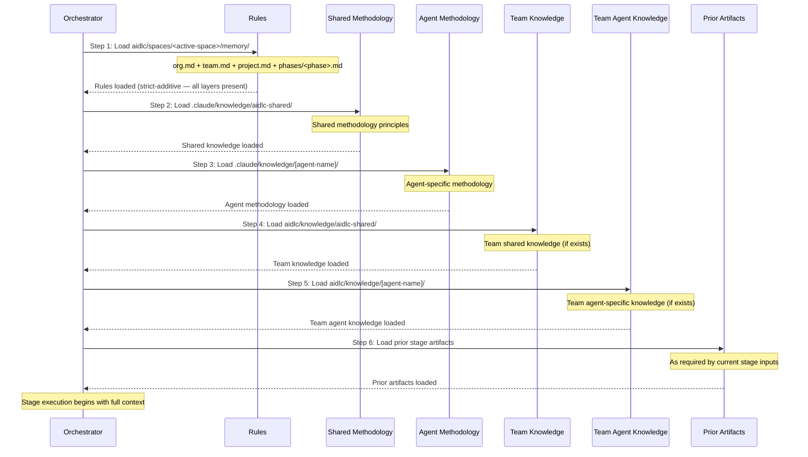

# Knowledge System

この章は 2 tier の knowledge アーキテクチャを文書化する: 方法論の knowledge がどう framework とともに同梱されるか、チーム knowledge がどうプロジェクトごとに管理されるか、6 ステップのロード順、テンプレートシステム、そして knowledge をどう拡張するか。

---

## Two-Tier Architecture

AI-DLC は、framework の方法論をチームのカスタマイズから分離する 2 tier の knowledge システムを用いる:

**Tier 1: Methodology knowledge**（`.claude/knowledge/`）-- framework とともに同梱される。共有原則と agent ごとの方法論リファレンスを含む。framework のアップグレード時に更新される。ワークフロー実行中は読み取り専用。

**Tier 2: Team knowledge**（active space — `aidlc/knowledge/`、`aidlc/spaces/<space>/knowledge/` の短縮形）-- ユーザー管理。会社固有の標準、ポリシー、規約を含む。space の `memory/`、`codekb/`、`intents/` の兄弟であり、space 内のすべての intent をまたいで蓄積される。自由形式で bootstrap 時は空: engine は最初の `/aidlc` で空の `aidlc/knowledge/` ディレクトリを作成し、その中に何も seed しない。固定のファイルセットは無い。

### Tier 1 Structure

```
.claude/knowledge/
+-- aidlc-shared/
|   +-- ai-dlc-principles.md       # Core methodology principles
|   +-- verification.md            # Phase boundary verification rules
|   +-- brownfield.md              # Brownfield safeguards
|   +-- audit-format.md            # 76-event audit taxonomy
|   +-- knowledge-readme-template.md  # Optional README template a team can copy into Tier 2
|   +-- state-template.md          # State file contract
+-- aidlc-product-agent/
|   +-- requirements-guide.md
|   +-- product-guide.md
|   +-- functional-design-guide.md
|   +-- requirements-elicitation.md
|   +-- prioritization-frameworks.md
|   +-- user-story-patterns.md
|   +-- market-research-methods.md
+-- aidlc-architect-agent/
|   +-- architecture-guide.md
|   +-- nfr-design-guide.md
|   +-- ddd-patterns.md
|   +-- architecture-patterns.md
|   +-- nfr-design-patterns.md
|   +-- adr-template.md
+-- aidlc-developer-agent/
|   +-- code-analysis-guide.md
|   +-- code-generation-guide.md
|   +-- code-generation-patterns.md
|   +-- api-design-guide.md
|   +-- data-modelling-patterns.md
|   +-- re-artifacts.md
+-- [... 8 more agent knowledge dirs]
```

### Tier 2 Structure

bootstrap 時は空。engine は素の `aidlc/knowledge/` ディレクトリを作成し、その中には何も作らない — README も、agent ごとのサブディレクトリも無い。下の `aidlc-shared/` と agent ごとのディレクトリは、agent persona が探す規約である; チームは内容を持つものを作成する。

```
aidlc/knowledge/                    # empty at bootstrap; team-created subdirs
+-- aidlc-shared/                   # optional — loaded by every agent if present
|   +-- (user-added files)
+-- aidlc-product-agent/            # optional — loaded when that agent is active
|   +-- (user-added files)
+-- [... a directory per agent the team chooses to populate]
```

---

## 6-Step Knowledge Loading Order

各 stage は厳密な 6 ステップのシーケンスで knowledge をロードする: まず解決された rule セット、次に共有方法論、次に agent 固有の方法論、次にチームのカスタマイズ、そして最後に先行 stage の artifact。



| Step | Source | Tier | Managed By | Loaded |
|------|--------|------|-----------|--------|
| 1 | `aidlc/spaces/<active-space>/memory/` | -- | Framework + 自己学習 | 最初 |
| 2 | `.claude/knowledge/aidlc-shared/` | 1 | Framework | 早期 |
| 3 | `.claude/knowledge/[agent]/` | 1 | Framework | 早期 |
| 4 | `aidlc/knowledge/aidlc-shared/` | 2 | チーム | 中盤 |
| 5 | `aidlc/knowledge/[agent]/` | 2 | チーム | 中盤 |
| 6 | 先行 stage の artifact | -- | 動的 | 最後 |

> **Note:** ステップ 1-5 は agent の knowledge ロードである（各 agent ファイルで定義される）。ステップ 6（先行 stage の artifact）は、ファイルのロードステップではなく、orchestrator がランタイムに追加するコンテキストである。

### What Each Layer Contributes

- Rule（ステップ 1）は最初にロードされ、strict-additive な 5 層チェーン（org → team → project → phase → stage）を通じて解決される — 適用可能なすべての rule がコンテキストに存在する; より広いレイヤーが上書きされることは決してなく、追加されるだけである。[Rule System](08-rule-system.md) を参照。
- Framework の方法論（ステップ 2-3）はベースラインの振る舞いを提供する。
- チーム knowledge（ステップ 4-5）は組織固有のコンテキストを追加する。
- 先行 artifact（ステップ 6）はワークフロー固有のコンテキストを提供する。

---

## Template System

### Knowledge README Template

`.claude/knowledge/aidlc-shared/knowledge-readme-template.md` は、チームが自身の Tier 2 ディレクトリを文書化するためにそこへコピーできる任意の README テンプレートを同梱する。engine はそれをスキャフォールドも seed もしない — space レベルの `aidlc/knowledge/` ディレクトリは空で作成され、チームが望むものを何でも足す。テンプレートは次を説明する:

- その agent のためにどんな種類のファイルを足すか
- 一般的なカスタマイズファイルの例
- ファイルがどうロードされるか（agent がアクティブになると自動的に）
- 特別な命名規約は不要であること -- 任意の `.md` ファイルがロードされる

### State Template

engine は `.claude/knowledge/aidlc-shared/state-template.md` の契約に従って `aidlc-state.md` を生成する。テンプレートは必須のセクションとフィールドを定義する; 具体的な Stage Progress の行は、テンプレートで手で列挙されるのではなく、コンパイルされた stage graph と scope grid から発行される。

---

## Adding Team Knowledge

会社固有のファイルをチーム knowledge ディレクトリに足す:

```bash
# Team-wide standards (loaded by all agents)
aidlc/knowledge/aidlc-shared/company-coding-standards.md
aidlc/knowledge/aidlc-shared/company-architecture-principles.md

# Agent-specific standards (loaded only when that agent is active)
aidlc/knowledge/aidlc-architect-agent/company-architecture-patterns.md
aidlc/knowledge/aidlc-devsecops-agent/company-security-policy.md
aidlc/knowledge/aidlc-developer-agent/company-coding-conventions.md
aidlc/knowledge/aidlc-quality-agent/company-testing-standards.md
```

ファイルは agent がアクティブになると自動的にロードされる（ロード順のステップ 4-5）。configuration の変更は不要。ディレクトリに置かれた任意の `.md` ファイルがロードされる。

### Knowledge by Agent

> この表はスナップショットである。各 agent の権威ある `display_name` + `examples` は、`core/agents/<slug>-agent.md` の agent の frontmatter に住み、`core/tools/aidlc-lib.ts` の `loadAgents()` を通じてプログラム的に表面化される。まずそこに新しい agent を足す; 同じ PR でこの表を更新する。

| Directory | Purpose | Example Files |
|-----------|---------|---------------|
| `aidlc-shared/` | チーム全体の標準 | `coding-standards.md`, `api-conventions.md` |
| `aidlc-product-agent/` | プロダクトのコンテキスト | `roadmap.md`, `personas.md` |
| `aidlc-design-agent/` | UX/UI ガイドライン | `design-system.md`, `accessibility.md` |
| `aidlc-delivery-agent/` | PM の規約 | `sprint-cadence.md`, `definition-of-done.md` |
| `aidlc-architect-agent/` | アーキテクチャの決定 | `tech-stack.md`, `infrastructure-preferences.md` |
| `aidlc-developer-agent/` | コーディングパターン | `db-conventions.md`, `error-handling.md` |
| `aidlc-quality-agent/` | テストの標準 | `test-strategy.md`, `coverage-requirements.md` |
| `aidlc-devsecops-agent/` | セキュリティポリシー | `security-baseline.md`, `compliance-rules.md` |
| `aidlc-aws-platform-agent/` | クラウドのコンテキスト | `account-structure.md`, `service-limits.md` |
| `aidlc-compliance-agent/` | コンプライアンス rule | `data-governance.md`, `audit-requirements.md` |
| `aidlc-pipeline-deploy-agent/` | CI/CD の標準 | `pipeline-standards.md`, `deployment-gates.md` |
| `aidlc-operations-agent/` | Ops の runbook | `monitoring.md`, `incident-response.md` |

---

## Cross-References

- [Architecture](01-architecture.md) -- 5 層モデルの knowledge レイヤー
- [Agent System](05-agent-system.md) -- agent の frontmatter と設定
- [Stage Protocol](04-stage-protocol.md) -- agent persona のロードのセクション
- [Hooks and Tools](06-hooks-and-tools.md) -- audit-format.md の分類（共有 knowledge に同梱される）
