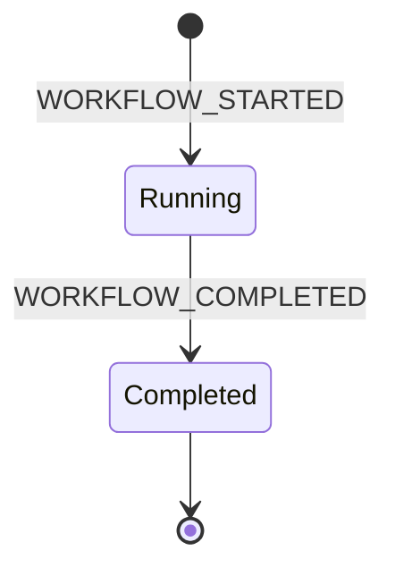
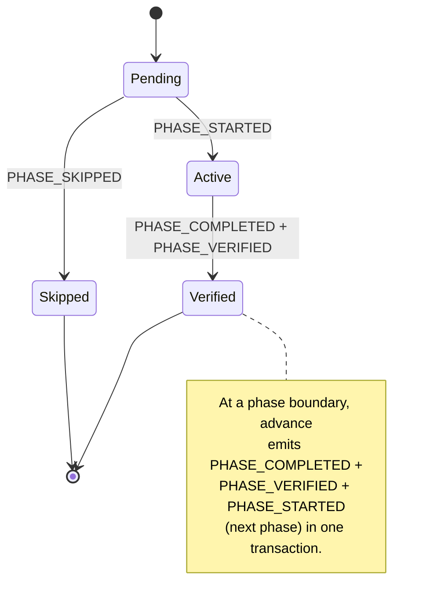
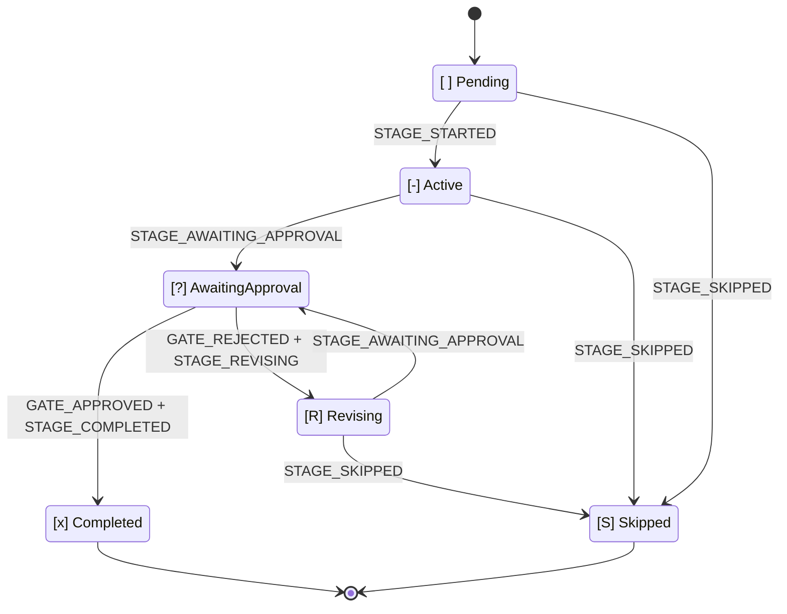

# State Machine

この章は、AI-DLC の状態機械、audit イベント分類、そしてそれらを結ぶ規則 — **すべての状態遷移はツールが所有する emitter をちょうど 1 つ持つ** — の標準リファレンスである。この章の表をコードと同期させ続けることは、`tests/integration/t48-audit-event-emitters.test.ts` の drift test で強制される。ドキュメントとコードが食い違えば、t48 が失敗する。

3 つの入れ子の状態機械が AI-DLC を駆動する: **workflow**、**phase**、**stage**。4 つ目の独立したストリームは、Claude Code hook が発行する **session** イベントを記録する。これら 4 つのストリームは intent の audit trail（record dir 配下の `audit/` shard dir。`<record>/` = `aidlc/spaces/<active-space>/intents/<YYMMDD>-<label>/`）を共有するが、それぞれ異なるコードパスが所有する。したがって、別々の関心事として読み、それらのタイムラインが交錯することを念頭に置くのが最も分かりやすい。

> **North-star invariant:** TypeScript が決定論的な記帳を所有し、LLM が判断を所有する。すべての audit emission はツールまたは hook に由来し、LLM の散文を emit パスから排除する。MD ファイルを読んでいて `aidlc-audit.ts append <EVENT>` が散文の指示として書かれているのを見たら、それはバグである。
>
> **Audit-first atomicity:** ツールは状態を変更する *前* に audit エントリを発行する。audit emission が失敗した場合、ツールは状態に触れる前に throw する — したがって `audit.md` と state ファイルが食い違うことは決してない。この章の末尾近くにある [「Audit-first atomicity」のセクション](#audit-first-atomicity) が失敗モードを詳述する。

---

## Why three state machines

workflow は phase を通過して完了し、phase はその in-scope stage を通過して完了し、stage はその approval gate が閉じたときに完了する。各層はそれぞれ異なる判断を所有する:

- **Workflow** — ジョブ全体は running か、done か？
- **Phase** — このライフサイクル phase は進行中か、verified か、それとも scope が除外したために skip されたか？
- **Stage** — この stage は作業中か、user 待ちか、rejection 後に revise 中か、それとも完了か？

それらを 1 つの状態フィールドに平坦化すると、それらの判断が混同される。分離することで、`/aidlc --status` は「この workflow を止めているものは何か？」に一読で答えられる: workflow `Running`、phase `Active`、stage `[?]` → "awaiting your approval on \<stage\>"。

---

## Workflow machine



<!-- Text fallback: initial state transitions to Running on WORKFLOW_STARTED; Running transitions to Completed on WORKFLOW_COMPLETED; Completed is terminal. -->

**Status values:** `Running`, `Completed`。

workflow は最初の intent が誕生したとき（`aidlc-utility intent-birth`。最初の `/aidlc` または `/aidlc-init` 経由で自動起動される）に開始し、最後の in-scope stage の approval gate が閉じたときに終了する。`Paused` ステータスも `Waiting for Approval` ステータスも存在しない — 承認は stage レベルの関心事であり、pause には UX がない。

workflow の `Running` 状態は Claude Code の session をまたいで持続する。月曜に workflow を開始し、session を止め、火曜に resume する — workflow はまだ `Running` である。終わったのは *session* であり、新しいものが始まったのだ。

| Transition | Trigger | Emitter |
|---|---|---|
| `[*] -> Running` | `aidlc-utility intent-birth` | `tools/aidlc-utility.ts` |
| `Running -> Completed` | `aidlc-orchestrate.ts report` を通じて報告された最終 stage の outcome | `tools/aidlc-state.ts` (internal emitter) |

---

## Phase machine



<!-- Text fallback: initial state transitions to Pending; Pending transitions to Active on PHASE_STARTED; Pending transitions to Skipped on PHASE_SKIPPED; Active transitions to Verified on PHASE_COMPLETED + PHASE_VERIFIED. At a phase boundary, advance emits PHASE_COMPLETED + PHASE_VERIFIED + PHASE_STARTED (next phase) atomically, chaining Verified back to the next phase's Pending-to-Active transition. -->

**Status values:** `Pending`, `Active`, `Verified`, `Skipped`。

phase 状態は `aidlc-state.md` の `## Phase Progress` セクションで追跡される。intent birth がこのセクションを種付けする: `Initialization` は `Verified` に着地し（birth は hand-off の前にすべての init stage を完了する）、最初の post-init stage の phase は `Active` に着地し、それ以降の各 phase は、scope が EXECUTE stage を残さずに離れた場合は `Skipped`（それぞれ `PHASE_SKIPPED` audit 行 1 つ）、そうでなければ `Pending` に着地する。phase の完了は phase 境界で `PHASE_COMPLETED` と `PHASE_VERIFIED` の両方を発火し、続いて次の phase の `PHASE_STARTED` を発火する。これらの行は同じ state 書き込みで切り替わる。このセクションは表示専用である: routing は `Lifecycle Phase` と Stage Progress の checkbox を読み、`/aidlc --status` はその phase ブロックをライブで再計算する。

| Transition | Trigger | Emitter |
|---|---|---|
| seed (`Verified`/`Active`/`Pending`/`Skipped`) | `aidlc-utility intent-birth` | `tools/aidlc-utility.ts` |
| `Active -> Verified` | phase 境界で `aidlc-orchestrate.ts` を通じて報告された stage の完了/skip。forward の `aidlc-jump execute` | `tools/aidlc-state.ts` (internal emitter)、`tools/aidlc-jump.ts` |
| `Pending -> Active` (boundary) | 報告された outcome の後に engine が routing する、または `aidlc-jump execute` | `tools/aidlc-state.ts` (internal emitter)、`tools/aidlc-jump.ts` |
| `Pending -> Skipped` (jumped over) | phase 全体を飛び越す forward の `aidlc-jump execute` | `tools/aidlc-jump.ts` |
| `Verified/Active -> Pending` reset | backward の `aidlc-jump execute`（EXECUTE stage を持つ phase を reset） | `tools/aidlc-jump.ts` |
| `Pending <-> Skipped` re-derivation | `aidlc-utility scope-change` / `recompose`（未到達の行のみ） | `tools/aidlc-utility.ts` |

init→post-init の hand-off では、`aidlc-utility intent-birth` 自身が最終 init stage の後に `PHASE_COMPLETED + PHASE_VERIFIED + PHASE_STARTED + STAGE_STARTED` を発行する。これにより、birth と最初の `advance` の間で無音になる代わりに、audit trail がこの遷移を捉える。

---

## Stage machine



<!-- Text fallback: [ ] Pending transitions to [-] Active on STAGE_STARTED. [-] Active transitions to [?] AwaitingApproval on STAGE_AWAITING_APPROVAL. [?] AwaitingApproval transitions to [x] Completed on GATE_APPROVED + STAGE_COMPLETED, or to [R] Revising on GATE_REJECTED + STAGE_REVISING. [R] Revising transitions back to [?] AwaitingApproval on STAGE_AWAITING_APPROVAL (re-entry). Any of Pending / Active / Revising can transition to [S] Skipped via STAGE_SKIPPED. -->

**Checkbox legend (in `aidlc-state.md`):**

| Checkbox | State | 意味 |
|---|---|---|
| `[ ]` | `Pending` | 未着手 |
| `[-]` | `Active` | 進行中 |
| `[?]` | `AwaitingApproval` | stage の作業は完了し、gate が開いている — user が blocker |
| `[R]` | `Revising` | user が gate を rejected した — 再入前に stage を revise 中 |
| `[x]` | `Completed` | 承認され完了 |
| `[S]` | `Skipped` | scope による除外、jump による skip、または途中で打ち切り |

`[?]` と `[R]` は、いずれも `[-]` に見えてしまう 2 つの状況を区別する。resume 時、`[R]` は conductor に対し、stage を最初から再実行するのではなく、gate に再入する前に以前の artifact とフィードバックを提示するよう伝える。

| Transition | Trigger | Emitter |
|---|---|---|
| `Pending → Active` | 直前の報告された outcome の後に engine が routing する | `tools/aidlc-state.ts` (internal emitter) |
| `Active → AwaitingApproval` | `aidlc-orchestrate.ts report --stage <slug> --result awaiting-approval` | `tools/aidlc-state.ts` (internal emitter) |
| `AwaitingApproval → Completed` | `aidlc-orchestrate.ts report --stage <slug> --result approved --user-input "<exact choice>"` | `tools/aidlc-state.ts` (internal emitter) |
| `AwaitingApproval → Revising` | `aidlc-orchestrate.ts report --stage <slug> --result rejected --user-input <text>` | `tools/aidlc-state.ts` (internal emitter) |
| `Active → Revising` | gate-open からの recovery が必要なときの同じ rejected report | `tools/aidlc-state.ts` (internal emitter) |
| `Revising → AwaitingApproval` | `aidlc-orchestrate.ts report --stage <slug> --result revised` | `tools/aidlc-state.ts` (internal emitter) |
| `{Active,Revising} → Skipped` | `aidlc-orchestrate.ts report --stage <slug> --result skipped --reason <text>` | `tools/aidlc-state.ts` (internal routed-skip emitter) |
| `Pending → Skipped` | Scope composition または `aidlc-jump execute` | `tools/aidlc-utility.ts`、`tools/aidlc-jump.ts` |

`approved` report は gate 後の遷移全体を所有する: `GATE_APPROVED + STAGE_COMPLETED` を発行し、次に in-scope stage へ routing し、`STAGE_STARTED` と境界での任意の `PHASE_*` イベントを発行する。最後の in-scope stage では `PHASE_COMPLETED + PHASE_VERIFIED + WORKFLOW_COMPLETED` を発行し、Status=Completed を設定する。conductor は報告の前後で state のライフサイクル動詞を呼ばない。

**Routed skip.** `report --result skipped` が受理されるのは、main workflow 上で、明示的な非空の `--stage` と `--reason` があり、指名された stage が `execution: CONDITIONAL` と宣言され、`Current Stage` に等しく、Active または Revising のときのみである。これは artifact、per-unit、ensemble-evidence の guard より前に実行される。正当な skip は completion evidence を負わないからである。engine は routing マーカー付きで内部の skip 遷移を呼び出す: このトランザクションは `[S]` を保持し、`STAGE_SKIPPED` をちょうど 1 つ発行し、`STAGE_COMPLETED` は決して発行せず、次の stage を開始する（境界イベントを含む）か workflow を完了する。以降の routing が失敗した場合、recovery は skip マーカーとカーソルを同じ stage に残すので、skip イベントを重複させずに route を再試行できる。`report --single --result skipped` は拒否される。

**Artifact guard (issue #366).** stage を `[x]` にマークするすべての report outcome は、完了させる前に決定論的な artifact チェックを実行する。したがって stage は、ディスク上の作業の痕跡なしに完了とマークできない。`produces[]` を宣言する stage は、それらの artifact の少なくとも 1 つが存在しなければならない（アクティブな intent の record dir、その per-unit Construction ディレクトリ、または codekb stage の場合はアクティブな space の `codekb/<repo>/` の配下）。`workspace_requires: true` はさらに、`aidlc/` と harness dir の外の source-work evidence も要求する。失敗は何も書き込まない。任意の出力は関与しない。`produces_kinds` については、その kind が必須集合をゼロに刈り込む unit は artifact を負わない。適用可能な unit はいずれも厳格なままである。`AIDLC_SKIP_ARTIFACT_GUARD=1` でバイパスする。

**Ensemble evidence gate.** `mob` または supports 付きの `subagent` stage では、宣言された support agent の contribution ファイル（`<stage>/contributions/<agent-slug>.md`）が欠けているか、その `**Collaborator:**` identity-marker の先頭行を欠く間、report パスは `awaiting-approval`、`revised`、`approved` を拒否する — ensemble が実際に招集されたことの決定論的な証明である。落ち着いた autonomous swarm は免除される（その per-unit の収束 ledger が evidence となる）。`report --single` は stage レベルの evidence のみをチェックする。`AIDLC_DISABLE_ENSEMBLE_EVIDENCE=1` でバイパスする。これは、正当に実行されたが contribution ファイルを失った stage を recovery する用途のみを意図している。

**Gate-revision backstop.** conductor が、先に rejection を報告せずに開いた gate で artifact を revise した場合、`approved` report は、gate 後の人間のターンに続いて artifact の書き込みがあったことを audit evidence が証明するとき、完了前に欠けている `GATE_REJECTED` + `STAGE_REVISING` のペアを reconcile する。backfill された行は `Recovered: true` を持つ。人間のターンより前の reviewer の書き込みはカウントされない。`AIDLC_SKIP_REVISION_BACKSTOP=1` でバイパスする。

**Park (issue #365/#367).** `aidlc-orchestrate park` は、いずれの stage も advance せずに `Parked` / `Parked At Stage` runtime マーカーを書き込む（`aidlc-state.ts park` 経由で、これは `WORKFLOW_PARKED` を発行する）。その後の素の `next` は終端の `parked` directive を再発行し、Stop hook がターンを終わらせる。これにより、長い workflow は、残りの stage を機械的に承認して `done` に到達する代わりに、session をまたいで pause できる。`/aidlc --resume` は続行の前にマーカーをクリアする（`unpark` は `WORKFLOW_UNPARKED` を発行する）。無人の autonomous Construction 実行（`Construction Autonomy Mode: autonomous`）は park を拒否する: ツールと Stop hook の `parked` allow の両方が autonomous モードでは decline するので、resume する人間がいないままループが動き続ける。

### Revision loop

```
report awaiting-approval  →  [?] AwaitingApproval
          ↘ report rejected  →  [R] Revising  (Revision Count += 1)
                   ↓ report revised
                   [?] AwaitingApproval
                   ↘ report approved  →  [x] Completed
```

`Revision Count` は state ファイルに存在し、rejected report のたびにインクリメントされる。conductor はこれを使って revision-loop escape hatch を検出する（デフォルトは skip を提示するまで 3 サイクル）。

revision が、directive に reviewer を持つ stage 上で `produces[]` artifact を変更する場合、conductor は `revised` を報告する前に §12a の reviewer ステップを再実行する（stage-protocol Part 0）— engine 自身の `revised` report に対するチェックは構造的なまま（completion evidence + artifact の存在）であり、reviewer の再実行は conductor の散文であって engine の gate ではない。

---

## Session stream (hook-owned, independent)

session イベントは AI-DLC ツールではなく Claude Code hook が発行する。session は 1 つの Claude Code 会話であり、workflow は長命なディレクトリ状態である。この関係は多対多である — 1 つの workflow は複数の session にまたがれるし、1 つの session は複数の workflow に触れられる — ので、ストリームは設計上独立している。

| Event | Emitter | Trigger |
|---|---|---|
| `SESSION_STARTED` | `hooks/aidlc-session-start.ts` | `source=startup` または `clear` の `SessionStart` |
| `SESSION_RESUMED` | `hooks/aidlc-session-start.ts` | `source=resume` の `SessionStart` |
| `SESSION_COMPACTED` | `hooks/aidlc-validate-state.ts` | `PreCompact` — compaction 時に発火するので確実に捉えられる |
| `SESSION_ENDED` | `hooks/aidlc-session-end.ts` | `SessionEnd` |

session hook は、発行の前にアクティブな intent の `aidlc-state.md`（`aidlc/spaces/<space>/intents/<YYMMDD>-<label>/` 配下）を確認する。そのようなファイルが存在しなければ（cwd にアクティブな AI-DLC workflow がなければ）、hook はいずれの audit ログにも書き込まず黙って終了する。session イベントは、アクティブな workflow のタイムラインに注釈を付けるために存在する — workflow のないディレクトリの session には、注釈する対象がない。

### Compaction awareness

`aidlc-state.ts resume` は audit の末尾を走査し、最新の `SESSION_COMPACTED` を探す。それに続く stage 活動（`STAGE_STARTED`、`STAGE_COMPLETED`、`GATE_APPROVED`、`SESSION_RESUMED`、`RECOVERY_COMPLETED`）がなければ、resume は `compaction_pending: true` を返し、conductor は続行の前に 3 択のプロンプト（continue / review / restart）を提示する。`RECOVERY_COMPLETED` は、user が選択肢を 1 つ選ぶと `acknowledge-compaction` が発行し、activity gate を満たすので、以降の compaction は新しい境界を検出する。

---

## Audit event taxonomy

**74 イベント**。以下では 17 カテゴリにグループ化している（標準の `audit-format.md` レジストリは同じ 74 を 19 に分割する - グループ化は提示上のものであり、不変なのはイベント集合である）。すべてのイベントはツールまたは hook の emitter をちょうど 1 つ持つ。ただし、次期リリース向けに事前登録され、Emitter セルが `Reserved (v0.4.0 PR N)`、`Reserved (v0.5.0 PR N)`、`Reserved (v0.6.0 PR N)` と書かれているイベントは例外である - これらは、consumer PR が emitter を出荷するまで drift test の forward チェックでスキップされる。drift test `tests/integration/t48-audit-event-emitters.test.ts` は、この章の表とコードの間の forward/reverse/tertiary/pairing/MD-MD の一貫性を強制する。

### Workflow lifecycle

| Event | Emitter | 備考 |
|---|---|---|
| `WORKFLOW_STARTED` | `tools/aidlc-utility.ts` | すべての intent birth で必須の最初のイベント |
| `WORKFLOW_COMPLETED` | `tools/aidlc-state.ts` |  |
| `WORKFLOW_PARKED` | `tools/aidlc-state.ts` | `park` - 後の session のために途中で park された workflow。stage は advance していない |
| `WORKFLOW_UNPARKED` | `tools/aidlc-state.ts` | `unpark` - 明示的な `--resume` 再入で park マーカーがクリアされた |

### Phase lifecycle

| Event | Emitter | 備考 |
|---|---|---|
| `PHASE_STARTED` | `tools/aidlc-utility.ts`, `tools/aidlc-state.ts`, `tools/aidlc-jump.ts` | init で最初に発火。以降は stage ツールの phase 境界で発火 |
| `PHASE_COMPLETED` | `tools/aidlc-utility.ts`, `tools/aidlc-state.ts`, `tools/aidlc-jump.ts` | すべての境界で `PHASE_VERIFIED` とペアになる |
| `PHASE_VERIFIED` | `tools/aidlc-utility.ts`, `tools/aidlc-state.ts`, `tools/aidlc-jump.ts` | 常に `PHASE_COMPLETED` とペアになる |
| `PHASE_SKIPPED` | `tools/aidlc-utility.ts` | scope 除外された phase につき 1 つ、intent birth で発行 |

### Stage lifecycle

| Event | Emitter | 備考 |
|---|---|---|
| `STAGE_STARTED` | `tools/aidlc-state.ts`, `tools/aidlc-utility.ts`, `tools/aidlc-jump.ts` | 内部 route が `[ ]` → `[-]` にマークする |
| `STAGE_AWAITING_APPROVAL` | `tools/aidlc-state.ts` | `report --result awaiting-approval` / `revised` の内部 emitter。recovered 行は `Recovered=true` を持つ |
| `STAGE_COMPLETED` | `tools/aidlc-state.ts`, `tools/aidlc-utility.ts` | completed/approved report の内部 emitter。skipped report とペアになることはない |
| `STAGE_REVISING` | `tools/aidlc-state.ts` | rejected report の後に `GATE_REJECTED` とペアになる内部 emitter |
| `STAGE_SKIPPED` | `tools/aidlc-state.ts`, `tools/aidlc-jump.ts` | `[S]` 遷移につきちょうど 1 つ。main-workflow の report パスがアトミックに以降へ routing する |
| `STAGE_JUMPED` | `tools/aidlc-jump.ts` | `--stage`/`--phase` jump で宛先の slug を記録する |

### Gate decisions

| Event | Emitter | 備考 |
|---|---|---|
| `GATE_APPROVED` | `tools/aidlc-state.ts` | `--user-input` が正確な選択を捉える |
| `GATE_REJECTED` | `tools/aidlc-state.ts` | `--feedback` が rejection の理由を捉える |

### User interaction

| Event | Emitter | 備考 |
|---|---|---|
| `DECISION_RECORDED` | `tools/aidlc-log.ts` | gate ではない `AskUserQuestion` の前に発火し、選択肢を捉える |
| `QUESTION_ANSWERED` | `tools/aidlc-log.ts` | gate ではない質問への応答の後に発火する; 承認の選択は `report` が所有するライフサイクルイベントである |
| `REVIEW_REQUESTED` | `tools/aidlc-log.ts` | conductor が §12a reviewer サブエージェントを dispatch したときに発火する |
| `REVIEW_COMPLETED` | `tools/aidlc-log.ts` | `READY` または `NOT-READY` の reviewer verdict が読まれたときに発火する。すべての完了系の状態遷移（`approve`、`advance`、`finalize`、`complete-workflow`）は、現在の workflow attempt からの、かつ最新の関連する declared-artifact の書き込み以降の、一致する receipt を要求する。per-unit stage は、適用可能な unit ごとに 1 つと、その unit への scope artifact 無効化を要求する。autonomous swarm の finalization はさらに、設定された各 unit の Bolt 開始後の receipt を要求する。 |

### Scope and configuration

| Event | Emitter | 備考 |
|---|---|---|
| `SCOPE_DETECTED` | `tools/aidlc-utility.ts` | `detect-scope` サブコマンド。`Source` フィールドが provenance（freeform / keyword / env / cli）を記録する |
| `SCOPE_CHANGED` | `tools/aidlc-utility.ts` | アクティブな workflow 上の `scope-change` サブコマンド |
| `PLUGIN_SELECTION_CHANGED` | `tools/aidlc-utility.ts` | `select-plugins` の set-mode。フィールド: `Previous Selection`、`New Selection` |
| `DEPTH_CHANGED` | `tools/aidlc-utility.ts` | `config set depth <value>` / `config-change --depth` |
| `TEST_STRATEGY_CHANGED` | `tools/aidlc-utility.ts` | `config set test-strategy <value>` / `config-change --test-strategy` |
| `RECOMPOSED` | `tools/aidlc-utility.ts` | `recompose` サブコマンド - 適応型コンポーザによる実行中の plan 再形成（pending-stage サフィックスが audit ロックの下で切り替わる） |

### Artifacts

| Event | Emitter | 備考 |
|---|---|---|
| `ARTIFACT_CREATED` | `hooks/aidlc-audit-logger.ts` | 新規パスへの Write — `mtimeMs == birthtimeMs` の stat チェックで UPDATED と区別する |
| `ARTIFACT_UPDATED` | `hooks/aidlc-audit-logger.ts` | Edit ツール、または既存ファイルを上書きする Write |
| `ARTIFACT_REUSED` | `tools/aidlc-state.ts` | `reuse-artifact` サブコマンド — keep/modify/redo の決定 |

### Construction Bolts

| Event | Emitter | 備考 |
|---|---|---|
| `BOLT_STARTED` | `tools/aidlc-bolt.ts` | 並列バッチ用に CSV の bolt 名を受け付ける |
| `BOLT_COMPLETED` | `tools/aidlc-bolt.ts` | 先行する `BOLT_STARTED` とペアになる |
| `BOLT_FAILED` | `tools/aidlc-bolt.ts` (`fail` + `abort`) | `--succeeded-siblings` が並列バッチの生存者を捉える。`abort` は下位分類のために `Reason: aborted` フィールドを追加する |
| `AUTONOMY_MODE_SET` | `tools/aidlc-bolt.ts` | `Construction Autonomy Mode` フィールドをアトミックに更新する。まずフィールドの存在を検証する（audit-first） |

### Session

| Event | Emitter | 備考 |
|---|---|---|
| `SESSION_STARTED` | `hooks/aidlc-session-start.ts` | `source=startup` または `clear` |
| `SESSION_RESUMED` | `hooks/aidlc-session-start.ts` | `source=resume` |
| `SESSION_COMPACTED` | `hooks/aidlc-validate-state.ts` | 重複を避けるため（次の SessionStart ではなく）PreCompact で発行される |
| `SESSION_ENDED` | `hooks/aidlc-session-end.ts` | Claude Code からの `Reason` フィールドを含む |
| `HUMAN_TURN` | `hooks/aidlc-mint-presence.ts` (+ per-harness prompt-submit adapters) | 実際の人間のプロンプトまたは回答済みの質問ウィジェットにつき 1 つ。approval/interview gate は最後の gate 解決以降に 1 つを要求する |
| `SUBAGENT_COMPLETED` | `hooks/aidlc-log-subagent.ts` | SubagentStop hook 経由で subagent の完了を記録する |
| `REVIEWER_SCOPE_BLOCKED` | `hooks/aidlc-reviewer-scope.ts` | per-unit reviewer のツール呼び出しが、兄弟 unit の `construction/` パスに手を伸ばしたために拒否された（§12a の read-scope 境界）。拒否 1 つにつき 1 行 |

### Diagnostics and workspace

| Event | Emitter | 備考 |
|---|---|---|
| `HEALTH_CHECKED` | `tools/aidlc-utility.ts` | `--doctor` の実行 |
| `WORKSPACE_SCAFFOLDED` | `tools/aidlc-utility.ts` | init が作成した新規ディレクトリツリー |
| `WORKSPACE_SCANNED` | `tools/aidlc-utility.ts` | brownfield ワークスペースの検出が完了 |
| `WORKSPACE_INITIALISED` | `tools/aidlc-utility.ts` | state ファイルが実体化された |

### Error and recovery

| Event | Emitter | Trigger |
|---|---|---|
| `ERROR_LOGGED` | `tools/aidlc-lib.ts` (via `emitError` from every tool's `error()`) | 非ゼロで終了するために `error(msg)` を呼ぶ任意のツール CLI。best-effort — cwd に workflow がなければ no-op、再帰に対して guard される |
| `RECOVERY_COMPLETED` | `tools/aidlc-state.ts` | user が compaction-awareness の AskUserQuestion に回答した後、conductor が呼ぶ `acknowledge-compaction --choice <continue|review|restart>` |

### Worktree

v0.4.0 向けに事前登録。3 つの `WORKTREE_*` 行は `aidlc-worktree.ts`（milestone 7）で出荷される。`STATE_*` は milestone 9（state fork/merge）で到着し、`AUDIT_*` は milestone 10（audit fork/merge）で到着する。t48 forward チェックは、Emitter セルがなお `Reserved` と書かれている行をスキップする。

| Event | Emitter | Trigger |
|---|---|---|
| `WORKTREE_CREATED` | `tools/aidlc-worktree.ts` | Bolt 開始時に main から作成される per-Bolt の git worktree（サブコマンド: `create`） |
| `WORKTREE_MERGED` | `tools/aidlc-worktree.ts` | gate 承認時に main へマージし戻される Bolt の worktree（サブコマンド: `merge`） |
| `WORKTREE_DISCARDED` | `tools/aidlc-worktree.ts` | abort された Bolt の worktree が明示的に削除される（サブコマンド: `discard`） |
| `STATE_FORKED` | `tools/aidlc-state.ts` | Bolt 開始時に state ファイルが worktree に fork される（サブコマンド: `fork`） |
| `STATE_MERGED` | `tools/aidlc-state.ts` | gate 承認時に worktree の state が main へマージし戻される。多層防御として alphabetical-slug の tiebreak（サブコマンド: `merge`） |
| `AUDIT_FORKED` | `tools/aidlc-audit.ts` (`audit-fork`) | Bolt 開始時に audit ログが worktree に fork される。audit-of-intent — emit が byte-copy に先行する |
| `AUDIT_MERGED` | `tools/aidlc-audit.ts` (`audit-merge`) | gate 承認時に worktree の audit エントリが main audit に追記される。per-Bolt のエントリ順は保持され、cross-Bolt の順は merge-completion の順を反映する |

### Practices

v0.4.0 向けに事前登録。emitter は milestone 8（stage 2.2 practices-discovery）と milestone 13（Construction orchestrator runtime）で到着する。

| Event | Emitter | Trigger |
|---|---|---|
| `PRACTICES_DISCOVERED` | `tools/aidlc-state.ts` `practices-event --type discovered` | greenfield または brownfield の lead draft + 3 spoke + 人間の interview + lead integration が完了。draft は affirmation を待つ |
| `PRACTICES_AFFIRMED` | `tools/aidlc-state.ts` `practices-promote` | チームが practices を承認。内容が intent の `inception/practices-discovery/` から `aidlc/spaces/<active-space>/memory/team.md` と `project.md` へ promote される |
| `PRACTICES_OVERRIDE` | `tools/aidlc-state.ts` `practices-promote`（write-failure パス）および `tools/aidlc-state.ts` `practices-event --type override`（bolt-plan-marker-conflict パス） | promotion が失敗して stage が承認待ちのままか、あるいは active-space の walking-skeleton の stance が現在の Bolt のマーカーを上書きしたか、のいずれか |
| `PRACTICES_SECTION_EMPTY` | `tools/aidlc-state.ts` `practices-event --type empty` | conductor が空を返す practices セクションを読んだ。advisory-only で、org デフォルトにフォールバックする |

### Merge dispatch

milestone 1 で v0.4.0 向けに事前登録。emitter は新しい `aidlc-bolt dispatch-event` サブコマンド経由で milestone 13 で到着する。conductor は各 aidlc-pipeline-deploy-agent の dispatch を括る — 呼び出し前に INVOKED、YAML パース成功で呼び出し後に RETURNED、タイムアウト / 不正な YAML / 低 confidence で FALLBACK。

| Event | Emitter | Trigger |
|---|---|---|
| `MERGE_DISPATCH_INVOKED` | `tools/aidlc-bolt.ts` `dispatch-event --event MERGE_DISPATCH_INVOKED` | conductor が、team practices の散文から merge strategy を決定するため、aidlc-pipeline-deploy-agent を Task 経由で dispatch した |
| `MERGE_DISPATCH_RETURNED` | `tools/aidlc-bolt.ts` `dispatch-event --event MERGE_DISPATCH_RETURNED` | agent が、strategy、target branch、confidence、notes を含むパース済み YAML を返した |
| `MERGE_DISPATCH_FALLBACK` | `tools/aidlc-bolt.ts` `dispatch-event --event MERGE_DISPATCH_FALLBACK` | agent がタイムアウトしたか不正な YAML を返した。conductor は org デフォルトにフォールバックした — 重要な可観測性 hook |

### Sensors

milestone 1 で v0.5.0 向けに事前登録。emitter は、4 つの `SENSOR_*` イベントについては milestone 9（sensor dispatcher）で、`GUARDRAIL_LOADED` については milestone 14（paired-coverage doctor 行）で到着する。カバレッジは環境的である — markdown を書く Inception/Construction/Operation の各 stage は、registry-default の sensor から少なくとも 1 つの `SENSOR_FIRED` 行を発行する。v0.5.0 では advisory-only。v0.8.0 の ralph driver が Construction-phase の sensor に blocking セマンティクスを導入する。

| Event | Emitter | Trigger |
|---|---|---|
| `SENSOR_FIRED` | `tools/aidlc-sensor.ts` `fire` | dispatcher が stage の出力に対して sensor を起動した（sensor の `matches` フィルタへの PostToolUse Write/Edit 一致ごと） |
| `SENSOR_PASSED` | `tools/aidlc-sensor.ts` `fire` | sensor が完了し findings なしを報告した（tool-unavailable と script-error の fall-through も含む。`Note` フィールドが区別する） |
| `SENSOR_FAILED` | `tools/aidlc-sensor.ts` `fire` | sensor が完了し findings を報告した。詳細ファイルは `<record>/.aidlc-sensors/<stage-slug>/<sensor-id>-<fire-id>.md`（intent の record dir 内）に書き込まれる |
| `SENSOR_BUDGET_OVERRIDE` | `tools/aidlc-sensor.ts` `fire` | sensor が設定された上限（three-layer cap モデルに従い registry / binding / depth-derived）を超え、終了または skip された |
| `GUARDRAIL_LOADED` | `tools/aidlc-utility.ts` | guardrail loader が、アクティブな workflow の scope-hierarchical な guardrail 集合（org → project → phase → stage）を解決した。doctor の paired-coverage チェックがこのイベントから読む |

### Learning loop

milestone 4 で v0.5.0 向けに事前登録。`MEMORY_EMPTY` emitter は milestone 8（`aidlc-runtime.ts compile`）で到着する。§13 の Learnings Ritual は実行中に per-stage の memory.md を書く。stage 承認時、runtime-graph compile が memory.md を読み、4 つの標準見出しの下に非空エントリがゼロの stage について `MEMORY_EMPTY` を発行する。milestone 12 の learning-gate ツール（`aidlc-learnings.ts persist`）は、保持された learning が日付付きの practice エントリとして `aidlc/spaces/<active-space>/memory/{project,team}.md` に着地したとき `RULE_LEARNED` を発行し、learning が sensor binding（manifest + 発生元 stage の `sensors:` frontmatter）をインストールしたとき `SENSOR_PROPOSED` を発行する。doctor は diary-discipline の可観測性のためにこれらの行を読む。

| Event | Emitter | Trigger |
|---|---|---|
| `MEMORY_EMPTY` | `tools/aidlc-runtime.ts` | stage 承認の runtime-graph compile が、memory.md の欠落、または §13 の 4 見出しの下に非空エントリがゼロであることを見つけた |
| `RULE_LEARNED` | `tools/aidlc-learnings.ts` | learning gate が、保持された learning を日付付きの practice エントリとして `aidlc/spaces/<active-space>/memory/{project,team}.md` に永続化した |
| `SENSOR_PROPOSED` | `tools/aidlc-learnings.ts` | learning gate が project-tier の sensor manifest を scaffold し、それを発生元 stage の `sensors:` frontmatter にバインドした |

### Swarm

milestone 2 で v0.6.0 向けに事前登録。6 つの swarm イベントはすべて、いまや swarm referee `aidlc-swarm.ts` から発行される — conductor が参照する決定論的な verdict サーフェスである。referee はステートレスである: `prepare` は per-unit の worktree を fork し `SWARM_STARTED` を発行する（加えて、conductor が loud downgrade を報告したときの `SWARM_DEGRADED`。これは Wave 4 の milestone 16 でライブになった）。`finalize` は、conductor が収束済みと主張した集合を、設定された各 unit の post-Bolt terminal reviewer receipt を含めて再検証し、per-Unit のペア、per-failed-Unit の baton 行、バッチの集計を発行する。`check` サブコマンドは advisory であり、何も発行しない。engine は読み取り専用で conductor は audit イベントを発行しないので、決定論的なツールが swarm 分類全体を所有する。これらの行は、依存関係でリンクされた Unit のバッチのライフサイクルを追跡する: バッチ開始時の fan-out、per-Unit の収束または再検証の失敗、conductor への baton の handback、バッチの完了。conductor は `invoke-swarm` を、stage の `mode` enum と並ぶ直交した directive の種類として扱う — これは予約済みの `agent-team` モードを有効化しない。それは予約済みのままである。t48 forward チェックは、Emitter セルがなお `Reserved` と書かれている行をスキップする。

| Event | Emitter | Trigger |
|---|---|---|
| `SWARM_STARTED` | `tools/aidlc-swarm.ts` | swarm referee の `prepare` が、依存関係でリンクされた Unit のバッチを fork した |
| `SWARM_UNIT_CONVERGED` | `tools/aidlc-swarm.ts` | swarm Unit が green かつ未改竄で再検証され、設定された post-Bolt reviewer receipt が存在し、マージし戻された（マージし戻しが失敗した収束済み unit は、finalize の再試行がマージするまで行を得ない） |
| `SWARM_UNIT_FAILED` | `tools/aidlc-swarm.ts` | swarm Unit が `finalize` の再検証に失敗した（主張されていない、主張されたが red、改竄された、または設定された reviewer receipt を欠く） |
| `SWARM_BATON_RETURNED` | `tools/aidlc-swarm.ts` | swarm Unit が、orchestrator を介した調整のために baton を conductor に返した |
| `SWARM_COMPLETED` | `tools/aidlc-swarm.ts` | バッチ内のすべての Unit が終了した（収束または失敗）。バッチが閉じられた |
| `SWARM_DEGRADED` | `tools/aidlc-swarm.ts` | `AIDLC_USE_SWARM=1` が要求されたが Workflow ツールが利用不可だった。conductor は subagent floor を実行した |

分類内のすべてのイベントは、実際の emitter に裏付けられているか、事前登録された次期 consumer 向けに `Reserved (v0.4.0 PR N)` / `Reserved (v0.5.0 PR N)` / `Reserved (v0.6.0 PR N)` とマークされているかのいずれかである。drift test は両半分を強制する — `Reserved` の早期スキップは、セルが文字どおり "Reserved" を含む間のみ適用される。consumer PR は、emit 呼び出しを出荷するのと同じコミットで、それを実際の emitter ファイルパスに置き換える。

---

## Audit-first atomicity

状態を変更するコマンドは、state ファイルを変更する **前** に audit エントリを発行する。2 つの帰結がある:

1. audit emission が失敗した場合（lock timeout、disk error、invalid event type）、ツールは state に触れる前に throw する。state は以前の値のままで、audit.md はクリーンなままである。
2. audit emission の *後* に state 書き込みが失敗した場合、audit には「intent」エントリがあるが state は動いていない。この drift は可視で診断可能であり、`--doctor` が表面化させる。

`tests/unit/t17.test.ts` の `test("65: approve is audit-first ...")` ケースが `approve` についてこれを証明する: audit.md を read-only に chmod すると audit 失敗を強制し、state ファイルが（`[x]` ではなく）`[?]` のままであることを assert する。同じ不変条件が `gate-start`、`reject`、`revise`、`skip`、`advance`、`complete-workflow`、`reuse-artifact`、`aidlc-bolt.ts set-autonomy`、そして `aidlc-state.ts fork` / `aidlc-state.ts merge`（v0.4.0 milestone 9 の state fork/merge サブコマンド — 同等の chmod-the-lock-dir Part A と chmod-the-target-after-emit Part B の証明は `tests/unit/t76.test.ts` を参照）についても成り立つ。

state fork/merge は、意図的に以下の audit-of-intent 例外に含めていない: state ファイルの再読み込みと再書き込みは冪等である（`git worktree add` が emit と git の間の kill-9 の後に worktree を残すのとは異なる）ので、厳格な不変条件がきれいに適用される。audit emit の成功後の state 書き込みの失敗は、phantom な `STATE_FORKED` 行になり、doctor（v0.4.0 milestone 15）がそれを worktree の record-dir の `aidlc-state.md` の存在と突き合わせて reconcile する。

### Audit-of-intent semantics (`WORKTREE_*`, `AUDIT_*`, and merge-dispatch `MERGE_DISPATCH_INVOKED`)

audit-of-intent セマンティクスは、発行の前に結果を確認できない副作用に適用される — disk 操作（worktree の作成 / 削除、audit の byte-copy）や LLM Task dispatch（aidlc-pipeline-deploy-agent）を含む。発行するツールはまず audit エントリを書き、次に副作用を実行する。emit の後に副作用が失敗した場合、ツールはメッセージに slug を埋め込んで（`[slug=<slug>]`）`emitError` を呼ぶ。audit-fork / audit-merge のハンドラはさらに失敗に `[fork-emitted:<timestamp>]` をタグ付けするので、`--doctor`（v0.4.0 milestone 15）が「intent は記録されたが副作用は着地しなかった」を以前の失敗モードと区別できる。`MERGE_DISPATCH_INVOKED` については、doctor の reconciliation が、orphan な INVOKED 行を、欠けている `MERGE_DISPATCH_RETURNED` または `MERGE_DISPATCH_FALLBACK` のパートナーと、slug + timestamp window で突き合わせる（LLM Task 呼び出しには順序付けの対象となる disk artifact がないので、correlation タグは不要）。`appendAuditEntry` は disk-side-effect の失敗時に `ERROR_LOGGED` エントリを記録する。doctor は観測時に audit の drift を reconcile する。

| Event グループ | Emitter | emit に続く副作用 |
|---|---|---|
| `WORKTREE_CREATED`, `WORKTREE_MERGED`, `WORKTREE_DISCARDED` | `tools/aidlc-worktree.ts` | `git worktree add`、`git merge` + cleanup、`git worktree remove` + branch delete |
| `AUDIT_FORKED`, `AUDIT_MERGED` | `tools/aidlc-audit.ts` | main audit の `mkdir -p` + `copyFileSync`。worktree-audit の差分の main audit への `appendFileSync` |
| `MERGE_DISPATCH_INVOKED` | `tools/aidlc-bolt.ts` `dispatch-event` | `Task(aidlc-pipeline-deploy-agent, ...)` の LLM dispatch — 副作用は LLM 呼び出しそのもの。成功は、一致する `MERGE_DISPATCH_RETURNED` または `MERGE_DISPATCH_FALLBACK` の呼び出し後 emit で観測される |

これは stage 遷移に対する厳格な audit-first 不変条件からの意図的な逸脱であり、rollback emit も `ERROR_LOGGED` も保証できない kill-9 / OS-crash の window が動機である。このパターンは上記のイベントに限定される。`STATE_FORKED` / `STATE_MERGED`（milestone 9）は意図的にこの例外を取らない — strict-first の根拠は前のセクションを参照（state 書き込みは冪等なので、失敗した書き込みは回復不能な orphan state ではなく回復可能な drift として表面化する）。`MERGE_DISPATCH_RETURNED` / `MERGE_DISPATCH_FALLBACK` は呼び出し後 emit（intent ではなく audit-of-result — strict-first）であり、例外を取らない。他のすべての状態変更コマンドは、上記のセクションのとおり strict-first のままである。

### Forbidden patterns

LLM の散文から audit イベントを発行してはならない。以下のアンチパターンが、このリファクタが存在する理由である:

- SKILL.md のステップとしての `bun .claude/tools/aidlc-audit.ts append WORKFLOW_STARTED ...` — ツールが内部で発行するように置き換えた
- stage ファイルが書く `**Event**: STAGE_COMPLETED` markdown ブロック — イベントはツールまたは hook 内の `appendAuditEntry` からのみ生じる
- hook が書く自由形式の `## Artifact Update` セクション — 正規の `ARTIFACT_CREATED` / `ARTIFACT_UPDATED` に置き換えた

`tests/integration/t48-audit-event-emitters.test.ts` の drift test が、この章の表とコードの間の drift を捉える: 表内のすべてのイベントは、宣言された emitter ファイルに一致する `appendAuditEntry(..., "EVENT", ...)` 呼び出しを持たなければならず、codebase 内のすべての emission 呼び出し箇所は表に現れなければならない。このテストはまた、削除されたイベントの復活と、pairing 不変条件（例: `handleApprove` は `GATE_APPROVED` と `STAGE_COMPLETED` の両方を発行しなければならない）に対しても guard する。

---

## Same-commit rule

state-machine の振る舞いを変更するときは、コードとこの章の両方を **同じコミット** で更新すること。この規則は drift test を通じて自らを捉えるが、事後に drift を修正するコスト（どのイベントを誰が所有するかを 3 ファイルにわたって追い回す）は、1 つの表を更新するよりはるかに高い。

具体的には:
- イベントの追加 → `aidlc-audit.ts` の `VALID_EVENT_TYPES` に追加し、emitter を追加し、上記の適切な表に追加する。
- イベントの削除 → `VALID_EVENT_TYPES` から削除し、emitter を削除し、ここの行を削除し、古くなった散文やテストがないか codebase を grep する。
- emitter ファイルの改名 → それを指すすべての表の行の Emitter 列を更新する。

---

## Known limitations

- **Multi-project sessions.** Claude Code は session 内の `cd` で hook を発火しないので、user がプロジェクト A で `/aidlc` を実行してからプロジェクト B に `cd` した場合、session hook は B の audit.md に対して再発火しない。session イベントは、すべてのワークスペース切り替えを完全には反映しないことがある。これは Claude Code の制約であって、AI-DLC の設計上の欠陥ではない。

---

## Related reference

- [Orchestrator](03-orchestrator.md) — `/aidlc --status`、session チェック、resume パスが state-machine のシグナルをどう消費するか。
- [Stage Protocol](04-stage-protocol.md) — stage レベルの behavioral contract。`[?]` / `[R]` 遷移を駆動する approval-gate の UX を含む。
- [Hooks and Tools](06-hooks-and-tools.md) — hook のライフサイクル、CLI ツールリファレンス、audit-event カタログ。
- [Testing](09-testing.md) — drift test の仕組みと、いつ実行するか。
