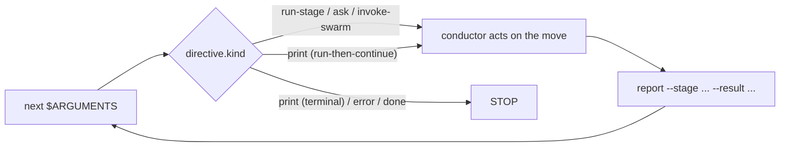

# The Orchestration Engine and Skill System

> 対象読者: Tier 2/3（team adopter、framework contributor）。

> **パス規約。** 以下の `<record>/` = アクティブな intent の record dir、`aidlc/spaces/<space>/intents/<YYMMDD>-<label>/`、ここに intent ごとの状態と runtime ファイルが住む。

この章は、すべての `/aidlc` 実行を駆動する orchestration アーキテクチャの正規リファレンスである: 「次は何か？」に答える決定論的な **engine**（`aidlc-orchestrate.ts`）、engine の答えに基づき行動する薄い **conductor**（`skills/aidlc/SKILL.md`）、両者を結ぶ **typed directive 契約**、runner ジェネレータが発する **複数形の skill** 集合、どの stage が走るかを決める **scope shape**、そして並列 Construction 作業を収束させる **swarm** referee である。これは、`SKILL.md` ボディ自体がすべてのルーティングロジックを保持していた、より古い散文 orchestrator モデルを置き換える。[Orchestrator](03-orchestrator.md)（conductor 自身の章）、[Runtime Graph](13-runtime-graph.md)（engine と swarm が読む実行真実の鏡）、[State Machine](12-state-machine.md)（`report` がコミットする transition）、[Hooks and Tools](06-hooks-and-tools.md)（Stop hook を含む決定論的スパイン）へクロスリンクせよ。

---

## 1. engine と conductor

このカットオーバーは 1 つの関心事を 2 つに分ける。**engine** は *stage 間ルーティング* を所有する — scope 解決、flag 優先順位のはしご、jump 方向の計算、resume と init のガード、stage シーケンス、gate ステータス、そしてワークフロー完了。**conductor** は *engine が名指した一手の中の実行品質* を所有する — ペルソナのフレーミング、良い質問をすること、stage diary を保つこと、stage 内の Keep/Modify/Redo ループ、そして gate で人間に判断を表面化すること。

engine は `core/tools/aidlc-orchestrate.ts` に著述され、各 harness に `<harness-dir>/tools/aidlc-orchestrate.ts`（例: `.claude/tools/`）として出荷される; それは正確に 3 つのサブコマンド `next`、`report`、`park` を持つ Bun CLI である。

| Subcommand | 役割 | 状態を変異する？ |
|------------|------|----------------|
| `next` | ワークフロー状態（アクティブな intent の `aidlc-state.md`、`aidlc/spaces/<space>/intents/<YYMMDD>-<label>/` 下）とコンパイル済み stage グラフ（`tools/data/stage-graph.json`）を読み、scope と位置を解決し、**正確に 1 つの** typed directive（JSON）を stdout に発する。 | No（文書化された推移的な例外が 1 つ: 既に intent を保持する workspace 上での no-state birth は、重複を birth するのではなく intent-pick プロンプトを発する）。 |
| `report` | conductor が directive に基づき行動した後に transition をコミットする。stage 認識の dispatcher: `--stage <slug>` が acted された directive をピン留めするので、recovered な `Current Stage` が report ターゲットを漂流させられない。承認、拒否、修正、完了、skip の結果を所有し、内部の状態 transition をアトミックにディスパッチし、明示的に報告された stage がなお `[-]` のとき承認の前に欠けた gate を開く。 | Yes。 |
| `park` | アクティブなワークフローを清い stage 間境界で一時停止する。後続の `next` 呼び出しに終端の `parked` directive を発させる `Parked` マーカーを書く; `/aidlc --resume` はルーティングが再開する前にマーカーをクリアする。 | Yes。 |

`report --result skipped` は main-workflow のライフサイクル結果であり、
single-run の結果ではない。明示的な非空の `--stage`、非空の
`--reason`、名指された stage が `Current Stage` に等しいこと、そして stage が
active か revising であることを要する。engine は 1 つの `STAGE_SKIPPED` を記録し、`[S]` を保存し、
`STAGE_COMPLETED` を発することなく次の stage を始める（またはワークフローを完了する）。
`report --single --result skipped` は拒否される。conductor は
対応する `aidlc-state.ts` ライフサイクル動詞を決して直接起動しない。

`next --stage <slug> --single` は `single: true`、`gate: false`、`next_stage: null` の
`run-stage` を発する。その typed マーカーは通常の gate
処理を上書きする: conductor はボディ、構成済みのトポロジと reviewer を走らせ、それから
`report --single --stage <slug> --result completed` を正確に 1 回呼ぶ。それは
workflow learnings を走らせず、承認 gate を開かず、main-workflow `next` を呼ばず、
park もしない。返された `done` が隔離された実行を終端する。

engine は設計上、決定論的なコードである — ルーティングは決定論の関心事なので、ツールに住み、LLM 散文には決して住まない（ルート文字列の構築を LLM に手渡すのは tool/agent/human のテーゼを反転させる）。それは既存の決定論的ライブラリを **compose** する: コンパイル済みグラフには `loadGraph()`、シーケンスには `nextInScopeStage()` / `firstInScopeStageOfPhase()`、scope 名集合には `validScopes()`、状態読み取りには `getField` / `parseCheckboxes`。非ハッピーパスの分岐（jump、resume、intent birth、scope/config change、env-scope 検証）は、兄弟の CLI ツールを shell out して compose し、それらの stderr を逐語で中継するので、ユーザー向けのエラー文言が再構築されることは決してない。engine が compose するのではなく *足す* 唯一のものは、`(観察された状態 + グラフ) → directive kind` をマップする決定ルールと、グラフノードの語彙名を正規の record-dir パス（`aidlc/spaces/<space>/intents/<YYMMDD>-<label>/<phase>/<stage>/...`）に変える成果物パス resolver である。

すべての directive は、表示される前に `aidlc-directive.ts` の凍結された契約に対し検証される; 不正な directive は、conductor が行動してしまう嘘を発するのではなく、非ゼロで exit する。

---

## 2. typed directive 契約

`aidlc-directive.ts` は、`kind` フィールドをキーとする **9 つ** の directive kind に対する discriminated union を定義する。各 directive はその kind が必要とするフィールドを正確に運び、kind ごとの許可キー集合で強制される（その kind の集合の外のフィールドは未知キーとして拒否される）。engine は **今日 7 つの kind を発する**; 2 つは、後のウェーブがそれらを配線するまでループを complete の形に保つ、文書化されたプレースホルダである。

| `kind` | 今日発する？ | conductor がすること |
|--------|----------------|--------------------------|
| `print` | Yes | `directive.message` が言うことを正確に行う — それが権威である。2 つの形状: **terminal**（status/help/doctor/version のような読み取り専用ユーティリティを名指す; それを走らせ、stdout を逐語で表示し、STOP）と **run-then-continue**（scope change、jump `execute`、またはユーザーが fresh な workspace で scope を明示的に名指した — flag または positional — ときに発される workflow-birth `init --scope <scope>` のような変異ツールを名指す; それを走らせ、それからループのステップ 1 に戻る）。変異は名指されたツールに住み、`next` には決して住まない。 |
| `error` | Yes | `directive.message` を逐語で表示し、STOP。recover したり取り繕ったりしない — メッセージがユーザー向けのエラーである。 |
| `done` | Yes | ワークフロー（または single-stage 実行）が完了である。完了サマリを提示し、STOP。 |
| `parked` | Yes | ワークフローは後のセッションのため清い stage 間境界（`directive.stage`）でフロー途中に park された。park されたことと resume の仕方（`/aidlc --resume`）をユーザーに伝え、それから STOP。`Parked` マーカーが設定されている（`aidlc-orchestrate park` が書く）間の素の `next` で発される; stage は前進しない。Stop hook は `parked` を terminal allow として扱うので、conductor は `done` に到達するため stage をラバースタンプするのではなく park する（#367）。 |
| `run-stage` | Yes | `rules_in_context` のすべての正確なパスを読み、それからその名簿が非空のとき `inline_context_paths` のすべてのパスを読む。ディスパッチされたトポロジでは、すべての agent brief に正確な rule パスを渡す。それから `directive.stage_file` を読み、stage ボディを走らせ、`produces` を書き、`directive.memory_path` で diary を保ち、`directive.gate` の前に任意の `directive.single` で分岐する（[Orchestrator](03-orchestrator.md) を参照）。`inline_context_paths` は既存のペルソナ、同梱の方法論、アクティブ space の knowledge ファイルを展開する: `inline` では lead + supports、`mob` では lead のみ、完全にディスパッチされた `subagent`/`pipeline` では空。directive はまた解決済みのルーティングフィールドをグラフノードから直接運ぶ: `lead_agent`、`support_agents`、`mode`、`gate`、`consumes`、`produces`、`rules_in_context`、`sensors_applicable`、`stage_file`、さらに `next_stage`（この後の次の in-scope stage の表示名、emit 時に解決される; 最終の in-scope stage では null）、conductor はこれを承認 gate の Approve オプションに逐語でレンダーする。 |
| `ask` | Yes | `directive.question` を `AskUserQuestion` 経由でレンダーし、それから人間の回答を次の `report` で `--user-input` で送り返す。engine は `AskUserQuestion` を決して自身で呼ばない — 人間のターンを conductor に委ねる。 |
| `invoke-swarm` | Yes | engine が適格な Construction バッチを swarm に許可した。conductor は `directive.units` の unit を fan-out し、swarm referee を参照しながら収束ループを走らせる（§6 を参照）。`autonomous` grant 下の適格な Construction バッチにのみ発される。 |
| `dispatch-subagent` | No（engine-future プレースホルダ） | 名指された stage を inline ではなく `Task` 呼び出しで *走らせるだろう*。今日は発されない; 投機的に実装しない。 |
| `present-gate` | No（engine-future プレースホルダ） | gate 儀式をそれ自身の directive として *走らせるだろう*; 今日は gate 決定が `run-stage` の `gate` フィールドに折り込まれている。 |

**gate センチネル。** `run-stage` の `gate` は、すべての決定論的ケースで boolean である（自動で進む bootstrap 初期化 stage では `false`、他のすべての EXECUTE stage では `true`）。1 つのケースは決定論的でない: 最初の Construction Bolt の gate は team の自由形式の `## Walking Skeleton` practices 散文に依存し、どの parser も導出できない。engine は文字列センチネル `GATE_UNRESOLVED`（`"unresolved"`）を発し、分類を conductor の knowledge-work に委ね、それがスタンスを `report --skeleton-stance <on|off|scope-dependent>` で手渡し戻す; 次の `next` が、今や決定した boolean gate で同じ stage を再発する。

**conductor ペルソナの配送。** conductor の実行品質の憲章は `aidlc-common/conductor.md` に一度だけ住む。どの skill もそれをパスで参照しない。代わりに engine がそれを読み、その内容を **ワークフローの最初の `run-stage` directive** の `conductor_persona` フィールドに焼き込む。conductor がそのフィールドを受け取ると、実行全体でそのペルソナを採る。これがすべてのエントリポイント — フレームワーク runner も手書きのものも — を、skill ごとの勤勉さ無しで 1 つのペルソナに保つ。

---

## 3. フォワーディングループと Stop hook

`skills/aidlc/SKILL.md` が **conductor** である: engine の directive に基づき行動する薄いフォワーディングループ。その制御構造の全体は:

```
Loop:
  1. directive = `bun .claude/tools/aidlc-orchestrate.ts next $ARGUMENTS`
  2. act on directive.kind
  3. `bun .claude/tools/aidlc-orchestrate.ts report --stage <directive.stage> --result <outcome> [--user-input "<text>"]` when the directive names a stage; omit `--stage` only for non-stage report round-trips.
  4. repeat unless directive.kind == done
```



図のテキスト記述: `next`（`$ARGUMENTS` を逐語で渡す）が 1 つの directive を返す。conductor は `directive.kind` で分岐する。`run-stage`、`ask`、`invoke-swarm`、および run-then-continue の `print` directive では、名指された一手を実行し `report` を呼び、それが `next` にループバックする。terminal の `print`、`error`、`done` ではループを止める。

`$ARGUMENTS` は最初の `next` に逐語で通り抜ける — engine が flag（`--status`、`--stage`、`--scope`、`--depth`、freeform テキスト）をパースするので、conductor はそれらを事前パースも剥ぎ取りもしない。`next` は何も変異しないので、ループは `report` が transition をコミットするときだけ進み、だから次の `next` は常に fresh な状態を読む。

インタラクティブな経路では conductor がループを保持する、なぜなら人間に質問できるのはそれだけだからである。ループが LLM の良い振る舞いに寄りかからないよう、**Stop hook**（`hooks/aidlc-stop.ts`）がそれを決定論的に強制する。それは 3 つのフロー変更 hook の 1 つである; state-transition と reviewer-scope の PreToolUse guard が他の 2 つで、残る 10 個の hook は advisory である。conductor がターンを終えようとするとき、Stop hook は `aidlc-orchestrate next` を走らせる; directive がなお保留中なら、stop をブロックし、directive を `reason` フィールド経由で **オンタスクの継続** として言い換えて注入し戻す（それはまだ負っている仕事 - ループを走らせ、行動し、report する - を名指し、override の形をした指示は決してしない、それは conductor の安全訓練が拒否するだろう）。`done` または `parked` directive（後者は `aidlc-orchestrate park` から、後のセッションのためのサポートされたフロー途中の一時停止）は stop を許す。いくつかの保留中のケースも *ブロックされない*: **human-wait 免除** は、conductor が正しく人間で park している（または単に雑談している）とき stop を許す - 現在の stage が積極的に `[?]` 承認待ち、`[R]` 修正中、正規または正確なアクティブ unit の `<slug>-questions.md` に未回答の `[Answer]:` タグがあって `[-]` 進行中（保留中の stage 途中の明確化質問）、または終了しつつあるターンが会話的だった（人間の最後のプロンプトがワークフローエンジン呼び出し無しで応答された、harness トランスクリプトから読み取る; 読み取り専用の `--status`/`--doctor` クエリは関与に数えない）。最後の 2 つは自律 Construction 下では抑制されるので、無人の実行は動き続ける; 会話的ケースは Kiro でも不活性で、Kiro はトランスクリプトを届けず、そこではインタラクティブ cap が代わりの解放経路である。そこでブロックすれば nudge をスパムするだけである（積極的確認のみ; human-wait チェックは fail open、会話的チェックは fail closed する; ステートレスなケースと本物の stage 途中の中断はなおブロックする）。2 つの境界がスタックしたループにセッションを罠にかけさせない: Claude Code の `stop_hook_active` シグナルと、`<record>/.aidlc-stop-hook/`（アクティブな intent の record dir の中）に永続化される no-progress カウンタ。連続する no-progress ブロックが上限（`CLAUDE_CODE_STOP_HOOK_BLOCK_CAP`、その既定は run-mode 認識: **インタラクティブ実行で 2、自律 Construction 下で 8**）に達すると hook は手放す; ワークフローの前進は位置シグネチャを変えカウンタを 0 にリセットするので、健全なループは決してスロットルされない。アクティブなワークフローが無い場合、またはあらゆる予期しないエラーで、hook は fail open する - 非 AIDLC セッションを決してブロックしない。

---

## 4. 複数形の skill、runner、そして共有スパイン

orchestrator は多くの skill の中の 1 つである。各 harness はその skills ディレクトリ（`<harness-dir>/skills/`、例: `dist/claude/.claude/skills/`）の下に複数形の集合を出荷する: ベースの `aidlc` orchestrator、runnable な stage ごとに 1 つの **stage-runner**（core stage は `aidlc-<slug>`; plugin 所有の stage は素の plugin プレフィックス付き slug を使う）、`runner: true` の scope ごとに 1 つの **scope-runner**（core scope は `aidlc-<scope>`; plugin 所有の scope は素の名前を使う）、読み取り専用のセッション skill（`aidlc-session-cost`、`aidlc-replay`、`aidlc-outcomes-pack`）、そして `aidlc-init`。ルーティングと実行の知識のすべては、`core/aidlc-common/`（`<harness-dir>/aidlc-common/` として出荷）に著述された **共有スパイン** に一度だけ住む: `conductor.md` ペルソナ、`protocols/`、そして `stages/{initialization,ideation,inception,construction,operation}/` の下の 32 個の stage ファイル。

runner skill は、`tools/aidlc-runner-gen.ts` によって生成され、決して手書きされない:

- **Stage-runner** は opt-in の糖衣である。各 core `/aidlc-<slug>`（または plugin 所有の `/<plugin>-<slug>`）は `/aidlc --stage <slug> --single`（それ無しでも動く）を、engine の `--single` モード経由で 1 つの stage を隔離して走らせ、main ワークフローの `Current Stage` を決して前進させない、タイプ可能なコマンドにパッケージする。発される `single: true` directive は workflow learnings と承認 gate を迂回し、その合成のライフサイクルペアを `report --single` 経由でコミットし、返された `done` で止まる。slug リストは `loadGraph()` — コンパイル済みの唯一の真実の源 — から来るので、グラフに足された stage はここでの編集無しで runner に流れ込む。bootstrap 初期化 stage は除外される（それらは単独の `--single` の意味を持たない; `--single` はそれらを拒否する）、そして初期化 phase 全体は engine の intent-birth の一手をパッケージする 1 つの `/aidlc-init` runner として出荷される。
- **Scope-runner** は既に runnable なコマンドをパッケージする; scope ファイルが定義を保持し、`runner: true` で既定の生成集合に opt-in する。各々は、`aidlc-orchestrate next --scope <scope>` を固定 scope・検出なしで `done` まで駆動する短いシェルである。フル scope 集合は `/aidlc --scope <name>` 経由で到達可能なまま残る; runner はトラフィックの多いものと opt-in する任意の plugin scope に対するタイプ可能な糖衣である。

2 つの drift guard がディスク上の runner 集合をそのソースにピン留めする: stage-runner には `aidlc-runner-gen.ts check`、scope-runner には `scopes --check`、両方 CI で走る。runner は **`hooks:` ブロックを運ばない** — ワークフロースパインの hook は `settings.json` に project-wide で住むので、決定論的スパインは継承され、コピーされない。そしてどの runner も `conductor.md` を手でロードしない: engine が最初の `next` でペルソナを配送する。

---

## 5. Scope shape

scope はファイル著述のプリミティブであり、sensor や agent を著述するのと同じ筋肉記憶である。**`scope-mapping.json` は無い** — 出荷ツリーから除かれた。scope の identity と stage メンバーシップは、2 つのファイル著述サーフェスに分かれ、コンパイル済みグリッドに転置される:

1. **Identity** は scope ごとに 1 ファイル、`dist/claude/.claude/scopes/aidlc-<name>.md` に住む — frontmatter（`name`、`depth`、`keywords`、`description`、任意の `runner`）に scope を記述する散文を加えたもの。出荷される集合は `bugfix`、`enterprise`、`feature`、`infra`、`mvp`、`poc`、`refactor`、`security-patch`、`workshop`。
2. **Membership** は各 stage の `scopes:` frontmatter に住む — その stage が EXECUTE となる scope のリスト。

`bun .claude/tools/aidlc-graph.ts compile`（`stage-graph.json` を生むのと同じコンパイルパス）は、これらを `tools/data/scope-grid.json` のグリッド — engine がすべての scope レベルのルーティングで読む `scope → {stages: {slug: EXECUTE|SKIP}}` マップ — に転置する。engine の `validScopes()` は、その正規の scope 名集合をそのコンパイル済みグリッドから導出する。

scope の追加は純粋に additive である: `.claude/scopes/aidlc-<name>.md` を落とし、メンバーの stage の `scopes:` リストにタグを付け、再コンパイルし、`SKILL.md` の人間可読サマリ表を再生成する。dispatch-logic の編集は不要で、drift guard がディスク上の集合の乖離を防ぐ。

---

## 6. swarm referee、driver seam、そして Bolt-DAG

**swarm** は、人間が許可した autonomy 下で並列 Construction 作業がどう収束するかである。ライブな `/aidlc` セッションの中でだけ発火するので、conductor（そのセッション）が fan-out とリトライループを所有する; `tools/aidlc-swarm.ts` は、conductor がループ自体を所有する間に参照する決定論的な **referee** である。これは収束に適用された three-concerns の分割である: conductor が fan-out とリトライ決定（knowledge）を所有し、tool が収束の判定 + merge + audit（determinism）を所有し、human が autonomy を許可し失敗エンベロープで baton を取り戻す（judgement）。

referee は **ステートレス** である — イテレーションカウンタも、永続化された進捗も無い — 3 つのサブコマンドを持つ:

| Subcommand | 役割 | 発行 |
|------------|------|-------|
| `prepare --batch <n> --units <a,b,c> [--base <branch>] [--degraded-from <subagent\|ultracode>]` | unit ごとに隔離された git worktree を fork する（`aidlc-worktree create` + `aidlc-bolt start --worktree` を compose）。どの worker よりも前に走るので、`check` に折り込めない。 | `SWARM_STARTED`（loud なダウングレードが報告されたとき `SWARM_DEGRADED` も）。 |
| `check <unit> --check-cmd <cmd> [--test-file <path>]` | ステートレスな単一 unit の判定: プロジェクト自身のチェックコマンドを走らせ（exit 0 = green、権威あるシグナル — worker の自己申告は決して信用されない）、加えて保護されたファイルをその fork された git ベースラインと anti-tamper 比較する。`{converged, tampered, reason}` を表示する; 本当に収束したときにのみ exit 0。 | None（advisory; conductor のリトライ決定に情報を与える）。 |
| `finalize --batch <n> --units <a,b,c> --claimed <a,b> --check-cmd <cmd> [--test-file <path>] [--reasons <unit>=<reason>,…]` | 権威ある gate: **すべての claimed な unit でチェックを再実行** し、現在の stage が reviewer を宣言するとき、その Bolt が始まった後のその unit の合致する terminal receipt を要求する。red、tampered、または unreviewed な claimed unit は merge の前に拒否される（嘘つき conductor ガード）、それから本物の pass は serial HOLD-MERGE ロック下で merge され戻る。exit 0（バッチ収束・merge 済み）または 2（失敗エンベロープ）。merge-back が失敗した収束 unit は `merge_failures` に着地し、その unit にスコープされた finalize リトライが merge するまで `SWARM_UNIT_CONVERGED` 行を得ない。 | `SWARM_UNIT_CONVERGED` / `SWARM_UNIT_FAILED` / `SWARM_BATON_RETURNED` / `SWARM_COMPLETED`。 |

これら 6 つの `SWARM_*` イベントは 74 イベントの audit 分類体系の一部である（[State Machine](12-state-machine.md) を参照）。exit-2 のエンベロープでは conductor が baton を取り戻す - 失敗は autonomy モードに関わらず常に halt して人間を再び関与させる。

**driver seam。** `AIDLC_USE_SWARM=1` はインラインの Dynamic Workflow driver を選ぶ（conductor が、unit ごとの pipeline とイテレーション cap を JS が所有する `Workflow` を著述する）; 未設定は subagent floor（1 つのメッセージで unit ごとに 1 つ、N 個の並列 `Task` 呼び出し）を選ぶ。`=1` だが Workflow ツールが利用不可なら、conductor は floor へ **loud-degrade** し、`--degraded-from ultracode` を渡すので referee は `SWARM_DEGRADED` を発する。暴走のバックストップはツール内の cap ではない - それは harness の Stop-hook の上限であり、この自律 Construction 経路では 8 ブロックである（§3）。

**Bolt-DAG。** swarm が fan-out するバッチは、`runtime-graph.json` の `bolt_dag` ノード（[Runtime Graph](13-runtime-graph.md) を参照）から来て、units-generation の `unit-of-work-dependency.md` のエッジブロックからパースされる。ノードは `units`（各々がその `depends_on` リスト付き）と `batches` — 各 unit の依存が先行バッチで満たされる topological なレベル、なのでバッチの unit は並列に fan-out できる — を運ぶ。ノードは有効なエッジブロックがディスクに存在するときにのみ在る; 不在、不正、または cyclic なブロックはノードを完全に省く（gate 時の required-sections sensor がそれらを上流でフラグする）。

---

## Next Steps

- **conductor 自身の章** — フォワーディングループ、gate 儀式、learnings 儀式の全容。[Orchestrator](03-orchestrator.md) を参照。
- **engine と swarm が読む実行真実の成果物** — `runtime-graph.json` とその `bolt_dag` ノード。[Runtime Graph](13-runtime-graph.md) を参照。
- **`report` がコミットする transition** - workflow / phase / stage の machine と 74 イベントの audit 分類体系。[State Machine](12-state-machine.md) を参照。
- **決定論的スパイン** — Stop hook と他のフレームワークの hook とツール。[Hooks and Tools](06-hooks-and-tools.md) を参照。
- **runner を日々使う** — タイプ可能な `/aidlc-<stage>` と `/aidlc-<scope>` コマンド。User Guide の [Skills and Runner Commands](../guide/17-skills.md) を参照。
