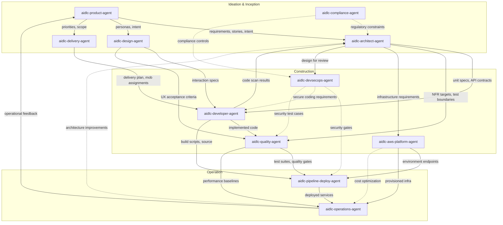

# Agent Reference

AI-DLC の 14-agent 陣容の技術リファレンス: 11 のドメインエキスパート、2 つの
review-only agent、そして適応ワークフローの composer。

設計思想と根拠は、[ユーザーガイドの Agents の章](../../guide/06-agents.md) を参照。

---

## 14 の Agent（ドメインエキスパート 11 + レビュアー 2 + composer）

| # | Agent | ドメイン |
|---|-------|--------|
| 1 | [aidlc-product-agent](product-agent.md) | 要件、scope、user story、市場調査 |
| 2 | [aidlc-design-agent](design-agent.md) | UX/UI、ワイヤーフレーム、インタラクションデザイン、アクセシビリティ |
| 3 | [aidlc-delivery-agent](delivery-agent.md) | チーム編成、キャパシティ計画、デリバリーの順序付け |
| 4 | [aidlc-architect-agent](architect-agent.md) | アプリケーション設計、ドメインモデリング、NFR、分解 |
| 5 | [aidlc-aws-platform-agent](aws-platform-agent.md) | AWS インフラ、IaC、FinOps、環境プロビジョニング |
| 6 | [aidlc-compliance-agent](compliance-agent.md) | GRC、規制マッピング、データ分類、リスク |
| 7 | [aidlc-devsecops-agent](devsecops-agent.md) | 脅威モデリング、security pipeline、セキュア設計レビュー |
| 8 | [aidlc-developer-agent](developer-agent.md) | コード生成、リバースエンジニアリング、実装ガイダンス |
| 9 | [aidlc-quality-agent](quality-agent.md) | テスト戦略、受け入れ基準、性能検証 |
| 10 | [aidlc-pipeline-deploy-agent](pipeline-deploy-agent.md) | CI/CD pipeline、デプロイ戦略、リリース実行 |
| 11 | [aidlc-operations-agent](operations-agent.md) | 可観測性、インシデント対応、フィードバックループ |
| 12 | aidlc-product-lead-agent | レビュー専任: 要件 / user-story / UX の品質 gate（balanced tier） |
| 13 | aidlc-architecture-reviewer-agent | レビュー専任: 技術設計の健全性 / 実装可能性 gate（balanced tier） |
| 14 | aidlc-composer-agent | 適応的なワークフロー構成: あつらえた stage 計画と、保留中 stage の再形成を提案する |

---

## 共有設定

14 の agent はすべて、frontmatter で定義される共通の設定ベースラインを共有する。どれも `tools:` allowlist を宣言しないため、すべての agent が **セッションの全ツールセット** を継承する — Claude Code の組み込みツールすべてに加え、セッションにプロビジョニングされた任意の MCP ツールである。出荷される唯一の制限は `disallowedTools: Task` である。

### セッションのツールセット（すべての agent が継承）

すべての agent は組み込みの Claude Code ツールを継承する。以下を含む:

| Claude Code ツール | 目的 |
|------------------|---------|
| Read | ファイルシステムからファイルを読む |
| Edit | ファイル内で厳密な文字列置換を行う |
| Write | ファイルシステムへファイルを書く |
| Glob | 高速なファイルパターンマッチング |
| Grep | ripgrep を用いたコンテンツ検索 |
| AskUserQuestion | 対話的なユーザープロンプト（main-thread stage のみ） |

### 共通で禁止される Claude Code ツール

| Claude Code ツール | 理由 |
|------------------|--------|
| Task | agent は委譲されたワーカーとして動作する。conductor（稼働中の `/aidlc` session）が agent を走らせる `Task` 呼び出しを行い、agent 自身は決して subagent を生成しない。`disallowedTools: Task` は subagent チェーンの連鎖を避ける。 |

### 各 persona が行使すると想定されるツール

すべての agent は継承により Bash と WebSearch に *到達できる*; この表は、方法論がどの persona にそれらの使用を **期待する** かを記録するのであり、agent ごとの付与ではない。persona を真に制限するには、任意の `tools:` allowlist を足す（`mcp__<server>__<tool>` の id も列挙しない限り、継承された MCP は落ちる）— この実装はそうした制限を一切出荷しない。

| Claude Code ツール | 行使が想定される agent |
|------------------|---------------------|
| Bash | aidlc-aws-platform-agent, aidlc-devsecops-agent, aidlc-developer-agent, aidlc-quality-agent, aidlc-pipeline-deploy-agent, aidlc-operations-agent |
| WebSearch | aidlc-product-agent, aidlc-design-agent, aidlc-compliance-agent |

### Agent の tier

| Tier | Agent |
|------|--------|
| judgment | aidlc-architect-agent, aidlc-product-agent, aidlc-design-agent, aidlc-developer-agent, aidlc-quality-agent, aidlc-devsecops-agent, aidlc-compliance-agent, aidlc-aws-platform-agent, aidlc-composer-agent |
| balanced | aidlc-architecture-reviewer-agent, aidlc-product-lead-agent |
| templated | aidlc-delivery-agent, aidlc-pipeline-deploy-agent, aidlc-operations-agent |

出荷される各 agent は、著述された frontmatter に `tier:` を宣言する; packager は
それを各 harness のネイティブな model/effort キーへ射影する（Claude Code では:
judgment -> `model: inherit`（effort の固定なし）、balanced -> `model: sonnet`
（effort の固定なし）、templated -> `model: sonnet` + `effort: medium`）。
したがって judgment agent が、セッション自身の model と effort より下へ格下げされる
ことは決してない。agent が templated になるのは、その出力が支配的にパターン追従的な
とき — delivery 計画、CI/CD YAML、observability と runbook の scaffolding — かつ
方法論がすでに agent の knowledge ファイルに符号化されているときだけである。

9 つの judgment agent は 1 つの性質を共有する: その仕事は、決定が下流へ波及する複数
制約の推論を要する。アーキテクチャ境界、曖昧な intent の解釈、UX のトレードオフ、
密なコンテキスト下でのコード合成、リスクベースのテスト戦略、脅威の優先順位付け、
規制のエッジケース、クラウドアーキテクチャのトレードオフが、すべてこのカテゴリに
入る。2 つの balanced reviewer は、明示的な基準に照らして新規の入力を評価する —
チェックリストが手法を符号化するので、セッションの effort の中型モデルで足りる
（Claude Code・Codex・opencode では; Kiro では全 tier がセッションの model と effort
を継承する）。射影表と `tier_cap` オーバーライドは [Agent System](../05-agent-system.md)
を参照。

---

## Agent サマリ表

| Agent | リードする stage | 支援する stage | Tier | 行使が想定されるツール |
|-------|-------------|----------------|-------|------------------------------|
| [aidlc-product-agent](product-agent.md) | intent-capture, market-research, scope-definition, requirements-analysis, user-stories | rough-mockups, approval-handoff, refined-mockups | judgment | WebSearch |
| [aidlc-design-agent](design-agent.md) | rough-mockups, refined-mockups | user-stories, application-design | judgment | WebSearch |
| [aidlc-delivery-agent](delivery-agent.md) | team-formation, approval-handoff, delivery-planning | scope-definition, units-generation | templated | -- |
| [aidlc-architect-agent](architect-agent.md) | feasibility, application-design, units-generation, functional-design, nfr-requirements, nfr-design | intent-capture, reverse-engineering （統合）, delivery-planning | judgment | -- |
| [aidlc-aws-platform-agent](aws-platform-agent.md) | infrastructure-design, environment-provisioning | feasibility, application-design, nfr-design, feedback-optimization | judgment | Bash |
| [aidlc-compliance-agent](compliance-agent.md) | （なし） | feasibility, nfr-requirements, infrastructure-design, environment-provisioning | judgment | WebSearch |
| [aidlc-devsecops-agent](devsecops-agent.md) | （なし） | practices-discovery, nfr-requirements, infrastructure-design, build-and-test, environment-provisioning | judgment | Bash |
| [aidlc-developer-agent](developer-agent.md) | reverse-engineering （コードスキャン）, code-generation | practices-discovery, user-stories, functional-design, deployment-execution | judgment | Bash |
| [aidlc-quality-agent](quality-agent.md) | build-and-test, performance-validation | practices-discovery, user-stories, nfr-requirements | judgment | Bash |
| [aidlc-pipeline-deploy-agent](pipeline-deploy-agent.md) | practices-discovery, ci-pipeline, deployment-pipeline, deployment-execution | （なし） | templated | Bash |
| [aidlc-operations-agent](operations-agent.md) | observability-setup, incident-response, feedback-optimization | （なし） | templated | Bash |

---

## Agent 比較マトリクス

次の 2 列の `Yes` は、方法論が persona にその継承ツールの使用を期待することを意味する; アクセスを付与も剥奪もしない。

| Agent | Bash の想定利用 | WebSearch の想定利用 | Tier | リードする stage | 支援する stage | stage 関与の合計 |
|-------|-------------------|------------------------|------|-------------|----------------|-------------------------|
| aidlc-product-agent | No | Yes | judgment | 5 | 3 | 8 |
| aidlc-design-agent | No | Yes | judgment | 2 | 2 | 4 |
| aidlc-delivery-agent | No | No | templated | 3 | 2 | 5 |
| aidlc-architect-agent | No | No | judgment | 6 | 3 | 9 |
| aidlc-aws-platform-agent | Yes | No | judgment | 2 | 4 | 6 |
| aidlc-compliance-agent | No | Yes | judgment | 0 | 4 | 4 |
| aidlc-devsecops-agent | Yes | No | judgment | 0 | 5 | 5 |
| aidlc-developer-agent | Yes | No | judgment | 2 | 4 | 6 |
| aidlc-quality-agent | Yes | No | judgment | 2 | 3 | 5 |
| aidlc-pipeline-deploy-agent | Yes | No | templated | 4 | 0 | 4 |
| aidlc-operations-agent | Yes | No | templated | 3 | 0 | 3 |

**観察:**
- aidlc-architect-agent は最も広い stage 関与を持つ（3 phase にわたる 9 stage）。設計の中心的な権威としての役割を反映している。
- 14-agent 陣容の全体では、9 つの agent が `judgment` tier を帯び、5 つが Claude Code・Codex・opencode で格下げされる（2 つの `balanced` reviewer に加え 3 つの `templated` planner; Kiro では全 tier がセッションの model と effort を継承するため、そこではどの agent も格下げされない）; 格下げされる agent は、明示的なチェックリストに照らしたレビューか、支配的に templated な計画・CI/CD・runbook の作業を生む。上の表は 11 のドメインエキスパート agent を扱う。
- aidlc-compliance-agent は純粋に助言的な立場で動作する（Ideation・Construction・Operation にわたる 4 つの support stage; lead stage は無し）。
- 11 のうち 6 つの agent が、CLI 操作のために Bash を使うと想定される（インフラ、セキュリティ、開発、テスト、デプロイ、運用）。
- 3 つの agent が、調査タスクのために WebSearch を使うと想定される（product、design、compliance）。

---

## Phase への参加

この表は、どの agent がどの phase でアクティブか、そしてその phase で lead（L）と
support（S）のどちらを務めるかを示す。

| Agent | Initialization（Phase 0） | Ideation（Phase 1） | Inception（Phase 2） | Construction（Phase 3） | Operation（Phase 4） |
|-------|--------------------------|---------------------|---------------------|------------------------|---------------------|
| aidlc-product-agent | -- | L (intent-capture, market-research, scope-definition), S (rough-mockups, approval-handoff) | L (requirements-analysis, user-stories), S (refined-mockups) | -- | -- |
| aidlc-design-agent | -- | L (rough-mockups) | L (refined-mockups), S (user-stories, application-design) | -- | -- |
| aidlc-delivery-agent | -- | L (team-formation, approval-handoff), S (scope-definition) | L (delivery-planning), S (units-generation) | -- | -- |
| aidlc-architect-agent | -- | L (feasibility), S (intent-capture) | L (application-design, units-generation), S (reverse-engineering, delivery-planning) | L (functional-design, nfr-requirements, nfr-design) | -- |
| aidlc-aws-platform-agent | -- | S (feasibility) | S (application-design) | L (infrastructure-design), S (nfr-design) | L (environment-provisioning), S (feedback-optimization) |
| aidlc-compliance-agent | -- | S (feasibility) | -- | S (nfr-requirements, infrastructure-design) | S (environment-provisioning) |
| aidlc-devsecops-agent | -- | -- | S (practices-discovery) | S (nfr-requirements, infrastructure-design, build-and-test) | S (environment-provisioning) |
| aidlc-developer-agent | -- | -- | L (reverse-engineering), S (practices-discovery, user-stories) | L (code-generation), S (functional-design) | S (deployment-execution) |
| aidlc-quality-agent | -- | -- | S (practices-discovery, user-stories) | L (build-and-test), S (nfr-requirements) | L (performance-validation) |
| aidlc-pipeline-deploy-agent | -- | -- | L (practices-discovery) | L (ci-pipeline) | L (deployment-pipeline, deployment-execution) |
| aidlc-operations-agent | -- | -- | -- | -- | L (observability-setup, incident-response, feedback-optimization) |

---

## Agent 協働マップ



### Text Fallback

```
aidlc-product-agent
  |-- requirements, stories --> aidlc-architect-agent
  |-- personas, intent -------> aidlc-design-agent
  |-- priorities, scope ------> aidlc-delivery-agent

aidlc-design-agent
  |-- interaction specs ------> aidlc-developer-agent
  |-- UX acceptance criteria -> aidlc-quality-agent

aidlc-architect-agent
  |-- unit specs, API contracts --> aidlc-developer-agent
  |-- NFR targets, test boundaries --> aidlc-quality-agent
  |-- infrastructure requirements --> aidlc-aws-platform-agent
  |-- design for review -----------> aidlc-devsecops-agent

aidlc-compliance-agent
  |-- regulatory constraints ....> aidlc-architect-agent
  |-- compliance controls .......> aidlc-devsecops-agent

aidlc-devsecops-agent
  |-- security gates ............> aidlc-pipeline-deploy-agent
  |-- secure coding requirements > aidlc-developer-agent
  |-- security test cases .......> aidlc-quality-agent

aidlc-delivery-agent
  |-- delivery plan, mob assignments --> aidlc-developer-agent

aidlc-developer-agent
  |-- code scan results --> aidlc-architect-agent
  |-- implemented code ---> aidlc-quality-agent
  |-- build scripts ------> aidlc-pipeline-deploy-agent

aidlc-quality-agent
  |-- test suites, quality gates --> aidlc-pipeline-deploy-agent
  |-- performance baselines ------> aidlc-operations-agent

aidlc-aws-platform-agent
  |-- environment endpoints --> aidlc-pipeline-deploy-agent
  |-- provisioned infra -----> aidlc-operations-agent

aidlc-pipeline-deploy-agent
  |-- deployed services --> aidlc-operations-agent

aidlc-operations-agent
  |-- operational feedback -------> aidlc-product-agent  (CLOSES THE LOOP)
  |-- architecture improvements .> aidlc-architect-agent
```

---

## 関連リンク

- [アーキテクチャ概要](../01-architecture.md)
- [Orchestrator](../03-orchestrator.md)
- [Agent System](../05-agent-system.md)
- [Stage ドキュメント](../04-stages/)
- [ユーザーガイドの Agents の章（哲学と根拠）](../../guide/06-agents.md)
- [SKILL.md（Conductor）](../../../dist/claude/.claude/skills/aidlc/SKILL.md) -- engine directive に基づいて動作する転送ループ; 人間可読な stage-graph mirror を運ぶ
