# AI-DLC ワークフロー図

本ドキュメントは、AI-DLC（AI-Driven Development Life Cycle）方法論を可視化するすべての Mermaid 図を収める。各節は短い説明のあとにレンダリング済みの図を置く。これらの図は、engine と conductor（`aidlc-orchestrate.ts` + `SKILL.md`）、stage protocol（`stage-protocol.md`）、stage ファイル、agent 定義から導出したものである。

> **Note:** これらの図は、対応するリファレンス各章にもインラインで埋め込まれている。本ファイルは、すべての図を 1 か所に集約したインデックスとして機能する。下の図中の `<record>/` = アクティブな intent の record dir、`aidlc/spaces/<space>/intents/<YYMMDD>-<label>/`。
>
> - 図 1 と 7: [Architecture](01-architecture.md)
> - 図 8: [Orchestrator](03-orchestrator.md) -- Session Management セクション
> - 図 9: [Orchestrator](03-orchestrator.md) -- Scope Routing セクション
> - 図 10: [Knowledge System](10-knowledge-system.md)
> - 図 11: [Stage Protocol](04-stage-protocol.md) -- Approval Gates セクション
> - 図 12: [Orchestrator](03-orchestrator.md) -- State Tracking セクション

---

## 1. エンドツーエンドのライフサイクル

AI-DLC 方法論は、作業を 5 つの逐次的な phase に編成する。各 phase はその境界に verification gate を持ち、それが通過しなければ次の phase は始まらない。完全なライフサイクルは 5 つの phase にまたがる 32 の stage に及び、どの stage が実際に実行されるかは scope が決める。

```mermaid
graph LR
    subgraph INITIALIZATION["INITIALIZATION (0.1-0.3)"]
        Z1["Workspace Scaffold"]
        Z4["State Init"]
        Z1 -.->|"3 stages"| Z4
    end

    subgraph IDEATION["IDEATION (1.1-1.7)"]
        I1["Intent Capture"]
        I7["Approval & Handoff"]
        I1 -.->|"7 stages"| I7
    end

    subgraph INCEPTION["INCEPTION (2.1-2.8)"]
        N1["Reverse Engineering"]
        N7["Delivery Planning"]
        N1 -.->|"8 stages"| N7
    end

    subgraph CONSTRUCTION["CONSTRUCTION (3.1-3.7)"]
        C1["Functional Design"]
        C7["CI Pipeline"]
        C1 -.->|"3.1-3.5 per Bolt; 3.6-3.7 once after all Bolts"| C7
    end

    subgraph OPERATION["OPERATION (4.1-4.7)"]
        O1["Deployment Pipeline"]
        O7["Feedback & Optimization"]
        O1 -.->|"7 stages"| O7
    end

    Z4 -->|"auto-proceed"| I1
    I7 -->|"Verification Gate 1"| N1
    N7 -->|"Verification Gate 2"| C1
    C7 -->|"Verification Gate 3"| O1
    O7 -.->|"Feedback Loop"| I1

    style INITIALIZATION fill:#f3e5f5,stroke:#9c27b0
    style IDEATION fill:#e8f5e9,stroke:#4caf50
    style INCEPTION fill:#e3f2fd,stroke:#2196f3
    style CONSTRUCTION fill:#fff3e0,stroke:#ff9800
    style OPERATION fill:#fce4ec,stroke:#e91e63
```

---

## 2. Ideation フロー

Ideation phase は、ビジネス上の intent を捉え、feasibility を検証し、scope を定義し、チームを編成し、rough mockup を作り、承認用の initiative brief を生成する。ALWAYS と記された stage はすべての scope で実行される; CONDITIONAL の stage は特定の scope でスキップされる（例: poc, bugfix, refactor は Market Research をスキップする）。実線の矢印は ALWAYS のルーティングを、破線の矢印は CONDITIONAL のルーティングを示す。

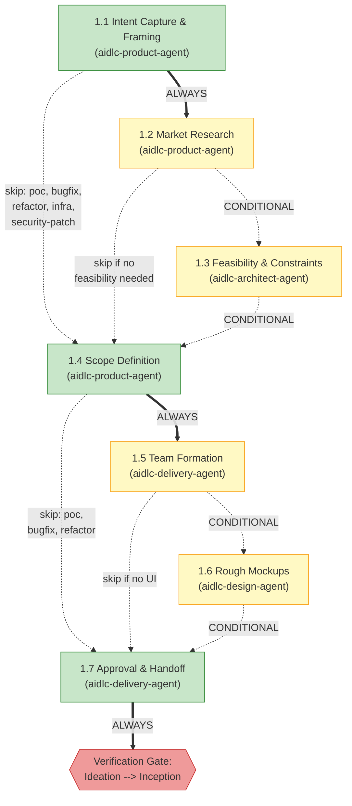

---

## 3. Inception フロー

Inception phase は、（brownfield プロジェクトでは）コードベースを分析し、チームの practices を発見し、要件を引き出し、user story と mockup を生成し、アプリケーションアーキテクチャを設計し、実装 unit に分解し、デリバリを計画する。Stage 2.1（Reverse Engineering）は pipeline（2-link チェーン）として走り、六角形で示される: まず developer subagent がコードをスキャンし、次に architect subagent が結果を統合して成果物を書く。

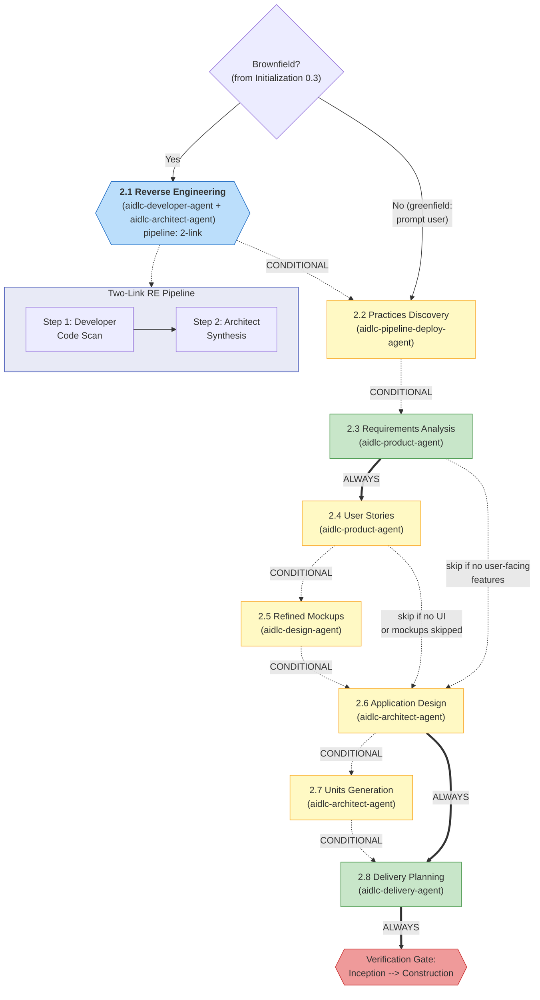

---

## 4. Construction フロー

Construction phase は、`bolt-plan.md` に従って Bolt 単位で実行する。各 Bolt は 1 つ以上の Units of Work のまとまったスライスをカバーし、stage 3.1–3.5 を一度走らせる。walking-skeleton の Bolt は常に single-Bolt バッチとして最初に走る; 後続の Bolt は依存グラフが許す限り並列バッチで走ってよい。最後の Bolt のあと、stage 3.6（Build and Test）と 3.7（CI Pipeline）が全 Bolt を通じて一度走る。Stage 3.5（Code Generation）は subagent として走り、六角形で示される。

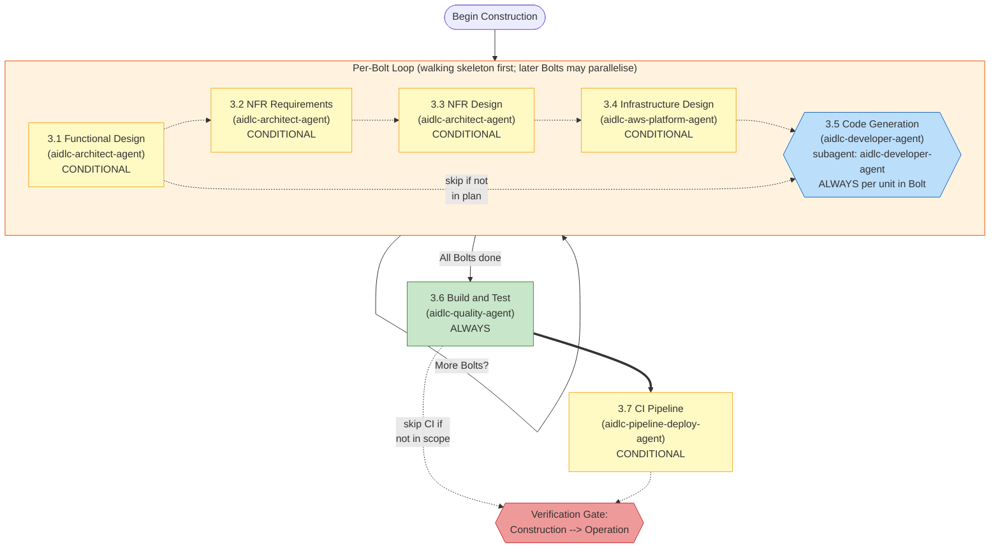

---

## 5. Operation フロー

Operation phase は、デプロイ、環境プロビジョニング、observability、インシデント対応、パフォーマンス検証、フィードバックをカバーする。7 つの stage はすべて CONDITIONAL である（phase 全体が poc と bugfix の scope でスキップされることがある）。すべての stage は inline で走る。Stage 4.7 は終端の stage である; 承認されると、ワークフローは完了するか、新しい Ideation サイクルを始められる。

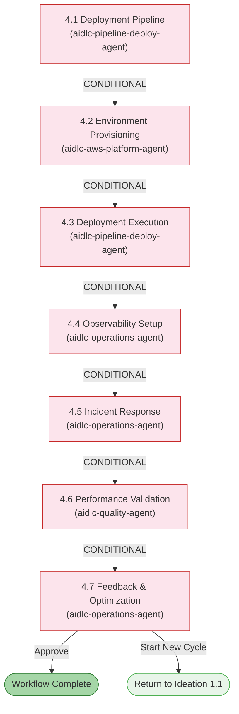

---

## 6. Agent コラボレーションマップ

完全な 14 agent の陣容は、11 の domain agent、2 つの review-only agent、そして adaptive-workflows composer から成る。この図は、意図的に 11 の domain agent とそれらの主要な成果物フローを扱う。review-only agent は独立した product とアーキテクチャのチェックを行い、composer は適応的な stage plan を提案し再形成する; [Agent Reference](agents/README.md) と [Reviewer Invocation](04-stage-protocol.md#reviewer-invocation) を参照。

conductor（SKILL.md）は、engine の指示どおりに各 agent の呼び出しを行う; agent どうしが直接呼び合うことは決してない。情報は、intent の record dir（`aidlc/spaces/<space>/intents/<YYMMDD>-<label>/`）に格納された成果物を通じて agent 間を流れる。図は、aidlc-operations-agent から aidlc-product-agent へ戻るフィードバックループで締めくくられる。

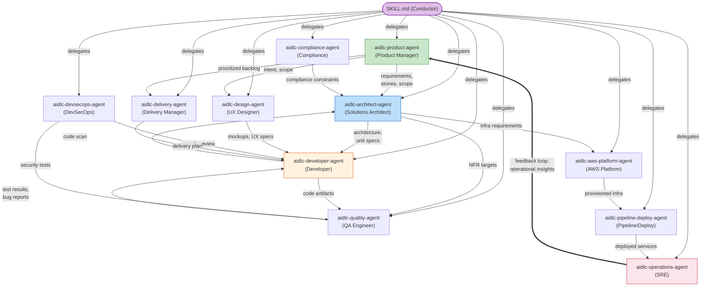

---

## 7. 実行モデル

この実装は、stage について 4 つの実行モードをアクティブに使う。**Inline** の stage は、orchestrator の会話の中で直接実行される（ユーザーは対話できる）。**Subagent** の stage は、Claude Code Task tool を介して単一の agent に委譲する（stage が support agent を宣言するとき hub-and-spoke になる）。**Pipeline** の stage は agent を逐次に連鎖させ、各リンクが work product を前進させる（Reverse Engineering が同梱の例である）。**Mob** の stage は、すべての support agent を並列ラウンドで召集する（User Stories が同梱の例である）。

```mermaid
flowchart LR
    subgraph INLINE["Mode 1: Inline"]
        direction TB
        IN1["Orchestrator reads\nstage file"]
        IN2["Load agent persona\n+ knowledge"]
        IN3["Execute stage steps\ndirectly in conversation"]
        IN4["User interaction\navailable"]
        IN5["Approval gate\n(AskUserQuestion)"]
        IN1 --> IN2 --> IN3 --> IN4 --> IN5
    end

    subgraph SUBAGENT["Mode 2: Subagent (simple)"]
        direction TB
        SA1["Orchestrator reads\nstage file"]
        SA2["Prepare context:\nartifacts + persona"]
        SA3["Task tool call\n(subagent_type specified)"]
        SA4["Subagent executes\n(no user interaction)"]
        SA5["Return structured\nsummary to orchestrator"]
        SA6["Orchestrator presents\ncompletion + approval"]
        SA1 --> SA2 --> SA3 --> SA4 --> SA5 --> SA6
    end

    subgraph TWOSTEP["Mode 3: Pipeline (2-link RE chain)"]
        direction TB
        TS1["Orchestrator reads\nRE stage file"]
        TS2["Task: aidlc-developer-agent\ncode scan"]
        TS3["Developer returns\nscan results"]
        TS4["Task: aidlc-architect-agent\nsynthesis"]
        TS5["Architect produces\n9 artifacts"]
        TS6["Orchestrator presents\ncompletion + approval"]
        TS1 --> TS2 --> TS3 --> TS4 --> TS5 --> TS6
    end

    subgraph MOB["Mode 4: Mob (parallel rounds)"]
        direction TB
        MB1["Orchestrator reads\nstage file"]
        MB2["Lead drafts the\nartifacts inline"]
        MB3["Parallel Tasks: all\nsupport agents, blind"]
        MB4["Each writes its\ncontribution file"]
        MB5["Lead integrates;\nobjection triage\n(judgment -> human,\nknowledge -> round 2)"]
        MB6["Orchestrator presents\ncompletion + approval"]
        MB1 --> MB2 --> MB3 --> MB4 --> MB5 --> MB6
    end

    style INLINE fill:#e8f5e9,stroke:#4caf50
    style SUBAGENT fill:#e3f2fd,stroke:#2196f3
    style TWOSTEP fill:#fff3e0,stroke:#ff9800
    style MOB fill:#f3e5f5,stroke:#9c27b0
```

---

## 8. Session Resume フロー

ユーザーが `/aidlc` を起動すると、orchestrator はアクティブな intent の `aidlc-state.md` をチェックする。見つかれば、4 つの resume オプションを提示する。見つからなければ、最初の intent を誕生させる。orchestrator はまた `.aidlc-recovery.md` をチェックし、context compaction による state の破損の可能性を検知する。

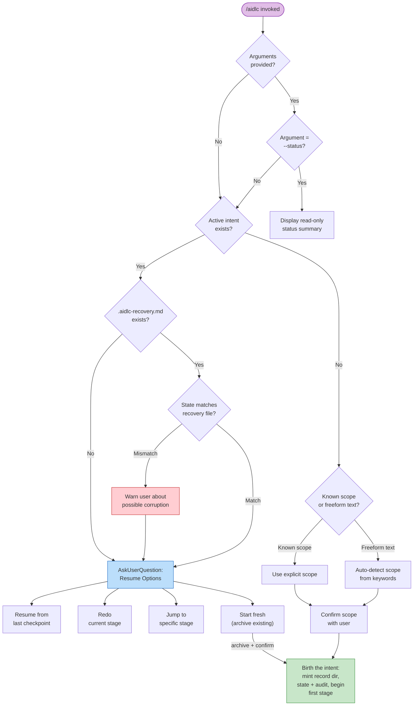

---

## 9. Scope ルーティング

> Scope ルーティングテーブル: [Orchestrator Reference -- Scope Mapping](03-orchestrator.md#scope-to-stage-mapping) を参照。

---

## 10. Knowledge のロード順序

各 stage は、厳密な 6 ステップの順序で knowledge をロードする。これにより、まず guardrail が優先され、続いて共有の方法論、次に agent 固有の knowledge、次にチームのカスタマイズ、最後に前段 stage の成果物、という順序が保証される。下のシーケンス図は、任意の stage 起動におけるロード順序を示す。

> **Note:** ステップ 1-5 は agent knowledge のロードである（各 agent ファイルで定義される）; ステップ 6（前段 stage の成果物）は、ファイルロードのステップではなく、実行時に orchestrator が追加するコンテキストである。

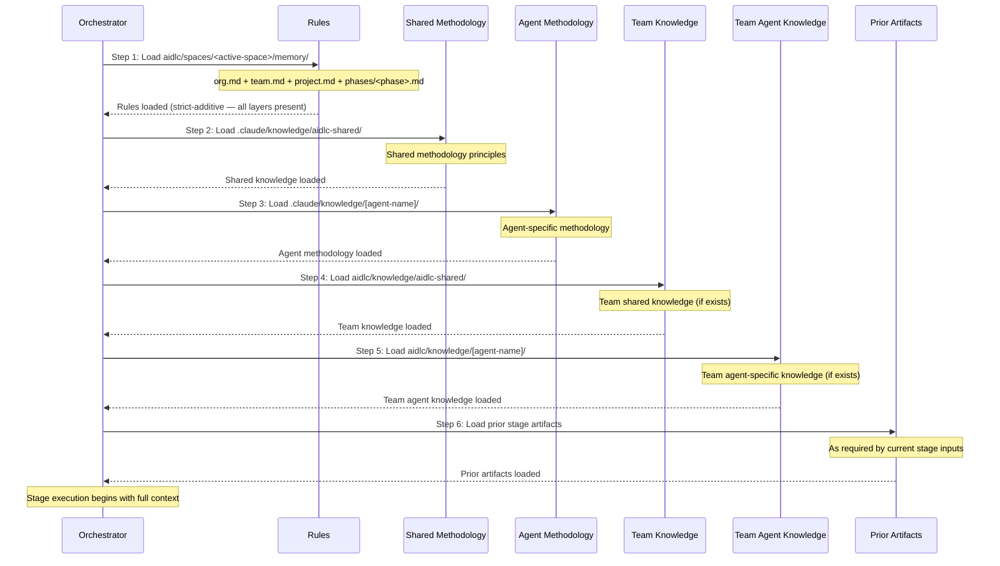

---

## 11. Approval Gate フロー

すべての stage（3 つの Initialization stage を除く）は approval gate で終わる。orchestrator は、オプションをユーザーに提示する前に audit trail へ記録し、そのあとユーザーの応答を記録する。3 回の revision サイクルのあと、「Accept as-is」の escape hatch が利用可能になる。Ideation と Inception の stage は、以前スキップした stage を追加する条件付きの第 3 オプションを含むこともある。

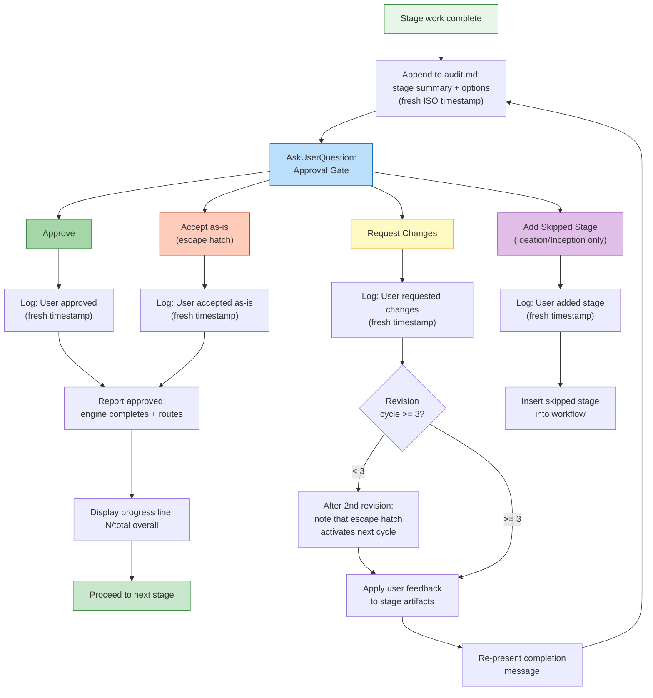

---

## 12. State トラッキング

`aidlc-state.md` ファイルは、各 stage を checkbox 記法で追跡する: `[ ]`（未着手）、`[-]`（進行中）、`[?]`（承認待ち）、`[R]`（修正中）、`[x]`（完了）、`[S]`（スキップ）。これらの遷移は engine が所有する; conductor は checkbox の state を編集するのではなく、結果を報告する。図はまた、skip・redo・jump 操作のサイドフローも示す。

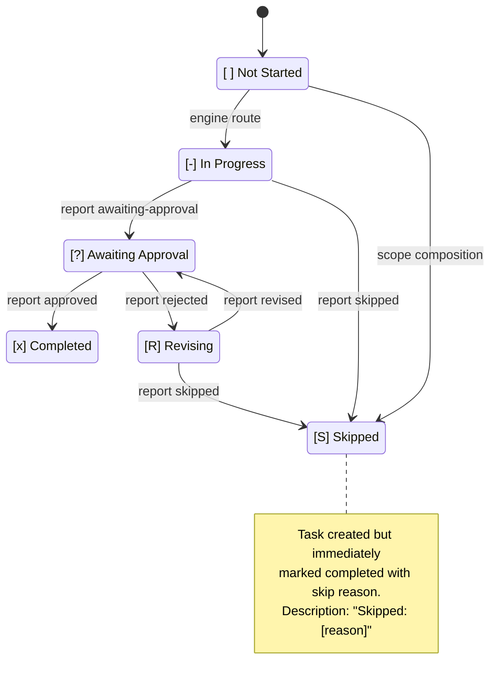

```mermaid
flowchart TD
    subgraph NORMAL["Normal Flow"]
        direction LR
        NS1["[ ] Not Started"]
        IP1["[-] In Progress"]
        AW1["[?] Awaiting Approval"]
        CO1["[x] Completed"]
        NS1 -->|"engine route"| IP1
        IP1 -->|"report gate open"| AW1
        AW1 -->|"report approved"| CO1
    end

    subgraph SKIP["Skip Flow"]
        direction LR
        NS2["[ ] Not Started"]
        SK2["[S] Skipped"]
        NS2 -->|"scope composition"| SK2
    end

    subgraph REDO["Redo Flow"]
        direction LR
        CO3["[x] Completed\nor [-] In Progress"]
        NS3["[ ] Not Started"]
        IP3["[-] In Progress"]
        CO3 -->|"user requests redo\n(delete artifacts)"| NS3
        NS3 -->|"re-execute stage"| IP3
    end

    subgraph JUMP["Jump Flow"]
        direction LR
        IP4["[-] In Progress\n(stage A)"]
        NS4["[ ] Not Started\n(stage B)"]
        IP4B["[-] In Progress\n(stage B)"]
        IP4 -->|"user requests jump\n(warn about skipped stages)"| NS4
        NS4 -->|"begin target stage"| IP4B
    end

    style NORMAL fill:#e8f5e9,stroke:#4caf50
    style SKIP fill:#fff9c4,stroke:#f9a825
    style REDO fill:#e3f2fd,stroke:#2196f3
    style JUMP fill:#fce4ec,stroke:#e91e63
```

---

## Stage 別の実行モードのまとめ

このリファレンス表は、素早い参照のために、すべての stage をその実行モードと lead agent に対応づける。

| Stage | 名前 | モード | Lead Agent |
|-------|------|------|------------|
| 0.1 | Workspace Scaffold | inline（auto-proceed） | orchestrator |
| 0.2 | Workspace Detection | inline（auto-proceed・決定論的スキャナ） | orchestrator |
| 0.3 | State Init | inline（auto-proceed） | orchestrator |
| 1.1 | Intent Capture | inline | aidlc-product-agent |
| 1.2 | Market Research | inline | aidlc-product-agent |
| 1.3 | Feasibility | inline | aidlc-architect-agent |
| 1.4 | Scope Definition | inline | aidlc-product-agent |
| 1.5 | Team Formation | inline | aidlc-delivery-agent |
| 1.6 | Rough Mockups | inline | aidlc-design-agent |
| 1.7 | Approval & Handoff | inline | aidlc-delivery-agent |
| 2.1 | Reverse Engineering | pipeline（2-link） | aidlc-developer-agent + aidlc-architect-agent |
| 2.2 | Practices Discovery | subagent | aidlc-pipeline-deploy-agent |
| 2.3 | Requirements Analysis | inline | aidlc-product-agent |
| 2.4 | User Stories | mob | aidlc-product-agent |
| 2.5 | Refined Mockups | inline | aidlc-design-agent |
| 2.6 | Application Design | inline | aidlc-architect-agent |
| 2.7 | Units Generation | inline | aidlc-architect-agent |
| 2.8 | Delivery Planning | inline | aidlc-delivery-agent |
| 3.1 | Functional Design | inline | aidlc-architect-agent |
| 3.2 | NFR Requirements | inline | aidlc-architect-agent |
| 3.3 | NFR Design | inline | aidlc-architect-agent |
| 3.4 | Infrastructure Design | inline | aidlc-aws-platform-agent |
| 3.5 | Code Generation | subagent（aidlc-developer-agent） | aidlc-developer-agent |
| 3.6 | Build and Test | inline | aidlc-quality-agent |
| 3.7 | CI Pipeline | inline | aidlc-pipeline-deploy-agent |
| 4.1 | Deployment Pipeline | inline | aidlc-pipeline-deploy-agent |
| 4.2 | Environment Provisioning | inline | aidlc-aws-platform-agent |
| 4.3 | Deployment Execution | inline | aidlc-pipeline-deploy-agent |
| 4.4 | Observability Setup | inline | aidlc-operations-agent |
| 4.5 | Incident Response | inline | aidlc-operations-agent |
| 4.6 | Performance Validation | inline | aidlc-quality-agent |
| 4.7 | Feedback & Optimization | inline | aidlc-operations-agent |
